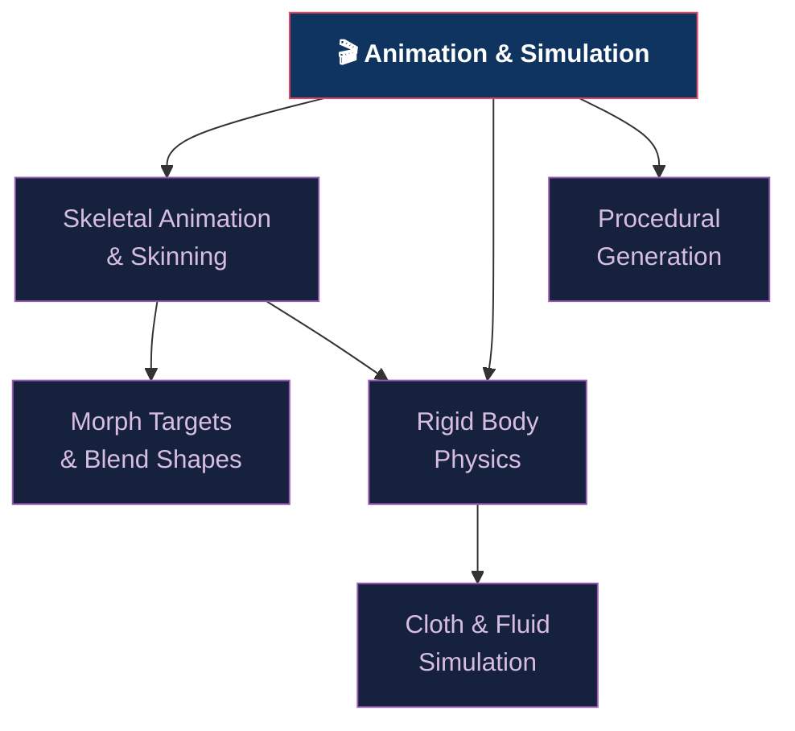

# 🎬 Animation and Simulation — Section Map of Content

> [!abstract] Section Overview
> This section covers real-time animation (skeletal/skinning, morph targets) and physics simulation (rigid body, cloth, fluid). Skeletal animation decomposes mesh deformation into a bone hierarchy with linear blend skinning. Morph targets encode delta positions for facial animation (FACS). Rigid body dynamics uses impulse-based collision resolution. Cloth simulation uses mass-spring or PBD (Position Based Dynamics). Procedural generation via noise functions creates infinite organic variation.

---

## Concept Map

---

## Learning Path

1. [[Skeletal_Animation_and_Skinning|Skeletal Animation & Skinning]] — bone hierarchy, LBS, dual quaternion, slerp
2. [[Morph_Targets_and_Blend_Shapes|Morph Targets & Blend Shapes]] — delta encoding, FACS, GPU morph
3. [[Rigid_Body_Physics|Rigid Body Physics]] — state integration, impulse response, GJK/EPA, Bullet/PhysX
4. [[Cloth_and_Fluid_Simulation|Cloth & Fluid Simulation]] — mass-spring, PBD, XPBD, SPH, Navier-Stokes
5. [[Procedural_Generation|Procedural Generation]] — Perlin/simplex noise, fBm, Worley, L-systems

---

## Notes at a Glance

| Note | Core Concept | Key Formula | Difficulty |
|------|-------------|-------------|------------|
| [[Skeletal_Animation_and_Skinning]] | LBS bone transforms | `Sj = Mj · Bj⁻¹` | Intermediate |
| [[Morph_Targets_and_Blend_Shapes]] | Delta pos/normal | `P = P₀ + Σ wᵢ·ΔPᵢ` | Intermediate |
| [[Rigid_Body_Physics]] | Impulse response | `j = −(1+e)·vrel·n / (1/m₁+1/m₂+...)` | Advanced |
| [[Cloth_and_Fluid_Simulation]] | PBD constraint | `Δx = λ·∇C / Σ(wᵢ|∇Cᵢ|²)` | Advanced |
| [[Procedural_Generation]] | fBm noise | `fBm = Σ 0.5ⁱ·noise(2ⁱ·x)` | Intermediate |

---

## Key Questions

1. What is the candy-wrapper artifact in LBS and how does dual quaternion skinning fix it?
2. How does the FACS basis enable facial animation with blend shapes?
3. What is the difference between GJK and EPA in collision detection?
4. Why is Position Based Dynamics (PBD) preferred over mass-spring for real-time cloth?
5. What distinguishes Simplex noise from Perlin noise in computational complexity?

---

## Related Sections

- [[_MOC_Computer_Graphics_Master|↑ Master MOC]]
- [[../04_Shaders/_MOC_Shaders|← Shaders]] (skinning in vertex shader, PBD in compute)
- [[../05_Lighting_and_Materials/_MOC_Lighting_and_Materials|← Lighting]] (normal updates for skinned/morphed meshes)

---

#Computer_Graphics #Animation_and_Simulation #MOC
