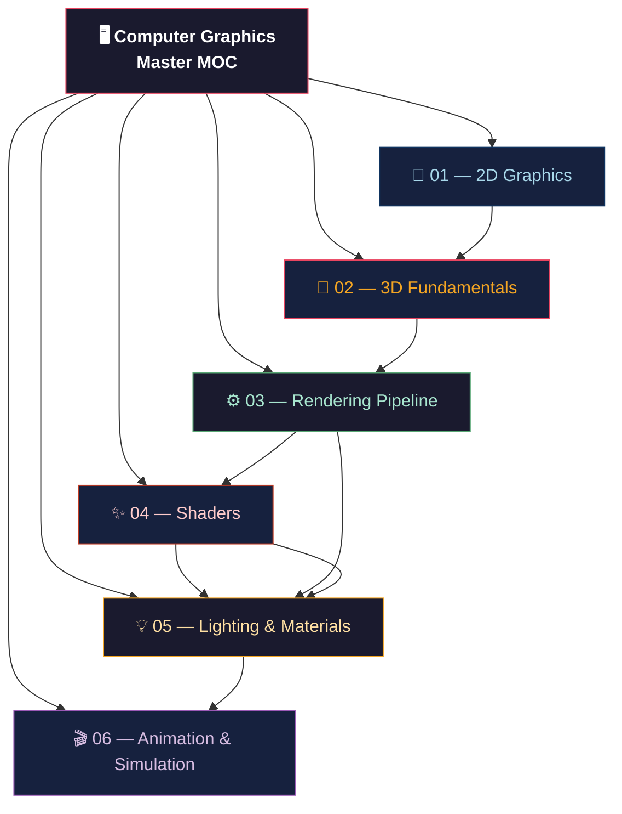

# 🖥️ Computer Graphics — Master Map of Content

> [!abstract] Vault Overview
> A 37-note deep-dive into Computer Graphics spanning 6 sections: 2D rasterization to 3D transforms, GPU pipeline APIs (OpenGL/Vulkan/DX12/Metal), shaders (GLSL/HLSL/Compute), physically-based lighting, and animation/simulation. Each note carries formulas, Mermaid diagrams, code, and review questions for active recall.

---

## Vault Architecture

---

## Sections Overview

| # | Section | Notes | Key Concepts | Difficulty |
|---|---------|-------|--------------|------------|
| 01 | [[01_2D_Graphics/_MOC_2D_Graphics\|📐 2D Graphics]] | 5 | Bresenham, Anti-aliasing, Bézier, SVG, Canvas | Beginner → Intermediate |
| 02 | [[02_3D_Fundamentals/_MOC_3D_Fundamentals\|🧊 3D Fundamentals]] | 5 | MVP Matrix, Projection, Frustum, Z-buffer | Intermediate |
| 03 | [[03_Rendering_Pipeline/_MOC_Rendering_Pipeline\|⚙️ Rendering Pipeline]] | 5 | OpenGL, Vulkan, DX12, Framebuffers, Deferred | Intermediate → Advanced |
| 04 | [[04_Shaders/_MOC_Shaders\|✨ Shaders]] | 5 | GLSL, Fragment, Compute, HLSL, Optimization | Intermediate → Advanced |
| 05 | [[05_Lighting_and_Materials/_MOC_Lighting_and_Materials\|💡 Lighting & Materials]] | 5 | Phong, PBR, Ray Tracing, GI, Textures | Advanced |
| 06 | [[06_Animation_and_Simulation/_MOC_Animation_and_Simulation\|🎬 Animation & Simulation]] | 5 | Skinning, Morph Targets, Physics, Cloth, Proc Gen | Advanced |

---

## Learning Paths

### Path A — Absolute Beginner
1. [[01_2D_Graphics/Rasterization_Algorithms|Rasterization Algorithms]] → [[01_2D_Graphics/Anti_Aliasing|Anti-Aliasing]] → [[01_2D_Graphics/Bezier_and_Bsplines|Bézier Curves]] → [[01_2D_Graphics/SVG_and_Vector_Graphics|SVG]] → [[01_2D_Graphics/Canvas_2D_API|Canvas 2D API]]

### Path B — 3D Graphics Foundation
1. [[02_3D_Fundamentals/Coordinate_Systems_and_Handedness|Coordinate Systems]] → [[02_3D_Fundamentals/3D_Transforms_and_Matrices|3D Transforms]] → [[02_3D_Fundamentals/Projection_and_Viewing|Projection & Viewing]] → [[02_3D_Fundamentals/Frustum_Culling_and_Clipping|Frustum Culling]] → [[02_3D_Fundamentals/Depth_Buffering_and_Precision|Depth Buffering]]

### Path C — GPU Programming
1. [[03_Rendering_Pipeline/OpenGL_Core_Profile|OpenGL Core]] → [[04_Shaders/GLSL_Vertex_Shaders|GLSL Vertex]] → [[04_Shaders/Fragment_Shaders_and_Effects|Fragment Shaders]] → [[03_Rendering_Pipeline/Vulkan_Architecture|Vulkan]] → [[04_Shaders/Compute_Shaders_GPGPU|Compute Shaders]]

### Path D — Visual Realism
1. [[05_Lighting_and_Materials/Phong_and_Blinn_Phong|Phong Lighting]] → [[05_Lighting_and_Materials/Physically_Based_Rendering|PBR]] → [[05_Lighting_and_Materials/Texture_Mapping_and_UV|Texture Mapping]] → [[05_Lighting_and_Materials/Global_Illumination|Global Illumination]] → [[05_Lighting_and_Materials/Ray_Tracing_and_Path_Tracing|Ray Tracing]]

### Path E — Real-Time Animation
1. [[06_Animation_and_Simulation/Skeletal_Animation_and_Skinning|Skeletal Animation]] → [[06_Animation_and_Simulation/Morph_Targets_and_Blend_Shapes|Morph Targets]] → [[06_Animation_and_Simulation/Rigid_Body_Physics|Rigid Body Physics]] → [[06_Animation_and_Simulation/Cloth_and_Fluid_Simulation|Cloth & Fluid]] → [[06_Animation_and_Simulation/Procedural_Generation|Procedural Generation]]

---

## Cross-Vault Links

| Related Domain | Connection Point |
|---|---|
| [[../AI-ML/_MOC_AI_ML_Master\|AI/ML]] | Neural rendering, NeRF, DLSS denoising, AI upscaling |
| [[../System_Design/_MOC_SystemDesign_Master\|System Design]] | GPU resource management, streaming pipelines |
| [[../Database/_MOC_Database_Master\|Database]] | Spatial indexing (R-tree, k-d tree) used in BVH |

---

## Section MOC Index

- [[01_2D_Graphics/_MOC_2D_Graphics|↗ 2D Graphics MOC]] — Rasterization, anti-aliasing, curves, web graphics
- [[02_3D_Fundamentals/_MOC_3D_Fundamentals|↗ 3D Fundamentals MOC]] — Math, matrices, projection, depth
- [[03_Rendering_Pipeline/_MOC_Rendering_Pipeline|↗ Rendering Pipeline MOC]] — OpenGL, Vulkan, DX12, Metal, framebuffers
- [[04_Shaders/_MOC_Shaders|↗ Shaders MOC]] — GLSL, HLSL, compute, optimization
- [[05_Lighting_and_Materials/_MOC_Lighting_and_Materials|↗ Lighting & Materials MOC]] — Phong, PBR, ray tracing, GI, textures
- [[06_Animation_and_Simulation/_MOC_Animation_and_Simulation|↗ Animation & Simulation MOC]] — Skinning, physics, cloth, procedural

---

## Key Formulas at a Glance

| Formula | Domain |
|---------|--------|
| `D₀ = 2Δy − Δx` | Bresenham decision variable |
| `MVP = Projection · View · Model` | Vertex transform chain |
| `Lo(ωo) = ∫ fr(ωi,ωo) Li(ωi) (ωi·n) dωi` | Rendering equation |
| `F(θ) = F₀ + (1−F₀)(1−cosθ)⁵` | Fresnel-Schlick |
| `Sj = Mj · Bj⁻¹` | Skinning matrix (inverse-bind) |
| `fBm = Σ 0.5ⁱ · noise(2ⁱ·x)` | Fractional Brownian Motion |

---

#Computer_Graphics #MOC
