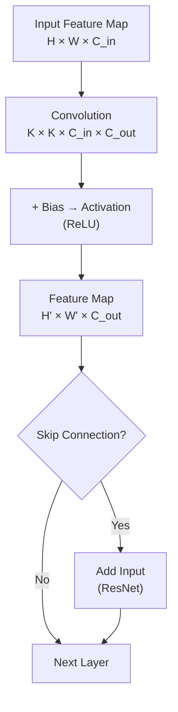

# 🧠 CNN Architectures

> [!abstract] TL;DR
> A CNN applies learned filters (kernels) to an input image, producing feature maps that encode progressively abstract representations — edges → textures → parts → objects. A decade of architecture search took us from AlexNet's 60M parameters in 2012 to EfficientNet's 5M parameters with higher accuracy in 2019, each innovation targeting a specific bottleneck in capacity, efficiency, or gradient flow.

---

## Intuition — analogy FIRST

Imagine a doctor examining an X-ray with a magnifying glass. They sweep a small lens across the image, noting what they see at each position. A convolutional filter does exactly this — it is a small learned "lens" (kernel) that slides across the entire image, producing a score at each location. Stack many such lenses, each tuned to detect a different pattern, and you build up a hierarchy of detectors from simple edges to complex objects.

---

## How It Works



---

## Key Concepts / Details

### The Convolution Operation (Cross-Correlation)

Technically, CNNs use **cross-correlation** (no kernel flip), though the term "convolution" is used throughout the literature:

$$y[i,j] = \sum_{m=0}^{k-1}\sum_{n=0}^{k-1} W[m,n] \cdot x[i+m,\ j+n] + b$$

- **W**: kernel of size k×k (learned weights)
- **x**: input feature map
- **b**: bias term
- **y**: output feature map (activation map)

### Padding and Output Size

| Padding | Output Size | Notes |
|---------|-------------|-------|
| valid (no pad) | $\lfloor(H - k)/s\rfloor + 1$ | Shrinks spatial dims |
| same | H/s (rounded) | Preserves spatial dims at s=1 |

### Stride

Stride $s > 1$ downsamples the feature map spatially. Stride-2 convolution halves H and W, often replacing max-pooling in modern architectures.

### Dilated (Atrous) Convolution

Inserts gaps of size $d-1$ between kernel elements, expanding the receptive field without increasing parameters or reducing resolution.

$$y[i,j] = \sum_{m,n} W[m,n] \cdot x[i + d \cdot m,\ j + d \cdot n]$$

Effective kernel size: $k_{\text{eff}} = k + (k-1)(d-1)$. Used extensively in semantic segmentation (DeepLab).

### Depthwise Separable Convolution

Decomposes a standard $k \times k \times C_{\text{in}} \times C_{\text{out}}$ convolution into:
1. **Depthwise**: $k \times k \times 1$ per channel (spatial mixing)
2. **Pointwise**: $1 \times 1 \times C_{\text{in}} \times C_{\text{out}}$ (channel mixing)

**Computation ratio** vs standard conv: $\approx \frac{1}{C_{\text{out}}} + \frac{1}{k^2}$ — roughly 8-9× cheaper for $k=3$.

### Pooling

| Type | Operation | Use |
|------|-----------|-----|
| Max Pool | Take max in window | Dominant spatial feature, translation invariance |
| Average Pool | Take mean in window | Smooth aggregation |
| Global Average Pool (GAP) | Mean over full H×W | Replaces FC layers; produces 1×1×C |

### Receptive Field

The receptive field (RF) of a neuron is the input region that influences its output. For a stack of convolutions:

$$RF_l = RF_{l-1} + (k_l - 1) \cdot \prod_{i=1}^{l-1} s_i$$

With stride-2 every other layer, RF grows rapidly — critical for detecting large objects.

### 1×1 Convolution

A $1 \times 1$ conv applies a learned linear combination across channels at each spatial location:
- **Bottleneck**: reduce channel depth ($C \to C/4$) before expensive $3 \times 3$ conv
- **Channel mixing**: project features without changing spatial size
- Used in Inception modules and ResNet bottleneck blocks

### ResNet Skip Connection (PyTorch)

```python
import torch
import torch.nn as nn

class ResidualBlock(nn.Module):
    """ResNet bottleneck block (3-layer: 1x1 → 3x3 → 1x1)."""
    expansion = 4

    def __init__(self, in_ch, mid_ch, stride=1):
        super().__init__()
        out_ch = mid_ch * self.expansion
        self.conv1 = nn.Conv2d(in_ch, mid_ch, 1, bias=False)
        self.bn1   = nn.BatchNorm2d(mid_ch)
        self.conv2 = nn.Conv2d(mid_ch, mid_ch, 3, stride=stride, padding=1, bias=False)
        self.bn2   = nn.BatchNorm2d(mid_ch)
        self.conv3 = nn.Conv2d(mid_ch, out_ch, 1, bias=False)
        self.bn3   = nn.BatchNorm2d(out_ch)
        self.relu  = nn.ReLU(inplace=True)

        # Projection shortcut when dimensions change
        self.shortcut = nn.Sequential()
        if stride != 1 or in_ch != out_ch:
            self.shortcut = nn.Sequential(
                nn.Conv2d(in_ch, out_ch, 1, stride=stride, bias=False),
                nn.BatchNorm2d(out_ch),
            )

    def forward(self, x):
        out = self.relu(self.bn1(self.conv1(x)))
        out = self.relu(self.bn2(self.conv2(out)))
        out = self.bn3(self.conv3(out))
        out += self.shortcut(x)          # identity / projection shortcut
        return self.relu(out)
```

The key insight: $H(x) = F(x) + x$ means gradients flow directly through the shortcut, enabling very deep networks (50–152+ layers) without vanishing gradients.

### Architecture Evolution

| Architecture | Year | Params | ImageNet Top-1 | Key Innovation |
|--------------|------|--------|----------------|----------------|
| AlexNet | 2012 | 60M | 57.1% | ReLU, dropout, GPU training, data aug |
| VGG-16 | 2014 | 138M | 71.5% | Only 3×3 convs stacked deep |
| GoogLeNet / InceptionV1 | 2014 | 6.8M | 74.8% | Inception module (multi-scale parallel) |
| ResNet-50 | 2015 | 25M | 76.0% | Skip connections, batch norm |
| ResNet-152 | 2015 | 60M | 77.8% | Very deep with skip connections |
| DenseNet-121 | 2016 | 8M | 74.4% | Dense connections (each layer → all later) |
| MobileNetV2 | 2018 | 3.4M | 72.0% | Inverted residuals, linear bottlenecks |
| EfficientNet-B0 | 2019 | 5.3M | 77.1% | Compound scaling (NAS-found base) |
| EfficientNet-B7 | 2019 | 66M | 84.3% | Scaled-up EfficientNet-B0 |

### Inception Module

Applies $1 \times 1$, $3 \times 3$, $5 \times 5$ convolutions and $3 \times 3$ max pool **in parallel**, then concatenates outputs along the channel axis. The $1 \times 1$ convolutions before larger kernels reduce channel depth (bottleneck), keeping computation tractable.

### EfficientNet Compound Scaling

EfficientNet scales three dimensions jointly using a single coefficient $\phi$:

$$\text{depth} \propto \alpha^\phi, \quad \text{width} \propto \beta^\phi, \quad \text{resolution} \propto \gamma^\phi$$

with constraint $\alpha \cdot \beta^2 \cdot \gamma^2 \approx 2$ (FLOPS scale by $2^\phi$). The base architecture (B0) was found by NAS.

---

## Real-World Notes

- For most fine-tuning tasks, **ResNet-50** or **EfficientNet-B3/B4** are the go-to backbones — well-studied, widely supported in timm/torchvision.
- Depthwise separable convolutions are critical for **on-device inference** (phones, edge hardware).
- Stride-2 convolution has largely replaced max-pooling in modern architectures since it is learnable.
- VGG-16 is rarely used in new projects but remains a popular feature extractor for style transfer due to its simple structure.

---

## Common Pitfalls

1. **Using FC layers instead of GAP**: FC layers fix the input spatial size; GAP lets the network accept any image size at inference.
2. **Not accounting for padding when computing output size**: Valid padding shrinks spatial dims — easy to accidentally create a 0-size feature map deep in the network.
3. **Forgetting the projection shortcut**: When stride > 1 or channels change in a ResNet block, the shortcut path must match dimensions.
4. **Excessive pooling early**: Aggressive spatial downsampling in early layers destroys fine-grained spatial information needed for dense prediction.
5. **Treating dilated convolution as free RF expansion**: Dilation creates a "grid artifact" in the receptive field — not all input positions contribute equally.

---

## Related Concepts

- [[Image_Representations]] — convolutions operate on [B, C, H, W] tensors
- [[Training_Techniques_CV]] — batch normalization is baked into every modern block
- [[Transfer_Learning_CV]] — these architectures are the pretrained backbones being transferred
- [[Data_Augmentation_CV_Deep]] — augmentation is applied before the first conv layer

---

## Review Questions

1. Derive the output size of a conv with H=224, k=7, p=3, s=2. What about H=112, k=3, p=0, s=1?
2. Why does a ResNet skip connection solve the vanishing gradient problem, but a DenseNet skip goes even further?
3. Compare parameter counts for a 3×3 conv with C_in=256, C_out=256 vs its depthwise separable equivalent.
4. What is the receptive field after two stride-1 3×3 convolutions followed by one stride-2 3×3 convolution?
5. Why does EfficientNet outperform simply making a ResNet wider or deeper alone?

---

## Sources

- He et al., "Deep Residual Learning for Image Recognition" (CVPR 2016)
- Szegedy et al., "Going Deeper with Convolutions" (CVPR 2015)
- Tan & Le, "EfficientNet: Rethinking Model Scaling" (ICML 2019)
- Howard et al., "MobileNets" (2017)

#computer-vision #image-fundamentals-cnns #intermediate
