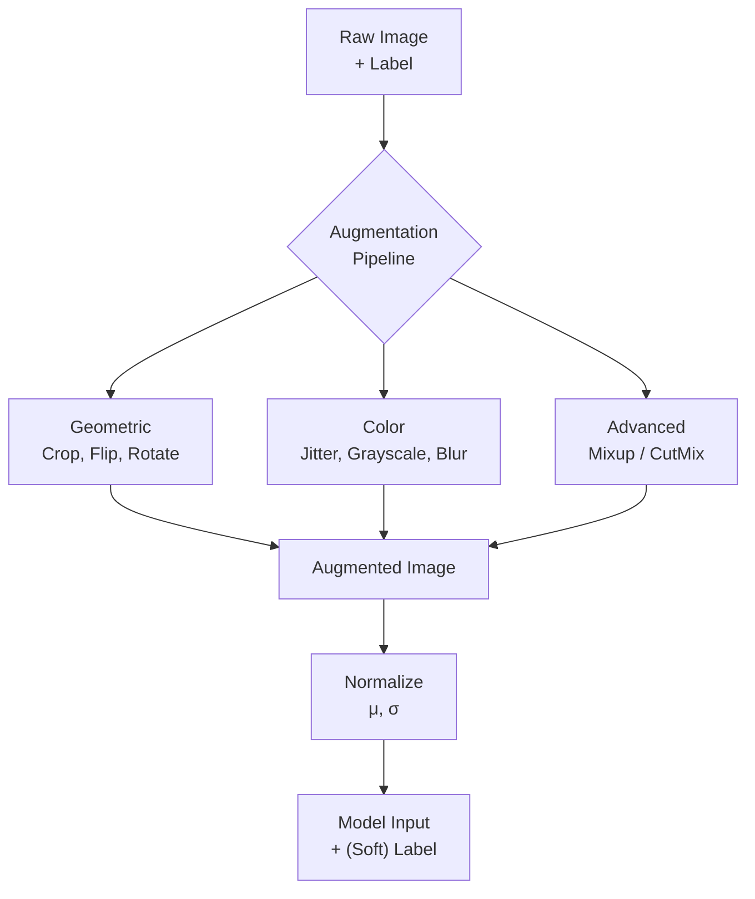

# 🔄 Data Augmentation CV Deep

> [!abstract] TL;DR
> Data augmentation artificially expands a training set by applying label-preserving (or label-adjusting) transformations to images, reducing overfitting and improving generalization. Modern techniques like CutMix, RandAugment, and AugMix go beyond simple flips and crops to create strongly regularized training signals that rival the effect of collecting 10× more real data.

---

## Intuition — analogy FIRST

A medical student who only ever sees textbook X-rays in perfect lighting will fail when facing a real hospital scan taken at an angle in poor contrast. Data augmentation is like a flight simulator for your model — it deliberately exposes the model to perturbed, degraded, and unusual views during training so it learns the underlying concept, not the particular recording conditions.

---

## How It Works



---

## Key Concepts / Details

### Geometric Transforms (Standard)

| Transform | Description | Hyperparameters |
|-----------|-------------|-----------------|
| RandomResizedCrop | Crop a random area (scale/ratio), resize to target | scale=(0.08,1.0), ratio=(3/4,4/3) |
| RandomHorizontalFlip | Mirror left-right with probability p | p=0.5 |
| RandomVerticalFlip | Mirror top-bottom | p=0.5 (only if valid for domain) |
| RandomRotation | Rotate by ±degrees | degrees=15–30 |
| RandomPerspective | Apply random projective transform | distortion_scale=0.5 |
| RandomAffine | Translation, rotation, scale, shear | Covers many geometric distortions |

> [!tip] RandomResizedCrop is the most impactful single augmentation for ImageNet-style training. It forces the model to recognize objects from any scale and partial view.

### Color Transforms (Standard)

| Transform | What It Varies | Typical Range |
|-----------|---------------|---------------|
| ColorJitter brightness | Pixel intensity multiplier | ±0.4 |
| ColorJitter contrast | Contrast stretching | ±0.4 |
| ColorJitter saturation | Color vividness | ±0.4 |
| ColorJitter hue | Hue rotation in HSV | ±0.1 |
| RandomGrayscale | Convert to grayscale with prob p | p=0.2 |
| GaussianBlur | Smooth with σ randomly chosen | σ ∈ [0.1, 2.0] |

```python
import torchvision.transforms as T

train_transforms = T.Compose([
    T.RandomResizedCrop(224, scale=(0.08, 1.0)),
    T.RandomHorizontalFlip(p=0.5),
    T.ColorJitter(brightness=0.4, contrast=0.4, saturation=0.4, hue=0.1),
    T.RandomGrayscale(p=0.2),
    T.GaussianBlur(kernel_size=23, sigma=(0.1, 2.0)),
    T.ToTensor(),
    T.Normalize(mean=[0.485, 0.456, 0.406],
                std=[0.229, 0.224, 0.225]),
])
```

### Albumentations (Production Library)

```python
import albumentations as A
from albumentations.pytorch import ToTensorV2

aug = A.Compose([
    A.RandomResizedCrop(224, 224, scale=(0.08, 1.0)),
    A.HorizontalFlip(p=0.5),
    A.ColorJitter(brightness=0.4, contrast=0.4, saturation=0.4, hue=0.1, p=0.8),
    A.CoarseDropout(max_holes=1, max_height=112, max_width=112, p=0.5),  # CutOut
    A.Normalize(mean=[0.485, 0.456, 0.406], std=[0.229, 0.224, 0.225]),
    ToTensorV2(),
])
```

### CutOut

Zero out a random square region of the input image. Forces the model to use context from the entire image rather than relying on a discriminative patch:

$$\tilde{x}_{(i,j)} = 0 \quad \text{if } (i,j) \in \text{masked region}$$

Label stays unchanged. Simple to implement; improves robustness to occlusion.

### Mixup

Linearly interpolate between two training samples (both images and labels):

$$\tilde{x} = \lambda x_i + (1 - \lambda) x_j, \quad \tilde{y} = \lambda y_i + (1 - \lambda) y_j$$

where $\lambda \sim \text{Beta}(\alpha, \alpha)$, typically $\alpha = 0.2$.

```python
import numpy as np
import torch

def mixup_batch(x, y, alpha=0.2):
    lam = np.random.beta(alpha, alpha)
    idx = torch.randperm(x.size(0))
    x_mix = lam * x + (1 - lam) * x[idx]
    y_a, y_b = y, y[idx]
    return x_mix, y_a, y_b, lam

# Loss with mixed labels
def mixup_loss(criterion, pred, y_a, y_b, lam):
    return lam * criterion(pred, y_a) + (1 - lam) * criterion(pred, y_b)
```

Soft targets prevent overconfident predictions and act as a strong regularizer.

### CutMix

Replace a randomly chosen rectangular region of one image with the corresponding region from another image. Labels are mixed proportionally to the area:

$$\tilde{y} = \lambda y_i + (1-\lambda) y_j, \quad \lambda = 1 - \frac{\text{area}(B)}{HW}$$

CutMix > Mixup for classification and object detection because the pasted region contains recognizable, unblended features rather than ghosted overlays.

```python
def cutmix_batch(x, y, alpha=1.0):
    lam = np.random.beta(alpha, alpha)
    idx = torch.randperm(x.size(0))
    H, W = x.size(2), x.size(3)
    cut_rat = np.sqrt(1.0 - lam)
    cut_w = int(W * cut_rat); cut_h = int(H * cut_rat)
    cx = np.random.randint(W); cy = np.random.randint(H)
    x1 = np.clip(cx - cut_w // 2, 0, W); x2 = np.clip(cx + cut_w // 2, 0, W)
    y1 = np.clip(cy - cut_h // 2, 0, H); y2 = np.clip(cy + cut_h // 2, 0, H)
    x_mix = x.clone()
    x_mix[:, :, y1:y2, x1:x2] = x[idx, :, y1:y2, x1:x2]
    lam_actual = 1 - (x2 - x1) * (y2 - y1) / (W * H)
    return x_mix, y, y[idx], lam_actual
```

### RandAugment

Samples N random transforms from a fixed policy (14 possible transforms) and applies each with magnitude M:

- N typically = 2, M ∈ [1, 30]
- Eliminates the need for RL-based policy search (AutoAugment)
- Simple two-hyperparameter grid search finds strong policies

```python
train_transforms = T.Compose([
    T.RandomResizedCrop(224),
    T.RandomHorizontalFlip(),
    T.RandAugment(num_ops=2, magnitude=9),   # PyTorch ≥ 1.11
    T.ToTensor(),
    T.Normalize(...),
])
```

### AugMix

Applies multiple augmentation chains, mixes them, and adds a **Jensen-Shannon divergence consistency loss** to maintain stable representations across augmentations:

$$L_{\text{total}} = L_{\text{CE}}(p_{\text{orig}}, y) + \lambda \cdot \text{JSD}(p_{\text{orig}} \| p_{\text{aug1}} \| p_{\text{aug2}})$$

Particularly effective for robustness to distribution shifts (ImageNet-C benchmark).

### Test-Time Augmentation (TTA)

Run multiple augmented versions of the same image at inference, then average predictions:

```python
def tta_predict(model, img_tensor, n_aug=10):
    aug = T.Compose([T.RandomHorizontalFlip(), T.RandomCrop(224, padding=28)])
    preds = [model(aug(img_tensor).unsqueeze(0)) for _ in range(n_aug)]
    return torch.stack(preds).mean(0)
```

Typically yields +0.5–1.5% accuracy at the cost of N× inference time.

### Augmentation → What It Prevents Overfitting To

| Augmentation | Prevents Overfitting To |
|--------------|------------------------|
| Random crop | Exact object position and scale |
| Horizontal flip | Orientation bias in training set |
| Color jitter | Specific lighting / camera color balance |
| Grayscale | Color as a discriminative feature when shape suffices |
| CutOut | Single discriminative patch (prevents lazy localization) |
| Mixup | Overconfident boundaries between classes |
| CutMix | Spurious correlations between patches and labels |
| RandAugment | Full distribution of natural imaging variations |

### Domain-Specific Augmentation (Medical Imaging)

| Technique | Description |
|-----------|-------------|
| Elastic deformation | Random non-rigid warp (simulates tissue deformation) |
| Intensity shift | Add/multiply random intensity offset per image |
| Gamma correction | Random gamma adjustment (scanner variability) |
| Histogram matching | Match histogram to a reference scanner's distribution |
| Gaussian noise | Simulate acquisition noise |

---

## Real-World Notes

- The timm library (`timm.data.create_transform`) packages state-of-the-art augmentation recipes (RandAugment + CutMix + Mixup) as a single config line.
- For medical imaging, always consult a domain expert before adding augmentations — horizontal flip of a chest X-ray may be fine, but for brain MRI with sidedness it can corrupt labels.
- CutMix and Mixup together (randomly choosing which to apply per batch) gives additive gains in many benchmarks.
- Augmentation should be applied only to training data, **never** to validation or test data (except TTA, which is deliberate).

---

## Common Pitfalls

1. **Augmenting segmentation masks with different interpolation**: Image and mask must use the exact same random transform parameters; use Albumentations or torchvision's `transforms.v2` which handles paired transforms.
2. **CutMix/Mixup with CrossEntropyLoss expecting hard labels**: Must use the mixup loss function that handles two labels and lambda.
3. **Too aggressive augmentation**: Applying large rotations or strong color jitter on fine-grained datasets (e.g., fine-grained bird recognition) can destroy discriminative features.
4. **TTA at training time**: TTA is an inference-only technique; applying it during training inflates computation without benefit.
5. **Normalizing before augmentation**: Color jitter should be applied before normalization (in [0,1] range); normalizing first can push values out of expected bounds.

---

## Related Concepts

- [[Image_Representations]] — augmentations operate on the tensor representations described there
- [[Training_Techniques_CV]] — CutMix/Mixup interact with the loss function and label smoothing
- [[Transfer_Learning_CV]] — augmentation intensity should be tuned based on dataset size and domain similarity

---

## Review Questions

1. CutMix vs Mixup: which produces cleaner training samples and why does that matter for detection tasks?
2. You train a skin lesion classifier and accidentally apply horizontal flip augmentation to bounding-box labels without flipping the box coordinates. What happens?
3. Why does RandAugment outperform randomly chosen augmentations despite using no RL policy search?
4. Describe how the AugMix JSD consistency loss differs from standard cross-entropy and what behaviour it encourages.
5. A team achieves 78% accuracy. They add TTA with 5 flipped crops. What is the expected accuracy improvement and what is the cost?

---

## Sources

- DeVries & Taylor, "Improved Regularization with CutOut" (2017)
- Zhang et al., "Mixup: Beyond Empirical Risk Minimization" (ICLR 2018)
- Yun et al., "CutMix" (ICCV 2019)
- Cubuk et al., "RandAugment" (NeurIPS 2020)
- Hendrycks et al., "AugMix" (ICLR 2020)

#computer-vision #image-fundamentals-cnns #intermediate
