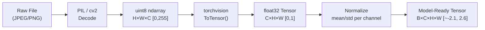

# 🖼️ Image Representations

> [!abstract] TL;DR
> A digital image is a grid of numeric pixel values stored as a multi-dimensional tensor. Understanding tensor shape conventions, color spaces, normalization, and interpolation is prerequisite knowledge for every CV pipeline — errors here silently corrupt model inputs and account for a surprising fraction of real debugging time.

---

## Intuition — analogy FIRST

Think of a color photo as a stack of three transparent acetate sheets — one red, one green, one blue — laid on top of each other. Each sheet is a 2-D grid of numbers (0–255 for 8-bit). A model "reads" the photo by looking at all three sheets simultaneously. The choice of color space determines how you slice the color information, and normalization re-centers those numbers so gradient descent converges cleanly.

---

## How It Works



---

## Key Concepts / Details

### Pixel Values and Bit Depth

| Bit Depth | Range | Common Use |
|-----------|-------|------------|
| 8-bit | 0–255 | Standard photos, web images |
| 16-bit | 0–65535 | Medical imaging, RAW cameras |
| 32-bit float | 0.0–1.0 | Model inputs after ToTensor() |
| HDR (float) | >1.0 | High dynamic range rendering |

Grayscale: single scalar per pixel. RGB: 3 values (R, G, B) per pixel. RGBA adds an alpha (transparency) channel.

### Tensor Shape Conventions

PyTorch uses **[B, C, H, W]** (batch, channels, height, width).  
TensorFlow/Keras uses **[B, H, W, C]** (channels-last).

```python
import torch

# Convert channels-last (TF) to channels-first (PyTorch)
tf_tensor = torch.rand(1, 224, 224, 3)           # B, H, W, C
pt_tensor = tf_tensor.permute(0, 3, 1, 2)        # B, C, H, W
print(pt_tensor.shape)  # torch.Size([1, 3, 224, 224])
```

### Color Spaces

| Color Space | Channels | Key Property | Best Used For |
|-------------|----------|--------------|---------------|
| RGB | R, G, B | Device-native, additive | General model input |
| HSV | Hue, Saturation, Value | Separates color from brightness | Color-based segmentation, jitter |
| LAB | L (lightness), A (green-red), B (blue-yellow) | Perceptually uniform | Color transfer, perceptual loss |
| YCbCr | Y (luma), Cb, Cr | Separates luminance from chrominance | Video compression (JPEG internals) |
| Grayscale | Intensity | Single channel, no color info | Texture analysis, medical imaging |

> [!tip] LAB perceptual uniformity
> Euclidean distance in LAB space corresponds to perceived color difference by the human eye — unlike RGB where equal numeric distance can look very different perceptually.

```python
import cv2
import numpy as np

img_bgr = cv2.imread("image.jpg")            # OpenCV reads as BGR
img_rgb = cv2.cvtColor(img_bgr, cv2.COLOR_BGR2RGB)
img_hsv = cv2.cvtColor(img_bgr, cv2.COLOR_BGR2HSV)
img_lab = cv2.cvtColor(img_bgr, cv2.COLOR_BGR2LAB)
```

### Image Normalization

Raw pixels [0, 255] → ToTensor → [0.0, 1.0] → Normalize → ~[-2.1, 2.6]

**ImageNet statistics** (used for all ImageNet-pretrained models):
$$\mu = [0.485,\ 0.456,\ 0.406], \quad \sigma = [0.229,\ 0.224,\ 0.225]$$

$$x_{\text{norm}} = \frac{x - \mu}{\sigma}$$

```python
from torchvision import transforms

preprocess = transforms.Compose([
    transforms.Resize(256),
    transforms.CenterCrop(224),
    transforms.ToTensor(),                       # uint8 [0,255] → float [0,1]
    transforms.Normalize(
        mean=[0.485, 0.456, 0.406],
        std=[0.229, 0.224, 0.225]
    ),
])
```

### Resizing and Interpolation

| Method | Quality | Speed | Best For |
|--------|---------|-------|----------|
| Nearest neighbor | Low | Fastest | Semantic masks (no blending) |
| Bilinear | Medium | Fast | General image resizing |
| Bicubic | High | Medium | High-quality downsampling |
| Lanczos (ANTIALIAS) | Highest | Slow | Printing, extreme downscaling |

> [!warning] Never use bilinear interpolation on segmentation masks — it blends class indices, creating invalid labels. Always use nearest neighbor for masks.

### Image File Formats

| Format | Compression | Alpha | Use Case |
|--------|-------------|-------|----------|
| JPEG | Lossy (DCT) | No | Photos, web, datasets |
| PNG | Lossless | Yes | Screenshots, masks, precise images |
| WebP | Lossy + Lossless | Yes | Web with smaller file sizes |
| TIFF | Lossless | Yes | Professional photography, medical |
| BMP | None | No | Raw pixel storage |

### Spatial vs Frequency Domain

Every image can be decomposed into sinusoidal components via the **2-D Discrete Fourier Transform**. Low frequencies = smooth regions; high frequencies = edges and fine textures.

$$F(u, v) = \sum_{x=0}^{M-1}\sum_{y=0}^{N-1} f(x,y)\ e^{-2\pi i\left(\frac{ux}{M}+\frac{vy}{N}\right)}$$

CNNs implicitly learn frequency-sensitive filters. Early layers learn high-frequency edge detectors; deeper layers capture low-frequency semantic patterns. See [[Fourier_Transform]] for the full transform derivation.

### Image Statistics

```python
import numpy as np
from PIL import Image

img = np.array(Image.open("image.jpg").convert("RGB")).astype(np.float32)

mean_per_channel = img.mean(axis=(0, 1))    # shape (3,)
std_per_channel  = img.std(axis=(0, 1))     # shape (3,)
histogram, _     = np.histogram(img[:,:,0], bins=256, range=(0,255))
```

---

## Real-World Notes

- OpenCV reads images as **BGR** by default, not RGB. Forgetting to convert is a very common bug that causes subtle color distortions in pretrained models.
- When logging images to TensorBoard or W&B, remember to **unnormalize** before display — normalized images look washed-out/inverted.
- For large datasets, pre-compute and cache resized images rather than resizing on-the-fly during training to reduce CPU bottleneck.
- WebP offers 25–35% smaller files than JPEG at the same perceptual quality, making it increasingly preferred for dataset storage.

---

## Common Pitfalls

1. **BGR vs RGB confusion**: OpenCV → BGR, PIL/torchvision → RGB. Always verify after loading.
2. **Applying ImageNet normalization to non-ImageNet tasks**: If training from scratch, compute your own dataset mean/std.
3. **Bilinear interpolation on masks**: Blends class IDs; use nearest-neighbor interpolation for segmentation labels.
4. **Forgetting to scale before normalizing**: ToTensor() divides by 255 automatically; doing it manually and then calling ToTensor() double-scales.
5. **Shape mismatch in batch dimension**: Broadcasting errors often trace to forgotten `.unsqueeze(0)` when feeding a single image.

---

## Related Concepts

- [[CNN_Architectures]] — convolutions operate on these [B, C, H, W] tensors
- [[Data_Augmentation_CV_Deep]] — augmentations transform these representations at training time
- [[Training_Techniques_CV]] — normalization statistics are tied to batch norm behavior
- [[Fourier_Transform]] — frequency-domain interpretation of image structure

---

## Review Questions

1. A segmentation pipeline resizes masks with bilinear interpolation. What goes wrong and how do you fix it?
2. You load an image with OpenCV and pass it directly to a ResNet. Describe the bug and its effect on predictions.
3. Why are ImageNet normalization constants (mean/std) used even for fine-tuning on medical images?
4. Given a tensor of shape (3, 224, 224), write the one-liner to add a batch dimension for model inference.
5. What is the difference between JPEG and PNG compression, and when would you prefer each for a CV dataset?

---

## Sources

- Goodfellow et al., *Deep Learning* (2016), Chapter 9
- PyTorch torchvision transforms docs: https://pytorch.org/vision/stable/transforms.html
- OpenCV color space docs: https://docs.opencv.org/4.x/df/d9d/tutorial_py_colorspaces.html

#computer-vision #image-fundamentals-cnns #beginner
