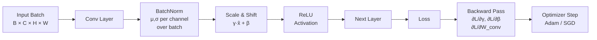

# ⚙️ Training Techniques CV

> [!abstract] TL;DR
> Getting a CNN to converge well requires more than just the right architecture — normalization layers stabilize activations, careful weight initialization ensures gradients flow from the start, learning rate schedules accelerate convergence, and mixed-precision training cuts GPU memory in half. Together, these techniques are often the difference between a model that trains in 12 hours vs 3 days and generalizes vs overfits.

---

## Intuition — analogy FIRST

Think of training a deep network like tuning a piano with 50 strings. If you tighten one string too much (exploding gradient) or leave another too loose (vanishing gradient), the whole instrument sounds wrong. Batch normalization is like a professional tuner who resets all strings to the right tension after each chord — it normalizes activations so each layer receives well-conditioned inputs, letting you play loudly (high learning rate) without breaking strings.

---

## How It Works



---

## Key Concepts / Details

### Batch Normalization

Introduced by Ioffe & Szegedy (2015). For a mini-batch of activations $\{x_1, \ldots, x_B\}$ for a single channel:

$$\hat{x}_i = \frac{x_i - \mu_B}{\sqrt{\sigma_B^2 + \epsilon}}, \quad y_i = \gamma \hat{x}_i + \beta$$

- $\mu_B, \sigma_B^2$: batch mean and variance (computed over B, H, W for each channel C)
- $\gamma, \beta$: learnable scale and shift (initialized to 1 and 0)
- $\epsilon \approx 10^{-5}$: numerical stability

**At inference**: uses exponential running mean/variance accumulated during training (not the batch stats).

**Why it helps**:
- Smooths the loss landscape (allows higher LR)
- Reduces internal covariate shift
- Acts as a mild regularizer (batch noise in stats)
- Placed **before** activation in original paper, but **after** is also common

### Normalization Comparison

| Method | Normalization Axis | Learnable | Best Used In |
|--------|-------------------|-----------|--------------|
| BatchNorm (BN) | Over B, H, W per channel | γ, β per channel | CNNs, large batches |
| LayerNorm (LN) | Over C, H, W per sample | γ, β per position | Transformers, ViT, small batch |
| GroupNorm (GN) | Over groups of channels per sample | γ, β per channel | CNNs with small batches (e.g., detection) |
| InstanceNorm | Over H, W per sample per channel | Optional | Style transfer |

### Weight Initialization

| Activation | Method | Formula | Why |
|------------|--------|---------|-----|
| ReLU | He / Kaiming | $\sigma = \sqrt{2/n_{\text{in}}}$ | Accounts for 50% neurons zeroed by ReLU |
| Sigmoid / Tanh | Xavier / Glorot | $\sigma = \sqrt{2/(n_{\text{in}}+n_{\text{out}})}$ | Preserves variance through saturating activations |
| Random uniform | (baseline) | — | Causes vanishing/exploding gradients in deep nets |

```python
import torch.nn as nn

conv = nn.Conv2d(64, 128, 3, padding=1)
nn.init.kaiming_normal_(conv.weight, mode='fan_out', nonlinearity='relu')
nn.init.zeros_(conv.bias)
```

### Learning Rate Schedules

| Schedule | Description | When to Use |
|----------|-------------|-------------|
| Step decay | Multiply LR by γ every N epochs | Simple baselines |
| Cosine annealing | LR follows a half-cosine curve | Standard for most CV training |
| Warmup + cosine | Linear warmup for W steps, then cosine | ViT and large models |
| OneCycleLR | LR rises to max, then falls; 1 cycle total | Fast training (superconvergence) |
| Cyclic LR | Oscillates between min and max | Escaping local minima |

### Mixed Precision Training (AMP)

Stores master weights in FP32 but computes forward/backward in FP16:
- ~2× speedup on Tensor Core GPUs (A100, V100, RTX series)
- ~50% GPU memory reduction
- Requires **gradient scaling** to prevent underflow in FP16 gradients

```python
import torch
from torch.cuda.amp import autocast, GradScaler

scaler = GradScaler()

for images, labels in loader:
    optimizer.zero_grad()

    with autocast():                                # FP16 forward
        outputs = model(images)
        loss = criterion(outputs, labels)

    scaler.scale(loss).backward()                  # scaled FP16 backward
    scaler.unscale_(optimizer)
    torch.nn.utils.clip_grad_norm_(model.parameters(), max_norm=1.0)
    scaler.step(optimizer)
    scaler.update()
    scheduler.step()
```

### Full Training Loop (AMP + OneCycleLR)

```python
import torch
import torch.nn as nn
from torchvision import models
from torch.optim.lr_scheduler import OneCycleLR

model = models.resnet50(pretrained=True)
model.fc = nn.Linear(2048, NUM_CLASSES)
model = model.cuda()

optimizer = torch.optim.AdamW(model.parameters(), lr=1e-3, weight_decay=1e-2)
scheduler = OneCycleLR(
    optimizer,
    max_lr=1e-3,
    steps_per_epoch=len(train_loader),
    epochs=NUM_EPOCHS,
    pct_start=0.3,          # 30% warmup
)
criterion = nn.CrossEntropyLoss(label_smoothing=0.1)
scaler = torch.cuda.amp.GradScaler()

for epoch in range(NUM_EPOCHS):
    model.train()
    for imgs, labels in train_loader:
        imgs, labels = imgs.cuda(), labels.cuda()
        optimizer.zero_grad()
        with torch.cuda.amp.autocast():
            logits = model(imgs)
            loss   = criterion(logits, labels)
        scaler.scale(loss).backward()
        scaler.unscale_(optimizer)
        torch.nn.utils.clip_grad_norm_(model.parameters(), 1.0)
        scaler.step(optimizer)
        scaler.update()
        scheduler.step()
```

### Gradient Clipping

Clips gradient norm to prevent exploding gradients, especially with RNNs and deep CNNs:

$$\text{if}\ \|\nabla\theta\|_2 > \text{clip\_val}: \quad \nabla\theta \leftarrow \frac{\text{clip\_val}}{\|\nabla\theta\|_2}\nabla\theta$$

### Label Smoothing

Replaces hard one-hot targets with soft targets, preventing overconfidence:

$$y_{\text{smooth}}^{(k)} = \begin{cases} 1 - \varepsilon & k = \text{true class} \\ \varepsilon/(K-1) & \text{otherwise} \end{cases}$$

Typical $\varepsilon = 0.1$. Improves calibration and generalisation. Available directly in `nn.CrossEntropyLoss(label_smoothing=0.1)` (PyTorch ≥ 1.10).

---

## Real-World Notes

- Batch size strongly affects BatchNorm quality — batch sizes below 16 make BN noisy; switch to GroupNorm for detection models where batch size is often 2–4.
- Mixed precision (AMP) is essentially free to add and should be default for any CNN training on modern hardware.
- OneCycleLR enables "superconvergence" — often converges in 1/5 the epochs of step-decay schedules.
- Weight decay (L2 regularization) interacts poorly with BatchNorm in SGD — use **decoupled weight decay** (AdamW) to avoid unintended effects on BN parameters.

---

## Common Pitfalls

1. **model.eval() forgetting**: Forgetting to call `model.eval()` at inference uses batch stats instead of running stats, giving inconsistent predictions especially with small eval batches.
2. **Applying weight decay to BN parameters**: BN's γ and β should typically not be regularized — add a `no_decay` group in the optimizer.
3. **Double-counting gradient scaler updates**: Calling `scaler.update()` before `scaler.step()` corrupts the scale factor.
4. **Using step scheduler with OneCycleLR per epoch**: OneCycleLR must be stepped **per batch**, not per epoch.
5. **He init with non-ReLU activations**: Using Kaiming init with sigmoid/tanh causes vanishing gradients — always match init to activation.

---

## Related Concepts

- [[CNN_Architectures]] — the layer structures that these training techniques plug into
- [[Data_Augmentation_CV_Deep]] — CutMix and Mixup are training-time augmentations closely tied to the loss function
- [[Transfer_Learning_CV]] — fine-tuning requires specific LR schedules and careful BN handling

---

## Review Questions

1. A model trained with BatchNorm gives good training accuracy but erratic validation accuracy. What is the most likely cause?
2. Why is GroupNorm preferred over BatchNorm in object detection frameworks like Detectron2?
3. Explain why label smoothing improves model calibration, not just accuracy.
4. What does the gradient scaler do in AMP, and why is it necessary?
5. Compare He initialization and Xavier initialization: when would you use each, and what goes wrong if you swap them?

---

## Sources

- Ioffe & Szegedy, "Batch Normalization" (ICML 2015)
- He et al., "Delving Deep into Rectifiers" (ICCV 2015)
- Smith, "Super-Convergence" (2018)
- PyTorch AMP tutorial: https://pytorch.org/docs/stable/amp.html

#computer-vision #image-fundamentals-cnns #intermediate
