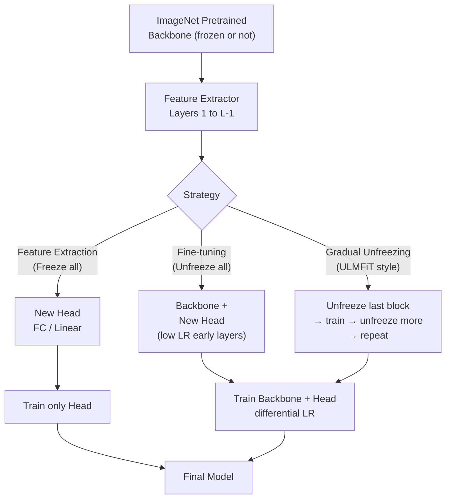

# 🔁 Transfer Learning CV

> [!abstract] TL;DR
> ImageNet-pretrained CNNs have learned rich general visual features — edges, textures, object parts — that transfer effectively to virtually any vision task. Transfer learning lets you leverage millions of labeled ImageNet images even when your own dataset has only hundreds of examples, by either freezing the backbone as a fixed feature extractor or fine-tuning it with a carefully controlled low learning rate.

---

## Intuition — analogy FIRST

A concert pianist asked to learn jazz already knows music theory, finger technique, and ear training — the general skills transfer immediately. They only need to learn jazz-specific vocabulary (scales, improvisation style). Fine-tuning a pretrained CNN is identical: the early layers (music theory = edge detectors) are already near-perfect; only the later layers (jazz vocabulary = high-level semantic features) need adapting to your new task.

---

## How It Works



---

## Key Concepts / Details

### Why Transfer Learning Works

Zeiler & Fergus (2014) visualized CNN filters and showed:
- **Early layers**: Gabor-like edge detectors, color blobs (domain-agnostic)
- **Middle layers**: Texture patterns, corners, curved edges (semi-generic)
- **Late layers**: High-level semantic parts — wheels, faces, fur (domain-specific)

This hierarchy means early features transfer nearly perfectly across domains; only late features require adaptation.

### Feature Extraction vs Fine-Tuning

| Approach | Backbone | Head | LR Strategy | Best When |
|----------|----------|------|-------------|-----------|
| Linear probing | Frozen | Trained | Single LR | Very small dataset, similar domain |
| Feature extraction | Frozen | Trained (MLP) | Single LR | Small dataset, time-constrained |
| Partial fine-tuning | Unfreeze last N blocks | Trained | Lower LR for frozen blocks | Medium dataset |
| Full fine-tuning | All unfrozen | Trained | Differential LR (higher for head) | Large dataset |
| Full fine-tuning from scratch | — | — | Single LR | Very large, very different domain |

### Differential Learning Rates

```python
import timm
import torch
import torch.nn as nn

model = timm.create_model('efficientnet_b3', pretrained=True, num_classes=0)

# Layer groups: early (lowest LR), middle, late, head (highest LR)
head = nn.Linear(model.num_features, NUM_CLASSES)

param_groups = [
    {"params": model.layer1.parameters(), "lr": 1e-5},
    {"params": model.layer2.parameters(), "lr": 2e-5},
    {"params": model.layer3.parameters(), "lr": 5e-5},
    {"params": model.layer4.parameters(), "lr": 1e-4},
    {"params": head.parameters(),         "lr": 1e-3},
]
optimizer = torch.optim.AdamW(param_groups, weight_decay=1e-2)
```

### Full timm Fine-Tuning Example

```python
import timm
import torch
import torch.nn as nn
from torch.optim.lr_scheduler import OneCycleLR
from torchvision import datasets, transforms

NUM_CLASSES = 10
EPOCHS = 20

# Load pretrained model with custom head
model = timm.create_model(
    'efficientnet_b3',
    pretrained=True,
    num_classes=NUM_CLASSES,
)
model = model.cuda()

# Use timm's recommended augmentation config
data_config = timm.data.resolve_model_data_config(model)
train_tf = timm.data.create_transform(**data_config, is_training=True)
val_tf   = timm.data.create_transform(**data_config, is_training=False)

train_ds = datasets.ImageFolder("data/train", transform=train_tf)
val_ds   = datasets.ImageFolder("data/val",   transform=val_tf)
train_loader = torch.utils.data.DataLoader(train_ds, batch_size=64, shuffle=True, num_workers=4)
val_loader   = torch.utils.data.DataLoader(val_ds,   batch_size=64, num_workers=4)

optimizer = torch.optim.AdamW(model.parameters(), lr=1e-3, weight_decay=1e-2)
scheduler = OneCycleLR(optimizer, max_lr=1e-3,
                       steps_per_epoch=len(train_loader), epochs=EPOCHS)
criterion = nn.CrossEntropyLoss(label_smoothing=0.1)
scaler = torch.cuda.amp.GradScaler()

for epoch in range(EPOCHS):
    model.train()
    for imgs, labels in train_loader:
        imgs, labels = imgs.cuda(), labels.cuda()
        optimizer.zero_grad()
        with torch.cuda.amp.autocast():
            loss = criterion(model(imgs), labels)
        scaler.scale(loss).backward()
        scaler.unscale_(optimizer)
        torch.nn.utils.clip_grad_norm_(model.parameters(), 1.0)
        scaler.step(optimizer); scaler.update(); scheduler.step()
```

### Gradual Unfreezing (ULMFiT-style)

1. Freeze entire backbone; train head for 1–2 epochs
2. Unfreeze the last convolutional block; train for 1–2 epochs
3. Continue unfreezing one block at a time toward input
4. Each newly unfrozen block gets a lower LR than the previous

Prevents "catastrophic forgetting" of general visual features by easing the backbone into the new task.

### Dataset Size × Domain → Strategy

| Dataset Size | Domain Similarity | Recommended Strategy |
|--------------|------------------|----------------------|
| Small (<1K) | Similar to ImageNet | Linear probing only (freeze all) |
| Small (<1K) | Very different | Freeze early layers, fine-tune last 1–2 blocks |
| Medium (1K–50K) | Similar | Fine-tune last 3–4 blocks, differential LR |
| Medium (1K–50K) | Different | Fine-tune whole backbone, lower LR for early |
| Large (>50K) | Similar | Full fine-tuning or train from scratch |
| Large (>50K) | Very different | Train from scratch or domain-pretrained model |

### Zero-Shot Transfer (CLIP)

CLIP (Contrastive Language-Image Pretraining) trains a vision encoder and text encoder jointly on 400M image-text pairs. At inference:

```python
import clip
import torch

model, preprocess = clip.load("ViT-B/32")
image = preprocess(img).unsqueeze(0)
text  = clip.tokenize(["a photo of a cat", "a photo of a dog"])

with torch.no_grad():
    img_features  = model.encode_image(image)
    text_features = model.encode_text(text)
    similarities  = (img_features @ text_features.T).softmax(dim=-1)
```

No fine-tuning required — query with any text label. Achieves ~76% on ImageNet zero-shot.

### Domain-Specific Pretrained Models

| Model | Pretrained On | Best Used For |
|-------|--------------|---------------|
| torchvision ResNet-50 | ImageNet-1K (1.2M) | General CV tasks |
| timm EfficientNet-B4 | ImageNet-21K (14M) | High-accuracy fine-tuning |
| DINOv2 (ViT-L/14) | LVD-142M (curated web) | Dense prediction, few-shot |
| SAM (ViT-H) | SA-1B (1B masks) | Segmentation backbone |
| BiT (Big Transfer) | ImageNet-21K | Cross-domain transfer |
| MedViT / BioViL | Medical imaging corpora | Radiology, pathology |

### Knowledge Distillation

Train a small **student** model to mimic a large **teacher** model's soft output probabilities:

$$L_{\text{KD}} = (1-\alpha) L_{\text{CE}}(p_s, y) + \alpha T^2 \cdot \text{KL}\left(\frac{p_t}{T} \| \frac{p_s}{T}\right)$$

- $T$: temperature (T > 1 softens the teacher's distribution, revealing inter-class similarities)
- $\alpha$: balance between hard and soft targets
- DeiT uses a distillation token that directly imitates a CNN teacher's output

```python
def distillation_loss(student_logits, teacher_logits, labels, T=4.0, alpha=0.7):
    soft_loss = nn.KLDivLoss(reduction='batchmean')(
        nn.functional.log_softmax(student_logits / T, dim=1),
        nn.functional.softmax(teacher_logits / T, dim=1)
    ) * (T ** 2)
    hard_loss = nn.CrossEntropyLoss()(student_logits, labels)
    return alpha * soft_loss + (1 - alpha) * hard_loss
```

### Backbone Selection Criteria

| Need | Recommended Model |
|------|------------------|
| Best accuracy, ample GPU | EfficientNet-B7, ConvNeXt-L, ViT-L/16 |
| Speed on mobile/edge | MobileNetV3, EfficientNet-B0 |
| Dense prediction (detection/seg) | ResNet-50 FPN, EfficientDet, DINOv2 |
| Minimal fine-tuning data | CLIP, DINOv2 (strong few-shot) |
| Medical images | BioViL, domain-pretrained ViT |

---

## Real-World Notes

- The **timm** library (Ross Wightman) provides 700+ pretrained models with consistent APIs, training recipes, and benchmark results — it is the de facto standard for CV practitioners.
- Batch normalization layers behave differently during fine-tuning. If batch size is small, consider freezing BN stats (`model.apply(lambda m: m.eval() if isinstance(m, nn.BatchNorm2d) else None)`).
- When fine-tuning on a very small dataset, **aggressive augmentation** (RandAugment + CutMix) combined with **heavy regularization** (dropout, weight decay) is as important as the transfer strategy itself.
- Freezing the backbone for epoch 1–2 first "warms up" the randomly initialized head before gradient flow reaches the pretrained backbone — prevents large early gradients from destroying pretrained weights.

---

## Common Pitfalls

1. **Training the head with the same LR as the backbone**: The head's random initialization requires a 10–100× higher LR than the backbone. Uniform LR trains the backbone too aggressively.
2. **Forgetting to unfreeze at the right moment**: Keeping the backbone frozen too long plateaus accuracy; unfreezing too early destroys pretrained features.
3. **Using ImageNet normalization for non-ImageNet pretrained models**: CLIP, SAM, and domain-specific models have their own normalization constants.
4. **Ignoring BN behavior during fine-tuning**: Small batches corrupt running stats through noisy batch statistics — freeze BN or use GroupNorm.
5. **Loading pretrained weights with mismatched num_classes**: Always set `num_classes=0` (feature extractor) or pass the correct `num_classes` to get the right head replaced.

---

## Related Concepts

- [[CNN_Architectures]] — the backbone architectures being transferred
- [[Training_Techniques_CV]] — fine-tuning requires specific LR schedules and BN handling
- [[Data_Augmentation_CV_Deep]] — augmentation strength must be calibrated to dataset size

---

## Review Questions

1. You have 500 labeled chest X-ray images and an ImageNet-pretrained ResNet-50. Describe your exact fine-tuning strategy (freeze decisions, LR, augmentation).
2. Why does gradual unfreezing prevent catastrophic forgetting, and how does the learning rate relate to this?
3. Explain the role of temperature T in knowledge distillation. What happens at T=1 vs T=10?
4. CLIP achieves 76% ImageNet zero-shot. What enables this — specifically what does the model learn during pretraining that a standard supervised CNN does not?
5. Why might training from scratch outperform ImageNet fine-tuning for a medical imaging task with 100K examples?

---

## Sources

- Howard & Ruder, "Universal Language Model Fine-Tuning" (ACL 2018) — ULMFiT-style gradual unfreezing
- Radford et al., "Learning Transferable Visual Models from Natural Language Supervision" (ICML 2021) — CLIP
- Hinton et al., "Distilling the Knowledge in a Neural Network" (2015)
- timm library: https://github.com/huggingface/pytorch-image-models
- Kornblith et al., "Do Better ImageNet Models Transfer Better?" (CVPR 2019)

#computer-vision #image-fundamentals-cnns #advanced
