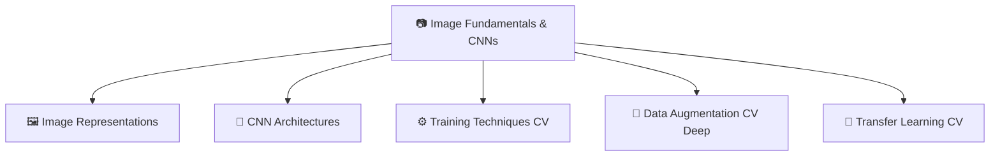

# 📷 MOC — Image Fundamentals & CNNs

> [!abstract] TL;DR
> This section covers the bedrock of computer vision — how images are represented as tensors, how convolutions extract spatial features, how classic CNN architectures evolved from AlexNet to EfficientNet, and how training techniques (batch norm, data augmentation, transfer learning) make these models generalizable. Every subsequent section in this vault builds on these foundations.

---

## Section Map

---

## Learning Path (Recommended Order)

| # | Note | Difficulty | What You'll Learn |
|---|------|------------|-------------------|
| 1 | [[Image_Representations]] | Beginner | Pixel values, tensor shapes, color spaces, normalization, interpolation |
| 2 | [[CNN_Architectures]] | Intermediate | Convolution math, pooling, receptive fields, AlexNet → EfficientNet evolution |
| 3 | [[Training_Techniques_CV]] | Intermediate | BatchNorm, weight init, LR schedules, mixed precision, label smoothing |
| 4 | [[Data_Augmentation_CV_Deep]] | Intermediate | Geometric + color augmentations, Mixup, CutMix, RandAugment, TTA |
| 5 | [[Transfer_Learning_CV]] | Advanced | Feature extraction, fine-tuning, domain adaptation, knowledge distillation |

---

## All Notes at a Glance

| Note | Difficulty | Core Concepts |
|------|------------|---------------|
| [[Image_Representations]] | Beginner | RGB, HSV, LAB, [B,C,H,W] tensors, ImageNet normalization, interpolation |
| [[CNN_Architectures]] | Intermediate | Cross-correlation, padding, stride, dilation, depthwise separable conv, ResNet |
| [[Training_Techniques_CV]] | Intermediate | BatchNorm, GroupNorm, He init, OneCycleLR, AMP, mixup, label smoothing |
| [[Data_Augmentation_CV_Deep]] | Intermediate | CutOut, Mixup, CutMix, RandAugment, AugMix, domain-specific augmentation |
| [[Transfer_Learning_CV]] | Advanced | Linear probing, fine-tuning, gradual unfreezing, CLIP, timm, distillation |

---

## 5 Key Questions for This Section

1. Why does PyTorch use [B, C, H, W] while TensorFlow uses [B, H, W, C], and how do you convert between them?
2. What is the receptive field formula for a stacked CNN and why does it matter for object detection?
3. How does batch normalization stabilize training, and why does its behavior differ between train and inference modes?
4. What makes CutMix a stronger regularizer than simple random cropping or CutOut?
5. When should you freeze the backbone entirely vs fine-tune with a low learning rate, and how does dataset size affect this decision?

---

## Related Sections

| Direction | Section |
|-----------|---------|
| Up (Vault Root) | [[_MOC_CV_Master]] |
| Companion (AI/ML vault) | [[_MOC_Computer_Vision]] |
| Forward | [[_MOC_Detection_Segmentation]] |
| Forward | [[_MOC_ViT_Self_Supervised]] |

---

## Tags
#MOC #computer-vision #image-fundamentals-cnns
