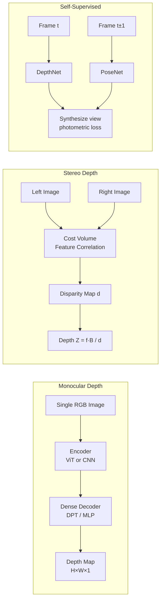

# 📐 Depth Estimation — Deep Dive

> [!abstract] TL;DR
> Depth estimation predicts per-pixel distance from camera to scene. Monocular depth from a single RGB image is ill-posed (many 3D scenes project to the same 2D image); supervised models rely on LiDAR ground truth. Stereo depth uses two cameras and disparity geometry. Self-supervised monocular methods exploit photometric consistency across video frames, removing the LiDAR requirement. Foundation models like Depth Anything (62M training images) dramatically improved zero-shot monocular depth. Metrics: AbsRel, δ<1.25.

## Intuition — analogy FIRST

Close one eye: depth becomes hard to judge (monocular — ill-posed). Open both eyes: your brain triangulates from disparity — the slight positional difference between the two views (stereo). LiDAR is like an active ruler: it fires laser pulses and measures exact distances. Self-supervised methods are like a traveler who learns depth by noticing "as I move forward, close things shift more than distant things" — photometric consistency across frames.

## How It Works



## Key Concepts / Details

### Monocular Depth — Supervised

**Challenge**: infinite 3D scenes can project to identical 2D images — a small nearby object looks identical to a large distant one. Networks must learn scene priors (sky is far, ground is near) from training data.

**Ground truth sources:**
- **LiDAR**: sparse but accurate (~64k points/frame); most common for outdoor (KITTI)
- **Structured light / RGB-D**: dense but short-range (Kinect, Intel RealSense); used for indoor (NYUv2)
- **Depth from stereo**: dense pseudo-GT from stereo matching (DSMNet, CREStereo)

**Scale-Invariant Logarithmic Loss (Eigen et al.):**
$$L_{SILog} = \frac{1}{n}\sum_i d_i^2 - \frac{\lambda}{n^2}\left(\sum_i d_i\right)^2, \quad d_i = \log y_i - \log y_i^*$$
Penalizes relative depth errors while ignoring global scale — important because different sensors have different absolute scale ranges.

**Eigen Split**: standard NYUv2 benchmark split; 654 test images, 36K training; used to compare monocular depth methods.

### Key Monocular Architectures

**DispNet (2016):** U-Net-like encoder-decoder trained end-to-end on stereo pairs with disparity GT.

**BTS — Big-to-Small (2019):** hierarchically captures global structure with local-planar guidance; KITTI AbsRel 0.059.

**AdaBins (2021):**
- Divides the depth range [d_min, d_max] into N adaptive bins; bin centers are predicted by a transformer module attending to global context
- Final depth = linear combination of bin centers weighted by pixel-wise softmax attention
- NYUv2: AbsRel 0.103; KITTI: 0.058

**DPT — Dense Prediction Transformer (2021):**
- ViT encoder → reassemble tokens into image-like feature maps at multiple scales → fusion decoder
- Leverages global attention for long-range consistency; handles large planar surfaces (floors, walls) better than CNN-only models
- MiDaS benchmark: highest zero-shot generalization before Depth Anything

**Depth Anything (2024) — Foundation Model:**
- Leverages 62M unlabeled images via pseudo-label distillation: teacher model labels unlabeled data; student trains on labeled + pseudo-labeled with semantic consistency regularization
- Depth Anything V2: uses synthetic data (high-quality GT) + distillation; AbsRel 0.043 on KITTI; near-SOTA on all benchmarks
- Zero-shot to unseen scenes; publicly available ViT-S/B/L variants

### Stereo Depth Estimation

**Geometry:**
$$Z = \frac{f \cdot B}{d}$$
where Z = depth, f = focal length (pixels), B = stereo baseline (meters), d = disparity (pixels). Larger disparity → closer objects.

**Classical SGM (Semi-Global Matching):**
- Compute matching cost between left and right image patches at each disparity
- Dynamic programming along 8 directions to enforce smoothness
- Fast, reliable in well-textured regions; fails in textureless areas and near occlusions

**Learned Stereo:**
- **DispNet**: CNN-based end-to-end disparity regression from stereo pairs
- **PSMNet**: 3D cost volume (H × W × D) with stacked hourglass 3D convolutions; learned cost aggregation
- **RAFT-Stereo**: adapts optical flow RAFT to disparity; iterative update operator; state-of-the-art on Middlebury/ETH3D

### Self-Supervised Monocular Depth

**SfMLearner (2017) — Photometric Consistency:**
- Train simultaneously: DepthNet (I_t → D_t) + PoseNet (I_t, I_{t±1} → relative pose T_{t→s})
- Reconstruct source frame from target: sample I_s using predicted depth D_t + pose T
- Photometric loss: |I_t − I_s→t| (L1) + SSIM term
- No depth GT needed; only monocular video at training time

**Monodepth2 (2019):**
- **Auto-masking**: ignore pixels where the moving object causes inconsistency (stationary camera or moving objects)
- **Full-resolution multi-scale loss**: compute photometric loss at all decoder scales
- **Minimum reprojection loss**: across multiple source frames → handles occlusions; KITTI AbsRel 0.115

**Depth Completion: Sparse LiDAR + RGB → Dense Depth**
- LiDAR gives ~5% pixel coverage; goal: dense H×W depth map
- CSPN (Convolutional Spatial Propagation Network): propagate sparse depth through spatial affinity from RGB
- GuideNet, PENet: guide sparse LiDAR with RGB features; KITTI depth completion RMSE ~200mm

### Depth Estimation Metrics

| Metric | Formula | Lower is better? |
|--------|---------|-----------------|
| AbsRel | (1/n)Σ|y−ŷ|/y | Yes |
| SqRel | (1/n)Σ(y−ŷ)²/y | Yes |
| RMSE | √((1/n)Σ(y−ŷ)²) | Yes |
| log RMSE | √((1/n)Σ(log y−log ŷ)²) | Yes |
| δ<1.25 | % pixels: max(y/ŷ, ŷ/y) < 1.25 | Higher is better |

### Supervised vs Self-Supervised vs Stereo

| Approach | Labeled Data | Accuracy | Use Case |
|----------|-------------|----------|----------|
| Supervised (LiDAR GT) | Expensive LiDAR scans | Best (AbsRel ~0.04) | Autonomous driving with LiDAR rig |
| Self-supervised (video) | Monocular video only | Good (AbsRel ~0.10) | Consumer cameras, mobile, drones |
| Stereo | Calibrated stereo rig | Excellent, metric scale | Robotics, AR, constrained hardware |
| Depth foundation model | Large unlabeled + pseudo-labels | Best generalization | Any domain, zero-shot deployment |

## Real-World Notes

```python
# Depth Anything V2 inference
from transformers import AutoImageProcessor, AutoModelForDepthEstimation
import torch
from PIL import Image
import numpy as np

processor = AutoImageProcessor.from_pretrained("depth-anything/Depth-Anything-V2-Small-hf")
model = AutoModelForDepthEstimation.from_pretrained("depth-anything/Depth-Anything-V2-Small-hf")

image = Image.open("scene.jpg")
inputs = processor(images=image, return_tensors="pt")

with torch.no_grad():
    outputs = model(**inputs)

# Post-process
predicted_depth = outputs.predicted_depth           # (1, H, W)
depth = torch.nn.functional.interpolate(
    predicted_depth.unsqueeze(1),
    size=image.size[::-1],
    mode="bicubic",
    align_corners=False,
).squeeze()

depth_np = depth.numpy()
# Note: output is relative/affine depth — not metric scale
# For metric scale, fine-tune on a dataset with metric GT
```

- Depth Anything outputs are **affine-invariant** (relative depth, not metric) for zero-shot mode; fine-tune on KITTI/NYUv2 splits for metric output
- For stereo applications: OpenCV `cv2.StereoSGBM_create()` gives a fast classical baseline
- RAFT-Stereo is the go-to for high-accuracy learned stereo

## Common Pitfalls

- **Scale ambiguity in self-supervised methods**: monocular self-supervised models predict up-to-scale depth; cannot directly compare absolute values across scenes without per-image scale alignment
- **Outdoor vs indoor generalization**: models trained on KITTI (outdoor, 80m range) perform poorly on NYUv2 (indoor, 10m range) — depth range normalization matters
- **Ignoring the sky in LiDAR GT**: sky pixels have no LiDAR returns; mask them from loss computation
- **Stereo rectification drift**: if calibration is imperfect, disparity estimation fails — always verify epipolar alignment before training/inference
- **Evaluating on non-Eigen split**: most papers use Eigen split on KITTI; using the full test set gives non-comparable numbers — always specify the split

## Related Concepts

- [[Semantic_Segmentation_Deep]] — dense prediction architectures (DPT, SegFormer) apply equally here
- [[Instance_Panoptic_Segmentation]] — depth maps can be used for 3D lifting of instance masks
- [[_MOC_Detection_Segmentation]] — section overview

## Review Questions

1. Why is monocular depth estimation ill-posed, and what scene priors do networks implicitly learn to resolve this ambiguity?
2. Derive the disparity-to-depth relationship Z = f·B/d from first principles using the stereo geometry.
3. How does SfMLearner's photometric loss enable training without depth ground truth, and what fundamental limitation does it have?
4. What is the purpose of auto-masking in Monodepth2, and why is it necessary?
5. How does AdaBins' adaptive bin prediction improve over fixed-depth-range regression for indoor scenes with wide depth variation?

## Sources

- Eigen et al., "Depth Map Prediction from a Single Image," NeurIPS 2014
- Zhou et al., "SfMLearner," CVPR 2017
- Godard et al., "Monodepth2," ICCV 2019
- Ranftl et al., "DPT," ICCV 2021
- Bhat et al., "AdaBins," CVPR 2021
- Yang et al., "Depth Anything V2," NeurIPS 2024

#computer-vision #detection-segmentation #advanced
