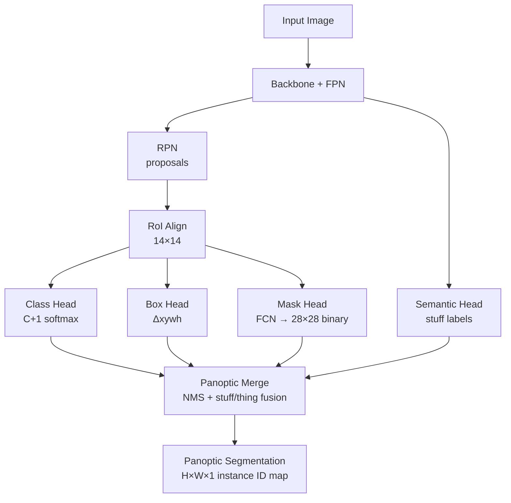

# 🧩 Instance & Panoptic Segmentation

> [!abstract] TL;DR
> Instance segmentation detects each object AND produces a per-instance binary mask — distinguishing car #1 from car #2. Mask R-CNN extends Faster R-CNN with a parallel mask prediction head. SOLO/SOLOv2 eliminates RoI operations entirely. Panoptic segmentation unifies "things" (countable: person, car) and "stuff" (amorphous: sky, grass) into a single coherent labeling evaluated by Panoptic Quality (PQ = SQ × RQ). Mask2Former provides a unified transformer-based approach for all three tasks.

## Intuition — analogy FIRST

Semantic segmentation paints by category: all pixels belonging to "person" are red. Instance segmentation paints by individual: person #1 is red, person #2 is blue, person #3 is green. Panoptic segmentation does both: it segments every "thing" by instance AND labels every "stuff" pixel by category — so the road, sky, and each individual pedestrian all get a label with no pixel left undefined.

## How It Works



## Key Concepts / Details

### Instance Segmentation Task
- Input: image
- Output: per detected object → (bbox, class, binary mask)
- Evaluation: **mAP** using mask IoU thresholds {0.5, 0.55, …, 0.95} averaged → mAP@0.5:0.95

### Mask R-CNN (2017)
Extends Faster R-CNN with a **mask head** — a small FCN applied independently to each RoI:
1. RoI Align: for each detected proposal, extract a 14×14 feature grid via bilinear interpolation
2. Mask head: 4× conv3×3 (256 channels) → transposed conv ×2 upsample → 28×28 × C binary masks
3. Loss: binary cross-entropy only over the GT class channel (class-specific mask prediction — decouples classification from masking)

**Key insight**: predicting C separate masks (one per class) and selecting the GT class mask avoids competition between class detection and mask quality. Class label comes from the bbox head.

**RoI Align importance**: quantized RoI Pooling introduces ~1px misalignment that is tolerable for detection but ruins the precise mask. RoI Align uses bilinear interpolation at exact floating-point coordinates → visually correct masks.

### SOLO — Segmenting Objects by Locations (2019)
- Divide image into S×S grid; assign GT objects to cells based on center location and object scale
- For each cell (i, j): predict a **category vector** (C classes) AND a **mask branch** outputting H×W binary mask
- Output: C × S² masks — direct per-cell mask prediction without RoI operations
- **SOLOv2**: decoupled mask prediction via kernel generation and dynamic convolution → faster + cleaner

**Advantage over Mask R-CNN**: no RPN, no NMS, no RoI operations; conceptually simple, parallelizable.

### QueryInst & Cascade Mask R-CNN
- **Cascade Mask R-CNN**: multiple detection + mask heads at increasing IoU thresholds (0.5, 0.6, 0.7); each stage refines previous stage's predictions → higher AP at tight IoU thresholds
- **QueryInst**: learnable queries iteratively refined through transformer decoder; instance-level feature extraction via query-based RoI; end-to-end without NMS

### Panoptic Segmentation

**Terminology:**
- **"Things"**: countable, individual objects (person, car, dog) — segmented by instance
- **"Stuff"**: amorphous background regions (sky, road, grass) — segmented by category only

**Panoptic Quality (PQ) Metric:**
$$\text{PQ} = \underbrace{\frac{\sum_{(p,g) \in TP} \text{IoU}(p, g)}{|TP|}}_{\text{SQ — Segmentation Quality}} \times \underbrace{\frac{|TP|}{|TP| + \frac{1}{2}|FP| + \frac{1}{2}|FN|}}_{\text{RQ — Recognition Quality}}$$

SQ measures average mask quality of matched pairs; RQ is an F1 measure of detection. PQ = SQ × RQ jointly penalizes poor localization and missed/spurious predictions.

**Panoptic FPN (2019):**
- Take Mask R-CNN's FPN → add a semantic segmentation branch (stuff head)
- Merge: assign each pixel to the highest-confidence instance if within a "thing" mask; otherwise use the semantic head's "stuff" label
- Simple, effective baseline: 40.9 PQ on COCO panoptic

**Mask2Former (2022) — Unified Architecture:**
- N learnable queries → transformer decoder with **masked attention** (each query only attends to pixels within its predicted mask region)
- Hungarian bipartite matching between N predictions and GT (same as DETR)
- Single model handles semantic, instance, and panoptic — switch only the loss/annotation during training
- 66.4 PQ on COCO panoptic (Swin-L backbone); 80.1 mIoU ADE20K semantic

### Video Instance Segmentation (VIS)
- Extend per-frame instance masks to consistent IDs across frames
- **MaskTrack R-CNN**: adds tracking branch to Mask R-CNN; match instances across frames by appearance + motion
- **Challenges**: occlusion, re-identification, efficiency across temporal dimension

### Open-Vocabulary Segmentation
- **ODISE**: diffusion model features + CLIP text embeddings for zero-shot panoptic segmentation
- **FC-CLIP**: single frozen CLIP model as backbone for open-vocabulary detection and segmentation
- Enables segmenting novel categories unseen during training using natural language descriptions

### Semantic vs Instance vs Panoptic

| Property | Semantic Seg | Instance Seg | Panoptic Seg |
|----------|-------------|-------------|-------------|
| Per-pixel labels | Yes | Yes | Yes |
| Instance distinction | No | Yes (things) | Yes (things) |
| Stuff regions | Yes | No | Yes |
| All pixels covered | Yes | No | Yes |
| Metric | mIoU | mAP (mask IoU) | PQ |
| Canonical model | DeepLabv3+ | Mask R-CNN | Mask2Former |

## Real-World Notes

```python
# Detectron2 Mask R-CNN inference
import detectron2
from detectron2.engine import DefaultPredictor
from detectron2.config import get_cfg
from detectron2.model_zoo import get_config_file, get_checkpoint_url

cfg = get_cfg()
cfg.merge_from_file(get_config_file("COCO-InstanceSegmentation/mask_rcnn_R_50_FPN_3x.yaml"))
cfg.MODEL.WEIGHTS = get_checkpoint_url("COCO-InstanceSegmentation/mask_rcnn_R_50_FPN_3x.yaml")
cfg.MODEL.ROI_HEADS.SCORE_THRESH_TEST = 0.5

predictor = DefaultPredictor(cfg)
import cv2
img = cv2.imread("image.jpg")
outputs = predictor(img)

instances = outputs["instances"]
print(instances.pred_boxes)    # N × 4 bounding boxes (xyxy)
print(instances.pred_classes)  # N class ids
print(instances.pred_masks)    # N × H × W binary masks
```

- Detectron2 provides Panoptic FPN and Mask2Former configurations out of the box
- For real-time instance segmentation: YOLOv8-seg achieves ~30 fps on T4 at 720p
- SOLOv2 is a strong alternative when RPN overhead is a bottleneck

## Common Pitfalls

- **Using RoI Pooling for masks**: always use RoI Align; the 1px quantization error that is acceptable for detection degrades mask quality visibly at 28×28 resolution
- **Class-specific vs class-agnostic masks**: Mask R-CNN uses class-specific (C masks per RoI); class-agnostic (1 mask) is simpler but less accurate; choose based on downstream need
- **Panoptic merge conflicts**: pixels can be claimed by both a thing instance and a stuff label — apply overlap resolution (prefer high-confidence instances, use threshold on mask area)
- **Evaluating VIS with static metrics**: PQ on individual frames does not capture tracking consistency — use VPQ (Video PQ) or HOTA
- **Memory with many instances**: storing N × H × W masks for large N and high-resolution images exhausts GPU memory; downsample masks or use compressed representations

## Related Concepts

- [[Object_Detection_RCNN]] — Mask R-CNN is built on Faster R-CNN + FPN
- [[Semantic_Segmentation_Deep]] — stuff segmentation component of panoptic pipeline
- [[_MOC_Detection_Segmentation]] — section overview

## Review Questions

1. Why is RoI Align critical for mask quality but only marginally important for bounding box detection?
2. Explain how Mask R-CNN's class-specific mask prediction decouples masking from classification.
3. What does the PQ metric penalize that mAP and mIoU individually miss?
4. How does SOLO eliminate the RPN and RoI operations while still performing instance segmentation?
5. What architectural decision in Mask2Former allows it to handle semantic, instance, and panoptic segmentation with a single model?

## Sources

- He et al., "Mask R-CNN," ICCV 2017
- Wang et al., "SOLO," ECCV 2020
- Kirillov et al., "Panoptic Segmentation," CVPR 2019
- Kirillov et al., "Panoptic FPN," CVPR 2019
- Cheng et al., "Mask2Former," CVPR 2022

#computer-vision #detection-segmentation #advanced
