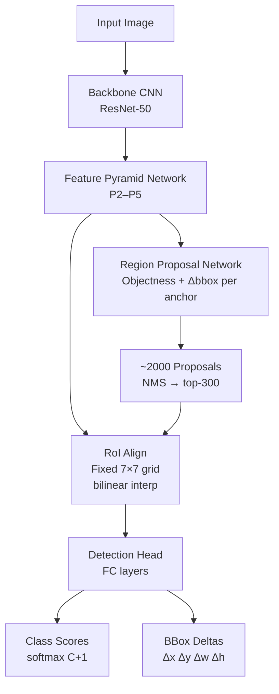

# 🔍 Object Detection — R-CNN Family

> [!abstract] TL;DR
> The R-CNN family introduced region proposals + CNN features as the dominant detection paradigm. R-CNN (2014) warped each proposal to a fixed size; Fast R-CNN moved feature extraction to run once on the whole image using RoI Pooling; Faster R-CNN replaced selective search with a Region Proposal Network (RPN) sharing the backbone, enabling end-to-end training at 5 fps. FPN added multi-scale features. DETR eliminated anchors and NMS entirely via set-prediction with transformers.

## Intuition — analogy FIRST

Imagine scanning a photo for faces: you first highlight "interesting regions" (proposals), then examine each crop closely to classify it. R-CNN does exactly this — but it's slow because it examines each crop independently. Fast R-CNN says: extract features once from the whole image, then just crop the feature map for each proposal. Faster R-CNN goes further: let the network itself suggest where to look.

## How It Works



## Key Concepts / Details

### Anchor Boxes
Pre-defined reference boxes tiled across every spatial location of a feature map at multiple **scales** (e.g., 32, 64, 128 px) and **aspect ratios** (1:1, 1:2, 2:1). For a P_l feature map of size H×W with k anchors, there are H×W×k anchor boxes total. Anchors with IoU > 0.7 with a GT box are positive; IoU < 0.3 are negative.

### IoU — Intersection over Union
$$\text{IoU}(A, B) = \frac{|A \cap B|}{|A \cup B|}$$
Ranges [0, 1]. Used for anchor assignment, NMS threshold, and mAP computation. IoU = 1 means perfect overlap.

### NMS — Non-Maximum Suppression
After inference, many overlapping boxes predict the same object. NMS: sort detections by confidence, keep the highest-score box, suppress all boxes with IoU > threshold (e.g., 0.5) with it, repeat. Soft-NMS decays scores instead of hard removal.

### RoI Pooling vs RoI Align
- **RoI Pooling**: quantizes proposal coordinates to integer grid positions → misalignment artifacts
- **RoI Align**: uses bilinear interpolation at exact floating-point coordinates → fixes ~1px misalignment critical for masks

### Feature Pyramid Network (FPN)
Bottom-up backbone produces feature maps C2–C5 at decreasing spatial resolution. Top-down pathway: upsample C5 → P5, merge with lateral 1×1 conv of C4 → P4, etc. Each pyramid level P_l handles objects of corresponding scale. Small objects use high-resolution P2; large objects use P5.

### Detection Head
Per RoI, the head outputs:
- **Classification**: softmax over C+1 classes (including background)
- **Bbox Regression**: 4 deltas (Δx, Δy, Δw, Δh) encoding offset from anchor to ground truth

### Anchor-Free Alternatives
- **FCOS**: assigns GT to each foreground pixel; predicts (l, t, r, b) distances to box edges + centerness score to suppress low-quality predictions near box edges
- **CenterNet**: represents objects as Gaussian heatmaps at object centers; regresses wh offsets; very clean formulation, no NMS needed for single-object-per-center
- **DETR**: uses N learnable object queries; cross-attends to CNN features; Hungarian matching loss trains directly for set prediction; no anchors, no NMS

### Evolution Summary

| Model | Speed | mAP (VOC) | Key Innovation |
|-------|-------|-----------|----------------|
| R-CNN | 47 s/img | 66.0 | Region proposals + CNN |
| Fast R-CNN | ~2 s/img | 70.0 | Feature map shared, RoI Pool |
| Faster R-CNN | 5 fps | 73.2 | RPN end-to-end, anchors |
| Faster+FPN | ~8 fps | 80.1 | Multi-scale FPN features |
| DETR | ~28 fps | 42.0 COCO | Transformer, no NMS |

## Real-World Notes

```python
import torchvision
model = torchvision.models.detection.fasterrcnn_resnet50_fpn(pretrained=True)
model.eval()
import torch
from torchvision.transforms.functional import to_tensor
from PIL import Image

img = to_tensor(Image.open("image.jpg"))
with torch.no_grad():
    predictions = model([img])
# predictions[0] keys: 'boxes' (N,4), 'labels' (N,), 'scores' (N,)
boxes  = predictions[0]['boxes']   # xyxy format
labels = predictions[0]['labels']
scores = predictions[0]['scores']
keep = scores > 0.5
print(boxes[keep], labels[keep])
```

- Use `fasterrcnn_mobilenet_v3_large_fpn` for edge inference; `fasterrcnn_resnet50_fpn_v2` for best accuracy
- FPN anchor strides: P2=4, P3=8, P4=16, P5=32 — choose anchors accordingly for your target object size
- Soft-NMS helps when objects are densely packed (crowds)

## Common Pitfalls

- **Anchor scale mismatch**: if your objects are much smaller/larger than ImageNet defaults, re-tune anchor sizes or switch to anchor-free
- **RoI Pooling vs Align**: always use RoI Align for segmentation tasks — quantization artifacts ruin masks
- **Ignoring background imbalance**: positive:negative anchors ~1:3; use Online Hard Example Mining (OHEM) or focal loss
- **Not freezing BN stats**: with small per-GPU batch sizes, BN in backbone hurts; freeze or use Group Norm
- **NMS threshold too low**: suppresses true positives in crowded scenes — raise to 0.6 or use Soft-NMS

## Related Concepts

- [[YOLO_Deep_Dive]] — single-stage counterpart; faster, less accurate on small objects
- [[Instance_Panoptic_Segmentation]] — Mask R-CNN extends Faster R-CNN with a mask head
- [[Semantic_Segmentation_Deep]] — FPN is also the neck in many segmentation models
- [[_MOC_Detection_Segmentation]] — section overview

## Review Questions

1. Why does RoI Align outperform RoI Pooling for instance segmentation?
2. How does FPN enable detection at multiple scales with a single forward pass?
3. What makes DETR fundamentally different from anchor-based detectors, and what are its trade-offs?
4. Describe the anchor assignment strategy in RPN: what IoU thresholds define positive, negative, and ignored anchors?
5. Why does FCOS need a centerness branch?

## Sources

- Girshick et al., "R-CNN," CVPR 2014
- Girshick, "Fast R-CNN," ICCV 2015
- Ren et al., "Faster R-CNN," NeurIPS 2015
- Lin et al., "FPN," CVPR 2017
- Tian et al., "FCOS," ICCV 2019
- Carion et al., "DETR," ECCV 2020

#computer-vision #detection-segmentation #intermediate
