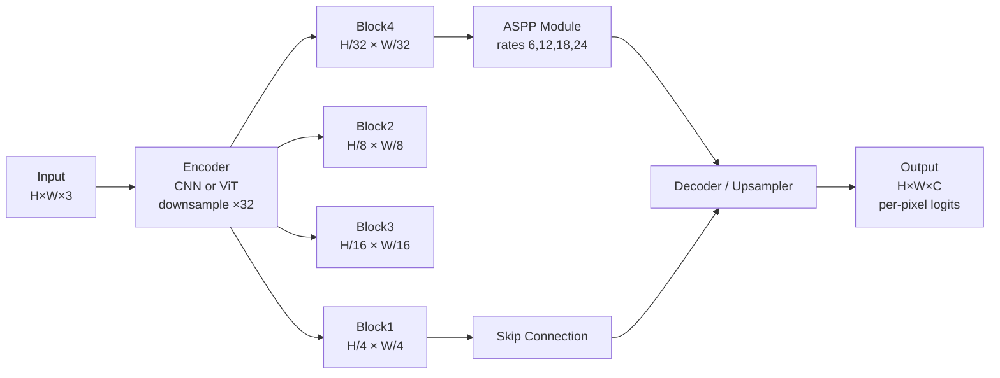

# 🎨 Semantic Segmentation — Deep Dive

> [!abstract] TL;DR
> Semantic segmentation assigns a class label to every pixel — sky, road, person — with no distinction between individual instances. Evaluation uses mIoU. The field evolved from FCN (2015, remove FC layers → dense predictions) through UNet (encoder-decoder with skip connections) and DeepLab (atrous convolutions + ASPP) to modern transformer-based models like SegFormer and Mask2Former that achieve state-of-the-art mIoU with lightweight decoders.

## Intuition — analogy FIRST

Imagine coloring a line drawing where each region gets a different crayon color by category — all sky in blue, all grass in green, all cars in red — but you don't care if there are two cars; they all get the same red. That's semantic segmentation. Every pixel gets a class label; individual instances are ignored.

## How It Works



## Key Concepts / Details

### Task Definition
Given image I ∈ ℝ^{H×W×3}, produce dense label map Y ∈ {1,…,C}^{H×W} where C is the number of semantic classes. No instance distinction — two pedestrians share the same "person" label.

**Evaluation — mIoU:**
$$\text{mIoU} = \frac{1}{C}\sum_{c=1}^{C}\frac{TP_c}{TP_c + FP_c + FN_c}$$
Mean IoU over all classes; each class IoU = pixels correctly labeled as c / (predicted c + true c − correctly predicted c).

### FCN — Fully Convolutional Network (2015)
- Replace fully-connected layers in VGG/AlexNet with 1×1 conv → outputs spatial map
- **Transposed convolution** (strided deconv) upsamples feature maps back to image resolution
- Skip connections from earlier layers (FCN-8s: fuse pool3, pool4, fc7 predictions)
- First end-to-end trained dense predictor; mIoU ~62% on Pascal VOC 2012

### UNet (2015) — Encoder-Decoder with Skip Connections
```
Encoder path:  conv→conv→pool  (downsample, double channels)
Bottleneck:    deepest feature representation
Decoder path:  upsample→concat(skip)→conv→conv  (halve channels)
Output:        1×1 conv → C classes
```
- **Skip connections** copy encoder feature maps directly to decoder at same resolution → preserves fine spatial detail lost during pooling
- Designed for biomedical images (few training examples); strong augmentation (elastic deformation)
- mIoU 77.5% on ISBI cell segmentation; widely used in medical imaging, satellite imagery

### DeepLab Series

**DeepLabv1 (2015):**
- **Atrous (dilated) convolution**: insert zeros between filter weights with rate r → receptive field expands without losing resolution
- Replace striding with dilation to maintain output stride 8 instead of 32

**DeepLabv2 (2016) — ASPP:**
- **Atrous Spatial Pyramid Pooling**: apply atrous conv at rates {6, 12, 18, 24} in parallel → capture context at multiple scales
- Fuse responses → 1×1 conv → prediction
- CRF post-processing for sharp boundaries (optional)

**DeepLabv3 (2017):**
- Improved ASPP with image-level global average pooling branch
- Removed CRF; robust encoder-only design

**DeepLabv3+ (2018):**
- Decoder path: low-level features from encoder (stride 4) + upsampled ASPP output → two 3×3 convs → bilinear upsample ×4
- 89.0 mIoU on Pascal VOC 2012; 82.1 on Cityscapes

### PSPNet — Pyramid Pooling Module (2017)
- Pool feature map at 4 scales: 1×1, 2×2, 3×3, 6×6
- Upsample each pooled map back to original feature map size
- Concatenate all scales → global and local context; 85.4 mIoU on Cityscapes

### SegFormer (2021)
- **Mix Transformer (MiT)** encoder: hierarchical ViT with overlapping patch embeddings and efficient self-attention (reduce seq length by pooling key/value)
- **Lightweight MLP decoder**: concatenate multi-scale features from 4 MiT stages, apply MLP + upsample → prediction; no attention in decoder
- SegFormer-B5: 84.0 mIoU Cityscapes; SegFormer-B0: 37.4M ops (faster than DeepLabv3+)

### Mask2Former (2022)
- Universal architecture for semantic, instance, and panoptic segmentation
- **Masked attention**: each query attends only to its predicted mask region (localized attention)
- N learnable queries → N mask predictions + class scores
- Training: Hungarian matching between predictions and GT; per-pixel cross-entropy + Dice loss

### Loss Functions

| Loss | Formula | Best For |
|------|---------|----------|
| Cross-Entropy | −Σ y_c log p_c | Standard baseline |
| Dice Loss | 1 − 2·TP/(2·TP+FP+FN) | Class imbalance (medical) |
| Focal Loss | −(1−p_t)^γ log(p_t) | Hard examples, heavy imbalance |
| Lovász-Softmax | Surrogate for mIoU | Directly optimize mIoU |

**Class imbalance**: in autonomous driving, sky/road are frequent; person is rare. Median frequency balancing weights or focal loss γ=2 helps.

### Architecture Comparison

| Model | Backbone | mIoU Citysc. | Params (M) | Output Stride |
|-------|----------|-------------|------------|---------------|
| FCN-8s | VGG-16 | 65.3 | 134 | 8 |
| UNet | Custom | varies | ~31 | 1 |
| DeepLabv3+ | ResNet-101 | 82.1 | 62 | 4 |
| PSPNet | ResNet-101 | 85.4 | 65 | 8 |
| SegFormer-B5 | MiT-B5 | 84.0 | 85 | — |
| Mask2Former | Swin-L | 86.8 | 216 | — |

## Real-World Notes

```python
from transformers import SegformerForSemanticSegmentation, SegformerImageProcessor
import torch
from PIL import Image

processor = SegformerImageProcessor.from_pretrained("nvidia/segformer-b0-finetuned-cityscapes-512-1024")
model = SegformerForSemanticSegmentation.from_pretrained("nvidia/segformer-b0-finetuned-cityscapes-512-1024")

image = Image.open("city.jpg")
inputs = processor(images=image, return_tensors="pt")

with torch.no_grad():
    outputs = model(**inputs)

logits = outputs.logits  # (1, C, H/4, W/4)
upsampled = torch.nn.functional.interpolate(logits, size=image.size[::-1], mode="bilinear")
pred = upsampled.argmax(dim=1)  # (1, H, W)
```

- UNet variants (UNet++, Attention UNet) dominate medical imaging competitions
- For edge deployment: DeepLabv3+ with MobileNetv2 backbone achieves ~70% mIoU Cityscapes at ~30 fps on mobile GPU
- Cityscapes has 19 classes; ADE20K has 150 classes — much harder

## Common Pitfalls

- **Ignoring class imbalance**: cross-entropy without weighting causes the model to ignore rare but important classes (cyclists, traffic signs)
- **Output stride confusion**: DeepLabv3+ outputs stride-4 maps; bilinear upsample ×4, not ×32 — failing to account for this causes blurry outputs
- **UNet skip connection dimension mismatch**: encoder and decoder must have matching channel counts at each skip — check architecture carefully
- **Evaluating on resized predictions**: always upsample logits to original input size before computing mIoU; evaluating at ×4 downsampled artificially inflates metrics
- **Forgetting void/ignore label**: Cityscapes has an "unlabeled" class (id=255) that must be masked from loss computation

## Related Concepts

- [[Instance_Panoptic_Segmentation]] — extends per-pixel classification to distinguish individuals
- [[Object_Detection_RCNN]] — FPN neck used in semantic segmentation heads
- [[_MOC_Detection_Segmentation]] — section overview

## Review Questions

1. Why does atrous convolution maintain spatial resolution while enlarging the receptive field?
2. How do UNet skip connections differ from FPN lateral connections?
3. What does ASPP do that a single atrous convolution cannot?
4. Why is Dice loss preferred over cross-entropy for class-imbalanced segmentation tasks?
5. How does SegFormer's MLP decoder achieve competitive accuracy with far fewer parameters than a transformer decoder?

## Sources

- Long et al., "Fully Convolutional Networks," CVPR 2015
- Ronneberger et al., "U-Net," MICCAI 2015
- Chen et al., "DeepLabv3+," ECCV 2018
- Xie et al., "SegFormer," NeurIPS 2021
- Cheng et al., "Mask2Former," CVPR 2022

#computer-vision #detection-segmentation #intermediate
