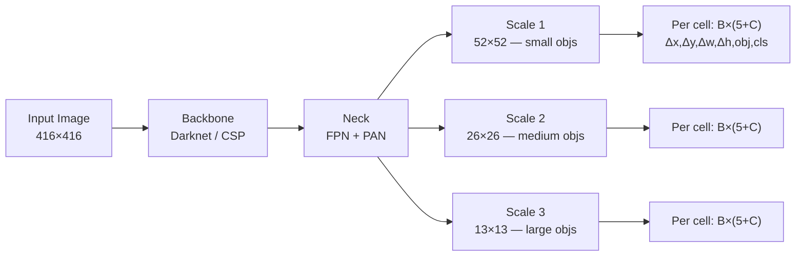

# ⚡ YOLO — Deep Dive

> [!abstract] TL;DR
> YOLO (You Only Look Once) reformulated detection as a single regression problem: one forward pass through a CNN predicts all boxes and classes simultaneously. Each version improved the accuracy-speed trade-off — YOLOv3 added multi-scale predictions; YOLOv4 introduced modern training tricks (mosaic augmentation, CIoU loss, CSP backbone); YOLOX went anchor-free with SimOTA label assignment; YOLOv8 (Ultralytics) unified detection, segmentation, pose, and classification in one framework.

## Intuition — analogy FIRST

Imagine dividing a photo into a grid of cells. Each cell "owns" whatever object's center falls inside it and is responsible for predicting that object's box and class. No separate proposal stage — the grid itself is the proposal mechanism. It's like assigning postal districts: whichever district contains an object's center handles it.

## How It Works



## Key Concepts / Details

### YOLOv1 (2016) — Unified Detection
A single CNN maps the image to an S×S grid (7×7). Each grid cell predicts:
- B bounding boxes: (x, y, w, h, confidence), confidence = Pr(object) × IoU
- C class probabilities: Pr(class | object)

Output tensor: S × S × (5B + C). At 7×7 grid with B=2, C=20 (VOC): **7×7×30**. Achieves 45 fps on GPU; 63.4 mAP@0.5 VOC. Weakness: struggles with small/clustered objects (one cell predicts at most B objects).

### YOLOv2 / YOLO9000 (2016)
- **Anchor boxes from k-means** on training set GT boxes (5 anchors by default)
- **Batch normalization** on all conv layers (regularization, no dropout)
- **Multi-scale training**: every 10 batches sample new input resolution {320, …, 608}
- **Darknet-19** backbone (19 conv layers); passthrough layer for fine-grained features

### YOLOv3 (2018)
- **Darknet-53** backbone (53 conv layers, residual connections)
- **3 detection scales** with FPN-like upsampling (13×13, 26×26, 52×52)
- **3 anchors per scale** (9 total from k-means), assigned by size
- **Sigmoid for class probabilities** (multi-label possible; no softmax)
- 30.9 AP on COCO (IoU=0.5:0.95) at 51 ms inference; excellent small-object detection

### YOLOv4 (2020) — Bag of Tricks
- **CSPDarknet-53** backbone: Cross-Stage Partial connections reduce computation
- **PANet neck**: Path Aggregation Network — bottom-up path augmentation on top of FPN
- **Mish activation**: smoother than ReLU, improves gradient flow
- **Mosaic augmentation**: randomly crop and combine 4 images → richer context, allows smaller batch size
- **CIoU loss**: Complete-IoU loss = IoU − (center distance penalty) − (aspect ratio penalty)
- 43.5 AP on COCO with 65 fps (Tesla V100)

### YOLOv5 (Ultralytics, 2020)
- PyTorch rewrite; tiered models: YOLOv5n/s/m/l/x (nano → extra-large)
- **AutoAnchor**: automatically cluster anchors from dataset GT boxes
- **Auto-batch**: scale batch size to GPU memory
- Achieved widespread adoption in industry

### YOLOX (2021) — Anchor-Free
- **Decoupled head**: separate branches for classification and regression (shared backbone/neck)
- **Anchor-free**: predict center offset within assigned cell, no pre-defined anchor shapes
- **SimOTA label assignment**: Optimal Transport-based dynamic assignment — each GT assigned to top-k predictions minimizing cost
- 51.5 AP on COCO at 68 fps; state-of-the-art in 2021

### YOLOv8 (Ultralytics, 2023)
- **C2f module** (Cross-Stage Partial with more gradient flow)
- **Task-Aligned Head (TAH)**: decoupled head with IoU-aware classification
- Supports: detection, instance segmentation, pose estimation, classification
- Ultralytics API: `model = YOLO("yolov8n.pt"); model.predict("image.jpg")`

### Loss Function
Total loss = λ_cls · L_cls + λ_box · L_box + λ_obj · L_obj

| Component | Description |
|-----------|-------------|
| L_cls | BCE per class (multi-label) or CE (mutually exclusive) |
| L_box | CIoU / GIoU / SIoU loss on matched GT |
| L_obj | BCE objectness: 1 if object assigned, 0 otherwise |

### IoU Loss Variants
- **GIoU**: penalizes smallest enclosing box area not overlapping either box
- **DIoU**: penalizes center-point distance between predicted and GT box
- **CIoU**: DIoU + aspect ratio consistency penalty → fastest convergence

### Label Assignment
- **ATSS** (Adaptive Training Sample Selection): select top-k candidates per level by center proximity; threshold using mean+std of IoU
- **SimOTA**: frame as optimal transport; cost = cls_loss + IoU_cost; dynamic k per GT
- **TAL** (Task-Aligned Learning, v8): alignment score = s^α · u^β (s=cls score, u=IoU)

### YOLO Family Comparison (COCO)

| Model | Params (M) | mAP@0.5:0.95 | Speed (ms, V100) |
|-------|------------|--------------|-----------------|
| YOLOv3-608 | 61 | 33.0 | 51 |
| YOLOv4-608 | 64 | 43.5 | 26 |
| YOLOv5l | 46 | 49.0 | 6.2 |
| YOLOX-l | 54 | 50.1 | 14.8 |
| YOLOv8l | 44 | 52.9 | 8.1 |

## Real-World Notes

```python
from ultralytics import YOLO

model = YOLO("yolov8n.pt")              # nano — fastest
results = model.predict("image.jpg", conf=0.25, iou=0.45)
for r in results:
    print(r.boxes.xyxy)                 # bounding boxes
    print(r.boxes.cls)                  # class ids
    print(r.boxes.conf)                 # confidence scores
    r.show()                            # visualize

# Fine-tune on custom data
model.train(data="custom.yaml", epochs=100, imgsz=640, batch=16)
```

- For real-time inference (< 10 ms): use YOLOv8n or YOLOv5n with TensorRT export
- For best accuracy: YOLOv8x or train with mosaic + mixup augmentation
- YOLOX is preferred in academic benchmarks due to clean anchor-free design
- Export formats: ONNX, TensorRT, CoreML, TFLite via `model.export(format="onnx")`

## Common Pitfalls

- **Grid cell boundary artifacts**: objects spanning multiple cells cause duplicate predictions — NMS is essential post-processing
- **Anchor scale mismatch**: if custom dataset has unusual aspect ratios, re-run k-means anchor clustering on your data
- **Small object detection**: YOLOv1/v2 struggle — use v3+ with 52×52 scale or increase input resolution
- **Objectness vs classification confusion**: objectness predicts presence of any object; class head predicts which class — both must fire for a valid detection
- **CIoU vs MSE box loss**: always prefer CIoU; MSE does not account for IoU and optimizes in the wrong direction for nearly aligned boxes

## Related Concepts

- [[Object_Detection_RCNN]] — two-stage counterpart; better accuracy on small objects
- [[Instance_Panoptic_Segmentation]] — YOLO-seg adds mask head to YOLOv8
- [[_MOC_Detection_Segmentation]] — section overview

## Review Questions

1. How does the S×S grid cell responsibility assignment cause limitations for clustered objects?
2. Why does decoupling the classification and regression heads (YOLOX) improve accuracy?
3. Explain CIoU loss and why it converges faster than MSE-based box regression.
4. What problem does SimOTA solve that fixed IoU threshold assignment cannot?
5. How does mosaic augmentation effectively increase the batch size diversity without needing more GPU memory?

## Sources

- Redmon et al., "You Only Look Once," CVPR 2016
- Redmon & Farhadi, "YOLOv3: An Incremental Improvement," arXiv 2018
- Bochkovskiy et al., "YOLOv4," arXiv 2020
- Ge et al., "YOLOX," arXiv 2021
- Ultralytics YOLOv8 documentation, 2023

#computer-vision #detection-segmentation #intermediate
