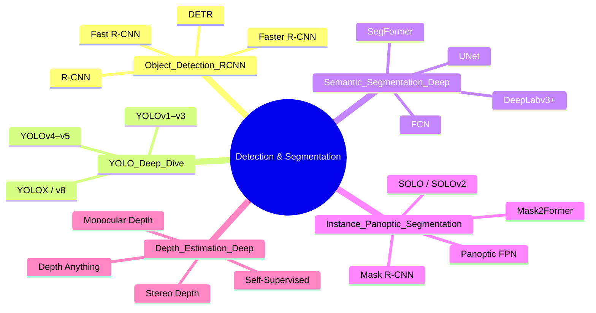

# 🗺️ MOC — Object Detection & Segmentation

> [!abstract] TL;DR
> Object detection finds and classifies every object in an image; segmentation extends this to pixel-level precision. Two-stage detectors (R-CNN family) are accurate; single-stage detectors (YOLO, SSD, FCOS) are fast. Semantic segmentation labels every pixel to a class; instance segmentation distinguishes individual objects; panoptic segmentation unifies both. This section covers the full pipeline from anchor design and NMS through state-of-the-art models.

## Intuition — analogy FIRST

Think of detection as asking "what is where?" — you want a bounding box around every cat and dog. Segmentation asks "what is every pixel?" — you want a precise outline, not just a box. The progression from detection → semantic → instance → panoptic mirrors increasing precision: box → class mask → individual mask → everything masked.

## How It Works



## Section Map

| Note | Topic | Difficulty |
|------|-------|------------|
| [[Object_Detection_RCNN]] | R-CNN family, anchors, FPN, DETR | intermediate |
| [[YOLO_Deep_Dive]] | YOLO v1–v8, anchor-free, label assignment | intermediate |
| [[Semantic_Segmentation_Deep]] | FCN, UNet, DeepLab, SegFormer | intermediate |
| [[Instance_Panoptic_Segmentation]] | Mask R-CNN, SOLO, panoptic QA | advanced |
| [[Depth_Estimation_Deep]] | Monocular, stereo, self-supervised | advanced |

## Core Vocabulary

- **IoU** — Intersection over Union: overlap metric for boxes and masks
- **mAP** — mean Average Precision: primary detection benchmark metric
- **mIoU** — mean Intersection over Union: primary segmentation metric
- **NMS** — Non-Maximum Suppression: remove duplicate detections
- **Anchor** — pre-defined reference box at a spatial location and scale
- **RoI** — Region of Interest: a cropped spatial region on a feature map
- **FPN** — Feature Pyramid Network: multi-scale feature representation
- **ASPP** — Atrous Spatial Pyramid Pooling: multi-rate dilated convolution

## Learning Path

```
Anchors & IoU → R-CNN family → YOLO → Semantic Seg → Mask R-CNN → Panoptic → Depth
```

Recommended reading order for a newcomer:
1. [[Object_Detection_RCNN]] — understand the two-stage foundation
2. [[YOLO_Deep_Dive]] — single-stage speed-accuracy trade-off
3. [[Semantic_Segmentation_Deep]] — pixel-level classification
4. [[Instance_Panoptic_Segmentation]] — combining detection + masks
5. [[Depth_Estimation_Deep]] — geometry-aware dense prediction

## Key Benchmarks

| Dataset | Task | Primary Metric |
|---------|------|----------------|
| COCO | Detection, Instance Seg | mAP@0.5:0.95 |
| Pascal VOC | Detection | mAP@0.5 |
| ADE20K | Semantic Seg | mIoU |
| Cityscapes | Semantic + Panoptic | mIoU, PQ |
| NYUv2 / KITTI | Depth Estimation | AbsRel, δ<1.25 |

## Related Concepts

- [[../01_Foundations_CNN_Architectures/_MOC_Foundations_CNN]] — backbone architectures
- [[../03_Vision_Transformers_Attention/_MOC_ViT_Attention]] — transformer-based detectors

## Sources

- Lin et al., "Feature Pyramid Networks," CVPR 2017
- He et al., "Mask R-CNN," ICCV 2017
- Redmon et al., "You Only Look Once," CVPR 2016
- Carion et al., "DETR," ECCV 2020
- Cheng et al., "Mask2Former," CVPR 2022

#MOC #computer-vision #detection-segmentation
