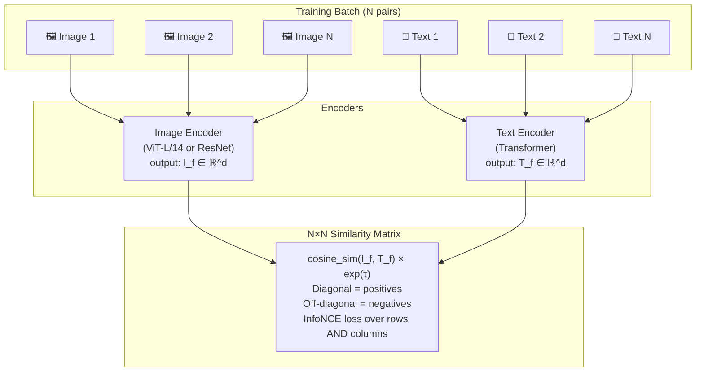

# 🔗 CLIP — Contrastive Language-Image Pretraining Deep Dive

> [!abstract] TL;DR
> CLIP (Radford 2021) trains a dual-encoder — one for images, one for text — on 400 million (image, caption) pairs from the internet using a contrastive loss. The result is a shared embedding space where "a photo of a dog" sits close to photos of dogs. Zero-shot image classification follows naturally: embed text descriptions of all classes, find the closest one to the image. CLIP matches a supervised ResNet-50 on ImageNet zero-shot — with no ImageNet training at all.

## Intuition — analogy FIRST

Imagine a museum curator who has processed millions of art catalog entries paired with images. She never took a "dog" or "cat" class — she simply absorbed the co-occurrence of words and visual features at scale. Ask her to sort new photographs by species and she can do it just by matching your verbal description against her memory of what those words were usually paired with.

CLIP is that curator. The contrastive objective — push matching image-text pairs together, push non-matching pairs apart — is the loss function that forces this joint embedding space to exist. Scale (400M pairs) is what makes it general.

## How It Works



### Architecture Details

**Image Encoder**
- Two variants in original CLIP: ResNet (RN50 to RN50×64) and ViT (ViT-B/32, ViT-B/16, ViT-L/14)
- Final layer uses attention pooling (not global avg pool) for ResNet
- Output: a single d-dimensional embedding (d=512 for ViT-B, 768 for ViT-L)

**Text Encoder**
- 12-layer Transformer (63M params for ViT-B pairing)
- BPE tokenization, max 77 tokens, uses [EOS] token as the text representation
- Output: same d-dimensional embedding space as image encoder

**Contrastive Loss (InfoNCE over N×N)**
Given a batch of N (image, text) pairs:
1. Compute all N×N cosine similarities: `S[i,j] = dot(I_f[i], T_f[j]) / (||I_f[i]|| · ||T_f[j]||) · exp(τ)`
2. Symmetric cross-entropy: classify each row (image → correct text) and each column (text → correct image)
3. Learnable temperature τ initialized to log(1/0.07)

N is the batch size; CLIP trained with N=32,768 — giving 32,767 negatives per example. This scale of negatives is what makes CLIP representations rich.

### Zero-Shot Classification
```
1. For each of K classes, construct a text prompt:
   e.g., "a photo of a {class_name}", "a photo of a {class_name}, a type of pet"
2. Encode all K prompts → text_embeddings (K × d)
3. Encode the query image → img_embedding (1 × d)  
4. Compute K cosine similarities
5. Softmax → probability distribution over K classes
6. argmax → predicted class
```
**Prompt engineering matters**: ensembling 80 text templates ("a photo of a big X", "a blurry photo of X", ...) improves ImageNet accuracy by ~3.5%.

## Key Concepts / Details

### Zero-Shot ImageNet Performance

| Model | Training Data | ImageNet Top-1 |
|-------|--------------|---------------|
| ResNet-50 (supervised) | ImageNet-1k | 76.2% |
| CLIP ViT-B/32 (zero-shot) | 400M WIT | 63.3% |
| CLIP ViT-L/14 (zero-shot) | 400M WIT | 75.5% |
| CLIP ViT-L/14@336px (zero-shot) | 400M WIT | 76.2% |
| OpenCLIP ViT-H/14 (zero-shot) | LAION-2B | 78.0% |

ViT-L/14 CLIP zero-shot matches supervised ResNet-50 without seeing a single ImageNet label.

### Linear Probing
Freeze CLIP image encoder, train a linear classifier on ImageNet-1k:
- CLIP ViT-L/14: **85.4%** linear probe — beats supervised ViT-B/16 (81.8%)
- Demonstrates the quality of learned visual features independent of the zero-shot transfer

### CLIP for Open-Vocabulary Detection
Use CLIP text embeddings as region classifiers:
- **RegionCLIP**: align image regions (RoI features) with text in CLIP space
- **GLIP**: grounding + detection with phrase-level contrastive loss
- **GroundingDINO**: DINO-DETR + CLIP text → open-set object detection ("find the red ball left of the chair")

### CLIP for Generative Models
- **DALL-E / GLIDE**: CLIP text embedding as conditioning for diffusion
- **CLIP guidance**: during diffusion sampling, gradient of CLIP similarity w.r.t. noisy image steers generation
- **Stable Diffusion**: CLIP text encoder provides text conditioning tokens fed to cross-attention in UNet

### Limitations
- **Counting**: CLIP cannot reliably count objects ("2 dogs" ≈ "3 dogs" in embedding space)
- **Spatial reasoning**: "dog to the left of cat" performs poorly
- **Fine-grained distinctions**: hard to distinguish subtle differences (flower species, car models)
- **Distribution shift**: ImageNet-A, ObjectNet zero-shot drops significantly vs standard IN-1k
- **Negation**: "a photo of no people" does not work as expected

### CLIP Variants Comparison

| Model | Dataset | Image Enc | Zero-shot IN-1k | Notes |
|-------|---------|-----------|----------------|-------|
| CLIP (OpenAI) | 400M WIT | ViT-L/14 | 75.5% | Original |
| ALIGN (Google) | 1.8B noisy | EfficientNet-L2 | 76.4% | Noisier data, larger scale |
| OpenCLIP | LAION-2B | ViT-H/14 | 78.0% | Open reproduction |
| EVA-CLIP | Merged | ViT-18B | 83.3% | Largest CLIP-style model |
| SigLIP (Google) | WebLI-1B | ViT-SO400M | 82.2% | Sigmoid loss, no softmax |

### SigLIP — Sigmoid Loss
SigLIP replaces InfoNCE's softmax-over-batch with a per-pair **sigmoid binary cross-entropy**:
- Each (image, text) pair independently labeled +1 (match) or -1 (non-match)
- No normalization over the batch → scalable to arbitrary batch sizes
- Better performance at small batch sizes; easier distributed training
- `L = -log σ(τ · sim(I,T) + b)` for positive pairs, `-log σ(-τ · sim(I,T) - b)` for negatives

## Real-World Notes

**Zero-shot classification with openai/clip (PyTorch)**
```python
import clip
import torch
from PIL import Image

device = "cuda" if torch.cuda.is_available() else "cpu"
model, preprocess = clip.load("ViT-L/14", device=device)

# Zero-shot ImageNet-style classification
class_names = ["cat", "dog", "airplane", "automobile", "bird"]
text_prompts = [f"a photo of a {c}" for c in class_names]

image = preprocess(Image.open("test.jpg")).unsqueeze(0).to(device)
text_tokens = clip.tokenize(text_prompts).to(device)

with torch.no_grad():
    image_features = model.encode_image(image)        # (1, 768)
    text_features = model.encode_text(text_tokens)    # (5, 768)

    # Normalize and compute similarities
    image_features = image_features / image_features.norm(dim=-1, keepdim=True)
    text_features = text_features / text_features.norm(dim=-1, keepdim=True)
    logits = (100.0 * image_features @ text_features.T).softmax(dim=-1)

probs = logits[0].cpu().numpy()
for name, prob in zip(class_names, probs):
    print(f"{name}: {prob:.3f}")
```

**Using OpenCLIP for custom domains**
```python
import open_clip
import torch

# Larger model from LAION-2B
model, _, preprocess = open_clip.create_model_and_transforms(
    'ViT-H-14', pretrained='laion2b_s32b_b79k'
)
tokenizer = open_clip.get_tokenizer('ViT-H-14')

texts = tokenizer(["a satellite image of farmland", "a satellite image of urban area"])
with torch.no_grad(), torch.cuda.amp.autocast():
    text_features = model.encode_text(texts)
    text_features /= text_features.norm(dim=-1, keepdim=True)
```

## Common Pitfalls

- **Prompt sensitivity**: zero-shot accuracy varies by ±5–8% depending on prompt phrasing; always ensemble 80 prompts or tune on a small held-out set
- **Normalization is non-optional**: cosine similarity requires L2-normalized embeddings; skipping normalization before `@` matrix multiply gives incorrect similarity scores
- **Temperature τ is learned**: do not hardcode 1/0.07; CLIP's τ is trained as exp(log_scale) and can differ from defaults if fine-tuning
- **CLIP is a discriminator, not a generator**: passing image to text encoder (or vice versa) is undefined; encoders are not interchangeable
- **False confidence on out-of-distribution**: CLIP can be very confident (high cosine similarity) on images with no text in the training distribution — always calibrate with temperature scaling before deployment

## Related Concepts
- [[Vision_Transformer_ViT_Deep]] — ViT is the image encoder in CLIP ViT-L/14
- [[Self_Supervised_Pretraining]] — CLIP is a form of contrastive SSL at vision-language scale
- [[MAE_and_Masked_Pretraining]] — complementary approach; MAE + CLIP combo (EVA) achieves highest accuracy

## Review Questions
1. Walk through CLIP's contrastive loss for a batch of N=4 pairs — how many positives and negatives does each training sample see?
2. Why does prompt engineering ("a photo of a {class}") improve over a bare class name like "dog"?
3. SigLIP replaces softmax-over-batch with per-pair sigmoid loss. What is the key practical benefit of this change?
4. CLIP linear probe (85.4%) outperforms zero-shot CLIP (75.5%) by 10 points on ImageNet. What does this tell us about the learned representation?
5. Why can't CLIP reliably count objects or understand negation like "no people"?
6. How is the CLIP text encoder used as conditioning in diffusion models like Stable Diffusion?

## Sources
- Radford et al., "Learning Transferable Visual Models From Natural Language Supervision" (CLIP, ICML 2021)
- Jia et al., "Scaling Up Visual and Vision-Language Representation Learning With Noisy Text Supervision" (ALIGN, ICML 2021)
- Zhai et al., "Sigmoid Loss for Language Image Pre-Training" (SigLIP, ICCV 2023)
- Fang et al., "EVA-CLIP: Improved Training Techniques for CLIP at Scale" (2023)
- Cherti et al., "Reproducible Scaling Laws for Contrastive Language-Image Learning" (OpenCLIP, CVPR 2023)

#computer-vision #vit-self-supervised #advanced
