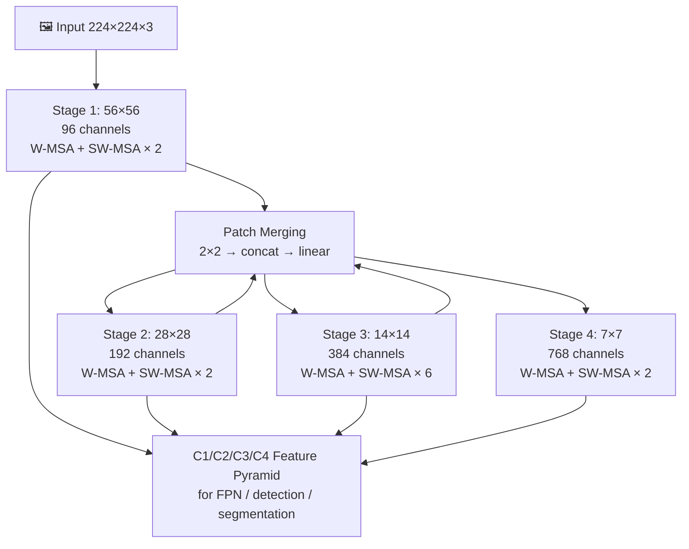

# 🏛️ Hierarchical Vision Transformers (Swin, PVT, MViT)

> [!abstract] TL;DR
> Plain ViT has two critical limitations for dense prediction: O(N²) attention cost and a single-resolution feature map. Swin Transformer (Liu 2021) solves both — local window attention reduces complexity to O(N), and hierarchical stages produce multi-scale features like a CNN. Shifted windows enable cross-window communication without full global attention. Swin became the dominant backbone for detection and segmentation until diffusion-era models.

## Intuition — analogy FIRST

Imagine reading a very large newspaper by having a spotlight that illuminates only a small 7×7 grid of words at a time. To understand the full article you slide the spotlight in a grid pattern. On the next reading, you shift the spotlight by half a window so that words that were previously at the boundary of two spotlights now appear together in the center of one — the "shifted window" trick. This is how Swin exchanges information across window boundaries without ever attending globally.

As you read, you also progressively merge adjacent words into sentences, sentences into paragraphs — the "patch merging" that creates Swin's hierarchy.

## How It Works



### Window Multi-Head Self-Attention (W-MSA)

Partition the feature map into non-overlapping M×M windows (M=7 by default).
- Each window contains M² = 49 tokens
- Self-attention computed **independently** within each window
- Complexity: O(N·M²) instead of O(N²) — linear in image size!

### Shifted Window Attention (SW-MSA)

W-MSA alone creates isolated windows with no cross-window information. SW-MSA alternates with W-MSA by shifting the window grid by (M/2, M/2) pixels each layer:
- Tokens at window boundaries now share a window → cross-window message passing
- **Cyclic shift trick**: instead of padding (expensive), cyclically roll the feature map so the shifted windows tile cleanly, then apply a mask to prevent attention between non-adjacent regions
- Each transformer block alternates: W-MSA → SW-MSA → W-MSA → SW-MSA...

### Patch Merging (Downsampling)
Between stages, 2×2 neighboring patches are concatenated (4× channels) then projected to 2× channels — analogous to a stride-2 convolution. This halves spatial resolution and doubles channels, creating the hierarchical feature pyramid.

### Relative Position Bias
Instead of absolute positional embeddings, Swin uses a learned **relative position bias** B added to attention logits:
`Attention(Q,K,V) = softmax(QKᵀ/√d_k + B) · V`

This generalizes better to different window sizes and resolution during fine-tuning.

## Key Concepts / Details

### Swin Variants

| Model | Stages | Channels | Params | FLOPs | ImageNet Top-1 |
|-------|--------|----------|--------|-------|----------------|
| Swin-T | [2,2,6,2] | 96 | 28M | 4.5G | 81.3% |
| Swin-S | [2,2,18,2] | 96 | 50M | 8.7G | 83.0% |
| Swin-B | [2,2,18,2] | 128 | 88M | 15.4G | 83.5% |
| Swin-L | [2,2,18,2] | 192 | 197M | 34.5G | 84.2% |
| Plain ViT-B/16 | 1×12 | 768 | 86M | 55.4G | 81.8% |
| ResNet-101 | — | — | 44M | 7.9G | 77.4% |

### PVT — Pyramid Vision Transformer
PVT (Wang 2021) is an earlier hierarchical approach using **Spatial Reduction Attention (SRA)**:
- Keys and values are spatially downsampled before attention (e.g., reduce K,V by factor 8×)
- Enables attention across larger regions without full O(N²) cost
- Simpler than Swin but less efficient; superseded by Swin for most tasks

### MViT — Multiscale Vision Transformers
MViT (Fan 2021) targets video and image understanding:
- **Pooling Attention**: pool Q, K, V tensors with learned kernels as the network deepens
- Early layers: high resolution, few channels; late layers: low resolution, many channels
- Achieves better accuracy/compute tradeoff for video recognition (Kinetics-400)
- MViTv2 adds decomposed relative position embeddings and residual pooling connections

### CvT — Convolutional Vision Transformer
Replaces linear projections for Q, K, V with **depthwise separable convolutions**:
- Injects local spatial structure into attention
- No positional embedding needed (conv provides position awareness)
- Stronger for smaller datasets; slightly worse at scale vs pure attention

### EVA and EVA-02
EVA (Fang 2022): scales Swin-like architecture to 1B parameters using CLIP image-text features as pretraining targets. EVA-02 achieves 90.0% ImageNet top-1 — highest for a single model.

### When to Use Which

| Task | Recommended Backbone |
|------|---------------------|
| ImageNet classification | ViT-B/L (large data), Swin-B (limited data) |
| Object detection (COCO) | Swin-L + HTC++ |
| Semantic segmentation | Swin-L + UperNet |
| Video recognition | MViT-L, VideoSwin |
| Efficient on-device | Swin-T, CvT-13 |

## Real-World Notes

**timm Swin inference (PyTorch)**
```python
import timm
import torch
from PIL import Image
from torchvision import transforms

model = timm.create_model('swin_base_patch4_window7_224', pretrained=True)
model.eval()

preprocess = transforms.Compose([
    transforms.Resize(256),
    transforms.CenterCrop(224),
    transforms.ToTensor(),
    transforms.Normalize(mean=[0.485, 0.456, 0.406], std=[0.229, 0.224, 0.225]),
])

img = preprocess(Image.open("cat.jpg")).unsqueeze(0)
with torch.no_grad():
    logits = model(img)          # (1, 1000)
    pred = logits.argmax(dim=-1) # class index

# Extract multi-scale features for FPN
features = model.forward_features(img)  # dict of stage outputs
```

**Using Swin as backbone in mmdetection**
```python
# config snippet (mmdet)
backbone = dict(
    type='SwinTransformer',
    pretrain_img_size=224,
    embed_dims=128,           # Swin-B
    depths=[2, 2, 18, 2],
    num_heads=[4, 8, 16, 32],
    window_size=7,
    use_abs_pos_embed=False,
    drop_path_rate=0.3,
    patch_norm=True,
)
neck = dict(type='FPN', in_channels=[128, 256, 512, 1024], out_channels=256)
```

## Common Pitfalls

- **Window size mismatch at fine-tune resolution**: Swin pretrained at 224×224 (window=7, grid=32×32). At 384×384 input, window size stays 7 but grid becomes 55×55 — fine-tune at higher resolution explicitly or relative position bias won't generalize cleanly
- **Forgetting cyclic shift mask**: when implementing SW-MSA from scratch, the mask preventing attention between non-adjacent cyclic-shift regions is easy to omit but critical for correctness
- **Patch merging vs stride conv**: patch merging uses concatenation then linear, not conv — this matters when adapting code; using a conv here breaks the channel math
- **Drop path (stochastic depth)**: essential regularization for Swin; rate typically 0.2–0.5 depending on model size; omitting it causes significant overfitting on ImageNet-1k

## Related Concepts
- [[Vision_Transformer_ViT_Deep]] — plain ViT that Swin improves upon
- [[Self_Supervised_Pretraining]] — SimMIM applies MAE-style masking to Swin
- [[MAE_and_Masked_Pretraining]] — MAE uses plain ViT; VideoMAE extends with tube masking

## Review Questions
1. Why is W-MSA O(N) rather than O(N²), and what is its main limitation?
2. How does the shifted window trick enable cross-window information flow without global attention?
3. What is the cyclic shift trick, and why is it needed to implement SW-MSA efficiently?
4. Compare Swin's patch merging with a stride-2 convolution — what does each do, and why does Swin's approach fit the transformer design?
5. Why do hierarchical ViTs (Swin) outperform plain ViT on dense prediction tasks like detection and segmentation?
6. What does relative position bias offer over absolute positional embeddings in windowed attention?

## Sources
- Liu et al., "Swin Transformer: Hierarchical Vision Transformer using Shifted Windows" (ICCV 2021)
- Wang et al., "Pyramid Vision Transformer" (ICCV 2021)
- Fan et al., "Multiscale Vision Transformers" (ICCV 2021)
- Wu et al., "CvT: Introducing Convolutions to Vision Transformers" (ICCV 2021)
- Fang et al., "EVA: Exploring the Limits of Masked Visual Representation Learning" (CVPR 2023)

#computer-vision #vit-self-supervised #intermediate
