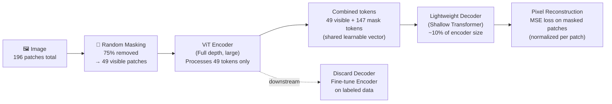

# 🎭 MAE and Masked Image Pretraining

> [!abstract] TL;DR
> MAE (He 2022) applies a deceptively simple idea: randomly mask 75% of image patches and reconstruct the missing pixels. The encoder only processes the visible 25% — dramatically reducing compute. The decoder is lightweight and discarded at fine-tuning time. Despite reconstructing low-level pixels, the encoder learns high-level semantic representations that fine-tune to state-of-the-art accuracy. The key insight: **images are highly redundant, so aggressive masking prevents trivial shortcuts and forces semantic understanding**.

## Intuition — analogy FIRST

Imagine doing a jigsaw puzzle where 75% of the pieces are hidden and you must sketch what they look like based only on the 25% you can see. A person who truly understands the image (knows it's a dog on a beach) can reconstruct approximate patches — textures, colors, edges — from their semantic understanding. Someone who only knows pixel statistics will fail badly. MAE makes the network be that person.

The contrast with BERT is instructive: BERT masks words and predicts tokens from a fixed vocabulary. In vision, there's no natural vocabulary, so MAE predicts raw pixel values — a lower-level target. Yet because the masking ratio is so high and the decoder so shallow, the encoder is forced to build semantic representations to fill in the gaps.

## How It Works



### Step-by-Step

**1. Patch tokenization**
Standard ViT tokenization: divide 224×224 image into 196 non-overlapping 16×16 patches.

**2. Random masking (75%)**
- Randomly sample 25% of patch indices (≈49 patches) to keep
- Remove the remaining 75% (≈147 patches) — these are the targets
- Masking is random per image; no structured masking (unlike block masking in BEiT)

**3. Encoder — ViT on visible patches only**
- The full-depth ViT (e.g., ViT-L) processes **only the 49 visible tokens**
- This is the crucial efficiency gain: encoder compute scales with visible token count
- ViT-L encoder (24 layers) processes 49 tokens → ~4× cheaper than processing all 196
- Positional embeddings are added to visible tokens before encoding

**4. Decoder — reconstructing the full image**
- Insert learned **mask tokens** at masked positions (shared constant vector + position embedding)
- Full token sequence (49 visible + 147 masked) fed to a **lightweight decoder**
- Decoder: typically 8 transformer blocks, 512 dim — much smaller than encoder
- Final linear layer projects each token to pixel values (16×16×3 = 768 values per patch)

**5. Reconstruction loss**
- MSE between predicted and actual pixel values **at masked positions only**
- Pixels are **normalized per patch** (subtract patch mean, divide by std) — this focuses the loss on structure rather than low-frequency color/brightness, empirically important
- Loss computed only on masked patches (visible patches are not penalized)

**6. Fine-tuning**
- Discard decoder entirely; it learned to reconstruct but not to understand
- Append classification head to encoder; fine-tune on labeled data
- Performance is remarkably good — the encoder representations transfer widely

## Key Concepts / Details

### Why 75% Masking?
MAE ablation shows peak fine-tuning accuracy at 75% masking:
- At 25%: images are too recognizable → model takes easy shortcuts (adjacent patch interpolation)
- At 75%: remaining patches are sparse → model must integrate global context to reconstruct
- Images are highly redundant (neighboring patches strongly correlated) — only high masking removes this redundancy and requires semantic understanding

Contrast with BERT (NLP): BERT uses 15% masking because text is less redundant — removing 15% of words already creates a hard prediction task.

### MAE vs BERT Reconstruction Targets
| Aspect | BERT | MAE | BEiT |
|--------|------|-----|------|
| Mask ratio | 15% | 75% | 40% |
| Reconstruction target | Discrete tokens (vocab) | Continuous pixels | Discrete visual tokens (dVAE) |
| Token source | WordPiece BPE | N/A | DALL-E dVAE |
| Loss | Cross-entropy | MSE | Cross-entropy |

MAE's pixel target is lower-level than BEiT's tokenized target, yet MAE matches or exceeds BEiT on fine-tuning because the masking ratio enforces more aggressive reasoning.

### Extensions to Other Modalities

**VideoMAE (Tong 2022)**
- Extend to video: sample 16 frames; tokenize spatiotemporal tubes (2×16×16)
- **Tube masking**: mask entire temporal tubes (same spatial position across all frames) — prevents trivial reconstruction from adjacent frames
- Masking ratio increased to 90% for video (even more redundant than images)
- Achieves state-of-the-art on Kinetics-400/600 and Something-Something v2

**AudioMAE (Huang 2022)**
- Treat audio spectrogram as 2D image; apply ViT + MAE
- Patch: 16 time steps × 16 frequency bins
- Masking ratio: 80%
- Fine-tunes to SOTA on AudioSet

**Point-MAE (Pang 2022)**
- 3D point clouds: divide into groups of N points; mask 60% of groups
- Encoder processes visible groups; decoder reconstructs coordinates of masked groups
- Enables self-supervised pretraining for 3D understanding (ModelNet, ScanObjectNN)

### MAE Variants

| Variant | Key Change | Benefit |
|---------|-----------|---------|
| **i-MAE** | Instance-level masking with prototypes | Better semantic alignment |
| **CAE** (Chen 2022) | Separate encoder and regressor; latent targets | More semantic than pixel targets |
| **MaskFeat** (Wei 2022) | Predict HOG features of masked patches | Semantic target without dVAE |
| **SparK** | Apply MAE to convolutional networks (sparse conv) | Brings MAE efficiency to CNNs |
| **SimMIM** | MAE for Swin Transformer | Dense prediction backbone pretraining |

### Linear Probe vs Fine-Tuning Gap
MAE has a large linear probe / fine-tuning gap compared to contrastive methods:

| Method | Linear Probe | Fine-Tune | Gap |
|--------|-------------|-----------|-----|
| MAE ViT-B | 68.0% | 83.1% | 15.1% |
| MAE ViT-H | 77.2% | 87.8% | 10.6% |
| DINO ViT-B | 77.3% | 82.8% | 5.5% |
| MoCo v3 ViT-B | 76.7% | 83.2% | 6.5% |

MAE's features are not inherently normalized onto a hypersphere (no projection head, no NT-Xent loss) — they require the fine-tuning head to find the right linear structure. The encoder's representational capacity is high but expressed in a non-linear way.

## Real-World Notes

**MAE reconstruction visualization (PyTorch)**
```python
import torch
import numpy as np
from PIL import Image
from torchvision import transforms
import matplotlib.pyplot as plt

# Load pretrained MAE (from facebookresearch/mae)
import sys
sys.path.append('/path/to/mae')  # clone https://github.com/facebookresearch/mae
import models_mae

model = models_mae.__dict__['mae_vit_large_patch16'](norm_pix_loss=True)
checkpoint = torch.load('mae_pretrain_vit_large.pth', map_location='cpu')
model.load_state_dict(checkpoint['model'], strict=False)
model.eval()

transform = transforms.Compose([
    transforms.Resize((224, 224)),
    transforms.ToTensor(),
    transforms.Normalize([0.485, 0.456, 0.406], [0.229, 0.224, 0.225])
])

img_tensor = transform(Image.open("photo.jpg")).unsqueeze(0)

with torch.no_grad():
    loss, pred, mask = model(img_tensor, mask_ratio=0.75)

# Visualize: original | masked | reconstructed
def unpatch(patches, patch_size=16, img_size=224):
    h = w = img_size // patch_size
    patches = patches.reshape(1, h, w, patch_size, patch_size, 3)
    patches = patches.permute(0, 1, 3, 2, 4, 5)
    return patches.reshape(1, img_size, img_size, 3)

pred_img = model.unpatchify(pred)  # (1, 3, 224, 224)
mask_img = mask.unsqueeze(-1).repeat(1, 1, 16**2 * 3)
mask_img = model.unpatchify(mask_img)  # (1, 3, 224, 224)

fig, axes = plt.subplots(1, 3, figsize=(12, 4))
axes[0].imshow(img_tensor[0].permute(1,2,0).clamp(0,1))
axes[0].set_title("Original")
axes[1].imshow((img_tensor * (1-mask_img))[0].permute(1,2,0).clamp(0,1))
axes[1].set_title("Masked Input (25% visible)")
axes[2].imshow(pred_img[0].permute(1,2,0).detach().clamp(0,1))
axes[2].set_title("MAE Reconstruction")
plt.show()
```

## Common Pitfalls

- **Normalized pixel loss is important**: without per-patch normalization, the loss is dominated by high-contrast patches (edges); normalize each patch to zero mean and unit variance before computing MSE
- **Decoder discarded at fine-tune, not encoder**: beginners sometimes think the "autoencoder" fine-tuned as a whole; only the encoder (pre-decoder) is kept; the decoder is too shallow for good features
- **Block masking vs random masking**: MAE uses random masking; BEiT uses block masking (contiguous masked region). Random masking is simpler and works better for MAE's pixel targets
- **ViT fine-tuning instability**: MAE pre-trained ViT can diverge with too high learning rate; use cosine LR warmup, layer-wise LR decay (lrd=0.75 for ViT-L), and drop path
- **VideoMAE tube masking ratio**: using 75% (image default) for video is insufficient — video is more redundant; 90% is required to prevent trivial reconstruction from adjacent frames

## Related Concepts
- [[Vision_Transformer_ViT_Deep]] — MAE encoder is a standard ViT; ViT-L and ViT-H are the most common sizes
- [[Self_Supervised_Pretraining]] — MAE in context of all SSL paradigms; comparison with DINO and contrastive methods
- [[Hierarchical_ViTs]] — SimMIM brings MAE-style masking to Swin Transformer for dense prediction pretraining

## Review Questions
1. Why does MAE process only 25% of patches in the encoder, and what is the compute savings for a ViT-L processing a 224×224 image?
2. MAE uses a 75% masking ratio while BERT uses 15%. What property of images (vs text) motivates this difference?
3. Why is per-patch pixel normalization important in MAE's reconstruction loss?
4. Compare MAE's linear probe (68%) vs fine-tune (83%) accuracy. What does this gap tell us about the nature of MAE's learned representations?
5. VideoMAE uses tube masking rather than random spatial masking. Why would random masking fail for video?
6. MAE uses a lightweight decoder during pretraining that is thrown away at fine-tune. Why is it important that the decoder be *light*? What happens if the decoder is too powerful?

## Sources
- He et al., "Masked Autoencoders Are Scalable Vision Learners" (CVPR 2022)
- Tong et al., "VideoMAE: Masked Autoencoders are Data-Efficient Learners for Self-Supervised Video Pre-Training" (NeurIPS 2022)
- Bao et al., "BEiT: BERT Pre-Training of Image Transformers" (ICLR 2022)
- Baevski et al., "data2vec: A General Framework for Self-supervised Learning in Speech, Vision and Language" (ICML 2022)
- Xie et al., "SimMIM: A Simple Framework for Masked Image Modeling" (CVPR 2022)
- Wei et al., "Masked Feature Prediction for Self-Supervised Visual Pre-Training" (MaskFeat, CVPR 2022)

#computer-vision #vit-self-supervised #advanced
