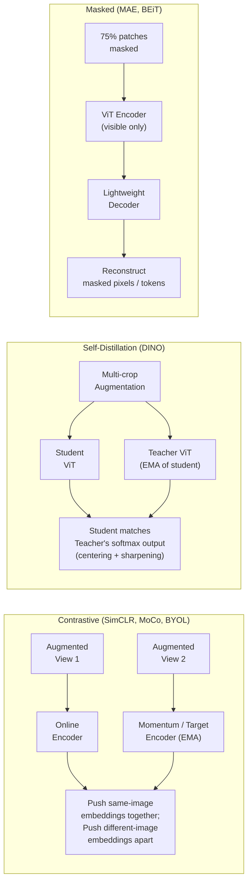

# 🔍 Self-Supervised Visual Pretraining — Survey

> [!abstract] TL;DR
> Labels are expensive; images are free. Self-supervised learning (SSL) uses the data itself as supervision — by contrasting augmented views, distilling from a momentum teacher, or reconstructing masked content. The three major paradigms (contrastive, self-distillation, masked) all converge on the same goal: representations that transfer well to downstream tasks with minimal labeled data. DINO and MAE are the current best-practice foundations.

## Intuition — analogy FIRST

Think of self-supervised learning as learning to recognize a city without a guidebook. **Contrastive learning** is like noticing that two photos of the same block taken from slightly different angles must show the same place — learn to match them. **Self-distillation** is like having an experienced colleague (the teacher network) who looks at the same block and tells you what to notice — gradually you become the expert and the colleague is simply a running average of your past self. **Masked prediction** is like covering half the city map and trying to fill in the blanks — you have to understand urban structure to do it well.

All three force the model to learn structure beyond pixel patterns, without a single labeled example.

## How It Works



## Key Concepts / Details

### Paradigm 1: Contrastive Learning

#### SimCLR (Chen 2020)
- **Setup**: for each image, create two augmented views (crop + color jitter + blur + grayscale)
- **Encoder + projection head**: both views pass through a shared ResNet/ViT encoder f(·), then a 2-layer MLP projection head g(·)
- **NT-Xent loss** (normalized temperature-scaled cross-entropy): for a batch of N images (2N augmented views), treat the 2 views of the same image as the positive pair; all other 2(N-1) views as negatives
  - `L = -log[ exp(sim(z_i,z_j)/τ) / Σ_{k≠i} exp(sim(z_i,z_k)/τ) ]`
  - τ (temperature) = 0.07; larger batch → more negatives → better performance
- **Key insight**: discard projection head at fine-tune; representation from f(·) is richer than from g(·)
- **Limitation**: requires very large batches (4096–8192) for enough negatives

#### MoCo (He 2020) — Momentum Contrast
- **Problem**: large batch is expensive; we need many negatives
- **Solution**: maintain a FIFO **queue** of ~65536 negative embeddings from past batches
- **Momentum encoder**: a separate encoder whose weights are the exponential moving average (EMA) of the online encoder: `θ_k ← m·θ_k + (1-m)·θ_q` (m=0.999)
- The queue is encoded by the stable momentum encoder → consistent representations without needing large batches
- MoCo v2 adds SimCLR's projection head and augmentations → closes the gap at smaller batch size
- MoCo v3: replaces CNN backbone with ViT; uses stop-gradient on one branch

#### BYOL (Grill 2020) — Bootstrap Your Own Latent
- **Revolutionary claim**: no negatives needed! Avoids representational collapse without negative pairs
- **Asymmetric architecture**: 
  - Online network: encoder f_θ + projector g_θ + **predictor** q_θ
  - Target network: encoder f_ξ + projector g_ξ (no predictor); weights = EMA of online
- **Loss**: minimize MSE between online network's prediction and target network's projection (stop-gradient on target)
- **Why no collapse?** Asymmetry (predictor on one side) + EMA slow update prevent trivial constant solution; batch normalization in the projector provides an implicit contrastive signal
- **SimSiam**: removes EMA; simply stops gradient on one branch; proves stop-gradient alone prevents collapse when predictor is used

### Paradigm 2: Self-Distillation

#### DINO (Caron 2021) — Self-Distillation with No Labels
- **Architecture**: student and teacher share the same ViT architecture; teacher = EMA of student
- **Multi-crop strategy**: two global crops (224×224) + several local crops (96×96); student processes all, teacher only processes global crops
- **Objective**: student output softmax matches teacher output softmax
- **Preventing collapse**:
  - **Centering**: subtract running mean from teacher output → prevents one-dimensional collapse
  - **Sharpening**: use low temperature on teacher (0.04) → sharp distribution
- **Emergent properties**: DINO's [CLS] token attention maps spontaneously segment foreground objects — never trained to do so. Nearest-neighbor k-NN classification with frozen features achieves 74.5% on ImageNet
- **DINOv2 (Oquab 2023)**: scale up with ViT-g (1B params), curated 142M image dataset (LVD-142M), distillation from large teacher, extra supervised loss. Achieves 86.3% linear probe on ImageNet — best visual foundation model for transfer

### Paradigm 3: Masked Pretraining

#### MAE — see [[MAE_and_Masked_Pretraining]] for full deep dive
- Mask 75% of patches; encode only visible 25%; decode to pixel values
- Extremely compute-efficient encoder training; strong fine-tuning representations

#### BEiT (Bao 2022) — BERT Pre-Training of Image Transformers
- Inspired by BERT: mask patches → predict **discrete visual tokens** (not pixels)
- Visual tokens from a dVAE (discrete Variational Autoencoder, e.g., DALL-E's tokenizer) provide a richer reconstruction target than raw pixels
- Forces model to predict semantic categories rather than low-level textures

#### data2vec (Baevski 2022)
- Universal SSL framework for images, text, and speech
- Teacher network computes **contextualized representations** of the full unmasked input
- Student predicts these teacher representations at masked positions
- More semantic target than pixels; works across modalities

### Evaluation Protocol

| Evaluation | Description | Measures |
|------------|-------------|---------|
| **Linear probe** | Freeze encoder, train a single linear layer | Quality of frozen features |
| **Fine-tuning** | Update all parameters on labeled data | Transfer potential of learned weights |
| **k-NN** | Nearest neighbor on frozen features | Feature smoothness and clustering |
| **Few-shot** | Fine-tune on 1% or 10% of labels | Label efficiency |

### Comparison Table

| Method | Paradigm | Negatives? | Backbone | IN-1k Linear | IN-1k Fine-tune |
|--------|----------|-----------|---------|-------------|----------------|
| SimCLR v2 | Contrastive | Yes (batch) | ResNet-152 | 79.8% | 86.8% |
| MoCo v3 | Contrastive | Yes (queue) | ViT-B | 76.7% | 83.2% |
| BYOL | Contrastive | No | ViT-B | 74.3% | 82.5% |
| DINO | Self-distillation | No | ViT-B/8 | 77.3% | 82.8% |
| DINOv2 | Self-distillation | No | ViT-L/14 | 86.3% | 87.6% |
| MAE | Masked | No | ViT-B | 68.0% | 83.1% |
| MAE | Masked | No | ViT-H | 77.2% | 87.8% |
| BEiT v2 | Masked | No | ViT-B | 80.1% | 85.0% |

## Real-World Notes

**DINO feature extraction for visualization (PyTorch)**
```python
import torch
import torch.nn.functional as F
import matplotlib.pyplot as plt
from PIL import Image
from torchvision import transforms

# Load DINO ViT-B/8
model = torch.hub.load('facebookresearch/dino:main', 'dino_vits8')
model.eval()

transform = transforms.Compose([
    transforms.Resize((480, 480)),
    transforms.ToTensor(),
    transforms.Normalize([0.485,0.456,0.406],[0.229,0.224,0.225])
])

img = transform(Image.open("dog.jpg")).unsqueeze(0)

with torch.no_grad():
    # Get attention maps from last layer
    attentions = model.get_last_selfattention(img)  # (1, h, N+1, N+1)

# Average over heads, take [CLS] attention to all patches
avg_attn = attentions[0].mean(0)[0, 1:]  # (N,)
h = w = int(avg_attn.shape[0] ** 0.5)
attn_map = avg_attn.reshape(h, w).numpy()

plt.imshow(attn_map, cmap='inferno')
plt.title("DINO [CLS] Attention Map — emergent segmentation")
plt.show()
```

## Common Pitfalls

- **Mode collapse with BYOL/SimSiam**: if EMA decay (m) is too high at training start, or predictor is misconfigured, representations collapse to a constant; use warmup schedules for m (start at 0.996, anneal to 0.999)
- **Linear probe vs fine-tuning gap**: MAE has a large gap (68% linear vs 83% fine-tune) because its features are not l2-normalized; contrastive methods have smaller gaps because projection heads force representations onto a hypersphere
- **Multi-crop memory**: DINO's multi-crop uses 2 global + 6–10 local crops per image; the memory cost grows linearly — start with 2 global + 4 local if GPU is limited
- **Temperature sensitivity**: in NT-Xent (SimCLR) and DINO, temperature is a critical hyperparameter — too high → no gradient signal, too low → training instability; use τ=0.07 for SimCLR, 0.04 teacher / 0.1 student for DINO

## Related Concepts
- [[Vision_Transformer_ViT_Deep]] — ViT backbone used by DINO, MAE, MoCo v3
- [[MAE_and_Masked_Pretraining]] — deep dive on masked autoencoders
- [[CLIP_Deep_Dive]] — vision-language contrastive pretraining (scale changes everything)

## Review Questions
1. SimCLR requires very large batches (4096+). What problem does MoCo solve, and how?
2. BYOL uses no negative pairs yet avoids collapse. What two design choices prevent the trivial solution?
3. Explain DINO's centering and sharpening tricks — what collapse mode does each prevent?
4. Why does MAE have a large gap between linear probe and fine-tuning accuracy, while DINO has a smaller gap?
5. What is the difference between reconstruction targets in MAE (pixels) vs BEiT (visual tokens), and why might BEiT's target lead to more semantic representations?
6. A self-supervised model trained with contrastive loss achieves 74% on linear probe. Suggest three strategies to improve representation quality without using labels.

## Sources
- Chen et al., "A Simple Framework for Contrastive Learning of Visual Representations" (SimCLR, ICML 2020)
- He et al., "Momentum Contrast for Unsupervised Visual Representation Learning" (MoCo, CVPR 2020)
- Grill et al., "Bootstrap Your Own Latent" (BYOL, NeurIPS 2020)
- Caron et al., "Emerging Properties in Self-Supervised Vision Transformers" (DINO, ICCV 2021)
- Oquab et al., "DINOv2: Learning Robust Visual Features without Supervision" (TMLR 2024)
- He et al., "Masked Autoencoders Are Scalable Vision Learners" (MAE, CVPR 2022)
- Bao et al., "BEiT: BERT Pre-Training of Image Transformers" (ICLR 2022)

#computer-vision #vit-self-supervised #advanced
