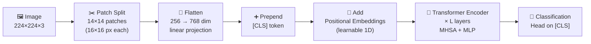

# 📐 Vision Transformer (ViT) — Deep Dive

> [!abstract] TL;DR
> ViT (Dosovitskiy 2020) treats an image as a sequence of 16×16 patches and feeds them directly into a standard Transformer encoder. No convolutions, no local receptive fields — just global self-attention. At scale (JFT-300M pretraining), ViT outperforms CNNs. The key insight: **inductive biases help in the low-data regime; at scale, attention learns them from scratch**.

## Intuition — analogy FIRST

Imagine reading a book by cutting every page into a 14×14 grid of stamps and shuffling them into a sequence. A language model reading that sequence must figure out which stamps belong together spatially — there's no left-to-right, no top-to-bottom given for free. That's exactly what ViT does: it strips out every spatial shortcut CNNs exploit (local filters, pooling hierarchies) and replaces them with learned positional embeddings + full attention over all patches simultaneously.

The analogy breaks down pleasantly: unlike shuffled stamps, ViT's patches are fed in raster order with learned position IDs, so it *can* recover spatial structure — it just doesn't have it hardwired.

## How It Works



### Step-by-step

**1. Patch tokenization**
An image H×W×C is divided into N non-overlapping patches of size P×P.
- N = (H/P) × (W/P) — for 224×224, P=16: N = 196 patches
- Each patch is flattened to a vector of size P²·C = 768 (for RGB, P=16)

**2. Linear projection (patch embedding)**
Each flattened patch is projected to dimension D via a learned matrix E ∈ ℝ^(P²C × D):
`z_i = x_i · E`

**3. [CLS] token**
A learnable embedding z_cls is prepended to the sequence. After all transformer layers, the representation at position 0 ([CLS]) is used for classification — analogous to BERT's [CLS].

**4. Positional embeddings**
Attention is permutation-invariant, so position must be injected explicitly. ViT uses **learned 1D positional embeddings** added (not concatenated) to the patch embeddings. 2D-aware variants exist but standard ViT uses 1D.

**5. Transformer Encoder — L layers of:**

- **Layer Norm (pre-LN)** applied before each sub-block
- **Multi-Head Self-Attention (MHSA)**:
  - Q = XW_Q, K = XW_K, V = XW_V (W ∈ ℝ^(D × d_k))
  - Single head: Attention(Q,K,V) = softmax(QKᵀ / √d_k) · V
  - h heads computed in parallel, outputs concatenated, then projected: MultiHead = Concat(head_1,...,head_h)W_O
- **Residual connection**
- **MLP block**: two linear layers with GELU activation, expansion ratio 4× (D → 4D → D)
- **Residual connection**

**6. Classification head**
Linear layer (or MLP) applied to z_cls at the final layer.

## Key Concepts / Details

### ViT Model Variants

| Model | Layers | Hidden D | Heads | Params | ImageNet Top-1 |
|-------|--------|----------|-------|--------|----------------|
| ViT-B/16 | 12 | 768 | 12 | 86M | 81.8% (fine-tuned) |
| ViT-L/16 | 24 | 1024 | 16 | 307M | 85.2% |
| ViT-H/14 | 32 | 1280 | 16 | 632M | 88.5% |
| ResNet-50 | — | — | — | 25M | 76.0% |
| ResNet-101 | — | — | — | 44M | 77.4% |

Notation: B/16 = Base model, patch size 16. H/14 = Huge model, patch size 14.

### DeiT — Data-Efficient ViT
ViT needs hundreds of millions of images to beat CNNs. DeiT (Touvron 2021) trains competitively on ImageNet-1k alone by:
1. **Distillation token**: a third token (alongside [CLS]) that mimics a CNN teacher's softmax output
2. **Strong augmentation**: RandAugment, Mixup, CutMix, Cutout, random erasing, repeated augmentation
3. Result: DeiT-B achieves 81.8% on ImageNet-1k with no extra data

### What Inductive Biases ViT Lacks
- **Translation equivariance**: a feature shifted in the image is not automatically shifted in the representation
- **Locality**: each attention head attends to all patches from the first layer
- **Downsampling hierarchy**: no multi-scale feature pyramid by default

These aren't bugs — they're what makes ViT a better foundation at scale. The model learns spatial inductive biases implicitly from data.

### Scaling Behavior
On JFT-300M (300M images), ViT-L/16 achieves 87.8% on ImageNet, outperforming all CNNs. The crossover point: at ~10M images ViTs match CNNs; below that CNNs win due to inductive biases.

### Computational Cost
- Attention complexity: O(N²) in the number of tokens
- ViT-B/16 on 224×224: N=196, manageable
- ViT-L on 384×384: N=576, expensive
- Patch size trades off: smaller P → more tokens → better spatial resolution → more compute

## Real-World Notes

**timm fine-tuning (PyTorch)**
```python
import timm
import torch

# Load pretrained ViT-B/16 (ImageNet-21k pretrained)
model = timm.create_model('vit_base_patch16_224', pretrained=True, num_classes=10)

# Freeze all but last 2 transformer blocks + head for efficient fine-tuning
for name, param in model.named_parameters():
    if 'blocks.10' not in name and 'blocks.11' not in name and 'head' not in name:
        param.requires_grad = False

optimizer = torch.optim.AdamW(
    filter(lambda p: p.requires_grad, model.parameters()),
    lr=1e-4, weight_decay=0.05
)

# Forward pass
x = torch.randn(8, 3, 224, 224)
logits = model(x)  # (8, 10)
```

**Layer norm placement matters**: ViT uses Pre-LN (norm before attention/MLP), which stabilizes training at depth. Original Post-LN requires careful LR warmup.

## Common Pitfalls

- **Forgetting positional embeddings interpolation**: when fine-tuning ViT pretrained at 224×224 on higher resolution (384×384), the number of patches changes — positional embeddings must be bicubically interpolated (timm handles this with `img_size` argument)
- **Too small learning rate for head, too large for backbone**: use differential LRs; backbone ~1e-5, head ~1e-3
- **Batch size sensitivity**: attention doesn't have batch norm, but some training recipes (DeiT) rely on specific batch sizes for optimal mixup statistics
- **Overlooking [CLS] vs average pooling**: some downstream tasks benefit from average pooling all patch tokens instead of [CLS] alone

## Related Concepts
- [[Hierarchical_ViTs]] — Swin Transformer addresses ViT's O(N²) and lack of hierarchy
- [[Self_Supervised_Pretraining]] — DINO/MAE use ViT as backbone
- [[CLIP_Deep_Dive]] — ViT-L/14 is the image encoder in CLIP
- [[MAE_and_Masked_Pretraining]] — MAE encoder is a standard ViT

## Review Questions
1. Why does ViT require positional embeddings when CNNs do not?
2. What is the role of the [CLS] token and how does it compare to global average pooling?
3. Compute the number of patches and total token sequence length for a ViT-B/16 processing a 384×384 image.
4. Why does DeiT use a distillation token in addition to [CLS], and what does it learn?
5. At what training data scale do ViT models begin outperforming equivalent CNN models, and why?
6. How does pre-LN differ from post-LN, and why does it matter for deep ViT training?

## Sources
- Dosovitskiy et al., "An Image is Worth 16x16 Words: Transformers for Image Recognition at Scale" (ICLR 2021)
- Touvron et al., "Training data-efficient image transformers & distillation through attention" (DeiT, ICML 2021)
- timm library: https://github.com/huggingface/pytorch-image-models
- Zhai et al., "Scaling Vision Transformers" (ScaViT, CVPR 2022)

#computer-vision #vit-self-supervised #intermediate
