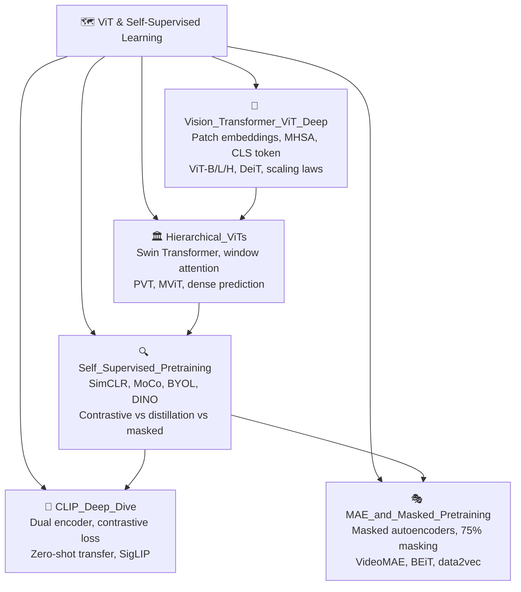

# 🗺️ MOC — Vision Transformers & Self-Supervised Learning

> [!abstract] TL;DR
> Vision Transformers replaced the inductive bias of convolutions with global self-attention, enabling scaling to massive datasets and achieving state-of-the-art performance when pretrained at scale. Self-supervised pretraining methods (DINO, MAE, SimCLR, MoCo) enable learning rich visual representations without labels. CLIP extended this to vision-language pretraining. This section covers the full ViT architecture, hierarchical improvements (Swin Transformer), and the major self-supervised paradigms.

## Section Overview

This section traces the arc from the original Vision Transformer paper (Dosovitskiy 2020) through hierarchical variants, to the modern self-supervised pretraining landscape. The central thesis: **when given enough data, attention-based models learn better general representations than hand-crafted inductive biases.**

## Section Map

## Learning Path

### Foundation (start here)
1. **[[Vision_Transformer_ViT_Deep]]** — Understand the core ViT architecture before anything else. Patch tokenization, positional embeddings, and the transformer encoder block are prerequisites for every other note in this section.
2. **[[Hierarchical_ViTs]]** — Learn how Swin Transformer solves ViT's limitations for dense prediction tasks. Essential for detection and segmentation applications.

### Self-Supervised Methods
3. **[[Self_Supervised_Pretraining]]** — Survey of all major paradigms. Contrastive (SimCLR, MoCo), self-distillation (DINO, DINOv2), and masked (MAE, BEiT). Read this for the big picture.
4. **[[MAE_and_Masked_Pretraining]]** — Deep dive into masked autoencoders, the simplest and most scalable modern approach.

### Vision-Language
5. **[[CLIP_Deep_Dive]]** — How image-text contrastive pretraining enables zero-shot transfer and open-vocabulary recognition.

## Key Milestones in This Section

| Year | Model | Contribution |
|------|-------|-------------|
| 2020 | ViT | Pure transformer on image patches; beats CNNs at scale |
| 2020 | DeiT | Data-efficient ViT with knowledge distillation |
| 2021 | CLIP | Vision-language pretraining; zero-shot ImageNet |
| 2021 | DINO | Self-supervised ViT with emergent segmentation |
| 2021 | Swin | Hierarchical ViT with shifted window attention |
| 2021 | MAE | 75% masking → scalable self-supervised pretraining |
| 2022 | DINOv2 | Large-scale DINO with curated data; universal features |
| 2023 | SigLIP | Sigmoid loss CLIP; more scalable vision-language |

## Core Concepts to Master

- **Patch tokenization**: images as sequences of non-overlapping patches
- **Multi-head self-attention (MHSA)**: global receptive field, O(N²) complexity
- **[CLS] token**: aggregates global representation for classification
- **Positional embeddings**: necessary because attention is permutation-invariant
- **Contrastive learning**: push matching pairs together, non-matching apart
- **Momentum encoder**: stable negative/teacher representations (MoCo, BYOL, DINO)
- **Masked autoencoding**: reconstruct masked inputs → learn semantics

## Prerequisites

- **[[../02_CNNs_and_Feature_Extraction/]]** — Familiarity with convolutional architectures helps appreciate what inductive biases ViT drops
- Transformer architecture basics (from NLP context is fine)
- Familiarity with ImageNet classification benchmarks

## Connections to Other Sections

- **Section 04 (Object Detection)** — ViT backbones in DETR, Deformable DETR, DINO-DETR
- **Section 05 (Segmentation)** — Swin-based Mask2Former, SAM uses ViT-H encoder
- **Section 07 (Generative Models)** — CLIP guides diffusion; DiT uses transformer denoising
- **Section 09 (Multimodal)** — CLIP, ALIGN are foundation for BLIP, LLaVA, GPT-4V

## Related Concepts
- [[Vision_Transformer_ViT_Deep]]
- [[Hierarchical_ViTs]]
- [[Self_Supervised_Pretraining]]
- [[CLIP_Deep_Dive]]
- [[MAE_and_Masked_Pretraining]]

## Sources
- Dosovitskiy et al., "An Image is Worth 16x16 Words" (ICLR 2021)
- Liu et al., "Swin Transformer" (ICCV 2021)
- Radford et al., "Learning Transferable Visual Models From Natural Language Supervision" (ICML 2021)
- He et al., "Masked Autoencoders Are Scalable Vision Learners" (CVPR 2022)
- Caron et al., "Emerging Properties in Self-Supervised Vision Transformers" (DINO, ICCV 2021)

#MOC #computer-vision #vit-self-supervised
