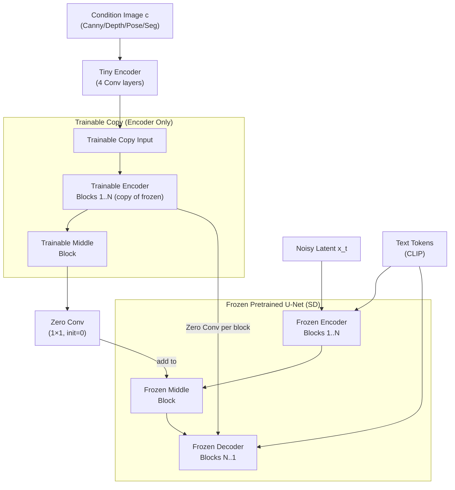

# 🎛️ ControlNet Deep Dive

> [!abstract] TL;DR
> ControlNet (Zhang 2023) adds precise spatial conditioning — edge maps, depth, pose, segmentation — to a frozen pretrained diffusion model. It makes a trainable copy of the U-Net encoder, connects it via zero-initialized convolutions, and injects activations into the original U-Net decoder. Zero convolutions ensure the model starts from its pretrained behavior and only gradually incorporates the conditioning. T2I-Adapter offers a lighter-weight alternative; IP-Adapter enables image-prompt conditioning via cross-attention injection; InstructPix2Pix edits images with natural language instructions.

## Intuition — analogy FIRST

Stable Diffusion is a brilliant painter who only takes text instructions. ControlNet gives that painter a reference sketch. The painter still uses all their existing knowledge and style (frozen weights), but now they must follow the spatial layout of the sketch — they can't reposition the head or change the pose.

The clever trick: when you first hand the painter the sketch, you start with a completely transparent overlay (zero convolutions). As training progresses, the sketch gradually becomes more opaque — the painter learns to incorporate it without forgetting how to paint. If you removed the sketch, the painter would produce exactly what they did before.

## How It Works



## Key Concepts / Details

### Zero Convolutions
A 1×1 convolution with:
- **Weights initialized to 0** → outputs 0 at the start of training
- **Biases initialized to 0**

Effect at training step 0: `F_decoder += ZeroConv(TC_encoder) = 0`. The frozen U-Net is completely unaffected — ControlNet starts from the exact pretrained behavior.

As training progresses, the zero convolutions learn to scale and project the trainable copy's features. The model gradually learns which spatial features are relevant.

```python
class ZeroConv2d(nn.Module):
    def __init__(self, in_ch, out_ch):
        super().__init__()
        self.conv = nn.Conv2d(in_ch, out_ch, 1, padding=0)
        nn.init.zeros_(self.conv.weight)
        nn.init.zeros_(self.conv.bias)

    def forward(self, x):
        return self.conv(x)   # outputs 0 at init; gradually learns non-zero
```

### Trainable Copy Architecture
ControlNet copies only the **encoder half** of the U-Net (not the decoder). This is sufficient to capture structural information. The trainable copy receives:
1. The noisy latent x_t (same as frozen U-Net)
2. The spatial condition c (edge map, depth, etc.) via a small 4-layer convolutional encoder

Each encoder block's output passes through a ZeroConv and is added to the corresponding decoder block of the frozen U-Net at matching resolution.

### Condition Types

| Condition | Extractor | Controls | Use Case |
|---|---|---|---|
| Canny edges | OpenCV Canny | Shape, structure | Character design, product shots |
| HED soft edges | HED detector | Soft structure | Artistic style transfer |
| MLSD lines | M-LSD detector | Straight lines | Architecture, interior design |
| Depth map | MiDaS/ZoeDepth | 3D structure | Scene composition |
| Normal map | Normal estimator | Surface orientation | 3D-consistent generation |
| Segmentation | OneFormer/SAM | Region semantics | Precise region control |
| Human pose | OpenPose | Body keypoints | Character posing, fashion |
| Scribbles | User-drawn | Coarse layout | Interactive editing |
| Low-res image | Bicubic downscale | Detail + structure | Super-resolution |

### Training Protocol
- **Frozen**: all original U-Net weights (text encoder, VAE also frozen)
- **Trained**: trainable copy encoder + middle block + all zero convolutions
- ~23% of original U-Net parameters are in the trainable copy
- Data: condition-image pairs (e.g., Canny(image), image)
- Loss: same DDPM noise prediction MSE on the main U-Net output

### Stacking Multiple ControlNets
Multiple ControlNets can be applied simultaneously — activations from each are summed before being injected into the decoder:
```
decoder_input += ZeroConv_1(TC1_encoder) + ZeroConv_2(TC2_encoder)
```
Common combination: pose + depth for full-body character generation.

### ControlNet + SDXL
SDXL ControlNet requires a separate model trained on the larger U-Net. Community models exist for Canny, depth, and pose conditioning with SDXL.

### Inference Code (Diffusers)
```python
from diffusers import StableDiffusionControlNetPipeline, ControlNetModel
from diffusers.utils import load_image
import cv2, numpy as np, torch

# Load pretrained ControlNet (Canny)
controlnet = ControlNetModel.from_pretrained(
    "lllyasviel/sd-controlnet-canny", torch_dtype=torch.float16
)
pipe = StableDiffusionControlNetPipeline.from_pretrained(
    "runwayml/stable-diffusion-v1-5",
    controlnet=controlnet, torch_dtype=torch.float16
).to("cuda")

# Prepare Canny edge condition
image = np.array(load_image("input.jpg"))
low_threshold, high_threshold = 100, 200
canny = cv2.Canny(image, low_threshold, high_threshold)
canny = np.stack([canny] * 3, axis=-1)          # 3-channel for pipeline

from PIL import Image
canny_image = Image.fromarray(canny)

result = pipe(
    prompt="A futuristic cityscape, cinematic lighting, 4k",
    image=canny_image,                           # spatial condition
    controlnet_conditioning_scale=1.0,           # condition strength 0-2
    num_inference_steps=30,
    guidance_scale=7.5,
).images[0]
```

### T2I-Adapter (Lighter Alternative)
Rather than copying the full U-Net encoder, T2I-Adapter uses a **separate lightweight adapter network** per condition type (~77M params vs ControlNet's ~360M). Adapter outputs are added to U-Net feature maps at fixed resolutions. Slightly lower quality than ControlNet but faster and more modular.

### IP-Adapter (Image Prompt Adapter)
Instead of spatial conditioning, IP-Adapter enables **image style/subject conditioning** via a separate cross-attention mechanism:
- Image features extracted from a CLIP image encoder
- Projected to K, V for a separate cross-attention layer added to each U-Net block
- Text cross-attention and image cross-attention outputs are summed
- Very effective for consistent style transfer and subject-driven generation without fine-tuning

```
text_attn  = CrossAttn(Q=spatial, KV=text_tokens)
image_attn = CrossAttn(Q=spatial, KV=image_features)   # new adapter layer
output = text_attn + λ · image_attn                    # λ controls IP weight
```

### InstructPix2Pix (Brooks 2023)
Edit images with text instructions like "make it winter" or "turn the car red":
- Training data: (original image, instruction, edited image) triples generated by combining GPT-4 (for instructions) and Prompt2Prompt (for edited images)
- Architecture: standard SD U-Net with 8-channel input (original image latent concatenated to noisy latent)
- Inference: classifier-free guidance over both the text instruction AND the source image simultaneously:
```
ε̃ = ε(x_t, ∅, ∅) + s_T·(ε(x_t, T, ∅) - ε(x_t, ∅, ∅))    # text guidance
              + s_I·(ε(x_t, T, I) - ε(x_t, T, ∅))          # image guidance
```

## Real-World Notes

| Method | Params Added | Spatial Control | Image Prompt | Compute Overhead |
|---|---|---|---|---|
| ControlNet | ~360M | Precise (multi-type) | No | ~2× inference time |
| T2I-Adapter | ~77M | Good | No | ~1.3× inference time |
| IP-Adapter | ~22M | No | Yes (style/subject) | ~1.1× inference time |
| InstructPix2Pix | Full fine-tune | Implicit | Yes (source) | Same as SD |

- ControlNet Canny + realistic checkpoint = dominant approach for product photography automation
- IP-Adapter is widely used for consistent character generation across multiple scenes
- ControlNet is available for SDXL, FLUX, and other base models

## Common Pitfalls

- **controlnet_conditioning_scale too high**: >1.5 often causes the condition to override the text prompt completely
- **Wrong condition extractor**: using HED edges when the image needs rigid structure → use MLSD or Canny instead
- **Condition resolution mismatch**: condition image should match the output resolution; SD v1.5 expects 512×512
- **Stacking too many ControlNets**: sum of all ZeroConv outputs can dominate the U-Net; scale each individually

## Related Concepts

- [[Stable_Diffusion_Architecture]] — ControlNet operates on top of the SD U-Net
- [[Diffusion_Models_Deep]] — forward/reverse process and U-Net backbone that ControlNet modifies
- [[VAE_Deep_Dive]] — VAE latent space in which all conditioning takes place

## Review Questions

1. What are zero convolutions and why are they critical for ControlNet's training stability?
2. Why does ControlNet copy only the encoder half of the U-Net, not the decoder?
3. Compare T2I-Adapter and ControlNet: what is traded off for T2I-Adapter's lower parameter count?
4. How does IP-Adapter inject image conditioning differently from ControlNet's spatial approach?
5. Write the dual-CFG guidance formula for InstructPix2Pix and explain the two guidance signals.
6. What happens when controlnet_conditioning_scale is set too high (e.g., 2.0)?

## Sources

- Zhang et al., "Adding Conditional Control to Text-to-Image Diffusion Models (ControlNet)," ICCV 2023
- Mou et al., "T2I-Adapter: Learning Adapters to Dig out More Controllable Ability for Text-to-Image Diffusion Models," AAAI 2024
- Ye et al., "IP-Adapter: Text Compatible Image Prompt Adapter for Text-to-Image Diffusion Models," arXiv 2023
- Brooks et al., "InstructPix2Pix: Learning to Follow Image Editing Instructions," CVPR 2023

#computer-vision #generative-vision #ControlNet #T2I-Adapter #IP-Adapter #spatial-conditioning #zero-convolution
