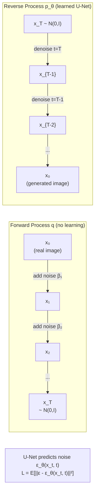

# 🌀 Diffusion Models Deep Dive

> [!abstract] TL;DR
> DDPM (Ho 2020) defines a forward process that gradually adds Gaussian noise over T=1000 steps, corrupting data to pure noise. The model (a U-Net) learns to reverse this process — predicting the noise at each step. At inference, start from pure noise and iteratively denoise. DDIM enables deterministic 50-step sampling with the same trained model. Classifier-free guidance (CFG) conditions generation on text/class via a weighted combination of conditional and unconditional score estimates, controlling the quality-diversity trade-off.

## Intuition — analogy FIRST

Think of a photograph left in bleach. Over 1000 seconds, it fades from a clear image to pure white static — you can mathematically model exactly how much bleach was added at each moment. Now train a neural network on thousands of "partially bleached → original" pairs so it learns to un-bleach any photo at any stage. At inference time, start with a photo of pure static and iteratively un-bleach it. Because the un-bleaching process is parameterized by a text or class condition, you can steer it toward generating anything you want.

## How It Works



## Key Concepts / Details

### Forward Process (DDPM)
Add noise over T steps according to a schedule {β₁, ..., β_T}:

```
q(x_t | x_{t-1}) = N(x_t ; √(1-β_t) · x_{t-1},  β_t · I)
```

**Closed-form marginal** (reparameterize with ᾱ_t = ∏ᵢ₌₁ᵗ (1 - βᵢ)):
```
q(x_t | x_0) = N(x_t ; √ᾱ_t · x_0,  (1-ᾱ_t) · I)
```

This means we can sample x_t directly from x_0 in one step:
```python
x_t = sqrt(alpha_bar_t) * x_0 + sqrt(1 - alpha_bar_t) * eps
# where eps ~ N(0, I)
```

### Training Objective (L_simple)
Predict the noise ε that was added to get x_t from x_0:
```
L = E_{t, x_0, ε} [ ||ε - ε_θ(x_t, t)||² ]
```
This is equivalent to denoising score matching. The model predicts the gradient of the log probability (score function) at each noise level.

### U-Net Backbone
```
Architecture: Encoder (downsample) → Bottleneck → Decoder (upsample) with skip connections
Time embedding: sinusoidal encoding of t → added to each ResBlock feature map
Attention: multi-head self-attention at intermediate resolutions (16×16, 8×8)
Conditioning: cross-attention on text tokens (in text-to-image variants)
```

### Variance Schedules
- **Linear schedule** (DDPM): β increases linearly from β₁=0.0001 to β_T=0.02
- **Cosine schedule** (Improved DDPM, Nichol & Dhariwal): `ᾱ_t = cos²((t/T + 0.008)/(1+0.008) · π/2)` — avoids destroying too much information at later steps; generally better FID

### DDIM (Denoising Diffusion Implicit Models)
Song 2020: non-Markovian deterministic sampler for the **same trained DDPM model**. No retraining needed.

Key insight: DDPM learns p(x_{t-1}|x_t); DDIM defines a deterministic trajectory through latent space:
```
x_{t-1} = √ᾱ_{t-1} · (x_t - √(1-ᾱ_t)·ε_θ(x_t,t)) / √ᾱ_t
         + √(1-ᾱ_{t-1}) · ε_θ(x_t, t)
```

- Reduces steps from T=1000 → 50 with comparable quality
- **Deterministic**: same z always produces same image
- **DDIM inversion**: run the process backward (noising direction) → encode a real image into noise → enables image editing

### Classifier Guidance
Train a noise-aware classifier p_φ(y|x_t) and add its gradient to the score:
```
ε̃_θ(x_t, t, y) = ε_θ(x_t, t) - √(1-ᾱ_t) · ∇_{x_t} log p_φ(y|x_t)
```
Requires training a separate noisy classifier. Guidance scale s controls strength.

### Classifier-Free Guidance (CFG)
Train a single model for both conditional and unconditional generation:
- During training: randomly drop the conditioning c with probability p_uncond → model learns both ε_θ(x_t, c) and ε_θ(x_t, ∅)
- During inference, extrapolate beyond conditional:
```
ε̃_θ(x_t, c) = ε_θ(x_t, ∅) + w · (ε_θ(x_t, c) - ε_θ(x_t, ∅))
```
**w** = guidance scale (typically 7-15 for text-to-image):
- w=1: standard conditional (maximum diversity)
- w>1: sharper, more aligned to prompt (less diversity)
- w>>1: oversaturated, distorted images

### Score Matching Connection
The score function s_θ(x, t) = ∇_x log p_t(x). Predicting ε is equivalent to estimating the score via denoising score matching. Langevin dynamics then uses this score to sample from p(x):
```
x_{k+1} = x_k + (δ/2)·s_θ(x_k, t) + √δ · z_k
```

### PyTorch DDPM Forward Process
```python
import torch

class DDPMScheduler:
    def __init__(self, T=1000):
        self.T = T
        betas = torch.linspace(1e-4, 0.02, T)       # linear schedule
        alphas = 1.0 - betas
        self.alpha_bar = torch.cumprod(alphas, dim=0)  # ᾱ_t

    def add_noise(self, x0, t):
        """Sample x_t ~ q(x_t | x_0) directly"""
        sqrt_ab = self.alpha_bar[t].sqrt().view(-1, 1, 1, 1)
        sqrt_1mab = (1 - self.alpha_bar[t]).sqrt().view(-1, 1, 1, 1)
        eps = torch.randn_like(x0)
        x_t = sqrt_ab * x0 + sqrt_1mab * eps
        return x_t, eps   # return noisy image AND the noise (training target)

# Training step
scheduler = DDPMScheduler()
t = torch.randint(0, 1000, (batch_size,))
x_t, eps = scheduler.add_noise(x0, t)
eps_pred = unet(x_t, t)                  # U-Net predicts noise
loss = F.mse_loss(eps_pred, eps)          # L_simple
```

### EDM (Elucidating Diffusion Models, Karras 2022)
Unifying framework for diffusion models with:
- Preconditioning of the network input/output to be well-scaled at all noise levels
- Optimal noise schedule derived analytically
- Improved second-order ODE sampler (Heun's method)
- Used as basis for FLUX (rectified flow variant)

## Real-World Notes

| Sampler | Steps | FID (CIFAR-10) | Notes |
|---|---|---|---|
| DDPM | 1000 | 3.17 | Original, slow |
| DDIM | 50 | ~4.2 | Deterministic, fast |
| PNDM | 50 | ~3.6 | Pseudo-numerical methods |
| DPM-Solver++ | 20 | ~3.2 | Near-DDPM quality at 20 steps |
| DPM-Solver++ | 10 | ~3.5 | Practical real-time use |

- DPM-Solver++ and UniPC are the standard fast samplers used in production Stable Diffusion
- DDIM inversion is used for image editing pipelines (Prompt2Prompt, InstructPix2Pix)
- Cosine schedule almost always preferred over linear for image quality

## Common Pitfalls

- **Forgetting the closed-form**: q(x_t|x_0) lets you jump directly to any timestep; you don't need to iteratively apply T steps to add noise during training
- **Confusing forward/reverse**: forward adds noise (analytical, no network); reverse removes noise (learned)
- **Guidance scale too high**: w > 15 typically causes oversaturation and artifacts; 7-12 is typical sweet spot
- **DDIM inversion assumptions**: only works well when the text conditioning is the same as the original image's content

## Related Concepts

- [[VAE_Deep_Dive]] — VQGAN used as the encoder/decoder wrapper around latent diffusion
- [[Stable_Diffusion_Architecture]] — LDM applies diffusion in VAE latent space
- [[ControlNet_Deep_Dive]] — spatial conditioning injected into the U-Net denoiser

## Review Questions

1. Write the closed-form expression for q(x_t|x_0) and explain how ᾱ_t is computed.
2. What is L_simple and what does the U-Net actually learn to predict?
3. How does DDIM achieve 50-step sampling without retraining the model?
4. Derive the CFG inference formula and explain the role of guidance scale w.
5. Why is the cosine variance schedule generally preferred over the linear schedule?
6. What is DDIM inversion and how does it enable image editing?

## Sources

- Ho et al., "Denoising Diffusion Probabilistic Models (DDPM)," NeurIPS 2020
- Song et al., "Denoising Diffusion Implicit Models (DDIM)," ICLR 2021
- Dhariwal & Nichol, "Diffusion Models Beat GANs on Image Synthesis," NeurIPS 2021
- Ho & Salimans, "Classifier-Free Diffusion Guidance," NeurIPS 2022 Workshop
- Karras et al., "Elucidating the Design Space of Diffusion-Based Generative Models (EDM)," NeurIPS 2022

#computer-vision #generative-vision #DDPM #DDIM #diffusion #score-matching #CFG
