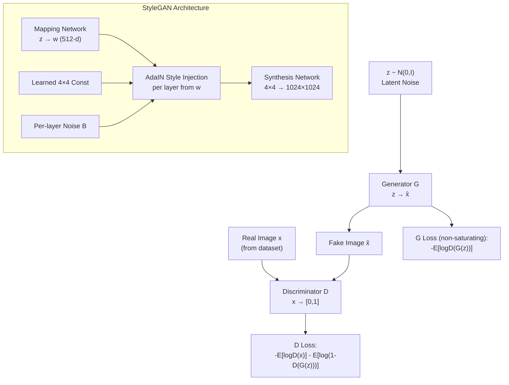

# ⚔️ GAN Deep Dive

> [!abstract] TL;DR
> GANs (Goodfellow 2014) train two networks adversarially: a generator G maps noise z → fake image x̂, a discriminator D learns to distinguish real from fake. The min-max game drives G to match the true data distribution. Training is notoriously unstable — mode collapse and gradient vanishing are the key failure modes. WGAN-GP stabilizes training via Earth Mover's distance; StyleGAN2 achieves photorealistic faces via disentangled style injection. GANs are still the fastest path to high-quality generation at inference time.

## Intuition — analogy FIRST

Imagine an art forger (Generator) and an authentication expert (Discriminator). The forger makes fake paintings; the expert grades real vs fake. Each loss teaches the forger to be more convincing and the expert to be more discerning. Eventually the forger is so skilled that even the expert can't tell. At that point, the forger is effectively sampling from the real painting distribution.

The problem: if the expert becomes too good too fast, they output near-0 gradients on all fakes → the forger gets no useful signal → training stalls. If the forger finds one style the expert always accepts → it keeps painting the same thing → **mode collapse**.

## How It Works



## Key Concepts / Details

### Original GAN Objective
```
min_G max_D  E_{x~p_data}[log D(x)] + E_{z~p_z}[log(1 - D(G(z)))]
```

Problem: `log(1-D(G(z)))` saturates to 0 when D is confident all fakes are fake — zero gradient for G.

**Non-saturating loss for G** (practical fix):
```
max_G  E_{z~p_z}[log D(G(z))]
```

### Training Dynamics & Failure Modes

| Problem | Symptom | Fix |
|---|---|---|
| Mode collapse | G outputs same image for all z | Minibatch discrimination, unrolled GAN, WGAN |
| Gradient vanishing | D too strong → zero signal to G | Balance G/D update frequency, label smoothing |
| Training instability | Loss oscillates, doesn't converge | Spectral normalization, WGAN-GP, two-timescale updates |

**Training tricks**:
- **Label smoothing**: use 0.9 instead of 1.0 for real labels → prevents D from being overconfident
- **Balanced updates**: typically 1 D step per G step (ProGAN uses 1:1; some use 5:1)
- **Spectral normalization**: normalize weight matrices by their largest singular value → controls Lipschitz constant of D

### Wasserstein GAN (WGAN)
Replace JS divergence with **Earth Mover's (Wasserstein-1) distance**:
```
min_G max_{||D||_L ≤ 1}  E[D(x)] - E[D(G(z))]
```
D is now a **critic** (unbounded real-valued output, not probability).

**Lipschitz constraint**: required for valid Wasserstein distance.
- WGAN (original): weight clipping to [-c, c] — crude but works
- **WGAN-GP**: gradient penalty instead of weight clipping:
```
L_GP = λ · E[(||∇_x̂ D(x̂)||_2 - 1)²],   x̂ = εx + (1-ε)G(z),  ε ~ U[0,1]
```

WGAN-GP provides meaningful loss curves (Wasserstein distance actually correlates with visual quality) and rarely mode-collapses.

### Progressive GAN (ProGAN)
Train at progressively higher resolutions:
```
4×4 → 8×8 → 16×16 → 32×32 → 64×64 → 128×128 → 512×512 → 1024×1024
```
New layers are blended in gradually via an alpha fade. Both G and D grow together. Stabilizes high-resolution training dramatically.

### StyleGAN Architecture
```
Mapping network:  z (512) → 8 FC layers → w (512)
Synthesis network: learned const 4×4 → AdaIN blocks with w per layer → 1024×1024
Per-layer noise: additive B·noise_map for stochastic variation (hair, pores)
```

**AdaIN (Adaptive Instance Normalization)**:
```
AdaIN(x, y_s, y_b) = y_s · (x - μ(x)) / σ(x) + y_b
```
y_s, y_b come from the style vector w → each layer receives independent style injection.

**Style mixing regularization**: during training, randomly use two different w vectors for different layers → prevents generator from relying on correlation between layer styles.

### StyleGAN2 & StyleGAN3
- **StyleGAN2**: removes "blob" artifacts caused by per-pixel mean in AdaIN; uses weight demodulation instead; revised path length regularization
- **StyleGAN3**: alias-free design using continuous signal processing theory → temporally consistent for video; no "texture sticking" artifacts during latent interpolation

### PyTorch GAN Training with Spectral Norm
```python
import torch
import torch.nn as nn
from torch.nn.utils import spectral_norm

# Spectral normalization applied to discriminator layers
class Discriminator(nn.Module):
    def __init__(self):
        super().__init__()
        self.net = nn.Sequential(
            spectral_norm(nn.Conv2d(3, 64, 4, 2, 1)),
            nn.LeakyReLU(0.2),
            spectral_norm(nn.Conv2d(64, 128, 4, 2, 1)),
            nn.LeakyReLU(0.2),
            spectral_norm(nn.Linear(128 * 8 * 8, 1)),
        )

# Non-saturating GAN training loop
for real_imgs in dataloader:
    # --- Train Discriminator ---
    z = torch.randn(batch, latent_dim)
    fake_imgs = G(z).detach()
    d_real = D(real_imgs)
    d_fake = D(fake_imgs)
    # Label smoothing: real=0.9, fake=0.0
    d_loss = F.binary_cross_entropy_with_logits(d_real, torch.full_like(d_real, 0.9)) + \
             F.binary_cross_entropy_with_logits(d_fake, torch.zeros_like(d_fake))
    d_optimizer.zero_grad(); d_loss.backward(); d_optimizer.step()

    # --- Train Generator (non-saturating) ---
    z = torch.randn(batch, latent_dim)
    fake_imgs = G(z)
    g_loss = F.binary_cross_entropy_with_logits(D(fake_imgs), torch.ones_like(D(fake_imgs)))
    g_optimizer.zero_grad(); g_loss.backward(); g_optimizer.step()
```

### Evaluation Metrics
- **IS (Inception Score)**: `exp(E[D_KL(p(y|x) || p(y))])` — higher = sharper + more diverse
- **FID (Fréchet Inception Distance)**: compare Inception-v3 feature statistics of real vs generated:
  ```
  FID = ||μ_r - μ_g||² + Tr(Σ_r + Σ_g - 2(Σ_r Σ_g)^½)
  ```
  Lower FID = better. Standard benchmark.

## Real-World Notes

| Model | FID (FFHQ 1024) | Notes |
|---|---|---|
| DCGAN | ~80 | Baseline CNN GAN |
| WGAN-GP | ~40 | Stable but low resolution |
| ProGAN | 8.0 | Progressive training breakthrough |
| StyleGAN2 | 2.84 | Best photorealistic faces |
| StyleGAN3 | 2.79 | Alias-free, video-ready |

- GANs remain fastest for inference: single forward pass vs 20-1000 steps for diffusion
- Used in real-time super-resolution (ESRGAN), face enhancement, video synthesis
- StyleGAN2 truncation trick: sample w closer to mean W̄ → higher quality, less diversity (quality-diversity trade-off)

## Common Pitfalls

- **Training both networks at equal LR**: D usually needs lower LR or fewer steps
- **Checking loss to measure quality**: GAN loss does not correlate with image quality; use FID
- **Assuming mode collapse is always visible**: generator might produce high-quality images of only a few modes without it being obvious
- **Forgetting spectral norm scope**: apply to discriminator only; applying to generator can hurt training

## Related Concepts

- [[VAE_Deep_Dive]] — VQGAN combines VQ-VAE with GAN discriminator
- [[Diffusion_Models_Deep]] — diffusion has largely replaced GANs for quality benchmarks
- [[Stable_Diffusion_Architecture]] — SDXL VAE uses adversarial loss from GAN literature

## Review Questions

1. Write the non-saturating generator loss and explain why it's preferred over the original.
2. What does the gradient penalty in WGAN-GP enforce and why is it better than weight clipping?
3. Describe the StyleGAN mapping network's role and why a separate w-space helps.
4. Why does FID correlate better with perceptual quality than Inception Score?
5. What is style mixing regularization and what failure mode does it prevent?
6. Compare ProGAN's training scheme to standard GAN training and explain the benefit.

## Sources

- Goodfellow et al., "Generative Adversarial Nets," NeurIPS 2014
- Arjovsky et al., "Wasserstein GAN," ICML 2017
- Gulrajani et al., "Improved Training of Wasserstein GANs (WGAN-GP)," NeurIPS 2017
- Karras et al., "Progressive Growing of GANs (ProGAN)," ICLR 2018
- Karras et al., "A Style-Based Generator Architecture (StyleGAN)," CVPR 2019
- Karras et al., "Analyzing and Improving StyleGAN (StyleGAN2)," CVPR 2020
- Karras et al., "Alias-Free Generative Adversarial Networks (StyleGAN3)," NeurIPS 2021

#computer-vision #generative-vision #GAN #StyleGAN #WGAN #adversarial-training
