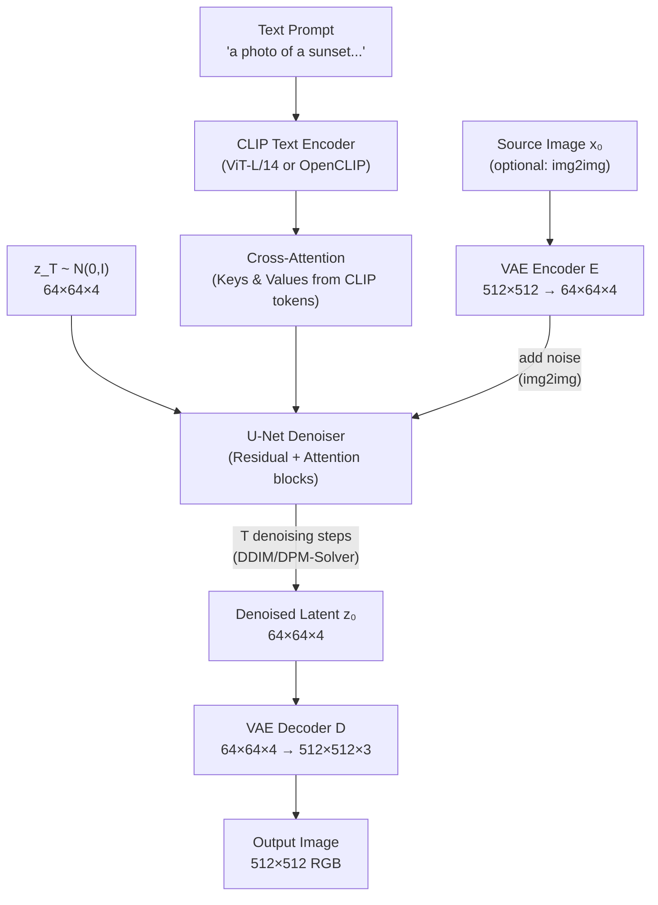

# 🏛️ Stable Diffusion Architecture

> [!abstract] TL;DR
> Latent Diffusion Models (LDM, Rombach 2022) run diffusion in a compressed latent space encoded by a VQGAN/VAE, reducing compute ~64× vs pixel-space diffusion. A U-Net denoises latent vectors z_t, conditioned on text via cross-attention with CLIP embeddings. At inference, the decoded latent z_0 → pixel image via the VAE decoder. SDXL scales to 2.6B U-Net parameters, native 1024×1024, and dual text encoders. Personalization techniques — LoRA, DreamBooth, Textual Inversion — fine-tune the model for custom concepts with 4-8GB VRAM.

## Intuition — analogy FIRST

Running a diffusion model on 512×512 pixel images is like sculpting a statue by controlling every grain of sand. It works, but it's enormously slow and expensive. Instead, LDM first compresses the image into a compact "sketch" (64×64 latent), does all the complex creative work in that sketch space, then expands it back into fine detail at the end. This separation of "what to paint" (latent space diffusion) from "how to render it" (VAE decoder) is the key insight that makes diffusion models practical at scale.

## How It Works



## Key Concepts / Details

### LDM Core Idea
Compress image to latent space using a pretrained VQGAN/VAE:
```
z = E(x)    # Encoder: 512×512×3 → 64×64×4 (8× spatial compression)
x̂ = D(z)   # Decoder: 64×64×4 → 512×512×3
```

Run the full DDPM/DDIM diffusion process on z (64×64×4) instead of x (512×512×3):
- Parameter reduction: 64×64 vs 512×512 = **64× fewer pixels** per step
- Enables high-resolution synthesis on consumer GPUs

### Text Conditioning via Cross-Attention
U-Net residual blocks interleaved with cross-attention blocks:
```python
# Pseudocode for cross-attention conditioning in U-Net
text_tokens = clip_encoder(prompt)     # shape: [B, 77, 768]
# In each attention block of U-Net:
Q = image_features @ W_q              # from spatial feature map
K = text_tokens @ W_k                 # from CLIP tokens
V = text_tokens @ W_v
attn_output = softmax(Q @ K.T / sqrt(d)) @ V
```
Image tokens attend to text tokens at every U-Net resolution → spatial features are text-guided throughout.

### Stable Diffusion v1 Specs
- **VAE**: KL-regularized autoencoder, 4-channel latent, 8× downsampling
- **U-Net**: 860M parameters, residual + attention blocks
- **Text encoder**: CLIP ViT-L/14 (frozen), 768-dim tokens, max 77 tokens
- **Training resolution**: 512×512
- **Scheduler**: DDPM trained, DDIM/DPM-Solver++ at inference

### SDXL (Stable Diffusion XL)
Significant scale-up:
```
U-Net: 2.6B parameters (vs 860M in SD 1.5)
Text encoders: CLIP ViT-L (768-d) + OpenCLIP ViT-bigG (1280-d) concatenated → 2048-d conditioning
Native resolution: 1024×1024
Refiner model: separate 2nd-stage U-Net for detail enhancement
Additional conditioning: image size, crop coordinates, aesthetic score
```

### Image-to-Image (img2img)
1. Encode source image: z_0 = E(x_source)
2. Add t steps of noise: z_t = √ᾱ_t · z_0 + √(1-ᾱ_t) · ε
3. Denoise from z_t with text conditioning
**strength** parameter controls t/T: strength=1.0 → full noise (unconstrained), strength=0.3 → light editing

### Inpainting
1. Encode full image + mask
2. At each denoising step, replace unmasked latent regions with noise-corrupted original latent
3. Network only generates content inside the mask, constrained to blend seamlessly

### Personalization Techniques

#### LoRA (Low-Rank Adaptation)
Fine-tune attention weights using low-rank decomposition:
```
W = W_pretrained + ΔW = W_pretrained + A · B
# A: [d_in, r],  B: [r, d_out],  r << min(d_in, d_out)
# Typical r = 4–8; only A and B are trained (~4MB per LoRA)
```
Trains in ~1 hour on 4-8GB VRAM with ~10-50 images. Multiple LoRAs can be merged or interpolated.

#### DreamBooth
Fine-tune the entire U-Net (and text encoder) on 3-5 reference images of a subject. Uses a **rare trigger token** (e.g., "sks") to bind the subject. **Prior preservation loss** prevents overfitting by simultaneously training on class images ("a dog").

```
L = L_recon(x, "sks dog") + λ · L_recon(x_prior, "a dog")
```

Requires ~16GB VRAM, 30-60 minutes training. Produces highest-fidelity personalization.

#### Textual Inversion
Freeze the entire model. Learn a **new text embedding** v* for a token `<concept>`:
```
v* = argmin_v E[||ε - ε_θ(x_t, τ(T(v*)))||²]
```
Only ~1KB learned; extremely portable. Lower quality than DreamBooth for complex subjects.

### Inference Code (Diffusers Library)
```python
from diffusers import StableDiffusionXLPipeline, DPMSolverMultistepScheduler
import torch

pipe = StableDiffusionXLPipeline.from_pretrained(
    "stabilityai/stable-diffusion-xl-base-1.0",
    torch_dtype=torch.float16,
).to("cuda")
pipe.scheduler = DPMSolverMultistepScheduler.from_config(pipe.scheduler.config)

image = pipe(
    prompt="A photorealistic sunset over the ocean, dramatic lighting",
    negative_prompt="blurry, low quality, artifacts",
    height=1024, width=1024,
    num_inference_steps=25,         # DPM-Solver++ needs far fewer steps
    guidance_scale=7.5,             # CFG weight
).images[0]
image.save("output.png")
```

## Real-World Notes

| Model | U-Net Params | Resolution | Text Encoder | FID (COCO) |
|---|---|---|---|---|
| SD 1.5 | 860M | 512×512 | CLIP ViT-L | ~14 |
| SD 2.1 | 865M | 768×768 | OpenCLIP ViT-H | ~12 |
| SDXL | 2.6B | 1024×1024 | CLIP-L + OpenCLIP-bigG | ~8 |
| FLUX.1 | 12B | 1024×1024 | T5-XXL + CLIP-L | ~5 |

- **FLUX** (Black Forest Labs, 2024) replaces the U-Net with a Transformer (DiT) and uses rectified flow instead of DDPM — current open-source SOTA
- LoRA is the dominant personalization method in production (Civitai ecosystem, ~100k public LoRAs)
- SD VAE is a known bottleneck: fine details and text-in-image require VAE improvements (SDXL VAE is fp16-fixed)

## Common Pitfalls

- **CLIP token limit**: SD uses 77 token limit for prompts; longer prompts are truncated (use prompt weighting to prioritize)
- **VAE baking artifacts**: rendering fine text in images fails because VAE loses high-frequency information
- **LoRA rank too high**: r=64+ overfits for most tasks; r=4-16 is typically optimal
- **img2img strength misunderstanding**: strength=1.0 ignores the source image entirely; strength=0.0 returns it unchanged

## Related Concepts

- [[Diffusion_Models_Deep]] — DDPM/DDIM theory underlying the denoising process
- [[VAE_Deep_Dive]] — VQGAN/VAE that provides the latent space compression
- [[ControlNet_Deep_Dive]] — spatial conditioning layer added on top of Stable Diffusion U-Net

## Review Questions

1. What is the spatial compression ratio of the Stable Diffusion VAE and how much compute does it save?
2. How does cross-attention enable text conditioning in the U-Net?
3. What are the two text encoders in SDXL and how are their outputs combined?
4. Explain the LoRA decomposition. Why is it preferred over full fine-tuning for personalization?
5. How does img2img's strength parameter control the balance between source image and new generation?
6. What is prior preservation loss in DreamBooth and why is it needed?

## Sources

- Rombach et al., "High-Resolution Image Synthesis with Latent Diffusion Models," CVPR 2022
- Podell et al., "SDXL: Improving Latent Diffusion Models for High-Resolution Image Synthesis," ICLR 2024
- Hu et al., "LoRA: Low-Rank Adaptation of Large Language Models," ICLR 2022
- Ruiz et al., "DreamBooth: Fine Tuning Text-to-Image Diffusion Models for Subject-Driven Generation," CVPR 2023
- Gal et al., "An Image is Worth One Word: Personalizing Text-to-Image Generation using Textual Inversion," ICLR 2023

#computer-vision #generative-vision #stable-diffusion #LDM #SDXL #LoRA #DreamBooth #text-to-image
