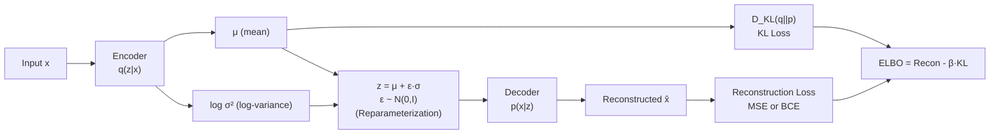

# 🔬 VAE Deep Dive

> [!abstract] TL;DR
> The Variational Autoencoder (VAE) learns a continuous, structured latent space by encoding inputs as Gaussian distributions (μ, σ²) rather than point vectors. The reparameterization trick makes sampling differentiable. Training maximizes the ELBO: reconstruction quality minus KL divergence from a standard Gaussian prior. Extensions — β-VAE (more disentangled), VQ-VAE (discrete codebook), VQGAN (adversarial perceptual quality) — power modern image tokenizers inside Stable Diffusion and DALL-E.

## Intuition — analogy FIRST

A standard autoencoder compresses a photo into a fixed point on a map, then reconstructs from that point. The problem: the map has gaps — random points in the middle of nowhere produce garbage reconstructions.

A VAE instead maps each photo to a **fuzzy region** (a Gaussian blob) on the map. During training, blobs are forced to overlap and stay near the center. This means any random point you sample from the map produces a valid-looking image. The latent space becomes a smooth, navigable terrain — walk between two faces and you get a morphing face, not static noise.

## How It Works



## Key Concepts / Details

### ELBO (Evidence Lower BOund)
The true objective is to maximize log p(x), the log-likelihood of data. Since this is intractable, we maximize its lower bound:

```
L(θ,φ; x) = E_q[log p(x|z)] - D_KL(q_φ(z|x) || p(z))
```

- **Reconstruction term** `E[log p(x|z)]`: how well the decoder recovers x from z. Use MSE for continuous outputs, BCE for binary.
- **KL term**: how close the posterior q(z|x) is to the prior p(z) = N(0,I). Has a closed form:

```
D_KL = -½ Σ (1 + log σ²_j - μ²_j - σ²_j)
```

### Reparameterization Trick
Sampling z ~ N(μ, σ²) is not differentiable w.r.t. μ, σ. Instead:

```
z = μ + ε · σ,   ε ~ N(0, I)
```

Now gradients flow through μ and σ; ε is just random noise injected from outside the computation graph.

### β-VAE
Replace the ELBO KL weight with β > 1:

```
L = E[log p(x|z)] - β · D_KL(q(z|x) || p(z))
```

Higher β forces the encoder to use fewer latent dimensions efficiently → **more disentangled** representations (e.g., one dimension controls lighting, another controls rotation). Trade-off: higher β → worse reconstruction quality.

### VQ-VAE (Vector Quantized VAE)
Replace continuous latent z with a **discrete codebook** embedding:
1. Encoder outputs continuous vector z_e
2. Find nearest codebook vector e_k: k* = argmin_k ||z_e - e_k||²
3. Pass e_{k*} to decoder (straight-through estimator: copy gradients from decoder input back to encoder output)
4. Codebook updated via exponential moving average or commitment loss

Used in DALL-E (image tokenization), VQGAN, and as tokenizer for autoregressive image models.

### VQ-VAE-2
Hierarchical VQ-VAE with two levels of discrete latents:
- **Top level**: global structure (layout, shape) — low resolution
- **Bottom level**: local details (texture, fine edges) — higher resolution

### VQGAN
VQ-VAE + adversarial discriminator + perceptual loss (VGG feature matching):
- Pixel MSE → blurry results (averages over modes)
- Perceptual loss: match activations from a pretrained VGG network → sharper textures
- Discriminator (patch-based): ensures local realism
- Used as the encoder/decoder in **Latent Diffusion Models (Stable Diffusion)**

### Architecture
```
Encoder: Conv → ResBlock × N → Attention → Downsample × M → Conv → μ_head, logσ²_head
Decoder: Conv → Upsample × M → Attention → ResBlock × N → Conv → output
```

### PyTorch VAE Training Loop
```python
import torch
import torch.nn.functional as F

def vae_loss(x_recon, x, mu, log_var, beta=1.0):
    # Reconstruction: MSE for continuous images
    recon_loss = F.mse_loss(x_recon, x, reduction='sum')
    # KL divergence closed form
    kl_loss = -0.5 * torch.sum(1 + log_var - mu.pow(2) - log_var.exp())
    return recon_loss + beta * kl_loss

# Training step
optimizer.zero_grad()
x_recon, mu, log_var = model(x)      # encoder → reparameterize → decoder
loss = vae_loss(x_recon, x, mu, log_var, beta=1.0)
loss.backward()
optimizer.step()

# Sampling from prior
z = torch.randn(batch_size, latent_dim)   # sample N(0,I)
samples = model.decode(z)                 # decode to images
```

## Real-World Notes

- VAEs are rarely used standalone for high-quality image synthesis today — too blurry at pixel level
- **VQ-VAEs and VQGANs are alive and critical**: they tokenize images for LDMs, DALL-E, Parti, etc.
- In Stable Diffusion, the VAE (KL-regularized variant, not VQ) compresses 512×512 → 64×64×4, enabling diffusion to run 64× cheaper in VRAM and FLOPs
- β-VAE spawned the disentanglement research subfield; still used in scientific settings (molecule generation, biology)

## Common Pitfalls

- **Posterior collapse**: KL term → 0 early in training; decoder ignores z. Fix: KL annealing (slowly increase β from 0) or free bits
- **Blurry outputs**: inherent to pixel-space MSE reconstruction. Fix: use perceptual loss or switch to VQGAN
- **Confusing AE and VAE**: AE has no prior on latent space; interpolation between random points produces garbage
- **VQ-VAE gradient issue**: codebook lookup is non-differentiable; straight-through estimator is the standard fix

## Related Concepts

| Model | Latent Type | Loss | Quality | Use Case |
|---|---|---|---|---|
| Autoencoder | Continuous, unconstrained | MSE | Blurry | Compression |
| VAE | Continuous, Gaussian prior | ELBO | Blurry-smooth | Generative sampling |
| β-VAE | Continuous, tight Gaussian | β-ELBO | Blurry | Disentanglement research |
| VQ-VAE | Discrete codebook | Recon + commit | Sharper | Tokenization |
| VQGAN | Discrete codebook | Recon + Adv + Perceptual | Sharp | Tokenizer for LDMs |

## Review Questions

1. Write out the ELBO objective and explain each term's role.
2. Why is the reparameterization trick necessary for training VAEs with backpropagation?
3. What problem does β-VAE solve, and what does increasing β trade off?
4. How does VQ-VAE handle the non-differentiability of the argmin codebook lookup?
5. Why does VQGAN produce sharper images than a pixel-MSE VAE?
6. What role does the VAE (KL-regularized) play in Stable Diffusion's architecture?

## Sources

- Kingma & Welling, "Auto-Encoding Variational Bayes," ICLR 2014
- Higgins et al., "β-VAE: Learning Basic Visual Concepts with a Constrained Variational Framework," ICLR 2017
- van den Oord et al., "Neural Discrete Representation Learning (VQ-VAE)," NeurIPS 2017
- Razavi et al., "Generating Diverse High-Fidelity Images with VQ-VAE-2," NeurIPS 2019
- Esser et al., "Taming Transformers for High-Resolution Image Synthesis (VQGAN)," CVPR 2021

#computer-vision #generative-vision #VAE #latent-space #ELBO
