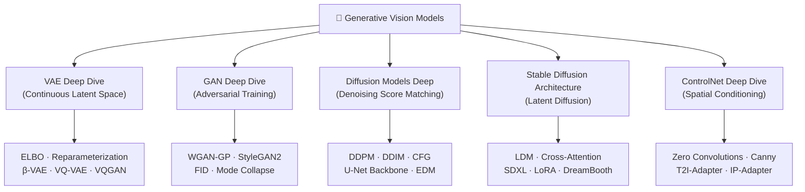

# 🗺️ Generative Vision Models — Section MOC

> [!abstract] TL;DR
> Generative vision models learn to synthesize realistic images from learned distributions. VAEs model a continuous latent space with a Gaussian prior; GANs pit a generator against a discriminator in an adversarial game; diffusion models iteratively denoise from pure noise and currently dominate image synthesis quality. Stable Diffusion operates in a compressed latent space for efficiency; ControlNet adds spatial conditioning to frozen pretrained models. This section covers the theory, architectures, training dynamics, and applications of each paradigm.

## Intuition — analogy FIRST

Think of generative vision models as three philosophies for painting a picture:
- **VAE**: Compress the painting into a sketch, then redraw from that sketch. The sketch is constrained to live on a smooth, known map — so you can navigate it.
- **GAN**: One artist paints fakes, another judge spots them. They compete until the fakes are indistinguishable from real masterpieces.
- **Diffusion**: Start with a canvas of pure static noise. Gradually sculpt it, removing noise step by step, guided by what you want the final image to look like.

## How It Works

## Paradigm Overview

| Paradigm | Core Idea | Training Loss | Strengths | Weaknesses |
|---|---|---|---|---|
| VAE | Encode → latent N(μ,σ²) → decode | ELBO (recon + KL) | Smooth latent space, fast | Blurry outputs |
| GAN | Generator vs Discriminator | Adversarial min-max | Sharp images | Mode collapse, training instability |
| Diffusion | Iterative denoising | Noise prediction MSE | SOTA quality, diversity | Slow sampling |
| LDM | Diffusion in latent space | Noise prediction MSE | Efficient diffusion | Requires good VAE |
| ControlNet | Spatial conditioning on frozen model | Noise prediction MSE | Precise spatial control | Extra compute |

## Key Concepts / Details

### Latent Space Geometry
- VAE: continuous, Gaussian prior → smooth interpolation, easy sampling
- VQ-VAE: discrete codebook → compressed tokens → enables autoregressive generation
- GAN: implicit distribution, no explicit latent structure guarantee
- Diffusion: latent is noisy data, reverse SDE traces sample back to data manifold

### Evaluation Metrics
- **FID** (Fréchet Inception Distance): lower = better; compares Inception feature statistics of real vs generated images
- **IS** (Inception Score): higher = better; measures quality + diversity
- **CLIP Score**: text-image alignment
- **LPIPS**: learned perceptual image patch similarity

### Training Stability Hierarchy
Diffusion > WGAN-GP > standard GAN (vanilla)

### Conditioning Mechanisms
- **Class conditioning**: embed class label, add to noise estimate
- **Text conditioning**: CLIP/T5 embeddings via cross-attention in U-Net
- **Spatial conditioning**: ControlNet zero convolutions, T2I-Adapter
- **Image conditioning**: IP-Adapter cross-attention injection

## Section Notes

> [!note] Reading Order
> 1. [[VAE_Deep_Dive]] — foundations of latent space generation
> 2. [[GAN_Deep_Dive]] — adversarial paradigm and style synthesis
> 3. [[Diffusion_Models_Deep]] — current SOTA theory
> 4. [[Stable_Diffusion_Architecture]] — practical large-scale system
> 5. [[ControlNet_Deep_Dive]] — controllable generation

> [!tip] Key Insight
> VQGAN (from VAE world) + Diffusion (denoising) + CLIP (language) = Stable Diffusion. The paradigms converge in modern systems.

## Real-World Notes

- **Industry use**: Stable Diffusion ecosystem dominates open-source; DALL-E 3, Imagen dominate closed APIs
- **VAEs survive**: as tokenizers inside larger systems (VQGAN in LDM, FSQ in newer models)
- **GANs still useful**: real-time generation (no iterative sampling), video synthesis, super-resolution (ESRGAN)
- **Diffusion trajectory**: DDPM → LDM → SDXL → FLUX (rectified flow) shows rapid iteration

## Common Pitfalls

- Confusing AE (no latent constraint) with VAE (Gaussian prior on latent)
- Thinking GANs are obsolete — they remain fastest for real-time use cases
- Equating "sampling steps" with quality — DDIM with 50 steps can match DDPM at 1000
- Forgetting CFG guidance scale trades diversity for fidelity (w > 1 sharpens but reduces variety)

## Related Concepts

- [[../03_Architectures/Vision_Transformers]] — ViT used in CLIP text/image encoders
- [[../05_Segmentation/Segment_Anything]] — SAM masks can serve as ControlNet conditions
- [[../01_Foundations/Convolutional_Neural_Networks]] — CNN backbone underlying U-Net

## Review Questions

1. What does the KL term in the ELBO objective enforce on the latent space?
2. Why does standard GAN training suffer from vanishing gradients when D is too strong?
3. What is the closed-form expression for q(x_t|x_0) in DDPM?
4. Why does Stable Diffusion operate in latent space rather than pixel space?
5. What is the purpose of zero convolutions in ControlNet?
6. How does classifier-free guidance work at inference time?

## Sources

- Kingma & Welling, "Auto-Encoding Variational Bayes" (2013)
- Goodfellow et al., "Generative Adversarial Nets" (2014)
- Ho et al., "Denoising Diffusion Probabilistic Models" (2020)
- Rombach et al., "High-Resolution Image Synthesis with Latent Diffusion Models" (2022)
- Zhang & Agrawala, "Adding Conditional Control to Text-to-Image Diffusion Models" (2023)

#MOC #computer-vision #generative-vision
