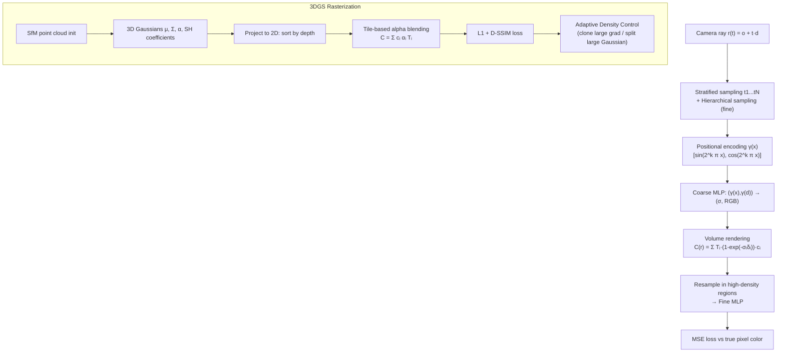

# ✨ NeRF and 3D Gaussian Splatting

> [!abstract] TL;DR
> Novel view synthesis: given a set of posed input images, render the scene from an arbitrary new camera. NeRF (Mildenhall 2020) encodes the scene as a continuous MLP mapping (x,y,z,θ,φ) → (RGB, density), then uses volume rendering to generate pixels. 3DGS (Kerbl 2023) represents the scene as explicit 3D Gaussians and rasterizes them in real time — achieving comparable quality at 100+ FPS vs NeRF's 30+ seconds per image.

---

## Intuition — analogy FIRST

**NeRF** is like compressing a 3D scene into the weights of a neural network. You shoot rays through every pixel of every training image, sample points along each ray, ask the network "what color and density is there?", and composite the answers like light traveling through smoke. Training minimizes the difference between rendered and true pixel colors — the MLP learns to memorize the scene.

**3DGS** is like describing the scene as a cloud of semi-transparent colored blobs (Gaussians). Each blob has a position, a shape (ellipsoid), an opacity, and a color that changes with viewing angle. Rendering is just sorting the blobs by depth and alpha-blending them onto the screen — graphics-pipeline style, no neural network at inference time.

---

## How It Works



---

## Key Concepts / Details

### NeRF Core (Mildenhall et al., ECCV 2020)
- **Scene function**: `F_θ: (x, d) → (c, σ)` where x=(x,y,z) ∈ ℝ³, d=(θ,φ) view direction, c=RGB color, σ=volume density
- **Volume rendering** (continuous): `C(r) = ∫[tn,tf] T(t) · σ(r(t)) · c(r(t),d) dt` where `T(t) = exp(-∫[tn,t] σ(r(s)) ds)` is accumulated transmittance
- **Discrete approximation**: `C(r) ≈ Σᵢ Tᵢ · (1 - exp(-σᵢ δᵢ)) · cᵢ` where δᵢ = tᵢ₊₁ - tᵢ; Tᵢ = exp(-Σⱼ<ᵢ σⱼδⱼ)
- **Positional encoding**: `γ(p) = [sin(2⁰πp), cos(2⁰πp), ..., sin(2^{L-1}πp), cos(2^{L-1}πp)]`; L=10 for position, L=4 for direction — critical for high-frequency detail (spectral bias of MLPs)
- **Architecture**: coarse MLP (8 layers, 256 hidden, skip at layer 5) + fine MLP (same); view direction injected at last layer (only affects color, not density)
- **Hierarchical sampling**: use coarse network's density estimate to focus fine network samples in high-density regions (importance sampling)
- **Training**: ~100 images × ~1500 rays/image × 64+128 samples/ray → MSE loss; ~1-2 days on a V100

### NeRF Variants
| Method | Key Improvement | Training Time | Notes |
|---|---|---|---|
| NeRF (2020) | Original | ~1-2 days | Slow, static scene only |
| Instant-NGP (2022) | Hash grid encoding replaces PE+MLP → tiny MLP | ~5 min | Multi-res hash, GPU CUDA custom |
| Mip-NeRF (2021) | Cone casting + integrated PE → anti-aliasing | ~1.5 days | Handles scale variation |
| Mip-NeRF 360 (2022) | Unbounded scene (contracted space) | ~2 days | Outdoor/indoor 360° |
| NeRF-W (2021) | Per-image appearance embeddings (latent code) | ~3 days | In-the-wild (tourists) |
| TensoRF (2022) | Tensor decomposition for scene representation | ~20 min | Explicit + MLP |

### 3D Gaussian Splatting (Kerbl et al., SIGGRAPH 2023)
- **Primitives**: each Gaussian G has: position μ ∈ ℝ³, covariance Σ = RSS^T R^T (rotation R, scale S), opacity α ∈ (0,1), color as Spherical Harmonics (SH) coefficients (degree 3 → 48 values per Gaussian for view-dependent color)
- **2D projection**: 3D Gaussian projects to 2D Gaussian; `Σ' = J W Σ W^T J^T` (Zwicker 2001)
- **Tile-based rasterization**: divide image into 16×16 tiles; sort Gaussians by depth (radix sort on GPU); front-to-back alpha blending per tile: `C = Σᵢ cᵢ αᵢ' Πⱼ<ᵢ (1 - αⱼ')`
- **Training**: initialize from COLMAP SfM sparse point cloud; loss = λ·L1 + (1-λ)·L_DSSIM; ~30 min on single GPU
- **Adaptive Density Control (ADC)**: 
  - *Clone*: small Gaussians with large positional gradient → duplicate and move apart (under-reconstruction)
  - *Split*: large Gaussians with large gradient → replace with two smaller (over-reconstruction)
  - *Prune*: Gaussians with α < ε removed periodically
- **Rendering**: no MLP at inference; pure rasterization → 30-150 FPS depending on scene complexity and resolution

### Comparison

| Method | Representation | Train Time | Render Speed | Quality | Editability |
|---|---|---|---|---|---|
| NeRF | Implicit MLP | ~1-2 days | ~30 s/img | High | Hard |
| Instant-NGP | Hash grid + tiny MLP | ~5 min | ~0.1 s/img | High | Moderate |
| 3DGS | Explicit Gaussians | ~30 min | Real-time (100+ FPS) | High | Moderate |
| Mip-NeRF 360 | Implicit MLP | ~2 days | ~30 s/img | Very High | Hard |

---

## Real-World Notes

- **nerfstudio** is the go-to framework; supports NeRF, Instant-NGP, 3DGS, and Nerfacto (best practical NeRF)
- **gsplat** is a clean open-source 3DGS implementation with Python bindings

```python
# --- nerfstudio inference (Nerfacto) ---
# After training: ns-train nerfacto --data ./my_scene
# Render video:
# ns-render camera-path --load-config outputs/.../config.yml \
#     --camera-path-filename camera_path.json --output-path render.mp4

# --- gsplat: load and render a 3DGS model ---
import torch
from gsplat import rasterization

# Gaussians: means (N,3), quats (N,4), scales (N,3), opacities (N,), colors (N,3)
# camera: viewmat (4,4), K (3,3), (W, H)
renders, alphas, info = rasterization(
    means=means,          # (N, 3)
    quats=quats,          # (N, 4) normalized quaternions
    scales=scales,        # (N, 3)
    opacities=opacities,  # (N,)
    colors=colors,        # (N, 3) or (N, K, 3) for SH
    viewmats=viewmat[None],  # (1, 4, 4)
    Ks=K[None],           # (1, 3, 3)
    width=W, height=H,
)
# renders: (1, H, W, 3) RGB image
```

---

## Common Pitfalls

- **No positional encoding → blurry NeRF**: MLPs have spectral bias toward low frequencies; PE injects high-frequency components explicitly
- **NeRF requires accurate camera poses**: use COLMAP first; camera pose errors directly corrupt the scene function
- **3DGS initialization matters**: random init gives poor results; SfM point cloud init is standard
- **3DGS floaters**: spurious Gaussians in thin air; tuning ADC thresholds and opacity reset helps
- **NeRF on unbounded scenes**: standard NeRF fails; use Mip-NeRF 360 with contracted space or NDC for forward-facing
- **SH degree tradeoff**: degree 0 (constant color) trains faster but misses view-dependent effects (specularities)
- **Memory**: 3DGS models can be 300MB-1GB for typical scenes; NeRF weights are ~5MB but need to re-render

---

## Related Concepts

- [[Scene_Understanding_3D]] — NeuS uses NeRF-like training for neural implicit surface reconstruction
- [[Point_Cloud_Processing]] — 3DGS initialized from SfM point cloud; can export to point cloud
- [[Visual_SLAM]] — NeRF/3DGS maps used in neural SLAM (NICE-SLAM, iMAP, Gaussian SLAM)

---

## Review Questions

1. Write out the discrete volume rendering equation and explain the role of the transmittance term T_i. What happens to a pixel where all σ values are zero?
2. Why is positional encoding necessary for NeRF? What phenomenon does it overcome, and what is the relationship between L (encoding levels) and the maximum representable frequency?
3. In 3DGS, what is Adaptive Density Control and why are both clone and split operations needed (as opposed to just one)?
4. A NeRF trained on a small room scene is queried at a point outside the training volume. What does it output and why? How does Mip-NeRF 360 address the unbounded scene problem?
5. Compare NeRF and 3DGS for a robotics scene editing use case (e.g., move an object). Which is more suitable and why?

---

## Sources

- Mildenhall et al., "NeRF: Representing Scenes as Neural Radiance Fields for View Synthesis," ECCV 2020
- Kerbl et al., "3D Gaussian Splatting for Real-Time Radiance Field Rendering," SIGGRAPH 2023
- Müller et al., "Instant Neural Graphics Primitives," SIGGRAPH 2022
- Barron et al., "Mip-NeRF 360," CVPR 2022
- [nerfstudio documentation](https://docs.nerf.studio/)
- [gsplat GitHub](https://github.com/nerfstudio-project/gsplat)

---

#computer-vision #3d-vision #nerf #gaussian-splatting #novel-view-synthesis #volume-rendering
