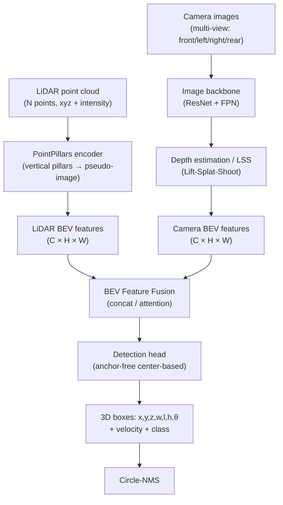

# 🚗 3D Object Detection

> [!abstract] TL;DR
> 3D object detection is the backbone of autonomous driving perception: given LiDAR point clouds and/or camera images, predict 7-DoF 3D bounding boxes (x, y, z, w, l, h, θ) for all objects. Modern methods operate in Bird's Eye View (BEV) space for LiDAR, or transform camera features to BEV via depth estimation, then fuse both modalities for best accuracy.

---

## Intuition — analogy FIRST

Think of a self-driving car trying to spot pedestrians and vehicles. A LiDAR sensor fires millions of laser pulses and gets back an exact 3D point cloud — like an architectural survey of the scene. But the data is a messy unordered set. Rather than process the 3D cloud directly, the clever trick is to "squash" it down into a 2D bird's-eye-view image (like looking straight down from above), then run a standard 2D detector on that. Cameras complement this by providing rich texture and color that LiDAR misses (especially far away). BEV fusion merges both.

---

## How It Works



---

## Key Concepts / Details

### Output Representation
- **3D bounding box**: (cx, cy, cz, w, l, h, θ) — center, dimensions, yaw angle (rotation about Z-axis)
- **Velocity**: (vx, vy) for moving objects (cars, pedestrians) — needed for prediction/planning
- **Class**: car, pedestrian, cyclist, truck, bus, ...
- **BEV box**: often parameterized as (cx, cy, w, l, sin θ, cos θ) to avoid angle discontinuity

### LiDAR-Based Methods

**PointPillars (Lang et al., CVPR 2019)**
- Quantize point cloud into vertical pillars (infinite-height columns on BEV grid)
- Per-pillar: run PointNet-lite (linear + BN + ReLU + max pool) over points → 64-dim pillar feature
- Scatter pillar features back to 2D BEV pseudo-image → standard 2D backbone (VGG-like) + FPN + SSD-style head
- Real-time: ~16ms on GPU; widely used in industry
- Weakness: loses precise height information (everything flattened)

**VoxelNet (Zhou & Tuzel, CVPR 2018)**
- 3D voxelization + Voxel Feature Encoding (VFE: small PointNet per voxel) → 3D sparse conv backbone → reshape to BEV → RPN
- More accurate than PointPillars but slower; precursor to Second (sparse conv) and CenterPoint

**CenterPoint (Yin et al., CVPR 2021)**
- Object center as keypoint (similar to CenterNet in 2D)
- Stage 1: PointPillars or VoxelNet encoder → center heatmap head (one heatmap per class) + regression head (size, height, orientation, velocity)
- Stage 2: point-based refinement using features around detected centers
- **Circle-NMS**: use radius-based suppression in BEV instead of IoU-NMS (handles rotated boxes efficiently)
- State-of-the-art on nuScenes; adopted widely in industry

### Camera-Based 3D Detection

**FCOS3D (Wang et al., ICCVW 2021)**: monocular 3D detection; extend FCOS with 3D regression branch (depth, 3D center offset, dimensions, orientation); depth predicted per object center; simple but depth estimation is inherently ambiguous

**BEVDet / BEVDepth**
- **LSS** (Lift-Splat-Shoot, Philion 2020): predict depth distribution per pixel → "lift" 2D pixel into 3D frustum; splat (scatter) into BEV voxel grid; shoot = query BEV features
- **BEVDet**: multi-camera images → image backbone → LSS BEV transform → BEV backbone → 3D detection head
- **BEVDepth**: adds LiDAR-supervised depth for more accurate lifting; significant accuracy boost

**PETR / PETRv2**: position-embedding-based transformer for 3D detection without explicit BEV transformation; encode 3D position into image features; efficient but slightly less accurate than BEVDepth

**DETR3D**: multi-camera 3D DETR; object queries iteratively sample features from multi-view images using projected 3D reference points; no explicit BEV but implicit 3D reasoning

### LiDAR-Camera Fusion

**BEVFusion (Chen et al., NeurIPS 2022)**
- Separate encoders for LiDAR (PointPillars/VoxelNet) and camera (image backbone + LSS)
- Both produce BEV feature maps at the same resolution
- Fusion: channel-wise concatenation → conv → unified BEV backbone → detection head
- Achieves significant gains over LiDAR-only; camera adds texture/color for far-away objects and small pedestrians

**Sensor Calibration**
- **Intrinsics**: K matrix (focal length, principal point) for each camera — from checkerboard calibration
- **Extrinsics**: R,t between each camera and LiDAR — from joint calibration (e.g., targetless CalibNet or manual reflective target)
- Calibration errors directly corrupt BEV projection; ~1cm translation error is tolerable, >0.5° rotation degrades fusion significantly

### Temporal Fusion
- Object detection on a single frame misses occluded objects and is noisy
- **BEVDet4D / BEVFusion-T**: warp previous BEV features to current frame using ego-motion transform; concatenate temporal features
- **StreamPETR**: propagate object-level features across frames via memory; captures long-range temporal context

### Evaluation Metrics

| Dataset | Primary Metric | Notes |
|---|---|---|
| nuScenes | NDS (nuScenes Detection Score = 0.5·mAP + 0.5·mTP) | 10-class, 360° coverage |
| KITTI | 3D mAP (IoU=0.7 for car) | 3-difficulty levels (easy/moderate/hard) |
| Waymo OD | mAPH (heading-weighted) | 2-level difficulty, LET-3D-APH |
| Argoverse 2 | CDS (Composite Detection Score) | 30 classes |

### Methods Comparison

| Method | Input | Speed | nuScenes NDS | Key Idea |
|---|---|---|---|---|
| PointPillars | LiDAR | ~16ms | ~59 | Pillar pseudo-image |
| CenterPoint | LiDAR | ~65ms | ~66 | Center keypoint + 2-stage |
| BEVDepth | Camera | ~130ms | ~60 | LSS + depth supervision |
| BEVFusion | LiDAR+Camera | ~70ms | ~72 | BEV feature fusion |

---

## Real-World Notes

```python
# mmdetection3d: run CenterPoint on a LiDAR scan
from mmdet3d.apis import init_model, inference_detector
import numpy as np

model = init_model(
    "configs/centerpoint/centerpoint_pillar02_second_secfpn_8xb4-cyclic-20e_nus-3d.py",
    "centerpoint_epoch20.pth",
    device="cuda:0",
)

# Load point cloud: (N, 4) array [x, y, z, intensity]
points = np.fromfile("scene.bin", dtype=np.float32).reshape(-1, 4)
result, _ = inference_detector(model, points)

# result contains: boxes_3d (N,7), scores_3d (N,), labels_3d (N,)
boxes = result[0]["boxes_3d"].tensor.numpy()  # (N, 7)
print(f"Detected {len(boxes)} objects")

# Visualize with open3d
import open3d as o3d
pcd = o3d.geometry.PointCloud()
pcd.points = o3d.utility.Vector3dVector(points[:, :3])
o3d.visualization.draw_geometries([pcd])
```

---

## Common Pitfalls

- **Pillar height loss**: PointPillars struggles to distinguish a bus from a tall wall — both look wide in BEV; add height statistics as extra pillar features
- **Angle regression**: directly predicting θ has a discontinuity at ±π; use sin(θ), cos(θ) or a bin+offset strategy
- **NMS with rotation**: standard IoU-NMS is slow for rotated boxes; use Circle-NMS (distance-based) for real-time
- **Camera-LiDAR temporal offset**: cameras and LiDAR may not be synchronized; compensate with ego-motion interpolation
- **Class imbalance**: pedestrians and cyclists are rare and small; upsample or use focal loss per class
- **Rain/fog**: LiDAR returns ghost points from water droplets; camera-LiDAR fusion provides complementary robustness

---

## Related Concepts

- [[Point_Cloud_Processing]] — PointPillars, VoxelNet use PointNet-style encoders per voxel/pillar
- [[Scene_Understanding_3D]] — 3D segmentation is the per-point classification companion to detection
- [[Visual_SLAM]] — 3D detection + tracking across frames provides object-level map landmarks

---

## Review Questions

1. Why does PointPillars process the point cloud as vertical pillars rather than full 3D voxels? What information is lost and how does this affect detection of tall thin objects (poles, pedestrians)?
2. Describe CenterPoint's two-stage detection: what does each stage contribute, and why is circle-NMS used instead of standard IoU-NMS?
3. Explain the Lift-Splat-Shoot process in BEVDet. What is the key ambiguity in the "lift" step, and how does BEVDepth address it?
4. BEVFusion outperforms LiDAR-only CenterPoint. Under what adverse conditions (sensor failure, weather) would LiDAR-only still be preferred in a safety-critical system?
5. nuScenes NDS penalizes velocity and attribute errors, not just localization. Why is this a better metric for autonomous driving than pure 3D IoU mAP?

---

## Sources

- Lang et al., "PointPillars: Fast Encoders for Object Detection from Point Clouds," CVPR 2019
- Yin et al., "Center-based 3D Object Detection and Tracking," CVPR 2021
- Huang et al., "BEVDet: High-Performance Multi-Camera 3D Object Detection in Bird-Eye-View," arXiv 2021
- Li et al., "BEVDepth: Acquisition of Reliable Depth for Multi-View 3D Object Detection," AAAI 2023
- Chen et al., "BEVFusion: Multi-Task Multi-Sensor Fusion with Unified Bird's-Eye View Representation," NeurIPS 2022
- [mmdetection3d documentation](https://mmdetection3d.readthedocs.io/)

---

#computer-vision #3d-vision #object-detection #autonomous-driving #lidar #bev-fusion #pointpillars
