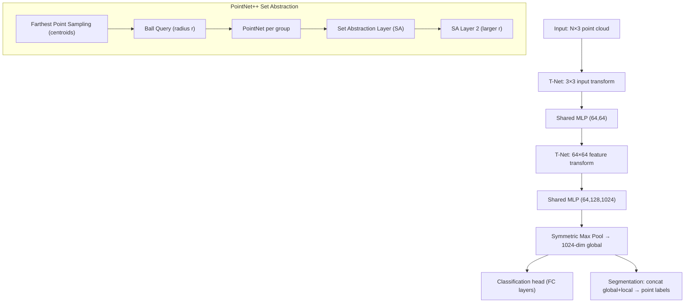

# 🔵 Point Cloud Processing

> [!abstract] TL;DR
> A point cloud is an unordered set of (x,y,z) points — raw LiDAR output, RGBD scans, or SfM reconstructions. The key challenge is that standard CNNs require regular grids; PointNet solves this via per-point MLPs + symmetric max pooling for permutation invariance. PointNet++ adds hierarchical local grouping to capture multi-scale geometry.

---

## Intuition — analogy FIRST

Think of a point cloud like a bag of marbles scattered in 3D space. You can't apply a regular convolution because the marbles have no fixed order or grid structure. PointNet treats each marble independently (same MLP shared across all), then squashes all their votes into one summary via max-pooling — no matter how you shuffle the bag, the winner of each channel stays the same. PointNet++ goes further: first cluster nearby marbles into neighborhoods, summarize each cluster, cluster those summaries, and so on — like zooming out progressively.

---

## How It Works



---

## Key Concepts / Details

### Point Cloud Properties
- **Unordered**: N! possible orderings for N points — algorithm must be permutation invariant
- **Irregular**: non-uniform spatial density (LiDAR is denser near sensor)
- **Sparse**: most of 3D space is empty
- **Applications**: autonomous driving (Velodyne LiDAR), robotics manipulation, 3D reconstruction, medical (CT scans)

### PointNet (Qi et al., CVPR 2017)
- **Core insight**: a function on sets is symmetric if `f({x1,...,xN}) = g(MAX(h(x1),...,h(xN)))`
- **Shared MLP `h`**: same weights applied to each point independently → (N, 3) → (N, 1024)
- **Max pool `g`**: element-wise max over all N points → (1024,) global descriptor (permutation invariant)
- **T-Net**: mini-PointNet that predicts a transformation matrix; applied to input (3×3) and features (64×64) for input/feature alignment (orthogonality regularization on 64×64 T to keep transform close to rotation)
- **Classification**: global descriptor → 3× FC → K classes
- **Segmentation**: concatenate per-point features + global descriptor → FC → per-point labels

### PointNet++  (Qi et al., NeurIPS 2017)
- **Farthest Point Sampling (FPS)**: greedily select M centroids that maximize minimum distance → better spatial coverage than random
- **Ball Query**: for each centroid, gather all points within radius r (capped at K points) — locality-aware unlike kNN in metric space
- **Set Abstraction (SA) layer**: FPS + Ball Query + PointNet per group → (N, C) → (M, C')
- **MSG** (Multi-Scale Grouping): apply multiple radii [r1, r2, r3] per centroid, concatenate features — handles density variation
- **MRG** (Multi-Resolution Grouping): combine features from two scales of abstraction
- **Feature Propagation (FP)**: upsample via k-NN interpolation + skip connections for segmentation tasks

### 3D CNNs
- **VoxelNet** (Zhou 2018): divide space into voxels → VFE (Voxel Feature Encoding, small PointNet per voxel) → 3D sparse conv → RPN; end-to-end LiDAR detection
- **Sparse 3D CNNs**: only compute on occupied voxels; implementations: MinkowskiEngine, spconv (used in CenterPoint); complexity O(K) where K = occupied voxels ≪ N³
- **Memory**: dense 3D conv on 512³ grid = 128M cells — impractical; sparse conv reduces by 10-100×

### KPConv (Thomas et al., ICCV 2019)
- **Kernel Points**: place K learnable kernel points in unit ball; each point carries a weight matrix
- **Correlation**: for each input point, weight its neighbors by distance to kernel points (radial basis function) → continuous convolution
- **Rigid vs Deformable**: rigid = fixed kernel geometry; deformable = kernel points predicted per location
- **Advantage**: handles arbitrary density, no quantization error from voxelization

### Point Transformer (Zhao et al., ICCV 2021)
- Self-attention on local k-NN neighborhoods
- Position encoding added to keys and values
- Subtraction-based attention: `a(xi,xj) = softmax(φ(xi-xj) + δ)` where δ is positional encoding
- Strong on ScanNet scene segmentation; Point Transformer V2/V3 improve scalability

### Evaluation Benchmarks

| Dataset | Task | Metric |
|---|---|---|
| ModelNet40 | Classification | Overall Accuracy |
| ShapeNet Parts | Part Segmentation | mIoU per part |
| S3DIS | Scene Segmentation | mIoU |
| ScanNet | 3D Instance Seg | mAP@0.5 |

---

## Real-World Notes

- **LiDAR data**: typically 16–128 beam sensors → 20k–200k points per sweep at 10 Hz
- **Open3D**: standard library for point cloud I/O, visualization, ICP registration, normals
- **Inference example (PointNet classification)**:

```python
import open3d as o3d
import torch

# Load and preprocess
pcd = o3d.io.read_point_cloud("object.ply")
pts = torch.tensor(pcd.points, dtype=torch.float32)  # (N, 3)

# Normalize to unit sphere
pts -= pts.mean(0)
pts /= pts.norm(dim=1).max()

# Run PointNet (e.g., from pytorch3d or custom)
pts = pts[:1024].unsqueeze(0)  # (1, 1024, 3) — fixed N for batching
model = PointNet(num_classes=40)
model.load_state_dict(torch.load("pointnet_modelnet40.pth"))
model.eval()
with torch.no_grad():
    logits, _, _ = model(pts)  # returns (logits, trans_feat, trans_input)
    pred = logits.argmax(dim=1)
print("Predicted class:", pred.item())
```

---

## Common Pitfalls

- **Fixed N assumption**: batching requires same N per sample; use random sampling or padding
- **Unit sphere normalization**: critical — PointNet has no scale invariance built in
- **T-Net regularization**: omitting the orthogonality loss on 64×64 T causes instability
- **Ball query vs kNN**: ball query gives consistent neighborhoods across densities; kNN neighborhoods vary in size
- **Dense 3D conv OOM**: always use sparse convolutions for large scenes; dense is only viable for small voxel grids (e.g., 32³)
- **S3DIS area overlap**: train/test split matters; Area 5 as test is the standard protocol

---

## Related Concepts

- [[Object_Detection_3D]] — PointPillars and VoxelNet build on point cloud encoders
- [[Scene_Understanding_3D]] — RandLA-Net, MinkowskiNet for large-scale segmentation
- [[NeRF_and_3DGS]] — point clouds often initialize 3DGS training (SfM initialization)
- [[Visual_SLAM]] — SLAM builds sparse point cloud maps as landmarks

---

## Review Questions

1. Why is max pooling the key operation that makes PointNet permutation invariant? What property does it satisfy?
2. What problem does PointNet++ solve that vanilla PointNet struggles with? How does MSG address non-uniform density?
3. Compare KPConv to voxel-based sparse conv — what are the tradeoffs in terms of quantization error and computational efficiency?
4. A PointNet++ model is trained on ModelNet40 (indoor objects at ~1m scale) but deployed on outdoor LiDAR (objects at 50m). What goes wrong and how would you fix it?
5. Explain T-Net: what does it predict, why is it needed, and what regularization keeps it well-behaved?

---

## Sources

- Qi et al., "PointNet: Deep Learning on Point Sets for 3D Classification and Segmentation," CVPR 2017
- Qi et al., "PointNet++: Deep Hierarchical Feature Learning on Point Sets," NeurIPS 2017
- Thomas et al., "KPConv: Flexible and Deformable Convolution for Point Clouds," ICCV 2019
- Zhao et al., "Point Transformer," ICCV 2021
- [Open3D documentation](http://www.open3d.org/docs/release/)

---

#computer-vision #3d-vision #point-cloud #pointnet #deep-learning
