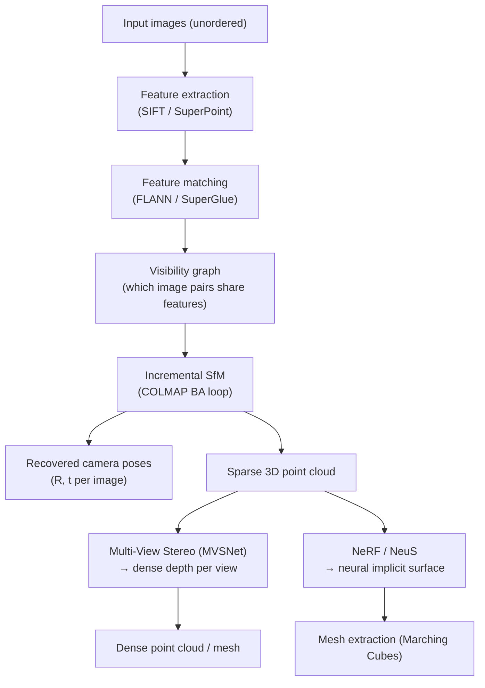

# 🏙️ 3D Scene Understanding

> [!abstract] TL;DR
> 3D scene understanding encompasses everything beyond detection: per-point semantic/instance/panoptic labeling, geometric reconstruction from images (SfM, MVS, NeuS), 6-DoF object pose estimation for robotic manipulation, and scene graph generation for semantic reasoning. These tasks collectively turn raw sensor data into structured representations that robots and AR systems can reason over.

---

## Intuition — analogy FIRST

If 3D detection answers "where is the car?", scene understanding answers "what is everything, exactly what shape is it, where precisely is it oriented, and how does it relate to the table next to it?" It's the difference between a security guard saying "there's a person by the door" versus an architect providing a complete annotated floor plan with furniture relationships. SfM is like photogrammetry — reconstructing 3D from tourist photos. Pose estimation is like teaching a robot hand to precisely grip a mug it has never physically handled.

---

## How It Works



---

## Key Concepts / Details

### 3D Semantic Segmentation
Assign a class label to every 3D point in a LiDAR scan or RGBD point cloud.

- **RandLA-Net** (Hu et al., CVPR 2020): random sampling + local feature aggregation (attentive pooling); handles 1M+ points efficiently; strong on SemanticKITTI outdoor LiDAR
- **MinkowskiNet** (Choy et al., CVPR 2019): sparse 3D CNNs via MinkowskiEngine; generalizes 2D U-Net to 3D; excellent on ScanNet indoor RGB-D
- **Cylinder3D**: cylindrical voxelization + asymmetric 3D convolution; handles LiDAR's non-uniform radial density
- **2D→3D projection**: project 2D semantic predictions onto 3D using depth; fast but boundary artifacts

### 3D Instance Segmentation
Assign both a class and a unique instance ID to each point — harder than semantic.

- **PointGroup** (Jiang et al., CVPR 2020): predict semantic labels + point-to-center offsets → cluster shifted points by DBSCAN → per-cluster ScoreNet refinement
- **Mask3D** (Schult et al., AAAI 2023): transformer-based; object queries attend to 3D point cloud features; direct set prediction (no clustering); state-of-the-art on ScanNet200
- **3D Panoptic Segmentation**: semantic (stuff) + instance (things) jointly; EfficientLPS, Panoptic-PolarNet

### SfM — Structure from Motion (COLMAP)

COLMAP (Schönberger & Frahm, CVPR 2016) is the standard offline SfM pipeline:

1. **Feature extraction**: SIFT keypoints + descriptors per image (GPU-accelerated)
2. **Feature matching**: exhaustive or vocabulary-tree-guided retrieval; FLANN approximate NN
3. **Geometric verification**: estimate fundamental matrix via RANSAC; filter outlier matches; build visibility graph
4. **Incremental reconstruction**: seed from well-matched pair; register new images via PnP; triangulate new 3D points; bundle adjustment after each registration
5. **Bundle Adjustment**: minimize `Σᵢⱼ ||uᵢⱼ - π(Rᵢ, tᵢ, Xⱼ)||²` over all camera poses {Rᵢ,tᵢ} and 3D points {Xⱼ}; Ceres solver
6. **Output**: camera poses + sparse point cloud (.ply); optionally feed to MVSNet for dense reconstruction

### Multi-View Stereo (MVS)
After SfM gives camera poses, MVS computes dense depth.

- **MVSNet** (Yao et al., ECCV 2018): warp image features into 3D cost volume using differentiable homography; 3D CNN regularization; regress depth via soft argmin
- **CasMVSNet**: coarse-to-fine cascade to reduce memory; compute low-res depth then refine
- **TransMVSNet**: transformer for long-range feature matching across views
- **Classic MVS**: PatchMatch-based (COLMAP dense, OpenMVS)

### Neural 3D Reconstruction
- **NeuS** (Wang et al., NeurIPS 2021): replace NeRF's density σ with a signed distance function (SDF); derive unbiased volume rendering from SDF via logistic CDF; produces watertight meshes via Marching Cubes; superior surface quality vs NeRF
- **Geo-NeRF**: depth supervision from sparse MVS into NeRF training; improves geometry in few-shot settings
- **Instant-NeuS**: Instant-NGP hash encoding + NeuS SDF; much faster training (~15 min)

### Object Pose Estimation
6-DoF pose = rotation R ∈ SO(3) + translation t ∈ ℝ³ of a known 3D CAD model in the camera frame.

- **PoseCNN** (Xiang et al., RSS 2018): predict object center projection, depth, and quaternion; ICP refinement; early deep learning baseline
- **DenseFusion** (Wang et al., CVPR 2019): RGBD input; per-pixel feature fusion; iterative refinement with point-wise feature comparison; strong on YCB-Video benchmark
- **FoundPose** (2024): foundation model features (DINOv2) + render-and-compare; zero-shot pose estimation for novel objects without retraining
- **GDR-Net**: geometry-guided direct regression; decoupled rotation parameterization
- **6DoF for manipulation**: requires ~cm accuracy; tight integration with robot kinematics; uncertainty estimation critical for grasp planning

### Human & Hand Pose
- **MediaPipe Hands**: 21-keypoint 3D hand pose in real-time on mobile; two-stage (palm detection + landmark)
- **FreiHand**: benchmark for hand pose estimation in the wild
- **SMPLify-X** (Pavlakos 2019): fit parametric SMPL-X body model (body + hands + face, 10k vertices) to 2D keypoints; whole-body 3D mesh from single image
- **PointHMR**: point cloud → human mesh recovery; avoids image-only ambiguity

### Scene Graph Generation
- **3D Scene Graph**: nodes = objects (detected + segmented), edges = pairwise relationships (spatial: "on top of", "next to"; semantic: "contains", "attached to"; functional: "supports")
- **3DSSG** (Wu et al., CVPR 2021): learns relationship predictions on ScanNet; used for natural language grounding ("the red mug on the desk")
- **Applications**: robot task planning ("pick up the cup on the table"), VQA, simulation
- **3D-VSG** (Visual Scene Graphs): joint 3D detection + relationship; transformer-based

### ScanNet Benchmark (3D Segmentation)

| Method | ScanNet Val mIoU (Sem.) | ScanNet Val mAP50 (Inst.) |
|---|---|---|
| MinkowskiNet (42) | 73.6 | — |
| PointGroup | — | 56.9 |
| Mask3D | — | 74.4 |
| Oneformer3D (2023) | 78.8 | 78.3 |

---

## Real-World Notes

```python
# COLMAP SfM pipeline (Python via subprocess / pycolmap)
import subprocess
import os

images_dir = "/data/scene/images"
output_dir = "/data/scene/colmap_output"
os.makedirs(output_dir, exist_ok=True)

# 1. Feature extraction
subprocess.run([
    "colmap", "feature_extractor",
    "--database_path", f"{output_dir}/database.db",
    "--image_path", images_dir,
    "--ImageReader.single_camera", "1",
    "--SiftExtraction.use_gpu", "1",
], check=True)

# 2. Feature matching (exhaustive for small scenes)
subprocess.run([
    "colmap", "exhaustive_matcher",
    "--database_path", f"{output_dir}/database.db",
    "--SiftMatching.use_gpu", "1",
], check=True)

# 3. Incremental reconstruction
sparse_dir = f"{output_dir}/sparse"
os.makedirs(sparse_dir, exist_ok=True)
subprocess.run([
    "colmap", "mapper",
    "--database_path", f"{output_dir}/database.db",
    "--image_path", images_dir,
    "--output_path", sparse_dir,
], check=True)

# 4. Visualize with open3d
import open3d as o3d
# Export COLMAP to .ply first: colmap model_converter --output_type PLY
pcd = o3d.io.read_point_cloud(f"{sparse_dir}/0/points3D.ply")
o3d.visualization.draw_geometries([pcd])
```

---

## Common Pitfalls

- **COLMAP with few images**: needs at least 3-5 overlapping views per region; fewer views cause incomplete reconstruction
- **Textureless surfaces**: SIFT/COLMAP fail on white walls, glass — use depth sensors or NeRF/NeuS instead
- **NeuS vs NeRF surface**: NeRF zero-crossing of density is not a true surface; NeuS SDF gives clean meshes — use NeuS if you need geometry, NeRF if you only need appearance
- **Pose estimation unit mismatch**: CAD models often in mm, RGBD depth in meters — align units before ICP or DenseFusion
- **Scene graph completeness**: detecting all relationships requires seeing the full scene; partial occlusion causes missed edges
- **ScanNet train/val split**: use official split (scenes 0-700 train, 700-800 val) for fair comparison

---

## Related Concepts

- [[Point_Cloud_Processing]] — RandLA-Net and MinkowskiNet build on point cloud architectures
- [[Object_Detection_3D]] — detection + segmentation are complementary perception tasks
- [[NeRF_and_3DGS]] — NeuS uses NeRF-like training; 3DGS initialized from COLMAP SfM
- [[Visual_SLAM]] — SfM is offline SLAM; online SLAM enables real-time reconstruction

---

## Review Questions

1. Describe the incremental SfM pipeline in COLMAP. Why is incremental preferred over global SfM, and what is the role of bundle adjustment at each registration step?
2. How does NeuS differ from NeRF in representing geometry? Write the key formula change and explain why it yields better surfaces.
3. 6-DoF pose estimation requires both R and t. Why is rotation harder to regress than translation, and what parameterizations (quaternion, 6D rotation, Euler) are preferred and why?
4. PointGroup uses point-to-center offsets for instance segmentation clustering. What failure mode occurs when two objects of the same class are very close together, and how does Mask3D's query-based approach avoid it?
5. A scene graph system must reason about a cluttered shelf with 20 objects. What are the computational challenges in predicting pairwise relationships and how would you scale it?

---

## Sources

- Schönberger & Frahm, "Structure-from-Motion Revisited," CVPR 2016 (COLMAP)
- Wang et al., "NeuS: Learning Neural Implicit Surfaces by Volume Rendering for Multi-view Reconstruction," NeurIPS 2021
- Hu et al., "RandLA-Net: Efficient Semantic Segmentation of Large-Scale Point Clouds," CVPR 2020
- Schult et al., "Mask3D: Mask Transformer for 3D Semantic Instance Segmentation," AAAI 2023
- Wang et al., "DenseFusion: 6D Object Pose Estimation by Iterative Dense Fusion," CVPR 2019
- Yao et al., "MVSNet: Depth Inference for Unstructured Multi-view Stereo," ECCV 2018
- [COLMAP documentation](https://colmap.github.io/)

---

#computer-vision #3d-vision #scene-understanding #sfm #colmap #pose-estimation #3d-segmentation #scene-graphs
