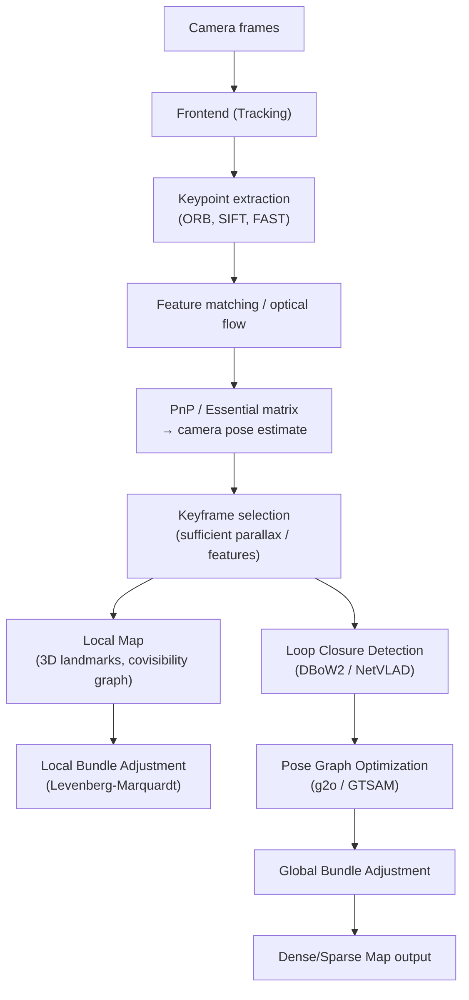

# 🗺️ Visual SLAM

> [!abstract] TL;DR
> SLAM (Simultaneous Localization and Mapping) solves the chicken-and-egg problem: you need a map to localize, but you need a pose to build a map. Visual SLAM uses a camera (monocular, stereo, or RGBD) as the primary sensor. The frontend tracks frame-to-frame motion; the backend optimizes the global map via bundle adjustment and detects loop closures to prevent drift.

---

## Intuition — analogy FIRST

Imagine exploring an unknown building blindfolded, only using touch to feel landmarks on the walls. You track how far you've walked (odometry), mark distinctive bumps (keypoints), and when you recognize a bump you've felt before, you realize you've looped back and correct your accumulated error (loop closure). Visual SLAM does the same with camera images: detect and track visual landmarks, estimate motion between frames, and periodically recognize previously-seen places to anchor the growing map.

---

## How It Works



---

## Key Concepts / Details

### SLAM Components
- **Frontend (tracking)**: processes each frame in real time; estimates relative camera motion; maintains local map of 3D points; fails gracefully with relocalization
- **Backend (mapping)**: non-linear optimization over all keyframes and 3D points; loop closure; typically runs in a separate thread

### Feature-Based SLAM: ORB-SLAM3 (Campos et al., T-RO 2021)
- **ORB features**: fast binary descriptor (rotation + scale invariant); 1000 features/frame at ~20ms
- **Frame-to-frame tracking**: match ORB descriptors between consecutive frames; RANSAC + PnP (Perspective-n-Point) for pose; Huber robust cost
- **Frame-to-map tracking**: project local map points into current frame; minimize reprojection error
- **Keyframe selection**: triggered by (a) large number of lost tracks, (b) enough parallax, (c) few map point matches — avoids redundant keyframes
- **Map points**: triangulated from keyframe matches; each stores descriptor, viewing direction, scale range
- **Covisibility graph**: keyframes sharing ≥15 map points are connected; used for local BA subgraph
- **Bundle Adjustment (BA)**: minimize `Σ ρ(||π(Tcw, Xj) - uij||²Ω)` over camera poses Tcw and 3D points Xj; π = projection; ρ = robust loss; Ω = information matrix
- **Loop closure**: DBoW2 bag-of-visual-words retrieval → geometric verification (EPnP) → pose graph optimization → global BA
- **Multi-map**: handles tracking loss by starting new sub-map; merges via loop detection

### Direct SLAM Methods
- **LSD-SLAM** (Engel 2014): tracks on image gradients (no keypoints); minimizes photometric error; builds semi-dense depth map; monocular scale ambiguity
- **DSO** (Engel 2018, Direct Sparse Odometry): joint geometric + photometric calibration; sparse but direct; handles rolling shutter; very accurate odometry but no loop closure
- **Direct vs Feature-based**: direct methods work in low-texture scenes but are sensitive to lighting changes; feature methods are robust to lighting but fail in texture-less areas

### RGBD SLAM
- **KinectFusion** (Newcombe 2011): depth from RGBD sensor; ICP frame-to-model alignment; TSDF (Truncated Signed Distance Function) volumetric fusion on GPU; dense real-time 3D reconstruction
- **ElasticFusion**: non-rigid deformation correction for room-scale RGBD

### Deep Learning SLAM
- **DROID-SLAM** (Teed & Deng, NeurIPS 2021): recurrent optical flow (RAFT-based) for tracking; differentiable bundle adjustment (DBA) layer using dense flow and depth estimates; robust to challenging sequences; generalizes across monocular/stereo/RGBD
- **NICE-SLAM** (Zhu 2022): neural implicit maps (multi-scale feature grids) for dense map; jointly optimizes camera poses + map; RGBD input
- **iMAP** (Sucar 2021): single MLP as the entire scene representation; updated online as camera moves; proof-of-concept NeRF-SLAM

### Stereo vs Monocular vs RGBD

| Modality | Scale | Dense | Speed | Notes |
|---|---|---|---|---|
| Monocular | Ambiguous (up to scale) | No | Fast | Scale drift accumulates |
| Stereo | Metric (from baseline) | No | Fast | Baseline limits close-range |
| RGBD | Metric | Yes | Fast | Limited range (~5m), indoor |
| LiDAR | Metric | Yes | Fast | Outdoor, long range |

### Scale Ambiguity in Monocular
- Monocular SLAM can only recover structure up to scale; absolute scale requires initialization with known object or IMU fusion
- Scale drift: small errors in scale compound along trajectory
- Fix: fuse with IMU (Visual-Inertial Odometry, e.g., ORB-SLAM3-VI)

### Loop Closure Detection
- **DBoW2**: TF-IDF vocabulary tree over ORB descriptors; query gives candidate keyframes; fast but brittle in appearance changes
- **NetVLAD**: CNN descriptor + VLAD pooling; place recognition robust to day/night/weather changes
- **Geometric verification**: check loop candidate with RANSAC homography/essential matrix before accepting

### Evaluation Metrics
- **ATE** (Absolute Trajectory Error): align estimated trajectory to ground truth via Sim(3); compute RMSE of translation — measures global accuracy
- **RPE** (Relative Pose Error): error in relative motion over fixed time intervals — measures local drift

| Benchmark | Sensor | Environment |
|---|---|---|
| TUM RGB-D | RGBD | Indoor room-scale |
| KITTI Odometry | Stereo + LiDAR | Outdoor driving |
| EuRoC MAV | Stereo + IMU | Indoor/outdoor UAV |
| TartanAir | Synthetic | Diverse environments |

---

## Real-World Notes

```python
# DROID-SLAM inference (simplified)
import torch
from droid import Droid

# Initialize with monocular config
droid = Droid(
    weights="droid.pth",
    upsample=True,
    image_size=[240, 320],
)

for t, (image, intrinsics) in enumerate(video_stream):
    # image: (3, H, W) float32, intrinsics: (4,) [fx,fy,cx,cy]
    droid.track(t, image[None], intrinsics=intrinsics[None])

# Extract final trajectory
traj = droid.terminate(stream=video_stream)
# traj: list of (4,4) SE(3) camera-to-world transforms
```

- ORB-SLAM3 has ROS wrappers; use `ros_mono` or `ros_rgbd` launch files
- For production robotics: combine ORB-SLAM3 (accuracy) + IMU (robustness to motion blur)
- 3DGS + SLAM: Gaussian-SLAM and SplaTAM use 3D Gaussians as the dense map representation

---

## Common Pitfalls

- **Initialization failure**: monocular SLAM needs sufficient parallax at startup; don't translate purely sideways or the initialization is degenerate
- **Dynamic objects**: moving people/cars violate the static world assumption; mask with semantic segmentation before feeding to SLAM
- **Lighting changes**: direct methods (DSO/LSD) break under sudden illumination changes; feature-based methods are more robust
- **Aggressive rotation**: fast rotation causes motion blur + poor feature tracking; reduce camera gain or use global shutter
- **Loop closure latency**: global BA after loop closure can pause tracking; run in separate thread with lock
- **Monocular scale in evaluation**: before computing ATE, align scale with ground truth using 7-DoF Sim(3) alignment — not just SE(3)

---

## Related Concepts

- [[NeRF_and_3DGS]] — neural SLAM uses NeRF/3DGS for dense map representation
- [[Object_Detection_3D]] — semantic SLAM adds object-level mapping
- [[Scene_Understanding_3D]] — SfM (COLMAP) is offline SLAM without the real-time constraint
- [[Point_Cloud_Processing]] — SLAM map points form a sparse 3D point cloud

---

## Review Questions

1. Explain the chicken-and-egg problem in SLAM and how ORB-SLAM3's initialization procedure resolves it for monocular cameras.
2. What is Bundle Adjustment? Write the objective function and explain each term. Why is a robust loss (Huber) used?
3. Compare DBoW2 and NetVLAD for loop closure detection: representation, robustness to appearance change, speed tradeoffs.
4. ATE vs RPE: for a task requiring accurate absolute localization (e.g., AR overlay), which metric matters more? For a long-corridor drift test, which reveals more?
5. A robot equipped with a monocular camera deploys ORB-SLAM3 in a blank white corridor (no texture). What fails and what are the options to recover?

---

## Sources

- Campos et al., "ORB-SLAM3: An Accurate Open-Source Library for Visual, Visual-Inertial, and Multimap SLAM," IEEE T-RO 2021
- Teed & Deng, "DROID-SLAM: Deep Visual SLAM for Monocular, Stereo, and RGB-D Cameras," NeurIPS 2021
- Engel et al., "Direct Sparse Odometry," PAMI 2018
- Newcombe et al., "KinectFusion," ISMAR 2011
- [ORB-SLAM3 GitHub](https://github.com/UZ-SLAMLab/ORB_SLAM3)
- [DROID-SLAM GitHub](https://github.com/princeton-vl/DROID-SLAM)

---

#computer-vision #3d-vision #slam #visual-odometry #orb-slam #localization #mapping
