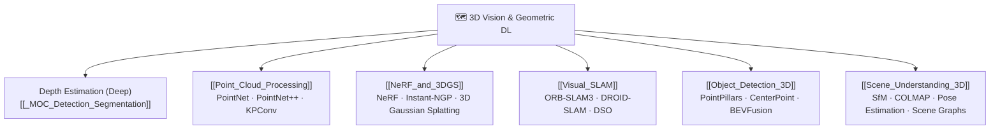

# 🗺️ MOC — 3D Vision & Geometric Deep Learning

> [!abstract] TL;DR
> 3D computer vision recovers and processes the three-dimensional structure of the world from visual data. This section covers depth estimation (predicting Z from images), point cloud processing (PointNet/PointNet++ for unordered 3D point sets), Neural Radiance Fields (NeRF) and 3D Gaussian Splatting (3DGS) for novel view synthesis, visual SLAM for real-time mapping and localization, and 3D object detection for autonomous driving.

---

## Section Map

---

## Notes in This Section

| File | Topic | Difficulty |
|------|-------|------------|
| [[Point_Cloud_Processing]] | PointNet, PointNet++, KPConv, Point Transformer | intermediate |
| [[NeRF_and_3DGS]] | Neural Radiance Fields, 3D Gaussian Splatting | advanced |
| [[Visual_SLAM]] | ORB-SLAM3, DROID-SLAM, loop closure, ATE/RPE | advanced |
| [[Object_Detection_3D]] | PointPillars, CenterPoint, BEVFusion, nuScenes | advanced |
| [[Scene_Understanding_3D]] | SfM, COLMAP, pose estimation, 3D segmentation | advanced |

> **Note:** Deep learning-based Depth Estimation (monocular, stereo, self-supervised) is covered in [[_MOC_Detection_Segmentation]] (Section 02) under the detection & dense prediction track.

---

## Key Themes

### The 3D Perception Stack
1. **Geometry recovery** — SfM, stereo, depth networks, NeRF/3DGS reconstruct 3D from 2D
2. **Point cloud learning** — PointNet family handles unordered, irregular 3D data
3. **Novel view synthesis** — NeRF (implicit MLP) and 3DGS (explicit primitives) render new viewpoints
4. **Real-time localization** — SLAM closes the loop between mapping and pose tracking
5. **Autonomous driving perception** — 3D detection + BEV fusion combine LiDAR and camera

### Representations Compared

| Representation | Structure | Pros | Cons |
|---|---|---|---|
| Depth map | 2.5D image | Familiar, dense | No full 3D |
| Point cloud | Unordered XYZ | Accurate, sparse | Irregular, no topology |
| Voxel grid | Regular 3D | Conv-friendly | Memory O(N³) |
| Mesh | Vertices+faces | Compact, renderable | Hard to optimize |
| NeRF | MLP weights | Continuous, smooth | Slow render |
| 3DGS | Gaussian primitives | Real-time render | Large storage |

---

## Prerequisites

- [[Camera_Models_and_Calibration]] — pinhole model, intrinsics, distortion
- [[Epipolar_Geometry]] — fundamental/essential matrix, triangulation
- Basic deep learning (CNN, MLP, attention)

## Related Sections

- Section 02: [[_MOC_Detection_Segmentation]] — includes monocular depth estimation
- Section 04: [[_MOC_Feature_Matching]] — SIFT/SuperPoint feed into SfM
- Section 06: [[_MOC_Video_Temporal]] — optical flow connects to visual odometry

---

## Sources & Further Reading

- Hartley & Zisserman, *Multiple View Geometry in Computer Vision* (2nd ed.)
- Mildenhall et al., "NeRF: Representing Scenes as Neural Radiance Fields" (ECCV 2020)
- Kerbl et al., "3D Gaussian Splatting for Real-Time Radiance Field Rendering" (SIGGRAPH 2023)
- Qi et al., "PointNet" (CVPR 2017); "PointNet++" (NeurIPS 2017)
- Campos et al., "ORB-SLAM3" (T-RO 2021)

---

#MOC #computer-vision #3d-vision
