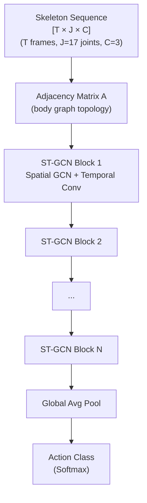

# 🏃 Action Recognition and Temporal Localization

> [!abstract] TL;DR
> Action recognition classifies *what* happens in a trimmed clip; temporal action localization (TAL) finds *when* each action starts and ends in an untrimmed video. Two-stream networks (RGB + optical flow) were the foundation; 3D CNNs took over. Skeleton-based ST-GCN models body joint graphs for pose-conditioned recognition. ActionFormer (transformer-based) dominates TAL by modeling long-range temporal context. Weakly supervised TAL removes the need for frame-level annotations.

---

## Intuition — analogy FIRST

Action recognition is like watching a 5-second highlight clip and naming the sport. Temporal localization is like watching a 2-hour game and annotating every moment a foul, goal, or timeout occurs — including precise start and end times. The second task is much harder: the model must find and classify events in an ocean of background footage, without knowing how many events there are.

---

## How It Works



*ST-GCN: body joints are nodes; bones are edges. Spatial GCN propagates across joints; temporal convolution captures motion over time.*

---

## Key Concepts / Details

### Task Definitions
- **Action Recognition** (trimmed): input = short clip; output = action class (e.g., "jumping", "handshaking")
- **Temporal Action Localization** (untrimmed): input = full video; output = list of `(start_time, end_time, class, confidence)` tuples
- **Spatio-temporal action detection**: localize actions in space AND time (AVA dataset)

### Two-Stream Networks (Simonyan & Zisserman, 2014)
- **RGB stream**: spatial appearance (static scene context); standard CNN
- **Optical flow stream**: dense motion patterns; learn flow-specific features
- **Late fusion**: average softmax scores from both streams
- Key insight: motion and appearance are complementary; flow captures fast local motion; RGB captures scene semantics

### Temporal Segment Networks (TSN, Wang 2016)
- Divide video into K=3 temporal segments
- Uniformly sample one snippet (short clip) per segment
- Compute prediction per snippet → **aggregate** with average/max pooling → final prediction
- Very efficient for long videos; simple and robust; classic baseline

### Non-Local Means (Wang 2018)
- Self-attention applied to video features across time: `y_i = Σⱼ f(x_i, x_j) · g(x_j)`
- Captures **long-range temporal dependencies** without RNNs
- Plug-in module added to any 3D CNN; significant accuracy boost

### Skeleton-Based Action Recognition

**Why skeletons?**
- View-invariant (normalize for camera angle)
- Robust to background and clothing variation
- Compact representation: only joint coordinates

**ST-GCN (Yan 2018)**
- Model skeleton as a spatial graph: joints = nodes, bones = edges
- **Spatial graph convolution**: propagate messages across adjacent joints (neighbor aggregation)
- **Temporal convolution**: 1D conv across time for each joint
- Learned attention for edge importance (not just fixed topology)
- Input: `[N, C, T, V, M]` — batch, channels (x,y,conf), time, joints (17 COCO), persons

**MS-G3D (Liu 2020)**
- Multi-scale disentangled (separates spatial and temporal graph operations)
- Better long-range joint dependencies; state-of-the-art on NTU RGB+D

**Source of skeletons**: OpenPose, MediaPipe Pose, ViTPose — 2D/3D body keypoints at low compute cost

---

### Temporal Action Localization (TAL)

**Pipeline Approach**
1. **Proposal generation**: candidate temporal segments (SSAD, BMN — Boundary-Matching Network)
2. **Classification**: classify each proposal
3. **NMS**: suppress overlapping proposals

**BMN (Lin 2019)**
- Boundary-Matching confidence map: 2D map where `(s, e)` encodes confidence that segment `[s, e]` contains an action
- Efficient dense evaluation of all possible start-end pairs

**ActionFormer (Zhang 2022)**
- Transformer encoder on video features (I3D or SlowFast features)
- Multiscale temporal pyramid: model actions at multiple durations
- Per-timestamp classification + boundary regression heads
- State-of-the-art on ActivityNet and THUMOS14; anchor-free

**AFSD (One-Stage Temporal Action Detection)**
- Anchor-free; integrates boundary refinement end-to-end

### Weakly Supervised TAL
- **Supervision**: only video-level action labels (no time boundaries)
- **Approach**: class activation maps (CAM) over time; highlight segments with highest class activation
- Much cheaper to annotate; smaller accuracy gap than expected

### Evaluation Metrics
- **Action recognition**: Top-1 / Top-5 accuracy on Kinetics, UCF101, HMDB51
- **TAL**: mAP @ IoU thresholds (e.g., 0.5) on ActivityNet, THUMOS14
- **Skeleton-based**: Top-1 accuracy on NTU RGB+D 60/120, Kinetics-Skeleton

### AVA Dataset (Atomic Visual Actions)
- Annotates every second of video with spatial bounding boxes + action labels
- 80 atomic action classes (e.g., "talk to", "listen to")
- Models must localize who is doing what, to whom, in each frame

---

## Real-World Notes

```python
# TSN-style inference using PyTorchVideo + torchvision
import torch
from torchvision.models.video import r3d_18, R3D_18_Weights

weights = R3D_18_Weights.DEFAULT
model = r3d_18(weights=weights).eval()
transforms = weights.transforms()

# TSN: sample 3 segments, 1 clip each
import torchvision
video_frames, _, _ = torchvision.io.read_video("action_video.mp4", pts_unit="sec")
# video_frames: [T, H, W, C]
T = video_frames.shape[0]
seg_size = T // 3

clips = []
for i in range(3):
    start = i * seg_size
    clip = video_frames[start:start+16].permute(3, 0, 1, 2).float() / 255.
    clips.append(transforms(clip.unsqueeze(0)))

with torch.no_grad():
    # Aggregate predictions from all segments
    preds = torch.stack([model(c) for c in clips], dim=0).mean(0)
    action = preds.argmax(dim=1).item()
    print(f"Predicted action class: {weights.meta['categories'][action]}")
```

---

## Common Pitfalls

- **RGB-only on Something-Something**: scene appearance is not a valid shortcut here — motion is the signal; always use optical flow or skeleton for motion-centric datasets
- **TAL IoU threshold sensitivity**: mAP@0.5 vs mAP@0.75 can tell very different stories; always report a range of IoU thresholds
- **ST-GCN skeleton normalization**: always center and normalize skeleton coordinates (subtract hip joint, divide by torso length) before input; un-normalized coordinates destroy cross-subject generalization
- **Long video efficiency**: for untrimmed videos (>10 min), extract features offline with I3D/SlowFast and run TAL on features — end-to-end is intractable

---

## Related Concepts

- [[Video_Understanding]] — 3D CNN and transformer backbones used for action features
- [[Optical_Flow_Tracking]] — two-stream networks depend on optical flow as motion input
- [[Vision_Language_Models]] — open-vocabulary action recognition with CLIP-based models

---

## Model Comparison

| Model | Task | Input | Key Innovation | NTU-120 / Kinetics-400 |
|-------|------|-------|----------------|------------------------|
| Two-Stream | Recognition | RGB + Flow | Late fusion | ~93% NTU-60 |
| ST-GCN | Skeleton Recognition | Joints | Spatial graph conv | 81.5% NTU-120 |
| MS-G3D | Skeleton Recognition | Joints | Multi-scale graph | 86.9% NTU-120 |
| ActionFormer | TAL | I3D Features | Transformer + multiscale | 82.1 mAP ActivityNet |

---

## Review Questions

1. What is the difference between action recognition and temporal action localization? Why is TAL harder?
2. In ST-GCN, what do the graph nodes and edges represent? What does spatial GCN propagation do?
3. How does TSN handle videos of varying lengths efficiently?
4. Why does ActionFormer use a multiscale temporal pyramid?
5. What is the key annotation assumption in weakly supervised TAL, and what trade-off does it make?

---

## Sources

- Simonyan & Zisserman (2014) — "Two-Stream Convolutional Networks for Action Recognition in Videos"
- Wang et al. (2016) — "Temporal Segment Networks: Towards Good Practices for Deep Action Recognition" (TSN)
- Wang et al. (2018) — "Non-local Neural Networks"
- Yan et al. (2018) — "Spatial Temporal Graph Convolutional Networks for Skeleton-Based Action Recognition" (ST-GCN)
- Gu et al. (2018) — "AVA: A Video Dataset of Spatio-temporally Localized Atomic Visual Actions"
- Liu et al. (2020) — "Disentangling and Unifying Graph Convolutions for Skeleton-Based Action Recognition" (MS-G3D)
- Zhang et al. (2022) — "ActionFormer: Localizing Moments of Actions with Transformers"

#computer-vision #video-multimodal #advanced
