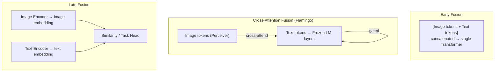

# 🏗️ Multimodal Architectures

> [!abstract] TL;DR
> Multimodal architectures vary by how they fuse vision and language tokens: early fusion concatenates all tokens into one sequence; cross-attention fusion alternates cross-attention between modalities (Flamingo); late fusion combines dual-encoder outputs at the task head. Image tokenization enables LM-style modeling: VQGAN/VQ-VAE discretize images into codebook tokens. Unified models (Chameleon, Show-o, Janus) handle both understanding and generation. GroundingDINO and GLIP ground language in spatial image regions.

---

## Intuition — analogy FIRST

Imagine merging two foreign languages into one system. You have three strategies: (1) **Early fusion** — transliterate both languages into the same alphabet from the start, then process them together as one long text; (2) **Cross-attention fusion** — keep the languages separate but build bridges at every paragraph where they influence each other; (3) **Late fusion** — process each language completely independently, then combine the final conclusions. Each strategy has trade-offs in interaction depth, computational cost, and flexibility.

---

## How It Works



*Three canonical fusion strategies. Early fusion requires image tokenization. Cross-attention enables frozen LLM reuse. Late fusion is simplest but limits interaction depth.*

---

## Key Concepts / Details

### Token Modality Fusion Strategies

**Early Fusion**
- Tokenize the image into discrete or continuous tokens, concatenate with text tokens
- Single transformer processes the full sequence
- Models: ViLBERT (image regions as BERT tokens), Perceiver IO (arbitrary modalities as token arrays)
- Requires image tokenization; expensive if image tokens are many (ViT: 256+ tokens)

**Cross-Attention Fusion**
- Keep image and text streams separate; interleave cross-attention layers
- Text tokens attend to image tokens at designated layers
- Model: Flamingo, Idefics, BLIP-2 Q-Former
- Advantage: LLM weights stay frozen; efficient injection of visual signals

**Late Fusion (Dual Encoder)**
- Separate image and text encoders; combine at task head (dot product, MLP)
- Models: CLIP (contrastive), ALIGN
- Fast retrieval; limited to tasks where global embeddings suffice; no pixel-level grounding

### Image Tokenization for Autoregressive Models

**VQ-VAE (van den Oord 2017)**
- Learn a codebook of K discrete vectors
- Encoder maps image to spatial feature map → nearest-neighbor quantize each spatial location to a codebook entry → sequence of integer indices
- Decoder reconstructs image from codebook indices
- Enables images to be modeled as sequences of integers (like text)

**VQGAN (Esser 2021)**
- VQ-VAE + GAN discriminator → sharper reconstructions
- Used in DALL-E (original), ImageGPT, VQGAN+CLIP
- Typical: 256×256 image → 16×16 = 256 tokens with codebook size 8192

**Continuous Token Projection (LLaVA style)**
- CLIP ViT features → linear projection / MLP → directly into LLM input space
- No quantization; smooth embedding; preferred for understanding tasks (not generation)

---

### Multimodal Generation: Unified Models

**EMU / Emu2 (BAAI)**
- Interleave image and text tokens; generate both image and text autoregressively
- Image generation via SDXL conditioned on LLM features

**Chameleon (Meta, 2024)**
- Truly unified: a single transformer trained from scratch on interleaved image+text tokens
- Images discretized with VQGAN (8192 codebook); tokens mixed with text tokens natively
- Can generate and understand images and text in any order
- No separate image encoder; architecture is truly modality-agnostic

**Show-o (2024)**
- Unified model for both understanding (discrete tokens) and generation (continuous diffusion)
- Mixed discrete/continuous token handling

**Janus (DeepSeek)**
- Decouple visual encoding for understanding vs. generation: separate encoders for the two tasks
- Better at both because the representations are optimized independently

---

### Video-Language Models

| Model | Base LLM | Video Input | Capability |
|-------|----------|-------------|-----------|
| Video-LLaMA | LLaMA | Frame + audio tokens | Video QA |
| Video-ChatGPT | Vicuna | Spatio-temporal pooled features | Video conversation |
| LongVA | LLaMA-3 | Long context (200k tokens) | 2000+ frames video |
| Qwen2-VL | Qwen2 | Dynamic resolution tiles | Strong video understanding |

---

### Document and Layout Understanding

**LayoutLM (Xu 2020)**
- Layout-aware BERT: add 2D positional embeddings for bounding box coordinates of OCR tokens
- Fine-tune on document classification, key-value extraction (forms, invoices)

**Donut (Kim 2022)**
- OCR-free: Swin Transformer encoder → BART-style autoregressive decoder
- Directly maps image → structured text (JSON extraction, classification)
- No external OCR dependency; end-to-end trainable

**Chart and Diagram Understanding**
- MatCha (pre-train on chart reasoning), DePlot (chart → table → LLM), ChartLLM

---

### Grounding: Connecting Language to Image Regions

**GLIP (Li 2022)**
- Phrase grounding: detect objects described by text phrases
- Fusion of language and vision features at the region-proposal level
- Open-vocabulary detection: generalize to unseen categories

**GroundingDINO (Liu 2023)**
- Extend DINO detector with text conditioning
- Input text → detect any object or attribute described by the phrase
- **Feature enhancer**: fuse image and text features early via cross-attention
- Open-vocabulary, zero-shot detection; strong on COCO and LVIS

**Referring Expression Comprehension**
- Task: given a phrase ("the dog on the left"), locate the specific region
- Models: MDETR, TransVG, UNINEXT

**Region-Level VLMs**
- Kosmos-2: extend Kosmos with grounding pre-training; output coordinates inline with text
- GPT-4V: can describe specific image regions when prompted with coordinates

---

### Evaluation

| Benchmark | Focus | Key Metric |
|-----------|-------|-----------|
| POPE | Object hallucination | F1 |
| SEED-Bench | Multi-granularity image+video | Accuracy |
| MME | Perception + reasoning | Score |
| LLaVA-Bench (Wild) | Open-ended image QA | GPT-4 judge |
| MMMU | College-level multi-discipline | Accuracy |
| COCO Caption | Image captioning | CIDEr |
| RefCOCO/+ | Referring expression grounding | Acc@0.5 IoU |

---

## Real-World Notes

```python
# Unified VLM pipeline: image captioning + grounding with transformers
from transformers import pipeline, AutoProcessor, GroundingDinoForObjectDetection
from PIL import Image
import torch

# 1. Image captioning (BLIP-2 style)
captioner = pipeline(
    "image-to-text",
    model="Salesforce/blip2-opt-2.7b",
    torch_dtype=torch.float16,
    device=0
)
image = Image.open("street_scene.jpg").convert("RGB")
caption = captioner(image, max_new_tokens=50)[0]["generated_text"]
print(f"Caption: {caption}")

# 2. Open-vocabulary detection via GroundingDINO
processor = AutoProcessor.from_pretrained("IDEA-Research/grounding-dino-base")
model_gd = GroundingDinoForObjectDetection.from_pretrained(
    "IDEA-Research/grounding-dino-base"
).eval()

text_query = "person . car . traffic light ."  # dot-separated categories
inputs = processor(images=image, text=text_query, return_tensors="pt")
with torch.no_grad():
    outputs = model_gd(**inputs)

# Post-process to boxes + labels
results = processor.post_process_grounded_object_detection(
    outputs, inputs.input_ids,
    box_threshold=0.4, text_threshold=0.3,
    target_sizes=[image.size[::-1]]
)[0]
for box, label, score in zip(results["boxes"], results["labels"], results["scores"]):
    print(f"{label}: {score:.2f} @ {box.tolist()}")
```

---

## Common Pitfalls

- **Chameleon image tokenization**: VQGAN tokens are lossy at high resolution; do not use for pixel-precise tasks (medical imaging, OCR); continuous projection (LLaVA-style) is better for understanding
- **GroundingDINO text format**: queries must be dot-separated noun phrases; do not pass full sentences or questions — the model expects category-style phrases
- **Late fusion for fine-grained tasks**: CLIP dual encoder cannot answer "is the red ball to the left of the blue cube?" — it has no cross-modal interaction at the token level; use a cross-attention model for spatial reasoning
- **Document models need correct resolution**: LayoutLM expects OCR bounding boxes from an external OCR engine (Tesseract); Donut avoids this but may miss small text at low resolution

---

## Related Concepts

- [[Vision_Language_Models]] — BLIP-2, LLaVA, Flamingo are the pretraining methods; this note covers the architecture design space
- [[../05_Generative_Models/Diffusion_Models|Diffusion Models]] — EMU and Show-o use diffusion for image generation within unified models
- [[../05_Generative_Models/Contrastive_Learning_CLIP|CLIP]] — CLIP is the canonical late-fusion dual encoder

---

## Architecture Comparison

| Model | Type | Generation | Architecture | Scale |
|-------|------|-----------|-------------|-------|
| LLaVA-1.5 | Cross-projection | Text only | CLIP ViT + MLP + LLM | 7–13B |
| Flamingo-80B | Cross-attention | Text only | Perceiver + frozen LM | 80B |
| Chameleon | Early fusion | Image + Text | Unified Transformer | 34B |
| Show-o | Early + diffusion | Image + Text | Discrete + continuous | 1.5B |
| GroundingDINO | Cross-attn fusion | Bounding boxes | DINO + text encoder | 172M |

---

## Review Questions

1. What are the three fusion strategies for vision-language models and what are the trade-offs of each?
2. Why does VQGAN discretization enable LM-style image modeling?
3. How does Chameleon differ architecturally from LLaVA? What does it enable that LLaVA cannot do?
4. What is the key advantage of Donut over LayoutLM for document understanding?
5. Why does GroundingDINO outperform CLIP for open-vocabulary detection?

---

## Sources

- van den Oord et al. (2017) — "Neural Discrete Representation Learning" (VQ-VAE)
- Esser et al. (2021) — "Taming Transformers for High-Resolution Image Synthesis" (VQGAN)
- Li et al. (2022) — "GLIP: Grounded Language-Image Pre-training"
- Liu et al. (2023) — "Grounding DINO: Marrying DINO with Grounded Pre-Training for Open-Set Object Detection"
- Kim et al. (2022) — "OCR-free Document Understanding Transformer" (Donut)
- Meta AI Research (2024) — "Chameleon: Mixed-Modal Early-Fusion Foundation Models"
- Zhang et al. (2024) — "Janus: Decoupling Visual Encoding for Unified Multimodal Understanding and Generation"

#computer-vision #video-multimodal #advanced
