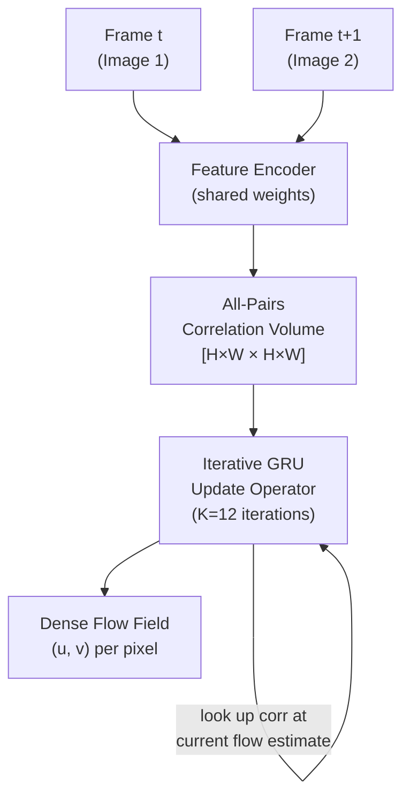

# 🌊 Optical Flow and Visual Tracking

> [!abstract] TL;DR
> Optical flow estimates per-pixel 2D displacement `(u, v)` between consecutive frames. Classical methods (Horn-Schunck, Lucas-Kanade) use brightness constancy assumptions; deep methods (FlowNet, PWC-Net, RAFT) learn flow directly. RAFT (2020) dominates with iterative GRU refinement over a 4D correlation volume. Visual tracking extends this to object-level: SORT/DeepSORT/ByteTrack chain detections across frames using Kalman filters and Hungarian assignment.

---

## Intuition — analogy FIRST

Imagine photographing a busy street with a long exposure — every moving car draws a streak. Optical flow is like computing that streak for every single pixel, frame by frame: a dense 2D vector field telling you where each pixel went. Tracking is coarser — instead of every pixel, you follow a specific object (a pedestrian, a car) from frame to frame, even when it's briefly occluded.

---

## How It Works



*RAFT: correlation volume is computed once; GRU iteratively refines the flow estimate by looking up the volume at current displacement hypotheses.*

---

## Key Concepts / Details

### Optical Flow Formulation
- Flow field: `(u(x,y), v(x,y))` — displacement of pixel `(x,y)` between frames `t` and `t+1`
- **Brightness constancy**: `I(x,y,t) = I(x+u, y+v, t+1)` (core assumption)
- **Aperture problem**: a single edge moving perpendicular to itself is ambiguous — need a window or global constraint

### Classical Methods

**Horn-Schunck (1981)**
- Add smoothness regularizer: minimize `||∇I · [u,v]ᵀ + Iₜ||² + λ(||∇u||² + ||∇v||²)`
- Global, variational; over-smooths at boundaries; historically important

**Lucas-Kanade (1981)**
- Assume constant flow in a local window → solve a local least-squares system
- Efficient; works well for small displacements; used in KLT feature tracker

### Deep Optical Flow

**FlowNet (Dosovitskiy 2015)**
- First end-to-end deep optical flow network
- Encoder-decoder U-Net with skip connections; trained on synthetic FlyingChairs data
- FlowNetS: simple concatenate inputs; FlowNetC: correlation layer (dot product between feature maps)

**SPyNet (Ranjan 2017)**
- Spatial pyramid + warping; lightweight; used as flow backbone in video models

**PWC-Net (Sun 2018)**
- **P**yramid, **W**arping, **C**ost volume
- At each pyramid level: warp image 2 features toward image 1 using current estimate → compute cost volume → refine flow
- Compact and fast; strong baseline

**RAFT (Teed & Deng 2020) — State of the Art**
- Extract features with a shared convolutional encoder
- Compute **all-pairs 4D correlation volume**: dot product between all feature pairs → `[H×W × H×W]`
- **Iterative refinement**: GRU recurrently updates flow; at each step, looks up correlation at current flow estimate (bilinear interpolation at subpixel offsets)
- K=12 iterations at test time; each iteration refines the flow residual
- Context encoder provides additional features; very accurate, especially at large displacements

**FlowFormer (Huang 2022)**
- Transformer-based; replaces RAFT's CNN context encoder with a cost-memory encoder using attention
- Better long-range reasoning than GRU

### Evaluation Metrics
- **EPE (End-Point Error)**: average Euclidean distance between predicted and GT flow vectors (lower is better)
- Benchmarks: **MPI-Sintel** (synthetic, large displacements), **KITTI 2015** (real driving scenes)

| Model | Sintel Clean EPE | KITTI 2015 EPE |
|-------|-----------------|----------------|
| Horn-Schunck | ~7.0 | — |
| FlowNet2 | 1.45 | 2.30 |
| PWC-Net | 1.45 | 2.16 |
| RAFT | **0.76** | **0.63** |
| FlowFormer | 0.71 | 0.53 |

---

### Visual Tracking

**Short-Term Tracking**
- **SiamFC / SiamRPN**: template matching via cross-correlation in feature space; online tracking without fine-tuning; fast inference

**Long-Term Tracking**
- Handle reappearance after extended occlusion; SiamLT, DiDi

### Multi-Object Tracking (MOT)

**SORT (Bewley 2016)**
- **Simple Online and Realtime Tracking**
- Detections from an external detector (YOLO, Faster-RCNN)
- **Kalman filter** predicts next position of each tracked object
- **Hungarian algorithm** assigns detections to tracks (cost = IoU distance)
- Re-ID: none; fast and simple

**DeepSORT (Wojke 2017)**
- Adds **appearance descriptor** (ReID network) to SORT
- Mahalanobis distance (motion) + cosine distance (appearance) for assignment
- Better identity persistence through occlusion

**ByteTrack (Zhang 2022)**
- Key insight: associate **all** detections, including low-confidence ones, not just high-confidence
- High-confidence detections assigned first; unmatched tracklets then matched to low-confidence detections
- Achieves state-of-the-art HOTA on MOT17/20; widely adopted

**OC-SORT (Cao 2023)**
- Observation-Centric SORT: re-activates Kalman filter from last observation rather than predicted state during occlusion; reduces velocity error accumulation

### KLT Feature Tracker
- Lucas-Kanade tracked feature points (corners, FAST keypoints)
- Foundation of SLAM visual odometry pipelines; extremely lightweight

---

## Real-World Notes

```python
# RAFT optical flow inference
import torch
import torchvision.transforms.functional as F
from torchvision.models.optical_flow import raft_large, Raft_Large_Weights
from PIL import Image
import numpy as np

weights = Raft_Large_Weights.DEFAULT
transforms = weights.transforms()
model = raft_large(weights=weights).eval()

img1 = F.to_tensor(Image.open("frame_001.png"))[None]  # [1, C, H, W]
img2 = F.to_tensor(Image.open("frame_002.png"))[None]

img1_t, img2_t = transforms(img1, img2)

with torch.no_grad():
    # Returns list of flow predictions from each GRU iteration
    flow_predictions = model(img1_t, img2_t)

# Final flow: [1, 2, H, W] — channel 0 = u (x-disp), channel 1 = v (y-disp)
flow = flow_predictions[-1]
flow_np = flow[0].permute(1, 2, 0).numpy()  # [H, W, 2]
print(f"Max displacement: {np.linalg.norm(flow_np, axis=2).max():.1f} px")
```

---

## Common Pitfalls

- **Large displacements**: classical methods and early deep networks fail; RAFT handles them via the all-pairs volume, but still struggles with very large motions (>100px)
- **Occlusion boundaries**: flow is technically undefined at pixels that become occluded; models predict something but it's unreliable there
- **DeepSORT ID switches**: the ReID model must be domain-matched to the tracking scenario (pedestrians vs. vehicles); wrong ReID degrades performance
- **ByteTrack detection dependency**: ByteTrack quality is bounded by the detector; it associates better but cannot invent detections

---

## Related Concepts

- [[Video_Understanding]] — I3D Two-Stream uses optical flow as second input
- [[Action_Recognition]] — TSN uses optical flow stream for motion cues
- [[../03_Object_Detection_and_Segmentation/Object_Detection|Object Detection]] — detection backbone required by SORT/DeepSORT/ByteTrack

---

## Review Questions

1. What is the aperture problem in optical flow and how does Horn-Schunck address it?
2. How does RAFT's correlation volume differ from PWC-Net's cost volume?
3. Why does RAFT use iterative GRU refinement rather than a single-pass decoder?
4. What does ByteTrack add over SORT and DeepSORT? Why does it improve tracking?
5. When would you prefer Lucas-Kanade over a deep flow network?

---

## Sources

- Horn & Schunck (1981) — "Determining Optical Flow"
- Lucas & Kanade (1981) — "An Iterative Image Registration Technique with an Application to Stereo Vision"
- Dosovitskiy et al. (2015) — "FlowNet: Learning Optical Flow with Convolutional Networks"
- Sun et al. (2018) — "PWC-Net: CNNs for Optical Flow Using Pyramid, Warping, and Cost Volume"
- Teed & Deng (2020) — "RAFT: Recurrent All-Pairs Field Transforms for Optical Flow"
- Bewley et al. (2016) — "Simple Online and Realtime Tracking" (SORT)
- Wojke et al. (2017) — "Simple Online and Realtime Tracking with a Deep Association Metric" (DeepSORT)
- Zhang et al. (2022) — "ByteTrack: Multi-Object Tracking by Associating Every Detection Box"

#computer-vision #video-multimodal #intermediate
