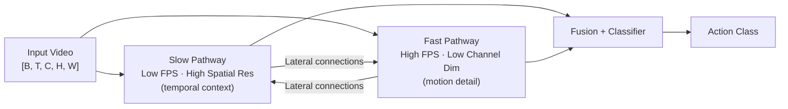

# 📹 Video Understanding

> [!abstract] TL;DR
> Video is a 4D tensor `[B, T, C, H, W]`. The core challenge is capturing spatio-temporal patterns efficiently. 3D CNNs (C3D, I3D) inflate 2D filters to 3D; SlowFast runs dual pathways at different frame rates; Video Transformers (TimeSformer, ViViT) apply attention across space and time; VideoMAE pretrains on masked tube reconstruction with 90% masking to handle temporal redundancy.

---

## Intuition — analogy FIRST

Imagine watching a flip-book. Each page is a frame (2D image), but you only understand what's happening — someone waving, a ball bouncing — when you flip through the pages and perceive *motion* across time. Image models only ever see one page. Video models must flip through and understand the whole sequence. The engineering challenge is doing this efficiently: a 32-frame 224×224 clip is 32× bigger than one image.

---

## How It Works



*SlowFast Network architecture: two-pathway design balances spatial semantics (slow) with fine-grained motion (fast).*

---

## Key Concepts / Details

### Video as a 4D Tensor
- Shape: `[Batch B, Temporal T, Channels C, Height H, Width W]`
- A 32-frame, 224×224 RGB clip = 32 × 3 × 224 × 224 ≈ 5M values per sample
- Key challenges: temporal redundancy, long-range dependencies, compute cost

### 3D CNNs

**C3D (Tran 2015)**
- Straightforward: inflate all 2D 3×3 conv kernels to 3×3×3
- Learns spatio-temporal features jointly
- Very compute-heavy; large memory footprint

**I3D — Inflated Inception (Carreira & Zisserman 2017)**
- Inflate 2D Inception weights to 3D (clever weight initialization)
- **Two-Stream**: one network on RGB, one on optical flow → late fusion
- Kinetics pretraining; dominant benchmark model for years

**SlowFast Networks (Feichtenhofer 2019)**
- **Slow pathway**: 4 fps, full spatial resolution → captures scene semantics
- **Fast pathway**: 32 fps, 1/8 channel dimensions → captures motion
- **Lateral connections** pass features from fast → slow (unidirectional)
- Best accuracy-speed trade-off; COCO-style keypoint-aware variant for pose

### Video Transformers

**TimeSformer (Bertasius 2021)**
- Apply ViT patch tokenization per frame
- **Divided space-time attention**: separate spatial attention (within frame) then temporal attention (across frames at same patch position)
- Factorizing avoids O(T²H²W²) full space-time attention
- Strong performance; competitive with 3D CNNs at lower compute

**ViViT (Arnab 2021)**
- Video ViT: 4 model variants
- Tubelet embedding: extract non-overlapping 3D patches `[t×h×w]` as tokens
- Model 1: full attention (expensive); Model 2: factorized encoder (spatial then temporal transformer)
- Pretrain on image ViT; fine-tune on video

**Video Swin Transformer (Liu 2022)**
- Extend Swin Transformer's shifted window attention to 3D
- 3D window partition + 3D shifted windows for local-to-global hierarchy
- Strong speed/accuracy on Kinetics

### Masked Pretraining

**VideoMAE (Tong 2022)**
- Mask random tubes (same spatial location across time) at 90–95% ratio
- Very high masking works because video has high temporal redundancy: adjacent frames are nearly identical
- Reconstruction task forces model to learn meaningful spatio-temporal features
- Self-supervised; strong fine-tuning downstream

### Efficient Video Models
- **TSN (Temporal Segment Network)**: sparse sampling — divide video into K segments, sample one frame per segment, aggregate predictions; very efficient
- **TRN (Temporal Relation Network)**: learn relations between sampled frames via MLP
- **X3D**: expand efficient 2D EfficientNet-style models to video via neural architecture search; excellent mobile efficiency
- **MobileNet3D**: 3D depthwise separable convolutions

### Key Datasets / Evaluation
| Dataset | Classes | Notes |
|---------|---------|-------|
| Kinetics-400 / 600 / 700 | 400–700 | Standard benchmark |
| Something-Something v2 | 174 | Focuses on *motion*, not scene context |
| UCF101 | 101 | Classic, small |
| HMDB51 | 51 | Classic, small |

---

## Real-World Notes

```python
# SlowFast inference with PyTorchVideo
import torch
from pytorchvideo.models.hub import slowfast_r50
from torchvision.transforms import Compose
from pytorchvideo.data.encoded_video import EncodedVideo
from pytorchvideo.transforms import (
    ApplyTransformToKey, ShortSideScale,
    UniformTemporalSubsample, UniformCropVideo
)

model = slowfast_r50(pretrained=True).eval()

# SlowFast expects [slow_clip, fast_clip] as input
# slow: 8 frames; fast: 32 frames at same duration
video = EncodedVideo.from_path("action_clip.mp4")
clip = video.get_clip(start_sec=0, end_sec=2.0)

# Transform: sample 32 frames → slow (every 4th) + fast (all)
frames = clip["video"]  # [C, T, H, W]
fast = frames[:, :32]        # 32 frames
slow = fast[:, ::4]          # 8 frames (every 4th)

with torch.no_grad():
    preds = model([slow.unsqueeze(0), fast.unsqueeze(0)])
    top_class = preds.argmax(dim=1).item()
```

---

## Common Pitfalls

- **Forgetting temporal stride**: SlowFast slow pathway is not just "first 8 frames" — it uniformly subsamples at 1/4 the rate
- **High masking ratio in VideoMAE**: 90% seems extreme but is correct — use lower ratios (75%) only if adapting to non-video data
- **Something-Something**: scene appearance leaks shortcuts on Kinetics — always check both benchmarks; models that rely on background textures fail on SSv2
- **Memory**: 3D conv video models are very memory-hungry; gradient checkpointing and mixed precision (fp16) are almost mandatory

---

## Related Concepts

- [[Optical_Flow_Tracking]] — optical flow is the other input stream in Two-Stream I3D
- [[Action_Recognition]] — downstream task using video features
- [[../04_Vision_Transformers/Vision_Transformer_ViT|ViT]] — backbone adapted in TimeSformer, ViViT, VideoMAE

---

## Model Comparison

| Model | Backbone | Key Innovation | Kinetics-400 Top-1 | Params |
|-------|----------|---------------|-------------------|--------|
| C3D | 3D VGG | Inflated 3×3×3 conv | ~82% | 78M |
| I3D Two-Stream | 3D Inception | RGB + flow; ImageNet init | 80.7% | 25M |
| SlowFast R50 | 3D ResNet | Dual pathway | 79.8% | 34M |
| TimeSformer-L | ViT-L | Divided space-time attn | 80.7% | 121M |
| VideoMAE ViT-H | ViT-H | Masked tube pretraining | 86.6% | 633M |

---

## Review Questions

1. Why does VideoMAE require 90% masking while image MAE uses only 75%?
2. What are the two pathways in SlowFast and what does each capture?
3. How does TimeSformer avoid the O(T²H²W²) cost of full space-time attention?
4. In I3D Two-Stream, why is optical flow included as a second input stream?
5. What is the advantage of Something-Something v2 over Kinetics for evaluating motion understanding?

---

## Sources

- Tran et al. (2015) — "Learning Spatiotemporal Features with 3D Convolutional Networks" (C3D)
- Carreira & Zisserman (2017) — "Quo Vadis, Action Recognition? A New Model and the Kinetics Dataset" (I3D)
- Feichtenhofer et al. (2019) — "SlowFast Networks for Video Recognition"
- Bertasius et al. (2021) — "Is Space-Time Attention All You Need for Video Understanding?" (TimeSformer)
- Arnab et al. (2021) — "ViViT: A Video Vision Transformer"
- Tong et al. (2022) — "VideoMAE: Masked Autoencoders are Data-Efficient Learners for Self-Supervised Video Pre-Training"

#computer-vision #video-multimodal #intermediate
