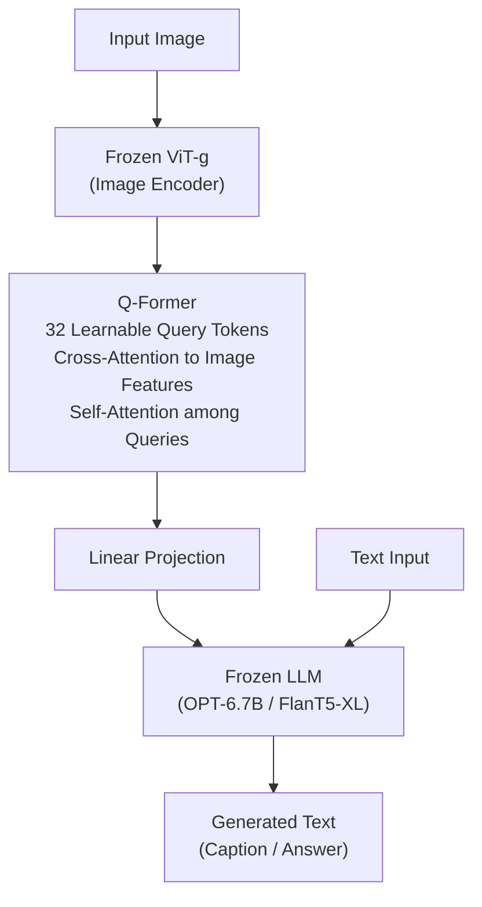

# 🔤 Vision-Language Models

> [!abstract] TL;DR
> Vision-Language Models (VLMs) jointly understand images and text. BLIP uses three pretraining objectives (ITC, ITM, LM) with web caption filtering. BLIP-2 freezes both ViT and LLM, training only a Q-Former that distills image information into 32 learned query tokens. LLaVA connects CLIP ViT to LLaMA via a projection layer and visual instruction tuning. Flamingo uses a Perceiver Resampler for few-shot multimodal learning. GPT-4V and Gemini are closed-source but set strong baselines.

---

## Intuition — analogy FIRST

Imagine a brilliant art historian (a large LLM) who can talk about anything but has never seen an image. Now imagine a skilled visual translator (the vision encoder) who can see images but barely speaks. A VLM is the interpreter between them — a connector that compresses what the visual translator sees into a format the art historian can understand, so they can finally have a conversation about what's in a painting. The art historian's knowledge is unchanged; only the interface is new.

---

## How It Works



*BLIP-2: only Q-Former and the linear projection are trained. Both ViT and LLM are frozen, making training extremely efficient.*

---

## Key Concepts / Details

### Pretraining Objectives (BLIP / BLIP-2)

| Objective | Name | What it does |
|-----------|------|-------------|
| **ITC** | Image-Text Contrastive | Pull matching image-text pairs together in embedding space (CLIP-style) |
| **ITM** | Image-Text Matching | Binary classify whether image and text match; hard negative mining |
| **LM** | Language Modeling | Generate text conditioned on image (autoregressive) |

These three objectives cover alignment (ITC), understanding (ITM), and generation (LM).

### BLIP (Li 2022)
- **Dual encoder**: image encoder + text encoder (contrastive); image-grounded text encoder (ITM)
- **CapFilt**: generate captions for noisy web images (captioner) + filter out mismatches (filter) — bootstraps clean training data
- Trains both understanding and generation jointly in a single model

### BLIP-2 (Li 2023)
- **Problem**: VLM pretraining is expensive; LLMs are already powerful
- **Solution**: freeze both the image encoder (ViT-g from EVA-CLIP) and the LLM (OPT or FlanT5)
- **Q-Former** (Querying Transformer):
  - 32 learnable query tokens as input
  - Self-attention among queries
  - Cross-attention to frozen image features
  - Output: 32 query vectors as visual "soft prompts" for the LLM
- Two training stages: (1) vision-language representation learning (ITC+ITM+LM with image encoder only); (2) vision-to-language generative learning (Q-Former → LLM)
- Result: competitive performance with much less trainable parameters

### LLaVA (Liu 2023)
- **Architecture**: CLIP ViT-L/14 → linear projection → LLaMA / Vicuna
- Only the projection layer (and optionally the LLM) are trained
- **Visual Instruction Tuning**: use GPT-4 to generate visual instruction-following data (multi-turn conversations about images) → fine-tune on these
- Very simple architecture; surprisingly effective

**LLaVA-1.5 (Liu 2023b)**
- Replace linear projection with a 2-layer MLP connector
- Use higher resolution input (336×336 or tiling for higher res)
- Add more diverse instruction-following data
- Outperforms many larger models

### InstructBLIP
- Apply instruction tuning to BLIP-2
- Instruction text passed through Q-Former alongside image (instruction-aware queries)
- Strong zero-shot generalization to diverse tasks

### Flamingo (Alayrac 2022 — DeepMind)
- **Perceiver Resampler**: pools variable-length image features into fixed 64 tokens
- **Gated cross-attention layers**: interleaved between frozen LM layers; visual tokens cross-attend into LM
- Supports **few-shot in-context multimodal learning**: interleave images and text in context window
- Pretrained on LAION + MultiModal MassiveWeb (M3W: web pages with interleaved images and text)
- Foundation for open-source Idefics

### Closed-Source Models
- **GPT-4V / GPT-4o**: strong complex reasoning, OCR, chart understanding, spatial relationships; proprietary
- **Gemini** (Google): multimodal from scratch; natively processes interleaved text/image/audio/video tokens; Gemini 1.5 Pro handles 1M token context including video

### Other Open VLMs
- **PaliGemma** (Google, 2024): SigLIP image encoder + Gemma LLM; strong on captioning and QA
- **Qwen-VL**: Qwen LLM + vision encoder; good on Chinese multimodal tasks
- **InternVL**: strong open-source; scales ViT and LLM together

### Evaluation Benchmarks

| Benchmark | Task | Notes |
|-----------|------|-------|
| VQAv2 | Visual question answering | Classic; answer accuracy |
| GQA | Compositional visual QA | Structural scene graph-grounded |
| NoCaps | Image captioning | Novel object generalization |
| MMMU | College-level multimodal | 57 subjects; hard reasoning |
| MMBench | Multi-task structured eval | Perception, reasoning, knowledge |
| POPE | Hallucination evaluation | Does model hallucinate objects? |

---

## Real-World Notes

```python
# BLIP-2 image captioning and VQA
from transformers import Blip2Processor, Blip2ForConditionalGeneration
from PIL import Image
import torch

device = "cuda" if torch.cuda.is_available() else "cpu"
processor = Blip2Processor.from_pretrained("Salesforce/blip2-opt-2.7b")
model = Blip2ForConditionalGeneration.from_pretrained(
    "Salesforce/blip2-opt-2.7b", torch_dtype=torch.float16
).to(device)

image = Image.open("cat_on_table.jpg").convert("RGB")

# Unconditional captioning
inputs = processor(images=image, return_tensors="pt").to(device, torch.float16)
with torch.no_grad():
    generated_ids = model.generate(**inputs, max_new_tokens=50)
caption = processor.batch_decode(generated_ids, skip_special_tokens=True)[0].strip()
print(f"Caption: {caption}")

# Visual QA — pass text prompt
inputs = processor(
    images=image,
    text="Question: What is the cat sitting on? Answer:",
    return_tensors="pt"
).to(device, torch.float16)
with torch.no_grad():
    generated_ids = model.generate(**inputs, max_new_tokens=30)
answer = processor.batch_decode(generated_ids, skip_special_tokens=True)[0].strip()
print(f"Answer: {answer}")
```

---

## Common Pitfalls

- **Hallucination**: VLMs frequently hallucinate objects not in the image; evaluate with POPE; mitigate with RLHF or contrastive decoding (VCD)
- **Spatial reasoning**: VLMs still struggle with "left/right of", "above/below" relationships; pixel-space grounding needed for precise localization
- **High-res images**: BLIP-2 and LLaVA-1.0 use fixed 224×336 resolution; text in images or fine details are lost; use tile-based high-res (LLaVA-HD) or PaliGemma 448 for document tasks
- **Frozen LLM brittleness**: BLIP-2 with OPT can fail at complex reasoning; pairing with a stronger LLM (FlanT5-XXL) dramatically improves instruction following

---

## Related Concepts

- [[Multimodal_Architectures]] — fusion strategies and unified generation models
- [[../04_Vision_Transformers/Vision_Transformer_ViT|ViT]] — image encoder backbone in BLIP-2, LLaVA, PaliGemma
- [[../05_Generative_Models/Contrastive_Learning_CLIP|CLIP]] — LLaVA uses CLIP ViT-L; ITC objective mirrors CLIP

---

## Model Comparison

| Model | Image Encoder | LLM | Trainable Params | VQAv2 | MMMU |
|-------|--------------|-----|-----------------|-------|------|
| BLIP-2 (OPT-6.7B) | EVA ViT-g | OPT-6.7B (frozen) | ~188M (Q-Former) | 65.0 | — |
| LLaVA-1.5 (7B) | CLIP ViT-L/336 | Vicuna-7B | Full LLM + MLP | 80.0 | 36.2 |
| Flamingo-80B | NFNet | Chinchilla-70B | Cross-attn layers | 82.0 | — |
| GPT-4V | — | GPT-4 | proprietary | ~77.2 | 56.8 |
| InternVL2-8B | InternViT-300M | InternLM2.5-7B | Full | 82.3 | 51.2 |

---

## Review Questions

1. What are the three pretraining objectives in BLIP and what does each one train the model to do?
2. Why does BLIP-2 freeze both the image encoder and LLM? What is the Q-Former's role?
3. How does LLaVA's approach differ from BLIP-2's? What is "visual instruction tuning"?
4. What makes Flamingo suitable for few-shot multimodal learning?
5. What is the POPE benchmark measuring, and why is it important for production VLMs?

---

## Sources

- Li et al. (2022) — "BLIP: Bootstrapping Language-Image Pre-training for Unified Vision-Language Understanding and Generation"
- Li et al. (2023) — "BLIP-2: Bootstrapping Language-Image Pre-training with Frozen Image Encoders and Large Language Models"
- Liu et al. (2023) — "Visual Instruction Tuning" (LLaVA)
- Liu et al. (2023b) — "Improved Baselines with Visual Instruction Tuning" (LLaVA-1.5)
- Alayrac et al. (2022) — "Flamingo: a Visual Language Model for Few-Shot Learning"
- OpenAI (2023) — "GPT-4 Technical Report"
- Team Gemini (2023) — "Gemini: A Family of Highly Capable Multimodal Models"

#computer-vision #video-multimodal #advanced
