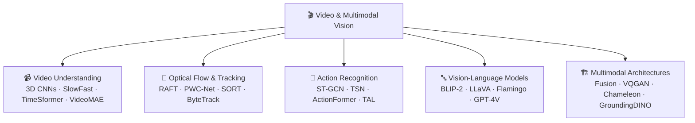

# 🗺️ MOC — Video and Multimodal Vision

> [!abstract] TL;DR
> Video understanding extends image models to the temporal dimension — treating video as a 4D tensor and modeling motion, action, and temporal context. Multimodal vision models combine visual understanding with language and other modalities, enabling image captioning, visual QA, and unified generation. This section covers video classification (3D CNNs, Video Transformers), optical flow and visual tracking, action recognition and temporal localization, vision-language models (BLIP-2, LLaVA, GPT-4V), and unified multimodal architectures.

---

## Section Map



---

## Notes in This Section

| File | Topic | Difficulty |
|------|-------|------------|
| [[Video_Understanding]] | 3D CNNs, I3D, SlowFast, TimeSformer, VideoMAE | Intermediate |
| [[Optical_Flow_Tracking]] | RAFT, PWC-Net, SORT, DeepSORT, ByteTrack | Intermediate |
| [[Action_Recognition]] | ST-GCN, TSN, ActionFormer, temporal localization | Advanced |
| [[Vision_Language_Models]] | BLIP-2, LLaVA, Flamingo, GPT-4V, Q-Former | Advanced |
| [[Multimodal_Architectures]] | Fusion strategies, VQGAN, Chameleon, GroundingDINO | Advanced |

---

## Core Ideas

### Why Video is Hard
- **Temporal dimension**: a video clip of shape `[B, T, C, H, W]` is far larger than an image `[B, C, H, W]`
- **Motion modeling**: static image models miss motion, velocity, and causality
- **Long-range dependencies**: actions unfold over seconds or minutes
- **Computation**: 3D conv is ~T× more expensive than 2D conv

### The Temporal Modeling Zoo

| Approach | Key Idea | Representative Model |
|----------|----------|----------------------|
| 3D Conv | Inflate 2D filters to 3D | C3D, I3D |
| Two-Stream | RGB + optical flow fusion | I3D Two-Stream |
| SlowFast | Dual-rate pathways | SlowFast |
| Transformer | Space-time attention | TimeSformer, ViViT |
| Masked pretraining | Reconstruct masked tubes | VideoMAE |
| Sparse sampling | TSN-style segment averaging | TSN, TRN |

### Vision-Language Alignment
- **Contrastive (ITC)**: CLIP-style pull matching pairs together
- **Matching (ITM)**: binary classify whether image and text match
- **Generative (LM)**: predict next token conditioned on image
- **Q-Former bottleneck**: BLIP-2's key innovation — 32 learned queries compress image into fixed-size representation for the LLM

---

## Key Benchmarks

| Task | Benchmark | Metric |
|------|-----------|--------|
| Video classification | Kinetics-400/700 | Top-1 Acc |
| Temporal action | ActivityNet, THUMOS14 | mAP@IoU |
| Optical flow | Sintel, KITTI 2015 | EPE (px) |
| Multi-object tracking | MOT17, MOT20 | HOTA, MOTA |
| Visual QA | VQAv2, GQA | Accuracy |
| Multimodal reasoning | MMMU, MMBench | Score |
| Hallucination | POPE | F1 |

---

## Prerequisites

- [[../02_CNNs_and_Feature_Extraction/Convolutional_Neural_Networks|CNNs]] — foundation for 3D extensions
- [[../03_Object_Detection_and_Segmentation/Object_Detection|Object Detection]] — used in multi-object tracking
- [[../04_Vision_Transformers/Vision_Transformer_ViT|ViT]] — backbone for VideoMAE, TimeSformer, VLMs
- [[../05_Generative_Models/Contrastive_Learning_CLIP|CLIP]] — image-text pretraining used in LLaVA, GroundingDINO

---

## Learning Path

```
Video_Understanding → Optical_Flow_Tracking → Action_Recognition
                                    ↓
              Vision_Language_Models → Multimodal_Architectures
```

---

#MOC #computer-vision #video-multimodal
