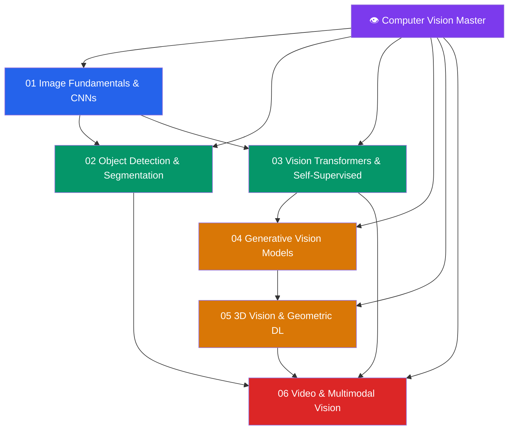

# 👁️ Computer Vision — Master Map of Content

> [!abstract] About This Vault
> A deep-dive Computer Vision reference: **37 notes across 6 sections**, covering the complete modern CV stack from image fundamentals and CNN architectures through detection/segmentation, Vision Transformers and self-supervised pretraining, generative vision models, 3D vision and NeRF, and video/multimodal systems. Every note pairs intuition-first analogies with precise mathematics, architecture diagrams, PyTorch code, benchmark comparisons, and review questions. This vault is the deep companion to the [[_MOC_Computer_Vision|AI/ML vault CV section]] — where that section surveys the landscape, this vault provides full architectural derivations, training details, and implementation guidance. Designed for CV practitioners, researchers, and ML engineers building production vision systems.

## Vault Architecture

## Sections at a Glance

| # | Section | Notes | Entry Point | Difficulty |
|---|---------|-------|-------------|------------|
| 01 | Image Fundamentals & CNNs | 5 | [[_MOC_Image_Fundamentals_CNNs]] | Beginner → Intermediate |
| 02 | Object Detection & Segmentation | 5 | [[_MOC_Detection_Segmentation]] | Intermediate |
| 03 | Vision Transformers & Self-Supervised | 5 | [[_MOC_ViT_Self_Supervised]] | Intermediate → Advanced |
| 04 | Generative Vision Models | 5 | [[_MOC_Generative_Vision]] | Advanced |
| 05 | 3D Vision & Geometric DL | 5 | [[_MOC_3D_Vision]] | Advanced |
| 06 | Video & Multimodal Vision | 5 | [[_MOC_Video_Multimodal]] | Advanced |

---

## Learning Paths

### Path 1 — CV Engineer (Production Systems)
**CNNs → Detection → ViT → Video**

[[_MOC_Image_Fundamentals_CNNs]] → [[CNN_Architectures]] → [[Training_Techniques_CV]] → [[_MOC_Detection_Segmentation]] → [[Object_Detection_RCNN]] → [[YOLO_Deep_Dive]] → [[Instance_Panoptic_Segmentation]] → [[_MOC_ViT_Self_Supervised]] → [[Vision_Transformer_ViT_Deep]] → [[_MOC_Video_Multimodal]] → [[Video_Understanding]]

### Path 2 — Generative AI / Diffusion Researcher
**CNN Basics → ViT → Generative Models → 3D**

[[Image_Representations]] → [[CNN_Architectures]] → [[_MOC_ViT_Self_Supervised]] → [[Vision_Transformer_ViT_Deep]] → [[CLIP_Deep_Dive]] → [[_MOC_Generative_Vision]] → [[VAE_Deep_Dive]] → [[GAN_Deep_Dive]] → [[Diffusion_Models_Deep]] → [[Stable_Diffusion_Architecture]] → [[_MOC_3D_Vision]] → [[NeRF_and_3DGS]]

### Path 3 — Multimodal / VLM Researcher
**ViT → CLIP → Video → Multimodal**

[[Vision_Transformer_ViT_Deep]] → [[CLIP_Deep_Dive]] → [[Self_Supervised_Pretraining]] → [[_MOC_Video_Multimodal]] → [[Video_Understanding]] → [[Vision_Language_Models]] → [[Multimodal_Architectures]]

### Path 4 — 3D / Robotics Engineer
**CNNs → Detection → Depth → 3D → Video**

[[CNN_Architectures]] → [[_MOC_Detection_Segmentation]] → [[Depth_Estimation_Deep]] → [[_MOC_3D_Vision]] → [[Point_Cloud_Processing]] → [[NeRF_and_3DGS]] → [[Visual_SLAM]] → [[_MOC_Video_Multimodal]] → [[Optical_Flow_Tracking]]

---

## AI/ML Vault Cross-Links

This vault is the deep companion to the AI/ML vault's CV section:
- **[[_MOC_Computer_Vision]]** (AI/ML vault, Section 04) — survey-level coverage; this vault provides the architectural depth and implementation details
- **[[_MOC_Deep_Learning]]** (AI/ML vault, Section 02) — backpropagation, optimization, and regularization fundamentals used throughout
- **[[_MOC_Generative_AI]]** (AI/ML vault, Section 05) — diffusion models and generative systems (Section 04 of this vault)
- **[[_MOC_NLP_Master]]** — multimodal vision-language models bridge CV and NLP; Section 06 of this vault
- **[[_MOC_Audio_Speech_Master]]** — audio-visual models and multimodal pretraining

---

## Section MOC Index

- [[_MOC_Image_Fundamentals_CNNs]] — Image representation (pixels, channels, color spaces), convolution mechanics (filters, stride, padding, receptive field), classic CNN architectures (AlexNet → ResNet → EfficientNet), batch/layer normalization, data augmentation strategies, and transfer learning.
- [[_MOC_Detection_Segmentation]] — Object detection pipeline (anchors, RPN, NMS, IoU), two-stage detectors (R-CNN family), single-stage detectors (YOLO deep dive, SSD, RetinaNet), semantic segmentation (FCN, UNet, DeepLab v3+), instance segmentation (Mask R-CNN), and panoptic segmentation.
- [[_MOC_ViT_Self_Supervised]] — Vision Transformer full architecture (patch embeddings, CLS token, positional encoding), hierarchical ViTs (Swin Transformer, DeiT), self-supervised pretraining (DINO, MAE, SimCLR), CLIP contrastive training, and foundation model pretraining for vision.
- [[_MOC_Generative_Vision]] — Variational Autoencoders (ELBO derivation, reparameterization), GANs (StyleGAN2/3, training dynamics), Denoising Diffusion Probabilistic Models (DDPM/DDIM), Stable Diffusion (latent diffusion, LDM), and ControlNet conditioning.
- [[_MOC_3D_Vision]] — Depth estimation (monocular and stereo), point cloud processing (PointNet/PointNet++), Neural Radiance Fields (NeRF) and 3D Gaussian Splatting (3DGS), visual SLAM, and 3D object detection.
- [[_MOC_Video_Multimodal]] — Video classification (3D CNNs, Video Transformers), optical flow and tracking, action recognition, vision-language models (BLIP-2, LLaVA, GPT-4V), and multimodal architectures (flamingo, unified contrastive).

#MOC #ComputerVision #MasterMOC
