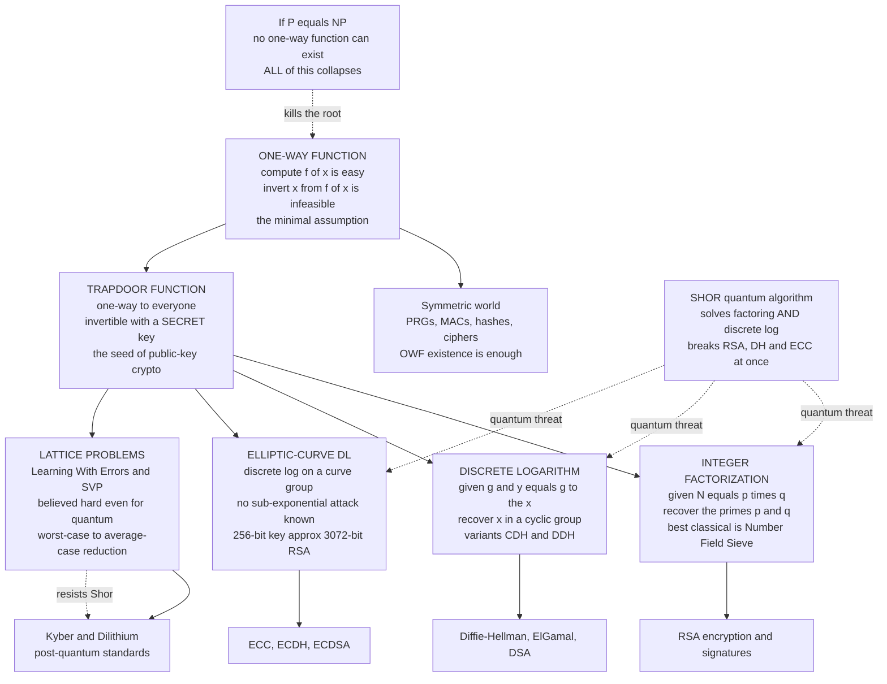

# 🔒 Computational Hardness Assumptions

> [!abstract] TL;DR
> Every public-key cryptosystem is a **bet** that some mathematical problem has no fast solution. The security of RSA, Diffie–Hellman, ECC, and the TLS handshake protecting this page is not *proven* — it is the assumption that **factoring**, the **discrete logarithm**, and the **elliptic-curve discrete log** are computationally infeasible for feasible (polynomial-time) adversaries. The atom underneath is the **one-way function**: easy to compute forward, hopeless to invert. Add a **trapdoor** — a secret that reopens the one-way door — and you get public-key encryption. These assumptions are **unproven** (proving factoring hard would settle deep complexity questions) but heavily scrutinized. The looming rupture: **Shor's algorithm** on a large quantum computer solves factoring *and* discrete log in polynomial time, breaking RSA/DH/ECC at once — which is exactly why **lattice-based** post-quantum cryptography, resting on the Learning-With-Errors assumption believed hard even for quantum machines, is now urgent.

---

## Intuition

**Analogy — mixing paint.** Squeeze a blob of blue and a blob of yellow onto a palette and stir: in two seconds you have green. Now hand that green to a stranger and ask them to recover the *exact* original blue and yellow — the precise shades, the precise amounts. Practically impossible. Mixing is a **one-way street**: trivial forward, hopeless backward. There is no shortcut that "un-stirs" the paint.

Public-key cryptography is built out of exactly this asymmetry, but manufactured from arithmetic instead of pigment. **Multiplying** two enormous prime numbers is a two-second operation your phone does without breaking a sweat; **factoring** the resulting product back into those primes has stumped the world's best algorithms and supercomputers for decades. That gap — cheap one way, infeasible the other — is not a law of nature we have proved. It is a **bet**. When you see the padlock in your browser, you are trusting that nobody knows a fast way to un-mix the mathematical paint. Cryptography's entire security rests on believing that certain problems have no efficient algorithm.

---

## How It Works

### Computational security: secure against *feasible* adversaries, not omnipotent ones

There is a crucial retreat baked into modern cryptography. With unlimited computation, almost everything breaks — an adversary who can try every key eventually wins. The lone exception is **information-theoretic security** like the one-time pad, which leaks nothing even to an infinitely powerful attacker but demands a key as long as the message and so is impractical at scale. Everything else settles for **computational security**: safe not against *all* adversaries but against **feasible** ones — those limited to polynomial-time computation. "Secure" is therefore redefined as **"breaking it requires solving a problem we believe is intractable."** Security becomes a *conditional* statement, and the condition is a hardness assumption.

### One-way functions (OWFs): the minimal assumption

A function `f` is **one-way** when:

1. **Easy forward.** `f of x` is computable in polynomial time for every input `x`.
2. **Hard backward.** For a *randomly chosen* `x`, no feasible algorithm can recover *any* preimage of `f of x` except with negligible probability.

OWFs are the **minimal assumption** for most of cryptography. Their mere existence is *equivalent* to the existence of a whole family of primitives — pseudorandom generators, message authentication codes, symmetric encryption, digital signatures. And they tie cryptography directly to complexity theory: inverting a one-way function is an NP search (a preimage is a short certificate), so **if P equals NP, one-way functions cannot exist** and computational cryptography collapses. Yet the converse fails — P not-equal NP is *necessary* but not *sufficient* for OWFs, because it is a worst-case statement while cryptography needs *average-case* hardness (a randomly generated key must be hard, not merely some rare instance).

### Trapdoor functions: the seed of public-key encryption

A **trapdoor one-way function** is one-way to the world but comes with a **secret** — the trapdoor — that makes inversion easy for whoever holds it. This single idea *is* public-key encryption:

- The **public key** exposes the one-way (forward) direction — anyone can encrypt.
- The **private key** is the trapdoor — only the owner can invert (decrypt).

RSA is the canonical **trapdoor permutation**: raising to the public exponent is easy for all; taking the inverse root requires knowing the factorization of the modulus, which is the trapdoor.

### The specific hard problems

- **Integer factorization.** Given `N = p times q`, a product of two large primes, recover `p` and `q`. Multiplying is one operation; factoring has no known efficient classical algorithm — the best is the sub-exponential **General Number Field Sieve**. Underpins **RSA**.
- **Discrete logarithm (DLP).** In a cyclic group, given `g` and `y = g^x`, recover the exponent `x`. Hard in the multiplicative group of integers mod a prime. Underpins **Diffie–Hellman**, **ElGamal**, and **DSA**. Security proofs actually lean on two *precise* variants: the **Computational Diffie–Hellman (CDH)** assumption (given `g^a` and `g^b`, compute `g^{ab}`) and the stronger **Decisional Diffie–Hellman (DDH)** assumption (distinguish `g^{ab}` from a random group element). These sit in a hierarchy: breaking DLP breaks CDH breaks DDH, but not obviously the reverse.
- **Elliptic-curve discrete log (ECDLP).** The same discrete-log problem, but in the group of points on an elliptic curve. Believed **harder** than DLP over integers — no sub-exponential attack is known — so ECC delivers equivalent security with dramatically **smaller keys**: a 256-bit elliptic-curve key is comparable to a 3072-bit RSA key.
- **Lattice problems (LWE, SVP, SIS).** **Learning With Errors** and the **Shortest Vector Problem** are believed hard even for **quantum** computers, and lattice cryptography enjoys a rare **worst-case-to-average-case reduction** (a random instance is as hard as the *worst* case). This is the foundation of **post-quantum** cryptography (Kyber, Dilithium).

### The quantum threat and the hierarchy of assumptions

**Shor's algorithm** on a large fault-tolerant quantum computer solves factoring *and* discrete log — including ECDLP — in polynomial time, simultaneously breaking RSA, Diffie–Hellman, and ECC. **Grover's algorithm** only *quadratically* speeds symmetric brute force, so doubling key length (AES-256, not AES-128) restores safety. This asymmetry — public-key crypto shattered, symmetric merely dented — is precisely *why* lattice-based post-quantum cryptography is urgent. Meanwhile "provable security" reduces a scheme's security to one of these named assumptions: *if* you can break scheme X, *then* you can solve hard problem Y. The assumptions themselves remain **unproven** — proving factoring hard would imply complexity separations we cannot currently reach — but they are the most battle-tested conjectures in computer science.

### Flow / Architecture



---

## Key Concepts

### Secondary (intuitive, no CS background needed)

- **The one-way street.** Some math is cheap forward and hopeless backward — multiply two primes in a blink, but factor the product and you may wait centuries. Mixing paint versus un-mixing it.
- **A padlock with a secret.** A trapdoor function is a lock anyone can *close* (the public key) but only the owner can *open* (the private key). That is public-key encryption in one sentence.
- **Security is a bet, not a proof.** Nobody has proved factoring is hard. We have only failed to crack it for fifty years. Every https padlock is a wager on that failure continuing.
- **Quantum could change the odds.** A future quantum computer running Shor's algorithm would un-mix the paint — factoring and discrete log fall — which is why researchers are already switching to new, quantum-resistant locks.

### Undergraduate (a first theory or crypto course)

- **Computational vs unconditional security.** Only the one-time pad is secure against unlimited computation; everything else is secure only against *polynomial-time* adversaries, contingent on a hardness assumption.
- **One-way function.** Polynomial to compute, hard to invert on a *random* input — the minimal cryptographic primitive; equivalent to the existence of PRGs, MACs, and signatures.
- **Trapdoor one-way function.** An OWF plus a secret that restores efficient inversion — the extra ingredient (beyond a plain OWF) that public-key encryption requires. RSA is the canonical trapdoor permutation.
- **The three deployed hard problems.** Factoring (RSA), discrete log (DH, DSA, ElGamal), elliptic-curve discrete log (ECDH, ECDSA). Each cryptosystem *names* its assumption, and that name is its risk profile.
- **CDH vs DDH.** The precise Diffie–Hellman assumptions security proofs invoke — computing `g^{ab}` (CDH) versus distinguishing it from random (DDH) — both no harder than plain DLP.
- **Why ECC keys are smaller.** No sub-exponential algorithm is known for ECDLP, unlike integer DLP, so equivalent security needs far fewer bits.

### Graduate (advanced complexity and cryptography)

- **OWF between P not-equal NP and secure crypto.** Inverting an OWF is an NP search, so OWFs imply P not-equal NP; but P not-equal NP is a worst-case separation and does *not* imply OWFs, which demand *average-case* hardness with samplable hard instances (Impagliazzo's Minicrypt vs Pessiland). See [[Complexity_Cryptography_and_Average_Case_Hardness]].
- **Reductions and provable security.** A scheme is "provably secure" when an efficient reduction converts any adversary breaking it into an algorithm solving the underlying hard problem — security is *relative* to an unproven assumption, never absolute.
- **The assumption web.** DLP >= CDH >= DDH (in hardness); factoring relates to RSA-inversion; lattice assumptions (LWE, Ring-LWE, SIS) reduce to worst-case SVP/GapSVP. Knowing the reduction structure reveals which schemes fall together.
- **Worst-case-to-average-case reductions.** Lattices are prized because a random LWE instance is provably as hard as the worst case of a standard lattice problem — a guarantee factoring and discrete log lack (they are pure average-case conjectures).
- **Quantum separations.** Shor places factoring and discrete log in quantum polynomial time (BQP), collapsing RSA/DH/ECC; Grover gives only quadratic speedup on unstructured search, so symmetric security degrades gracefully. See [[Quantum_Complexity_Theory_and_BQP]].
- **Unfalsifiable-until-broken.** These assumptions cannot presently be *proved* (that would imply major complexity results) and are validated only by sustained cryptanalytic failure — a scientific, not mathematical, kind of confidence.

---

## Python Demo

```python
# EASY FORWARD, HARD BACKWARD -- measured, not asserted.
#
# We time the two directions of two candidate one-way functions and watch the
# INVERSE cost pull away from the near-flat FORWARD cost as the numbers grow.
#
#   (A) DISCRETE LOG.  Forward:  y = g^x mod p     -- fast square-and-multiply.
#       Inverse (recover x): we run TWO real attacks and time them --
#         * brute force            -- scan x = 0,1,2,...        ~ p steps
#         * baby-step giant-step   -- meet in the middle        ~ sqrt(p) steps
#   (B) FACTORING.  Forward:  N = p * q    -- ONE multiplication.
#       Inverse (recover p,q): trial division                   ~ sqrt(N) steps
#
# Toy sizes so it finishes in seconds. Real crypto uses 2048+ bit numbers where
# the backward cost is astronomically larger than any machine can ever pay.
# Pure standard library for all computation; matplotlib only to draw the gap.

import time
import math
import random
import matplotlib.pyplot as plt

random.seed(7)

# ---- primality test + prime sampler (pure stdlib, deterministic Miller-Rabin) --
_SMALL = (2, 3, 5, 7, 11, 13, 17, 19, 23, 29, 31, 37)

def is_prime(n):
    if n < 2:
        return False
    for p in _SMALL:
        if n % p == 0:
            return n == p
    d, s = n - 1, 0
    while d % 2 == 0:
        d //= 2
        s += 1
    for a in _SMALL:                      # deterministic for n < 3.3e24
        x = pow(a, d, n)
        if x == 1 or x == n - 1:
            continue
        for _ in range(s - 1):
            x = x * x % n
            if x == n - 1:
                break
        else:
            return False
    return True

def prime_with_bits(b):
    lo, hi = 1 << (b - 1), (1 << b) - 1
    while True:
        n = random.randint(lo, hi) | 1
        if is_prime(n):
            return n

# ---- (A) discrete log: forward + two inverse attacks -------------------------
def dlog_bruteforce(g, y, p):
    cur = 1
    for x in range(p):
        if cur == y:
            return x
        cur = cur * g % p
    return None

def dlog_bsgs(g, y, p):                    # baby-step giant-step, ~ sqrt(p) work
    m = math.isqrt(p) + 1
    table = {}
    cur = 1
    for j in range(m):                     # baby steps: store g^j -> j
        table.setdefault(cur, j)
        cur = cur * g % p
    g_inv_m = pow(pow(g, m, p), p - 2, p)  # (g^m)^{-1} mod p  (p prime, Fermat)
    gamma = y
    for i in range(m + 1):                 # giant steps
        if gamma in table:
            return i * m + table[gamma]
        gamma = gamma * g_inv_m % p
    return None

def timed(fn, repeat=1):
    t0 = time.perf_counter()
    for _ in range(repeat):
        fn()
    return (time.perf_counter() - t0) / repeat

dl_bits = list(range(10, 23))              # up to 2^22 ~ 4M brute-force steps
dl_forward, dl_brute, dl_bsgs = [], [], []
for b in dl_bits:
    p = prime_with_bits(b)
    g = 2
    x = random.randrange(1, p - 1)
    y = pow(g, x, p)                                   # FORWARD (fast built-in)
    dl_forward.append(timed(lambda: pow(g, x, p), repeat=5000))
    dl_brute.append(timed(lambda: dlog_bruteforce(g, y, p)))
    dl_bsgs.append(timed(lambda: dlog_bsgs(g, y, p)))

# ---- (B) factoring: multiply vs trial-division -------------------------------
def factor_trial(N):
    if N % 2 == 0:
        return 2
    i = 3
    while i * i <= N:
        if N % i == 0:
            return i
        i += 2
    return N

fac_bits = list(range(20, 45, 2))          # smallest factor up to ~2^22
fac_forward, fac_inverse = [], []
for b in fac_bits:
    half = b // 2
    p = prime_with_bits(half)
    q = prime_with_bits(b - half)
    N = p * q
    fac_forward.append(timed(lambda: p * q, repeat=200000))   # ONE multiply
    fac_inverse.append(timed(lambda: factor_trial(N)))         # trial division

# ---- plot the forward-vs-inverse chasm ---------------------------------------
fig, ax = plt.subplots(1, 2, figsize=(15, 5.8))

ax[0].semilogy(dl_bits, dl_brute, "o-", color="crimson", lw=2,
               label="INVERT: brute force  ~ 2^bits")
ax[0].semilogy(dl_bits, dl_bsgs, "s-", color="darkorange", lw=2,
               label="INVERT: baby-step giant-step  ~ 2^(bits/2)")
ax[0].semilogy(dl_bits, dl_forward, "^-", color="seagreen", lw=2,
               label="COMPUTE forward: g^x mod p  ~ constant")
ax[0].set_xlabel("prime bit length")
ax[0].set_ylabel("seconds per operation (log scale)")
ax[0].set_title("Discrete log is a one-way street\n"
                "forward hugs the floor; inverting climbs away")
ax[0].legend(fontsize=8, loc="upper left")
ax[0].grid(True, which="both", alpha=0.3)

ax[1].semilogy(fac_bits, fac_inverse, "o-", color="crimson", lw=2,
               label="FACTOR N: trial division  ~ 2^(bits/2)")
ax[1].semilogy(fac_bits, fac_forward, "^-", color="seagreen", lw=2,
               label="MULTIPLY p*q: ~ constant (essentially free)")
ax[1].set_xlabel("modulus N bit length")
ax[1].set_ylabel("seconds per operation (log scale)")
ax[1].set_title("Multiplication vs factoring is a one-way street\n"
                "multiplying is flat; factoring blows up")
ax[1].legend(fontsize=8, loc="upper left")
ax[1].grid(True, which="both", alpha=0.3)

plt.tight_layout()
plt.show()

# ---- print the measured asymmetry --------------------------------------------
print("Discrete log -- forward vs inverse (seconds):")
for b, f, br, bs in zip(dl_bits, dl_forward, dl_brute, dl_bsgs):
    print(f"  {b:>2}-bit p:  forward {f:.2e}   brute {br:.2e}   bsgs {bs:.2e}"
          f"   (brute/forward = {br/f:,.0f}x)")
print()
print("Factoring -- multiply vs trial-division (seconds):")
for b, f, inv in zip(fac_bits, fac_forward, fac_inverse):
    print(f"  {b:>2}-bit N:  multiply {f:.2e}   factor {inv:.2e}"
          f"   (factor/multiply = {inv/f:,.0f}x)")
print()
print("These are TOY sizes. Real RSA uses 2048+ bit N and real Diffie-Hellman")
print("uses 2048+ bit p, where the backward cost dwarfs the number of atoms in")
print("the universe. That measured chasm -- cheap forward, infeasible backward,")
print("on a RANDOM key -- IS the one-way function your TLS session bets on.")
```

**What the demo shows.** The green "forward" curves — `pow(g, x, p)` and a single multiply — stay essentially flat: the forward direction barely notices the numbers growing. The crimson "invert" curves climb steeply: brute-force discrete log tracks `2^bits`, and trial-division factoring tracks `2^(bits/2)`. Baby-step-giant-step (orange) is a genuinely clever attack — it meets in the middle for a `sqrt(p)` speedup — yet it *still* rises far faster than the flat forward line, which is the whole point: even our *best* toy inversion cannot keep pace with the free forward step. Extrapolate the crimson curves to the 2048+ bit numbers real cryptography uses and they pass the age of the universe. That visible, *measured* gap — easy one way, hopeless the other, on a randomly chosen key — is precisely what "computational hardness assumption" means in practice.

---

## Real-World Applications

> **Example — every TLS handshake is a live wager on these assumptions.** When your browser opens an https connection, it negotiates a shared key using (classically) elliptic-curve Diffie–Hellman and authenticates the server with an RSA or ECDSA signature. The confidentiality of that session rests *entirely* on ECDLP and the factoring/discrete-log assumptions being true for a *randomly generated* key. No proof underwrites it — only the assumption, tested by decades of failed cryptanalysis, that these problems have no efficient algorithm.

- **RSA (factoring).** Public-key encryption and signatures whose trapdoor is the factorization of the modulus. Named assumption: integer factorization is infeasible. Quantum-vulnerable (Shor).
- **Diffie–Hellman, ElGamal, DSA (discrete log / CDH / DDH).** Key exchange and signatures over the multiplicative group mod a prime; proofs cite CDH or DDH. Quantum-vulnerable (Shor).
- **ECC, ECDH, ECDSA (ECDLP).** The same problem on elliptic curves, giving 256-bit keys the strength of 3072-bit RSA — why modern TLS, Signal, SSH, and cryptocurrency wallets default to curves. Quantum-vulnerable (Shor).
- **Kyber and Dilithium (lattice / LWE).** NIST's standardized post-quantum key encapsulation and signature schemes, chosen because LWE resists Shor *and* carries a worst-case-to-average-case reduction. Quantum-resistant — the whole reason they exist.
- **Symmetric ciphers and hashes (one-way functions).** AES and SHA are engineered pseudorandom permutations/functions — the practical embodiment of the "OWFs exist" world; only quadratically dented by Grover, so AES-256 survives.
- **Reading a scheme's risk profile.** Because every public-key system *names* its assumption, you can read its quantum exposure directly: factoring/discrete-log/ECDLP schemes are quantum-vulnerable; lattice schemes are quantum-resistant. The assumption *is* the risk assessment.

---

## Common Pitfalls

- **"Provably secure means unconditionally secure."** It never does. A security proof is a *reduction* to an unproven hardness assumption — "secure *if* factoring is hard." No one has proved factoring (or discrete log, or LWE) is actually hard; "provable security" means *conditional* security, and stating it as absolute is a category error.
- **"NP-complete means cryptographically secure."** NP-completeness is a *worst-case* guarantee; cryptography needs *average-case* hardness on random keys. Merkle–Hellman knapsack cryptosystems were built on an NP-complete problem and were still broken, because their *random* instances were easy. See [[NP_Completeness_and_the_Cook_Levin_Theorem]].
- **Confusing a one-way function with a trapdoor function.** Plain OWFs buy you only *symmetric* cryptography. Public-key encryption needs the *extra* structure of a trapdoor. Assuming OWFs automatically yield public-key crypto skips the hardest ingredient.
- **Treating all hardness assumptions as equally solid.** Factoring and discrete log are *pure average-case conjectures* — a clever average-case algorithm could exist even if the worst case is hard. Lattice assumptions are stronger precisely because a worst-case-to-average-case reduction rules that out.
- **Ignoring the quantum clock.** A scheme "secure" against every classical attack can be dead against Shor's algorithm. Data encrypted today under RSA/ECC is exposed to "harvest now, decrypt later" once a cryptographically relevant quantum computer exists. See [[Post_Quantum_Cryptography]].
- **Rolling your own hardness.** Inventing a new "hard problem" without years of public cryptanalysis is how schemes die. The deployed assumptions are trusted *because* thousands of researchers have attacked them and failed — novelty is a liability, not a feature.

---

## Related Concepts

- [[Complexity_Cryptography_and_Average_Case_Hardness]] — the complexity-theoretic engine room: why cryptography needs *average-case* (not worst-case) hardness, one-way functions, and Impagliazzo's five worlds.
- [[P_versus_NP]] — one-way functions imply P not-equal NP; and P equals NP would destroy every hardness assumption at once.
- [[NP_Completeness_and_the_Cook_Levin_Theorem]] — the archetype of *worst-case* hardness, which is exactly *not* what a cryptographic key needs; the source of the knapsack pitfall.
- [[The_Class_NP_and_Verification]] — the "verify easily, find hard" asymmetry a cryptographic key exploits; a key is a hard-to-find certificate.
- [[Time_and_Space_Complexity]] — the resource framework in which "polynomial forward, exponential backward" is stated precisely.
- [[Shors_Factoring_Algorithm]] — the quantum algorithm that solves factoring and discrete log in polynomial time, breaking RSA/DH/ECC and motivating post-quantum crypto.
- [[Grovers_Search_Algorithm]] — the quadratic quantum speedup on unstructured search; why symmetric key sizes only need doubling.
- [[Quantum_Complexity_Theory_and_BQP]] — the complexity class where factoring and discrete log become tractable, formalizing the quantum threat.
- [[Post_Quantum_Cryptography]] — lattice/LWE schemes (Kyber, Dilithium) chosen because their hardness assumption resists Shor.
- [[Asymmetric_Cryptography_and_PKI]] — the deployed public-key world built directly on trapdoor one-way functions.
- [[Symmetric_Encryption]] — the "OWFs exist" world realized as block/stream ciphers; only Grover-dented.
- [[Hash_Functions_and_MACs]] — practical one-way/pseudorandom primitives for integrity and authentication.
- [[Modular_Arithmetic]] — the arithmetic of `mod p` that discrete-log and RSA assumptions live in.
- [[Divisibility_and_Primes]] — the number theory of primes and factorization underpinning the factoring assumption.
- [[Groups_and_Subgroups]] — cyclic groups are where the discrete logarithm problem is defined.

*(Forthcoming siblings in this new Cryptography vault — a `Cryptography_Overview` entry note, `Provable_Security_and_Reductions`, `Public_Key_Cryptography_Foundations`, `RSA`, `Diffie_Hellman_and_Discrete_Log`, `Elliptic_Curve_Cryptography`, and `Probability_and_Information_Theoretic_Security` — will expand each assumption and its reductions; they are referenced in prose here until they exist.)*

---

## Review Questions

1. **(Conceptual)** Distinguish a one-way function from a trapdoor one-way function, and explain why the difference is exactly the difference between symmetric and public-key cryptography. Then state the two facts that place OWFs strictly between "P not-equal NP" and "secure cryptography": why do OWFs imply P not-equal NP, and why does P not-equal NP *not* imply OWFs?
2. **(Scenario)** A vendor markets an encryption product as "provably unbreakable, secure as an NP-complete problem." Using the worst-case vs average-case distinction and the history of knapsack cryptosystems, explain what could still go wrong, what stronger guarantee you would demand (name it), and why a lattice-based scheme provides a firmer foundation than a factoring-based one.
3. **(Trade-off / deep)** You are choosing between RSA-3072, ECC P-256, and Kyber for a system whose data must stay confidential for thirty years. Compare them on key size, classical security, and the *named hardness assumption* each rests on. Explain precisely why Shor's algorithm changes the analysis for two of them but not the third, and what "harvest now, decrypt later" implies for your decision today.

---

## Sources

- Katz, J., & Lindell, Y. (2020). *Introduction to Modern Cryptography* (3rd ed.). CRC Press. — Standard treatment of computational security, one-way/trapdoor functions, and the deployed hardness assumptions.
- Goldreich, O. (2001). *Foundations of Cryptography, Volume 1: Basic Tools.* Cambridge University Press. — Rigorous development of one-way functions, hardcore predicates, and reductions.
- Regev, O. (2009). "On Lattices, Learning with Errors, Random Linear Codes, and Cryptography." *Journal of the ACM*, 56(6), 1–40. — LWE and its worst-case-to-average-case reduction.
- Shor, P. W. (1997). "Polynomial-Time Algorithms for Prime Factorization and Discrete Logarithms on a Quantum Computer." *SIAM Journal on Computing*, 26(5), 1484–1509. — The quantum break of factoring and discrete log.
- Impagliazzo, R. (1995). "A Personal View of Average-Case Complexity." *Proc. 10th Structure in Complexity Theory Conf.*, 134–147. — The five-worlds taxonomy tying cryptography to average-case hardness.
- NIST (2024). FIPS 203 (ML-KEM / Kyber) and FIPS 204 (ML-DSA / Dilithium). https://csrc.nist.gov/pubs/fips/203/final — Standardized lattice-based post-quantum schemes.

---

#cryptography #hardness-assumptions #one-way-functions #discrete-log #factoring
