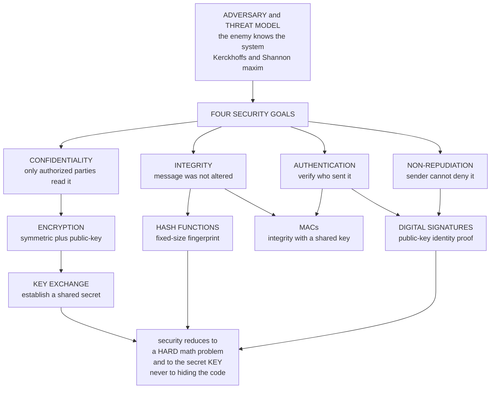

# 🔐 Cryptography Overview

> [!abstract] TL;DR
> Cryptography is the mathematical science of securing communication and computation in the presence of **adversaries** — from the Greek *kryptós graphein*, "hidden writing." Modern cryptography is a rigorous, provable discipline, not a bag of clever secret codes. It pursues four **security goals** — *confidentiality, integrity, authentication, non-repudiation* — delivered by a small toolbox of **primitives**: ciphers (secrecy), hash functions (integrity), MACs (integrity + authentication with a shared key), digital signatures (authentication + non-repudiation with public keys), and key exchange (establishing shared secrets). Its founding doctrine is **Kerckhoffs's principle**: a system must stay secure even when the enemy knows *everything except the key*. Security therefore rests on the secrecy of the **key** and on the **hardness of math problems**, never on hiding the algorithm — the reason real crypto is open, peer-reviewed, and "security through obscurity" is a fallacy. This note is the entry point to a theory-and-math vault that sits beneath the applied [[Symmetric_Encryption|Cybersecurity crypto notes]].

---

## Intuition

**Analogy:** Cryptography is the art of designing a lockbox that stays secure *even when the enemy holds the blueprints, owns an identical factory, and has a million years to pick it.* You do not win by hiding how the lock is built — assume the attacker already knows. You win because a tiny secret (a **key**) plus a genuinely hard mathematical puzzle makes forcing the box open *computationally hopeless*. A good safe manufacturer publishes the mechanism and dares the world to break it; the security lives entirely in the combination, not in the mystery of the gears.

That is the whole game. Take away the mystery — publish the algorithm, hand the adversary the source code — and a well-designed cryptosystem is *still* unbreakable, because the hard part was never the secrecy of the design. It was the astronomically large space of keys and the mathematics that makes searching it infeasible.

---

## How It Works

Cryptography starts by refusing to hand-wave the word "secure." You cannot claim a system is secure without stating **against whom** and **what they can do**. So every construction has three ingredients: a set of **security goals** it promises, a set of **primitives** that deliver them, and an explicit **threat model** describing the adversary. Break any one and "secure" is meaningless.

### The four security goals (the CIA-plus triad)

1. **Confidentiality** — only authorized parties can read the message. An eavesdropper sees ciphertext and learns nothing useful.
2. **Integrity** — the message was not altered in transit. Any tampering is detectable.
3. **Authentication** — you can verify *who* sent the message or *who* you are talking to (data-origin and entity authentication).
4. **Non-repudiation** — the sender cannot later deny having sent it. This is stronger than authentication and needs asymmetric math.

### The primitives that provide them

- **Encryption** (symmetric or public-key) provides **confidentiality**.
- **Hash functions** produce a fixed-size fingerprint of data, the backbone of **integrity**.
- **MACs** (message authentication codes) give **integrity + authentication** using a *shared secret key*.
- **Digital signatures** give **authentication + non-repudiation** using *public keys* — anyone can verify, only the holder of the private key can produce.
- **Key exchange** (Diffie–Hellman and friends) lets two strangers agree on a shared secret over a public channel, bootstrapping everything above.

### The threat model — you must name the adversary

Security is always *relative to an attacker*. Cryptographers classify them along two axes:

- **What the attacker can see or do:** *ciphertext-only* (weakest), *known-plaintext*, *chosen-plaintext (CPA)* — the attacker can encrypt messages of their choosing, and *chosen-ciphertext (CCA)* — the attacker can also get chosen ciphertexts decrypted (the strongest, most realistic model). Passive **eavesdropping** vs active **tampering / man-in-the-middle** is the other cut.
- **How much computing power they have:** *unbounded* (information-theoretic setting) vs *feasible / polynomial-time* (the computational setting all real systems live in).



### Kerckhoffs's principle — the foundational doctrine

Auguste Kerckhoffs (1883) argued a military cipher must remain secure **even if everything about it except the key becomes public**. Shannon restated it bluntly: *"the enemy knows the system."* The consequences are enormous:

- Security rests on the **secrecy of the key**, not the secrecy of the algorithm.
- Real cryptography is therefore **open, published, and peer-reviewed** — an algorithm survives only after years of public attack (this is why AES, SHA-3, and TLS were chosen through open competitions).
- **"Security through obscurity" is a fallacy.** A hidden algorithm gains you nothing durable: it will leak, be reverse-engineered, or be broken by analysis that never needed the source in the first place (see the Python demo, where a "secret" Caesar cipher falls to frequency analysis *without* the attacker being told the algorithm).

### Computational vs information-theoretic security

There are exactly two ways to be "secure," and they mean very different things:

- **Information-theoretic (perfect) security** — secure against an adversary with *unlimited* computation. The **one-time pad** (Shannon, 1949) achieves it: the ciphertext is statistically independent of the plaintext, so it reveals *literally nothing*. The catch is Shannon's bound — the key must be truly random and *at least as long as the message*, making it impractical for everyday use. See [[Information_Theoretic_Security_and_Privacy]].
- **Computational security** — secure against a *feasible* (polynomial-time) adversary. It relies on **hard problems** (integer factoring, discrete logarithm, lattice problems): breaking the scheme would take billions of years on all the world's hardware. This is the basis of *all* practical cryptography. It is not unbreakable in principle — merely infeasible to break in practice, an assumption that can be undermined by better algorithms or by quantum computers (see [[Shors_Factoring_Algorithm]]).

### The key distinction — symmetric vs public-key

- **Symmetric** cryptography uses the *same secret key* to encrypt and decrypt (AES, ChaCha20). It is fast and compact but suffers the **key-distribution problem**: how do two parties share a secret key without already having a secure channel?
- **Public-key (asymmetric)** cryptography uses a *key pair* — a public key encrypts (or verifies), a private key decrypts (or signs). It solves key distribution and enables signatures, but it is comparatively **slow**.
- Real systems are **hybrid**: use public-key crypto (or a key-exchange) to agree on a fresh symmetric key, then do the bulk encryption symmetrically. This is exactly how TLS/HTTPS works.

### The modern foundation — provable security

Since the 1980s (Goldwasser and Micali) cryptography became a *science of definitions and proofs*. A construction is accompanied by:

- A **precise security definition** — e.g. **IND-CPA** (ciphertexts are indistinguishable under chosen-plaintext attack) for encryption, **EUF-CMA** (existential unforgeability under chosen-message attack) for signatures.
- A **reduction** — a proof that *any* efficient attacker who breaks the scheme could be turned into an efficient algorithm for a believed-hard math problem. If the problem is hard, the scheme is secure.

The practical rule that follows: **"don't roll your own crypto."** Use vetted, formally-analyzed constructions, because subtle definitional gaps — not broken math — cause the vast majority of real-world failures.

### Map of this vault

This vault is the **theory and mathematics** beneath the applied [[Symmetric_Encryption|Cybersecurity crypto notes]], organized into six sections:

1. **Mathematical Foundations** (this section) — probability, number theory, groups/fields, and the security definitions.
2. **Symmetric Cryptography** — block ciphers, AES, stream ciphers, hash functions, MACs, modes.
3. **Public-Key Cryptography** — RSA, Diffie–Hellman, elliptic curves, signatures, the hardness assumptions they rest on.
4. **Protocols and Applications** — key exchange, PKI, TLS, secure messaging, authenticated encryption.
5. **Advanced Cryptography** — zero-knowledge proofs, homomorphic encryption, secure multiparty computation, commitments.
6. **Cryptanalysis and Frontiers** — attacks, side channels, and post-quantum cryptography.

*(Sibling notes such as `Symmetric_Encryption_Fundamentals`, `Public_Key_Cryptography_Foundations`, `Hash_Functions`, `Digital_Signatures`, `Message_Authentication_Codes`, `Key_Exchange_and_PKI`, `Provable_Security_and_Reductions`, `Computational_Hardness_Assumptions`, `Block_Ciphers_and_AES`, `Probability_and_Information_Theoretic_Security`, and `The_Reach_and_Future_of_Cryptography` are planned for this vault and referenced here in prose until they exist.)*

---

## Key Concepts

### Secondary (intuitive)
- **Cryptography** = keeping secrets and proving trust when someone is actively trying to cheat you.
- **The key** is the secret; the **algorithm** is public. Assume the attacker already has the source code.
- **Confidentiality** = they can't read it. **Integrity** = they can't change it undetected. **Authentication** = you know who you're talking to. **Non-repudiation** = they can't deny they said it.
- "**Security through obscurity**" (hiding how it works) is not real security — a hidden lock is not a strong lock.

### Undergraduate (formal)
- **Kerckhoffs's principle:** a cryptosystem is secure if it remains secure when everything but the key is public knowledge.
- **Symmetric vs public-key:** one shared secret key (fast, key-distribution problem) vs a public/private key pair (solves distribution, enables signatures, slower). Real systems are **hybrid**.
- **Primitive → goal map:** encryption → confidentiality; hash → integrity; MAC → integrity + authentication (shared key); signature → authentication + non-repudiation (public key); key exchange → shared secret.
- **Threat models:** ciphertext-only ⊂ known-plaintext ⊂ chosen-plaintext (CPA) ⊂ chosen-ciphertext (CCA); passive vs active adversaries; bounded vs unbounded compute.
- **Two security notions:** *information-theoretic* (unbounded adversary, one-time pad, needs H(K) ≥ H(M)) vs *computational* (feasible adversary, rests on hardness assumptions) — see [[Information_Theoretic_Security_and_Privacy]].

### Graduate (advanced)
- **Provable security via reduction:** exhibit a polynomial-time reduction from a hard problem P (factoring, discrete log, LWE) to breaking the scheme; if no efficient algorithm solves P, no efficient attacker breaks the scheme. The scheme's security is *conditional* on the assumption.
- **Security definitions as games:** IND-CPA and IND-CCA (indistinguishability against chosen-plaintext/ciphertext), EUF-CMA (signature unforgeability), and the semantic-security formulation (Goldwasser–Micali) — security = no efficient adversary wins the game with non-negligible advantage.
- **Negligible advantage & asymptotics:** security is stated in a security parameter n; "hard" means success probability is a negligible function of n and running time is polynomial — the framing that connects cryptography to [[P_versus_NP|complexity theory]] and [[Complexity_Cryptography_and_Average_Case_Hardness|average-case hardness]].
- **The number-theoretic substrate:** modular arithmetic, groups, rings and finite fields underpin RSA and elliptic-curve crypto — see [[Modular_Arithmetic]] and [[Groups_and_Subgroups]].
- **Random oracles & idealized models:** many proofs assume hash functions behave like random functions (the random-oracle model), a heuristic whose gap to reality is an active research theme.
- **Interactive proofs and zero knowledge:** prove a statement is true while revealing nothing beyond its truth — the frontier where cryptography meets complexity, see [[Interactive_Proofs_and_Zero_Knowledge]].

---

## Python Demo

```python
# Kerckhoffs's principle in code. Three lessons in one script:
#  (1) a "secret" Caesar cipher is broken by FREQUENCY ANALYSIS even though the
#      attacker is never told the algorithm  -> obscurity buys nothing.
#  (2) a one-time pad is UNBREAKABLE even with the algorithm fully public,
#      because its ciphertext is consistent with EVERY plaintext of equal length
#      -> security rests entirely on the KEY (information-theoretic security).
#  (3) keyspace size, not secrecy of the code, decides computational feasibility.
# Pure stdlib + matplotlib (no numpy required).
import string, secrets, math
import matplotlib.pyplot as plt

# Relative English letter frequencies (percent) used to score "Englishness".
ENGLISH = {
    'a':8.17,'b':1.49,'c':2.78,'d':4.25,'e':12.70,'f':2.23,'g':2.02,
    'h':6.09,'i':6.97,'j':0.15,'k':0.77,'l':4.03,'m':2.41,'n':6.75,
    'o':7.51,'p':1.93,'q':0.10,'r':5.99,'s':6.33,'t':9.06,'u':2.76,
    'v':0.98,'w':2.36,'x':0.15,'y':1.97,'z':0.07,
}

PLAINTEXT = ("the enemy knows the system so security must rest on the secrecy "
             "of the key and never on the secrecy of the algorithm itself")

# ============================================================
# 1. A "SECRET" ALGORITHM: Caesar shift. The attacker is NOT told the shift.
# ============================================================
def caesar(text, shift):
    out = []
    for ch in text:
        if ch.isalpha():
            out.append(chr((ord(ch) - 97 + shift) % 26 + 97))
        else:
            out.append(ch)
    return ''.join(out)

secret_shift = secrets.randbelow(26)              # the tiny 26-key "secret"
ciphertext   = caesar(PLAINTEXT, secret_shift)

def chi_squared(text):
    """Lower score = more English-like."""
    letters = [c for c in text if c.isalpha()]
    n = len(letters)
    score = 0.0
    for c in string.ascii_lowercase:
        observed = letters.count(c)
        expected = ENGLISH[c] / 100.0 * n
        if expected > 0:
            score += (observed - expected) ** 2 / expected
    return score

# BREAK IT: try all 26 candidate shifts, keep the most English-looking one.
scores     = [chi_squared(caesar(ciphertext, (26 - g) % 26)) for g in range(26)]
best_shift = min(range(26), key=lambda g: scores[g])
recovered  = caesar(ciphertext, (26 - best_shift) % 26)

print("hidden shift (the 'secret' algorithm):", secret_shift)
print("shift recovered by frequency analysis:", best_shift)
print("cracked plaintext:", recovered[:45], "...")
print("attack succeeded  :", recovered == PLAINTEXT)

# ============================================================
# 2. A PROPER CIPHER: one-time pad. Algorithm public; security is the KEY.
# ============================================================
def xor_bytes(a, b):
    return bytes(x ^ y for x, y in zip(a, b))

msg     = PLAINTEXT.encode()
otp_key = secrets.token_bytes(len(msg))           # truly random key == message length
otp_ct  = xor_bytes(msg, otp_key)

# The pad leaks NOTHING: for the SAME ciphertext we can forge a key that
# "decrypts" it to any message of equal length. So the ciphertext pins nothing.
lie        = b"attack the north bridge at exactly high noon this coming friday"
lie        = lie.ljust(len(msg), b" ")[:len(msg)]
forged_key = xor_bytes(otp_ct, lie)               # key such that ct XOR key == lie
print("\nSame OTP ciphertext also 'decrypts' to a totally different message:")
print("  ", xor_bytes(otp_ct, forged_key).decode())
print("both keys are equally valid -> ciphertext reveals nothing at all")

# ============================================================
# 3. COMPUTATIONAL vs INFORMATION-THEORETIC: keyspace vs brute-force time
# ============================================================
GUESSES_PER_SEC = 1e12                             # optimistic: a trillion keys/sec
schemes   = ["Caesar\n26", "Substitution\n26!", "DES\n2^56",
             "AES-128\n2^128", "AES-256\n2^256"]
keyspaces = [26, math.factorial(26), 2**56, 2**128, 2**256]
seconds   = [k / GUESSES_PER_SEC for k in keyspaces]
AGE_UNIVERSE = 4.35e17                              # seconds since the Big Bang

# ---------------- visualize both lessons ----------------
fig, ax = plt.subplots(1, 2, figsize=(14, 5))

colors = ["#2ecc71" if g == best_shift else "#3498db" for g in range(26)]
ax[0].bar(range(26), scores, color=colors)
ax[0].set_xlabel("guessed shift (candidate key)")
ax[0].set_ylabel("chi-squared vs English  (lower = more English)")
ax[0].set_title("Breaking a 'secret' Caesar cipher by frequency analysis")
ax[0].annotate("recovered key", xy=(best_shift, scores[best_shift]),
               xytext=(best_shift + 2, max(scores) * 0.55),
               arrowprops=dict(arrowstyle="->"))

ax[1].bar(schemes, seconds, color="#9b59b6")
ax[1].set_yscale("log")
ax[1].set_ylabel("brute-force time at 1e12 keys/sec  (seconds, log scale)")
ax[1].set_title("Keyspace size, not secrecy of the code, decides feasibility")
ax[1].axhline(AGE_UNIVERSE, color="red", ls="--", label="age of the universe")
ax[1].legend()

plt.tight_layout()
plt.show()

# Takeaways:
#  * Caesar's 26-key space collapses instantly under frequency analysis whether
#    or not the attacker was 'told' the algorithm -> obscurity is worthless.
#  * The one-time pad's ciphertext is consistent with EVERY equal-length message
#    -> information-theoretically unbreakable, resting entirely on the key.
#  * AES-128 and up push brute force past the age of the universe -> computationally
#    secure: not unbreakable in principle, just infeasible in practice.
```

Running it prints the recovered Caesar shift (matching the "secret" shift the attacker was never told), shows the one-time-pad ciphertext plausibly "decrypting" to a completely different message, and plots (left) the frequency-analysis break with the recovered key highlighted, and (right) brute-force time versus keyspace on a log scale, with AES-128 sitting far above the age of the universe.

---

## Real-World Applications

> **Example — TLS / HTTPS.** Every padlock in your browser is this note in action. TLS uses a **hybrid** design: an elliptic-curve **key exchange** (ECDHE) establishes a fresh shared secret, a **digital signature** on the server's certificate provides authentication (and the PKI chains that trust), and **AEAD symmetric encryption** (AES-GCM or ChaCha20-Poly1305) provides confidentiality *and* integrity for the bulk data. Its algorithms are fully public — Kerckhoffs in production — see [[TLS_Protocol_Deep_Dive]].

- **Secure messaging** (Signal, WhatsApp, iMessage): the Double Ratchet combines key exchange, symmetric encryption, and MACs for forward-secret, authenticated chat.
- **Banking, e-commerce, and payments:** card networks and open banking rely on symmetric encryption, HMAC integrity, and signatures for transaction authorization and non-repudiation.
- **Passwords and authentication:** password *hashing* (Argon2, bcrypt) and HMAC-based tokens protect credentials at rest and in transit — see [[Hash_Functions_and_MACs]].
- **Blockchain and cryptocurrencies:** digital signatures authorize transactions, hash functions chain blocks, and Merkle trees prove membership — cryptography *is* the ledger's trust model.
- **Software supply chain:** code signing and hash-based integrity verify that a download is the genuine, untampered artifact.

---

## Common Pitfalls

- **Rolling your own crypto** — hand-built ciphers and protocols almost always have subtle, catastrophic flaws that only years of public review reveal. Use vetted, proven libraries and standard constructions.
- **Security through obscurity** — relying on the secrecy of the algorithm rather than the key. It violates Kerckhoffs's principle, and once the code leaks (it always does) the system is naked. The demo shows a hidden Caesar cipher falling with the algorithm never disclosed.
- **Confusing computational and information-theoretic security** — AES-256 is *not* "unbreakable," only currently infeasible to brute-force; only the one-time pad (and similar unconditional schemes) survive unlimited computation.
- **Claiming "secure" without a threat model** — a scheme secure against a passive eavesdropper (ciphertext-only) can be trivially broken by an active CCA adversary. Always ask "secure against *whom*, able to do *what*?"
- **Reusing a one-time pad** — the "two-time pad" leaks C₁ ⊕ C₂ = M₁ ⊕ M₂ and collapses perfect secrecy; the guarantee holds *only* if the key is truly random, message-length, and used exactly once.
- **Confidentiality without integrity** — encryption alone does not stop tampering. Unauthenticated ciphertext is malleable; use authenticated encryption (AEAD) or encrypt-then-MAC.
- **Weak randomness** — keys, nonces, and IVs from a predictable PRNG silently destroy security even when the algorithm is perfect. Always use a cryptographically secure RNG (`secrets`, `os.urandom`).

---

## Related Concepts

- [[Symmetric_Encryption]] — the applied companion: AES, modes, AEAD, and password KDFs implementing the confidentiality primitive.
- [[Asymmetric_Cryptography_and_PKI]] — public-key encryption, signatures, and the PKI that operationalizes authentication and non-repudiation.
- [[Hash_Functions_and_MACs]] — the integrity primitives (hashes) and the shared-key integrity + authentication primitive (MACs).
- [[TLS_Protocol_Deep_Dive]] — the flagship hybrid protocol tying key exchange, signatures, and symmetric AEAD together.
- [[Post_Quantum_Cryptography]] — what happens to computational security when quantum computers threaten factoring and discrete-log assumptions.
- [[Information_Theoretic_Security_and_Privacy]] — the one-time pad, perfect secrecy, and Shannon's H(K) ≥ H(M) bound; the unconditional-security half of the story.
- [[Entropy_and_Information_Content]] — measures the uncertainty of keys and secrets; min-entropy sets guessing resistance.
- [[Modular_Arithmetic]] — the arithmetic of finite structures underpinning RSA, Diffie–Hellman, and elliptic curves.
- [[Divisibility_and_Primes]] — primes and factoring are the hard problems public-key crypto is built on.
- [[Groups_and_Subgroups]] — the algebraic setting for discrete-log and elliptic-curve cryptography.
- [[Complexity_Cryptography_and_Average_Case_Hardness]] — why cryptography needs *average-case* hard problems, connecting it to complexity theory.
- [[P_versus_NP]] — the open question whose resolution would reshape what "computationally secure" can mean.
- [[Interactive_Proofs_and_Zero_Knowledge]] — proving statements while revealing nothing, the frontier of provable-security cryptography.
- [[Shors_Factoring_Algorithm]] — the quantum algorithm that breaks RSA/ECC, the reason computational assumptions are not forever.

---

## Review Questions

1. **Conceptual:** State Kerckhoffs's principle and explain *why* it implies that publishing a cryptographic algorithm makes it stronger rather than weaker. Use "security through obscurity" as the counter-example and explain what real secrecy the security actually depends on.
2. **Scenario:** You are handed two systems. System A encrypts with a proprietary, undisclosed algorithm and a short key. System B uses published AES-256 with a random 256-bit key. An attacker eventually reverse-engineers both. Which system is still secure, and why? Frame your answer in terms of keyspace size, computational vs information-theoretic security, and the threat model.
3. **Trade-off:** Compare symmetric and public-key cryptography along *speed*, *key distribution*, and *the security goals each can provide* (confidentiality, authentication, non-repudiation). Explain precisely why real systems combine them into a hybrid scheme rather than choosing one, and give TLS as a concrete example.

---

## Sources

- [Kerckhoffs, "La cryptographie militaire," Journal des sciences militaires (1883)](https://www.petitcolas.net/kerckhoffs/crypto_militaire_1.pdf)
- [Shannon, "Communication Theory of Secrecy Systems," Bell System Technical Journal (1949)](https://ieeexplore.ieee.org/document/6769090)
- [Katz & Lindell, *Introduction to Modern Cryptography* (3rd ed., 2020)](https://www.cs.umd.edu/~jkatz/imc.html)
- [Goldwasser & Micali, "Probabilistic Encryption," Journal of Computer and System Sciences (1984)](https://people.csail.mit.edu/silvio/Selected%20Scientific%20Papers/Probabilistic%20Encryption/Probabilistic_Encryption.pdf)
- [Boneh & Shoup, *A Graduate Course in Applied Cryptography*](https://toc.cryptobook.us/)

---

#cryptography #security-goals #kerckhoffs #threat-models #crypto-primitives
