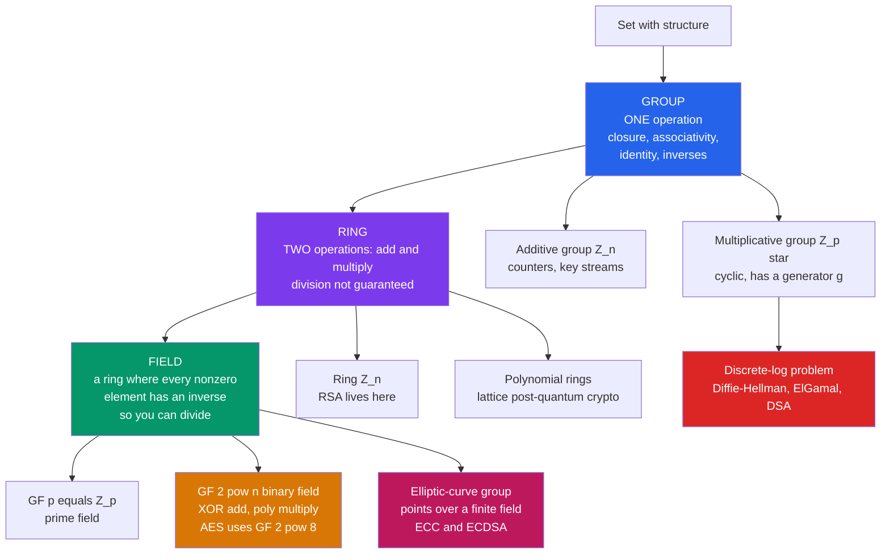

# 🔐 Groups, Rings, and Fields for Cryptography

> [!abstract] TL;DR
> Modern cryptography runs inside carefully chosen **finite algebraic structures**: **cyclic groups** power Diffie-Hellman and discrete-log crypto, **finite (Galois) fields** power AES and error-correcting codes, and **elliptic-curve groups** power efficient public-key crypto. Groups/rings/fields give you predictable arithmetic *and* provably hard-to-invert operations at the same time — that combination is exactly what a cipher needs.

---

## Intuition

**Analogy:** A **group** is any set of "things" where you can *combine* two of them and always *undo* the result — like the rotations of a clock, or the twists of a Rubik's cube. Every twist can be reversed; combining twists gives another twist; doing nothing is the "identity." That is *all* a group is: a set with one reversible operation.

Now push the analogy into cryptography. Imagine the clock has a prime number of positions and you keep multiplying (not adding) your way around it. The combining is easy — one multiplication — but if a friend hands you a position and asks *"how many times did we rotate to get here?"*, that question can be astronomically hard. Cryptography lives inside groups and fields precisely because they hand you **easy forward arithmetic** and a **hard reverse question** in the very same structure. Add a second operation (multiply *and* add, with division always available) and a group becomes a **field** — the setting where AES scrambles bytes.

---

## How It Works

### Core Mechanics

A cryptographer builds up structure in three layers, each adding power:

1. **Group** — one associative operation $\ast$ with an **identity** ($a \ast e = a$) and an **inverse** for every element ($a \ast a^{-1} = e$). If the operation also **commutes** ($a \ast b = b \ast a$) the group is **abelian**. Nearly all crypto groups are abelian.

2. **Ring** — *two* operations, "add" and "multiply." Addition forms an abelian group; multiplication is associative and distributes over addition — but multiplicative inverses need **not** exist. The integers mod $n$, $\mathbb{Z}_n$, form a ring. RSA lives in the ring $\mathbb{Z}_n$ because there you *cannot* always divide (that limitation is what makes factoring relevant).

3. **Field** — a ring where **every nonzero element has a multiplicative inverse**, so you can *divide*. $\mathbb{Q}$, $\mathbb{R}$, $\mathbb{C}$ are infinite fields; the crypto workhorses are **finite fields**.

**The two structures crypto leans on hardest:**

- **Cyclic groups & generators.** A group is **cyclic** if a single element $g$ (a **generator** or **primitive root**) produces *every* element by repeated application: $g^0, g^1, g^2, \dots$. The multiplicative group $\mathbb{Z}_p^\ast$ (nonzero residues mod a prime $p$, under multiplication) is always cyclic and has $\varphi(p-1)$ generators. The **discrete-log problem** — given $g$ and $g^x$, recover $x$ — is believed hard in well-chosen cyclic groups, and *that* is the foundation of Diffie-Hellman, ElGamal, and DSA. **Lagrange's theorem** guarantees the **order** of any element (the smallest $k$ with $g^k = e$) **divides** the group order — which is why large **prime-order subgroups** are chosen to defeat small-subgroup attacks.

- **Finite (Galois) fields $GF(q)$.** A finite field exists **exactly** when $q = p^n$ is a prime power. $GF(p) = \mathbb{Z}_p$ is just integers mod a prime. $GF(2^n)$ is a **binary field** whose elements are polynomials over $GF(2)$: **addition is XOR**, and **multiplication is polynomial multiplication modulo an irreducible polynomial**. $GF(2^8)$ — bytes — is the field of the AES S-box and MixColumns, and the same fields power Reed-Solomon and BCH codes.

- **Elliptic-curve groups.** The points on an elliptic curve over a finite field form an **abelian group** under a geometric "chord-and-tangent" addition. Doing discrete-log in *that* group gives the same security as $\mathbb{Z}_p^\ast$ with far smaller keys — the basis of ECC and ECDSA.

**Why structure matters:** cryptography needs operations that are **easy to compute but hard to invert**, *inside a well-understood algebraic setting*. Groups and fields provide both the predictable arithmetic (so honest parties can compute fast) and the hard problems (so attackers cannot reverse them). Choosing the *right* group — large prime order, no exploitable structure — is a security-critical decision, not a detail.

### Flow / Architecture



---

## Key Concepts

### Secondary (build the picture)
- A **group** is a set with one reversible operation (identity + inverses). A clock face under "advance by hours" is a group.
- A **field** additionally lets you add, subtract, multiply, **and divide** — like the rational numbers, but crypto uses *finite* versions.
- **Cyclic** means one element $g$ can generate the whole group by repetition — like a single gear driving every position on a dial.

### Undergraduate (the working machinery)
- **Order of an element** $a$: smallest $k>0$ with $a^k = e$. **Lagrange's theorem** — the order divides the group order (see [[Cosets_and_Lagrange_Theorem]]).
- **$\mathbb{Z}_p^\ast$ is cyclic** of order $p-1$ with $\varphi(p-1)$ generators; a **generator** (primitive root) hits every nonzero residue exactly once.
- **Discrete log**: given $g, g^x \bmod p$, find $x$. Easy forward, hard backward in good groups — the DH/ElGamal/DSA foundation.
- **$GF(2^8)$**: bytes as degree-$<8$ polynomials over $GF(2)$; add $=$ XOR; multiply $=$ poly-mult mod the AES irreducible polynomial $x^8 + x^4 + x^3 + x + 1$ (hex `0x11B`).

### Graduate (why it is secure)
- **Prime-order subgroups**: work in a subgroup of large prime order $q \mid p-1$ so element orders can't be small — this blocks **small-subgroup** and Pohlig-Hellman-style attacks; safe primes $p = 2q+1$ are the classic choice.
- **Field uniqueness**: $GF(p^n)$ is unique up to isomorphism; different irreducible polynomials give **isomorphic** fields (implementation choice, not security choice).
- **Structure-borne weakness**: MOV/Frey-Rück attacks, anomalous curves, and pairing-friendly structure show that *extra* algebraic structure can *reduce* security — the discrete-log hardness is a property of the *chosen* group, not of groups in general (see the broader hardness-assumption discussion below).

---

## Python Demo

```python
"""
Groups, Rings, Fields for Cryptography — exploring the structures crypto uses.

Part A: the multiplicative group Z_p*  -> find a GENERATOR, compute element
        orders, and verify Lagrange's theorem (order divides group order).
Part B: the finite field GF(2^8) (the field AES uses) -> XOR addition,
        polynomial multiplication modulo an irreducible polynomial, and a
        proof that EVERY nonzero element has a multiplicative inverse.

Pure standard library + matplotlib (numpy optional).
"""

import matplotlib.pyplot as plt

# ----------------------------------------------------------------------
# Part A: the multiplicative group  Z_p*  (nonzero residues mod prime p)
# ----------------------------------------------------------------------

def multiplicative_order(a, p):
    """Order of a in Z_p*: smallest k > 0 with a**k % p == 1."""
    k, x = 1, a % p
    while x != 1:
        x = (x * a) % p
        k += 1
    return k

def find_generator(p):
    """Smallest primitive root of Z_p* (an element of order p-1)."""
    for g in range(2, p):
        if multiplicative_order(g, p) == p - 1:
            return g
    raise ValueError("no generator found (is p prime?)")

P = 23                       # small prime; Z_p* has order p-1 = 22
group_order = P - 1
g = find_generator(P)
powers = [pow(g, k, P) for k in range(group_order)]   # g^0, g^1, ... g^21

print(f"Z_{P}* has order {group_order}, smallest generator g = {g}")
print(f"powers of g cycle through: {powers}")
# A generator visits EVERY nonzero residue exactly once:
assert sorted(powers) == list(range(1, P)), "g must generate the whole group"

# Lagrange: the order of every element divides the group order.
orders = {a: multiplicative_order(a, P) for a in range(1, P)}
assert all(group_order % o == 0 for o in orders.values()), "Lagrange violated!"
print(f"all element orders divide {group_order} -> Lagrange holds")

# ----------------------------------------------------------------------
# Part B: the finite field  GF(2^8)  (AES's field)
#   elements = bytes 0..255 = polynomials over GF(2)
#   addition       = XOR
#   multiplication = polynomial mult modulo the AES irreducible polynomial
#                    0x11B = x^8 + x^4 + x^3 + x + 1
# ----------------------------------------------------------------------

AES_MODULUS = 0x11B

def gf_add(a, b):
    return a ^ b             # characteristic 2: addition is XOR

def gf_mul(a, b):
    """Multiply in GF(2^8) modulo AES_MODULUS (Russian-peasant method)."""
    result = 0
    while b:
        if b & 1:
            result ^= a
        b >>= 1
        a <<= 1
        if a & 0x100:         # degree hit 8 -> reduce modulo the polynomial
            a ^= AES_MODULUS
    return result

# 0x03 is a generator of the multiplicative group GF(2^8)*  (order 255).
GEN = 0x03
exp_table = [0] * 256        # exp_table[k] = GEN^k
log_table = [0] * 256
x = 1
for k in range(255):
    exp_table[k] = x
    log_table[x] = k
    x = gf_mul(x, GEN)
assert gf_mul(exp_table[254], GEN) == 1          # GEN^255 == 1 closes the cycle
assert sorted(exp_table[:255]) == list(range(1, 256))
print("0x03 generates all 255 nonzero elements of GF(2^8)")

def gf_inv(a):
    """Multiplicative inverse via logs: a^-1 = GEN^(255 - log a)."""
    if a == 0:
        raise ZeroDivisionError("0 has no inverse")
    return exp_table[(255 - log_table[a]) % 255]

# FIELD AXIOM: every nonzero element has a multiplicative inverse.
assert all(gf_mul(a, gf_inv(a)) == 1 for a in range(1, 256))
print("verified: every nonzero element of GF(2^8) is invertible -> it is a field")

# ----------------------------------------------------------------------
# Visualize both structures
# ----------------------------------------------------------------------
import math

fig, ax = plt.subplots(2, 2, figsize=(13, 11))

# (1) The cyclic walk of Z_p*: powers of g placed around a circle.
angles = [2 * math.pi * k / group_order for k in range(group_order)]
xs = [math.cos(t) for t in angles]
ys = [math.sin(t) for t in angles]
ax[0, 0].plot(xs + [xs[0]], ys + [ys[0]], "-", color="#94a3b8", zorder=1)
ax[0, 0].scatter(xs, ys, c=range(group_order), cmap="viridis", s=260, zorder=2)
for k, (px, py) in enumerate(zip(xs, ys)):
    ax[0, 0].annotate(str(powers[k]), (px, py), ha="center", va="center",
                      color="white", fontsize=9, fontweight="bold", zorder=3)
ax[0, 0].set_title(f"Z_{P}*: powers of generator g={g} walk the whole cycle\n"
                   f"(label = g^k mod {P}; color = exponent k)")
ax[0, 0].set_aspect("equal"); ax[0, 0].axis("off")

# (2) Element orders — Lagrange: every bar is a divisor of the group order.
elems = list(orders.keys())
vals = [orders[a] for a in elems]
divisors = [d for d in range(1, group_order + 1) if group_order % d == 0]
colors = ["#dc2626" if v == group_order else "#2563eb" for v in vals]
ax[0, 1].bar(elems, vals, color=colors)
for d in divisors:
    ax[0, 1].axhline(d, color="#cbd5e1", ls="--", lw=0.8, zorder=0)
ax[0, 1].set_title(f"Order of each element of Z_{P}*\n"
                   f"red = generator (order {group_order}); "
                   f"dashed lines = divisors of {group_order}")
ax[0, 1].set_xlabel("element a"); ax[0, 1].set_ylabel("order of a")

# (3) GF(2^8) multiplication table (structure of the whole field).
mul_table = [[gf_mul(a, b) for b in range(256)] for a in range(256)]
im = ax[1, 0].imshow(mul_table, cmap="twilight", origin="lower")
ax[1, 0].set_title("GF(2^8) multiplication table  a*b\n"
                   "(256x256; structured yet non-obvious)")
ax[1, 0].set_xlabel("b"); ax[1, 0].set_ylabel("a")
fig.colorbar(im, ax=ax[1, 0], fraction=0.046, pad=0.04)

# (4) The generator "scrambles": exponent k vs value GEN^k (discrete-log preview).
ax[1, 1].scatter(range(255), exp_table[:255], s=8, color="#7c3aed")
ax[1, 1].set_title("GF(2^8): value of 0x03^k vs exponent k\n"
                   "no visible pattern -> discrete log is hard")
ax[1, 1].set_xlabel("exponent k"); ax[1, 1].set_ylabel("0x03^k  (byte value)")

plt.tight_layout()
plt.show()
```

Running it prints that `g = 5` generates all of $\mathbb{Z}_{23}^\ast$, that every element order divides $22$ (Lagrange), and that all $255$ nonzero bytes of $GF(2^8)$ are invertible. The four panels make the structure visible: the generator's powers walk a single closed cycle, element orders are all divisors of the group order, the $GF(2^8)$ multiplication table is fully structured yet non-obvious, and the "exponent vs value" scatter looks like noise — a first glimpse of why **discrete log** is hard.

---

## Real-World Applications

> **AES (symmetric encryption).** Every AES round does arithmetic in $GF(2^8)$: the S-box computes a multiplicative **inverse** in the field (then an affine map), and MixColumns multiplies bytes by fixed field elements. The whole cipher only works because $GF(2^8)$ is a genuine field where those inverses exist. See [[Symmetric_Encryption]].

> **Diffie-Hellman / ElGamal / DSA.** These operate in the cyclic group $\mathbb{Z}_p^\ast$ (or a large prime-order subgroup of it). Security rests on the **discrete-log** hardness — easy to compute $g^x$, infeasible to recover $x$. See [[Asymmetric_Cryptography_and_PKI]].

> **Elliptic-curve crypto (ECDSA, ECDH, X25519).** Points on a curve over a finite field form an abelian group; discrete-log there needs far larger effort per bit, so a 256-bit ECC key rivals a 3072-bit RSA key.

> **Reed-Solomon & BCH codes.** QR codes, CDs, DVDs, and deep-space links encode data as polynomials over $GF(2^m)$ and use field arithmetic to correct errors. See [[Linear_Block_Codes_and_Reed_Solomon]].

> **Lattice-based post-quantum crypto (Kyber, Dilithium).** These live in **polynomial rings** such as $\mathbb{Z}_q[x]/(x^n+1)$ — rings, not fields, chosen so that structured lattice problems stay hard even against quantum computers. See [[Post_Quantum_Cryptography]].

---

## Common Pitfalls

- **Assuming a ring is a field.** In $\mathbb{Z}_n$ with composite $n$, not every element is invertible (only those coprime to $n$). Code that "divides" mod a composite silently breaks. Inverses exist for *all* nonzero elements only in a field ($GF(p)$ or $GF(p^n)$).
- **Small-subgroup attacks.** Using a generator of the *full* $\mathbb{Z}_p^\ast$ (order $p-1$, often smooth) lets an attacker confine keys to a tiny subgroup and recover secrets. Fix: work in a **large prime-order** subgroup and validate that received points/elements actually lie in it.
- **Non-prime "primes."** Discrete-log and RSA moduli assume genuine primes; a composite that passes weak testing wrecks the group structure. Use vetted primality tests and standardized groups.
- **Wrong or reducible modulus polynomial for $GF(2^n)$.** Multiplication is only a field operation modulo an **irreducible** polynomial. Pick a reducible one and inverses vanish; pick a different irreducible one and you get an isomorphic-but-incompatible field (interop bugs, not security). AES fixes $x^8 + x^4 + x^3 + x + 1$.
- **Confusing additive and multiplicative structure.** In $\mathbb{Z}_p$ the additive group is cyclic of order $p$ (trivial discrete log), while the *multiplicative* group $\mathbb{Z}_p^\ast$ of order $p-1$ is where the hardness lives. Discrete-log crypto is multiplicative.
- **Treating "more structure" as safer.** Extra algebraic structure (special curves, low embedding degree) can *enable* attacks. Prefer standardized, structure-audited groups.

---

## Related Concepts

- [[Groups_and_Subgroups]] — the pure-math definition of groups, subgroups, and generators that crypto specializes to finite cyclic groups.
- [[Cosets_and_Lagrange_Theorem]] — Lagrange's theorem, the reason element orders must divide the group order (and why prime-order subgroups are safe).
- [[Rings_and_Ideals]] — the ring structure of $\mathbb{Z}_n$ where RSA lives and why not every element is invertible.
- [[Fields_and_Field_Extensions]] — fields, characteristic, and finite fields $GF(p^n)$ from the abstract-algebra side.
- [[Polynomial_Rings_and_Factorization]] — polynomial rings and irreducibility, the machinery behind $GF(2^n)$ and lattice PQC rings.
- [[Galois_Theory]] — the deeper theory of finite fields and their automorphisms (Frobenius), naming Galois fields.
- [[Symmetric_Encryption]] — AES and its $GF(2^8)$ S-box / MixColumns arithmetic in practice.
- [[Asymmetric_Cryptography_and_PKI]] — Diffie-Hellman, ElGamal, and DSA built on cyclic-group discrete log.
- [[Linear_Block_Codes_and_Reed_Solomon]] — finite fields powering error-correcting codes.
- [[Post_Quantum_Cryptography]] — polynomial-ring lattice schemes that generalize this algebra for quantum resistance.

> Companion Cryptography-vault notes still to be written — reference in prose for now: *Modular Arithmetic and Number Theory*, *Elliptic Curve Cryptography*, *Block Ciphers and AES*, *Diffie-Hellman and Discrete Log*, *RSA*, and *Computational Hardness Assumptions*.

---

## Review Questions

**Tier 1 — Foundational**
1. What three properties must a set-with-operation satisfy to be a group, and what extra property makes a **field** out of a ring? Give one everyday example of each.

**Tier 2 — Undergraduate**
2. $\mathbb{Z}_{23}^\ast$ has order 22. By Lagrange, what element orders are even *possible*, and how many generators does the group have? If you needed a subgroup immune to small-subgroup attacks, which order would you pick and why?

**Tier 3 — Graduate**
3. AES computes its S-box as a multiplicative inverse in $GF(2^8)$. Explain (a) why that inverse is guaranteed to exist, (b) why choosing a *reducible* modulus polynomial would break the S-box, and (c) why swapping to a *different irreducible* degree-8 polynomial changes the byte values but not the security — grounding each answer in group/field structure.

---

## Sources

- Menezes, van Oorschot, Vanstone — *Handbook of Applied Cryptography*, Ch. 2–3 (algebraic background, groups & finite fields). [Free online](https://cacr.uwaterloo.ca/hac/)
- NIST FIPS 197 — *Advanced Encryption Standard (AES)*, Sec. 4 (arithmetic in $GF(2^8)$). [PDF](https://nvlpubs.nist.gov/nistpubs/FIPS/NIST.FIPS.197-upd1.pdf)
- Hoffstein, Pipher, Silverman — *An Introduction to Mathematical Cryptography*, 2nd ed. (Springer). [Publisher](https://link.springer.com/book/10.1007/978-1-4939-1711-2)
- Katz, Lindell — *Introduction to Modern Cryptography*, 3rd ed. (number-theoretic and algebraic foundations). [Book site](https://www.cs.umd.edu/~jkatz/imc.html)
- Lidl, Niederreiter — *Finite Fields* (Cambridge, Encyclopedia of Mathematics). [Publisher](https://www.cambridge.org/core/books/finite-fields/6ADBE60524B0E45B9691E1E6FF31DCA7)

---

#cryptography #group-theory #finite-fields #cyclic-groups #galois-fields
