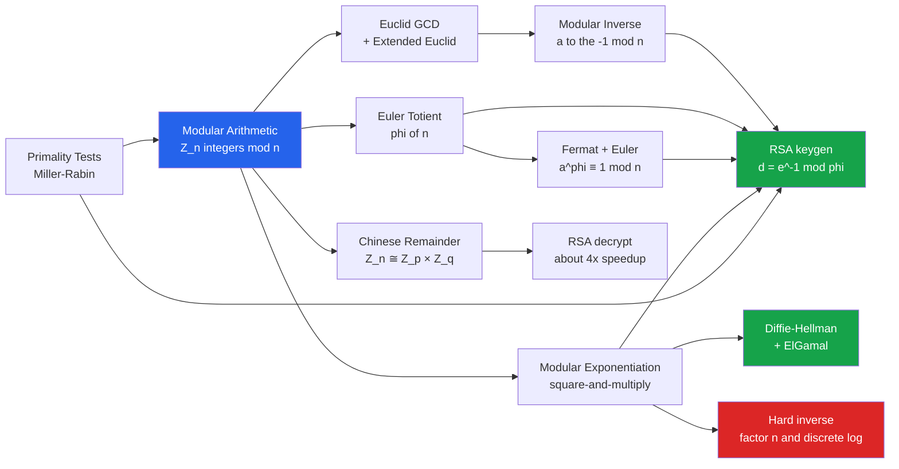

# 🔑 Modular Arithmetic and Number Theory

> [!abstract] TL;DR
> Public-key cryptography runs on a handful of number-theory tools: arithmetic in $\mathbb{Z}_n$, the Euclidean algorithm (for modular inverses), Euler's totient $\varphi(n)$, Fermat's and Euler's theorems, the Chinese Remainder Theorem, and fast modular exponentiation. These operations are *easy forward* (multiply primes, exponentiate) but their inverses (factor $n=pq$, take a discrete log) are *believed hard* — and that one-way asymmetry is exactly what RSA and Diffie-Hellman turn into secrets.

---

## Intuition

**Analogy:** Modular arithmetic is **clock math**. On a 12-hour clock, $10 + 5 = 3$, not $15$, because you wrap around at 12. Time never runs off to infinity — it lives in a bounded loop of 12 positions.

Cryptography lives in exactly this wrap-around world, just with a much bigger clock (thousands of bits around). Two things make it a hiding place for secrets. First, numbers stay **bounded**, so arithmetic on gigantic values remains tractable. Second, some operations are **easy one way but fiendishly hard to reverse**: given the clock's current position after many laps, you cannot cheaply recover how many laps were taken. Multiplying two large primes is quick; un-multiplying (factoring) their product is not. Exponentiating on the clock is quick; finding the exponent that got you there (the discrete log) is not. That gap between forward and backward is where the padlock lives.

---

## How It Works

### Core Mechanics

The "number theory for crypto" toolkit is a short, tightly-connected chain. Each tool unlocks the next, and together they assemble RSA and Diffie-Hellman.

1. **Modular arithmetic in $\mathbb{Z}_n$.** Work only with remainders $\{0, 1, \ldots, n-1\}$. We say $a \equiv b \pmod{n}$ when $n$ divides $a-b$. Addition and multiplication respect the wrap, so $\mathbb{Z}_n$ is a commutative **ring**; when $n$ is prime it is even a **field** (every nonzero element is invertible). Crypto works here because the state space is *finite and bounded* — you can raise huge numbers to huge powers without the value exploding.
2. **Euclidean algorithm** computes $\gcd(a, b)$ in $O(\log \min(a,b))$ steps by repeated remaindering. The **extended** version also returns Bezout coefficients $x, y$ with $ax + by = \gcd(a,b)$.
3. **Modular inverse.** If $\gcd(a, n) = 1$, then $ax \equiv 1 \pmod n$ has a solution — read straight off Bezout's $x$. This is the "division" of the clock world. RSA key generation *is* a modular inverse: $d \equiv e^{-1} \pmod{\varphi(n)}$.
4. **Euler's totient $\varphi(n)$** counts integers in $[1, n]$ coprime to $n$. Two facts drive RSA: $\varphi(p) = p-1$ for prime $p$, and $\varphi(pq) = (p-1)(q-1)$ for distinct primes — a value only someone who knows the factorization of $n$ can compute.
5. **Fermat's Little Theorem / Euler's Theorem.** For prime $p$ and $\gcd(a,p)=1$: $a^{p-1} \equiv 1 \pmod p$. The generalization for any $n$ with $\gcd(a,n)=1$: $a^{\varphi(n)} \equiv 1 \pmod n$. This is *why RSA decryption works* — because $ed \equiv 1 \pmod{\varphi(n)}$, we get $m^{ed} \equiv m \pmod n$.
6. **Chinese Remainder Theorem.** A number mod a product of coprime moduli is uniquely determined by its residues mod each factor: $\mathbb{Z}_n \cong \mathbb{Z}_p \times \mathbb{Z}_q$. RSA implementations exploit this to decrypt mod $p$ and mod $q$ separately, roughly a 4x speedup.
7. **Modular exponentiation** computes $a^b \bmod n$ in $O(\log b)$ multiplications via **square-and-multiply** — the workhorse of RSA and Diffie-Hellman. Its inverse, the **discrete logarithm**, has no known efficient algorithm.
8. **Primality.** All of this needs large random primes. Probabilistic tests like **Miller-Rabin** certify a 2048-bit candidate as "almost surely prime" in milliseconds; the Prime Number Theorem guarantees primes are dense enough that random guessing finds one quickly.

### Flow / Architecture



---

## Key Concepts

### Secondary (explain to anyone)
- **Congruence / clock wrap.** $a \equiv b \pmod n$ means $a$ and $b$ leave the same remainder when divided by $n$. On a 12-hour clock, $15 \equiv 3 \pmod{12}$.
- **GCD.** The largest number dividing two integers; the Euclidean algorithm finds it by repeated remainders.
- **Coprime.** $\gcd(a,n)=1$ means $a$ and $n$ share no common factor — the condition for $a$ to be "divisible into" (invertible mod $n$).

### Undergraduate (needs some CS/math background)
- **The ring $\mathbb{Z}_n$ and its unit group $\mathbb{Z}_n^{*}$.** $\mathbb{Z}_n$ is a field iff $n$ is prime; the invertible elements form the group $\mathbb{Z}_n^{*}$ of order $\varphi(n)$.
- **Extended Euclidean → modular inverse.** From $ax + ny = 1$ we read $a^{-1} \equiv x \pmod n$. This is RSA keygen's core step.
- **Euler's totient.** $\varphi(p)=p-1$, $\varphi(p^k)=p^{k-1}(p-1)$, and $\varphi$ is multiplicative on coprime arguments so $\varphi(pq)=(p-1)(q-1)$.
- **Fermat / Euler theorems.** $a^{\varphi(n)} \equiv 1 \pmod n$ when $\gcd(a,n)=1$; the RSA correctness proof hinges on this.
- **Square-and-multiply.** Compute $a^b \bmod n$ using the binary expansion of $b$: square each step, multiply in $a$ where a bit is set.
- **Chinese Remainder Theorem.** Reconstruct $x \bmod pq$ from $(x \bmod p, x \bmod q)$; the isomorphism $\mathbb{Z}_{pq} \cong \mathbb{Z}_p \times \mathbb{Z}_q$.

### Graduate (system-level / research)
- **Discrete logarithm and its hardness.** In $\mathbb{Z}_p^{*}$, finding $x$ from $g^x \bmod p$ underlies Diffie-Hellman and ElGamal; best classical algorithms (index calculus, GNFS-style) are sub-exponential, not polynomial.
- **Structure of $\mathbb{Z}_n^{*}$.** It is cyclic iff $n \in \{1, 2, 4, p^k, 2p^k\}$; a generator is a **primitive root**. The **Carmichael function** $\lambda(n)$ gives the true group exponent, tighter than $\varphi(n)$.
- **Quadratic residues and the Legendre symbol.** $\left(\tfrac{a}{p}\right)$ distinguishes squares mod $p$; used in the Solovay-Strassen test, Goldwasser-Micali encryption, and Rabin's scheme.
- **Miller-Rabin.** A composite passes a single random round with probability $< 1/4$; $k$ rounds give error $< 4^{-k}$. Deterministic **AKS** proves primality in polynomial time but is too slow for practice.
- **CRT decryption and fault attacks.** RSA-CRT is standard, but a single computational fault in the mod-$p$ branch leaks a factor of $n$ via a GCD (Boneh-DeMillo-Lipton) — implementations must verify before releasing signatures.

---

## Python Demo

```python
"""
Number-theory primitives that public-key cryptography is built from.
Pure standard library + matplotlib. Run: python nt_crypto.py
"""
import matplotlib.pyplot as plt


# 1) EXTENDED EUCLIDEAN ALGORITHM -> gcd(a,b) plus Bezout x,y with a*x + b*y = gcd
def ext_gcd(a, b):
    if b == 0:
        return a, 1, 0
    g, x1, y1 = ext_gcd(b, a % b)
    return g, y1, x1 - (a // b) * y1


# 2) MODULAR INVERSE -> a^{-1} mod m, exists iff gcd(a, m) == 1
def mod_inverse(a, m):
    g, x, _ = ext_gcd(a % m, m)
    if g != 1:
        raise ValueError(f"{a} has no inverse mod {m} (gcd={g})")
    return x % m


# 3) FAST MODULAR EXPONENTIATION -> a^b mod m via square-and-multiply, O(log b)
def mod_pow(base, exp, mod):
    result = 1
    base %= mod
    while exp > 0:
        if exp & 1:                      # bit set -> multiply in base
            result = (result * base) % mod
        base = (base * base) % mod       # square
        exp >>= 1
    return result


# 4) EULER TOTIENT -> count of integers in [1, n] coprime to n
def euler_phi(n):
    result, m, i = n, n, 2
    while i * i <= m:
        if m % i == 0:
            while m % i == 0:
                m //= i
            result -= result // i
        i += 1
    if m > 1:
        result -= result // m
    return result


# 5) CHINESE REMAINDER THEOREM -> solve x ≡ residues[i] mod moduli[i] (coprime)
def crt(residues, moduli):
    N = 1
    for n in moduli:
        N *= n
    x = 0
    for a, n in zip(residues, moduli):
        Ni = N // n
        x += a * Ni * mod_inverse(Ni, n)
    return x % N, N


# --- verify the primitives --------------------------------------------------
g, x, y = ext_gcd(240, 46)
assert 240 * x + 46 * y == g
print(f"Extended Euclid: gcd(240,46)={g}, Bezout 240*{x} + 46*{y} = {g}")

inv = mod_inverse(17, 3120)
print(f"Modular inverse: 17^-1 mod 3120 = {inv} "
      f"(check 17*{inv} mod 3120 = {17 * inv % 3120})")

# our square-and-multiply must match Python's built-in pow(a, b, m)
assert mod_pow(7, 12345, 3233) == pow(7, 12345, 3233)
print("Square-and-multiply agrees with built-in pow: OK")

# FERMAT'S LITTLE THEOREM: a^(p-1) ≡ 1 mod p for prime p
p = 97
fermat = {a: mod_pow(a, p - 1, p) for a in (2, 3, 5, 42)}
print(f"Fermat a^(p-1) mod {p}: {fermat}  (all 1)")

# EULER'S THEOREM: a^phi(n) ≡ 1 mod n for gcd(a, n) = 1
n40 = 40
print(f"Euler phi(40)={euler_phi(n40)}, "
      f"3^phi(40) mod 40 = {mod_pow(3, euler_phi(n40), n40)}")

# CRT: x ≡ 2 mod 3, x ≡ 3 mod 5, x ≡ 2 mod 7  ->  x = 23 mod 105
sol, mod = crt([2, 3, 2], [3, 5, 7])
print(f"CRT solution: x = {sol} mod {mod}")


# --- MINI-RSA by hand with small primes -------------------------------------
p, q = 61, 53
n = p * q                      # 3233  public modulus
phi = (p - 1) * (q - 1)        # 3120
e = 17                         # public exponent, gcd(e, phi) = 1
d = mod_inverse(e, phi)        # private exponent = 2753
m = 65                         # the "message"
c = mod_pow(m, e, n)           # encrypt: c = m^e mod n
m_back = mod_pow(c, d, n)      # decrypt: m = c^d mod n
assert m_back == m
print(f"\nRSA  n={n} phi={phi} e={e} d={d}")
print(f"     encrypt {m} -> {c} ; decrypt {c} -> {m_back}")

# RSA speedup via CRT: exponentiate mod p and mod q separately, then recombine
dp, dq = d % (p - 1), d % (q - 1)
m_crt, _ = crt([mod_pow(c, dp, p), mod_pow(c, dq, q)], [p, q])
assert m_crt == m
print(f"     RSA-CRT decrypt -> {m_crt} (matches, ~2 half-size exponentiations)")


# --- VISUALIZE --------------------------------------------------------------
fig, (ax1, ax2) = plt.subplots(1, 2, figsize=(13, 5))

# (left) modular exponentiation is cyclic and looks pseudo-random:
# g=3 is a primitive root mod 17, so 3^k sweeps every value 1..16 exactly once.
p_vis, g_vis = 17, 3
ks = list(range(1, p_vis))
vals = [mod_pow(g_vis, k, p_vis) for k in ks]
ax1.plot(ks, vals, "o-", color="#2563eb")
ax1.set_title(f"Modular exponentiation {g_vis}^k mod {p_vis}\n"
              "inverting this (discrete log) is the hard direction")
ax1.set_xlabel("exponent k")
ax1.set_ylabel(f"{g_vis}^k mod {p_vis}")
ax1.grid(alpha=0.3)

# (right) why RSA uses CRT: cost of a modular exponentiation grows ~ bits^2,
# so two half-size exponentiations cost 2*(b/2)^2 = b^2/2 -> about 4x cheaper.
bits = list(range(512, 4097, 256))
full = [b ** 2 for b in bits]                 # one exponentiation mod n
crt_cost = [2 * (b // 2) ** 2 for b in bits]   # two exponentiations mod p, mod q
ax2.plot(bits, full, "s-", label="decrypt mod n", color="#dc2626")
ax2.plot(bits, crt_cost, "o-", label="decrypt via CRT", color="#16a34a")
ax2.set_title("Why RSA decrypts with CRT: about 4x speedup")
ax2.set_xlabel("RSA modulus size (bits)")
ax2.set_ylabel("relative modular-multiply cost")
ax2.legend()
ax2.grid(alpha=0.3)

plt.tight_layout()
plt.savefig("number_theory_crypto.png", dpi=120)
print("\nSaved plot to number_theory_crypto.png")
```

Running it prints the Bezout identity, the modular inverse, matching square-and-multiply, all-ones Fermat/Euler checks, the CRT solution `x = 23 mod 105`, and a full mini-RSA round trip (`encrypt 65 -> 2790 ; decrypt 2790 -> 65`) verified both directly and via CRT. The plot shows the pseudo-random cyclic sweep of $3^k \bmod 17$ (left) and the roughly-4x CRT decryption speedup (right).

---

## Real-World Applications

> **Example — RSA in OpenSSL / every TLS library.** RSA is *literally* this note. Key generation calls Miller-Rabin to find two large primes $p, q$, sets $n = pq$ and $\varphi(n) = (p-1)(q-1)$, picks $e = 65537$, and computes $d = e^{-1} \bmod \varphi(n)$ with the extended Euclidean algorithm. Encryption is one modular exponentiation $c = m^e \bmod n$; decryption is another, $m = c^d \bmod n$, whose correctness is Euler's theorem. Production decryption runs the **CRT** variant (exponentiate mod $p$ and mod $q$, recombine) for the ~4x win — which is why RSA private keys store $p$, $q$, $d_p$, $d_q$, and $q^{-1} \bmod p$, not just $d$.

- **Diffie-Hellman key exchange** is modular exponentiation twice: each party sends $g^a \bmod p$ and $g^b \bmod p$, and both compute the shared $g^{ab} \bmod p$. Security rests on the discrete-log problem — the inverse direction.
- **Miller-Rabin** ships in every crypto library (OpenSSL `BN_is_prime_ex`, Go `big.Int.ProbablyPrime`, Python `sympy.isprime`) to generate the primes for RSA/DSA/DH.
- **Secret sharing and threshold crypto** use CRT-style reconstruction (Mignotte/Asmuth-Bloom schemes) and Shamir's polynomial interpolation over $\mathbb{Z}_p$.
- **Elliptic-curve crypto** replaces $\mathbb{Z}_p^{*}$ with a curve group but keeps the identical skeleton: modular inverses for point addition, scalar "exponentiation," and discrete-log hardness.

---

## Common Pitfalls

- **Computing a modular inverse when it does not exist.** $a^{-1} \bmod n$ requires $\gcd(a,n)=1$. If you forget the coprimality check, extended Euclid returns a $\gcd \neq 1$ and any "inverse" is meaningless — always verify the gcd first.
- **Naive exponentiation $a^b$ then `% n`.** Computing the full $a^b$ first produces astronomically large integers and blows up time and memory. Always reduce mod $n$ at every step (square-and-multiply, or `pow(a, b, n)`).
- **Trusting Fermat's test alone for primality.** Carmichael numbers like $561 = 3 \cdot 11 \cdot 17$ satisfy $a^{n-1} \equiv 1 \pmod n$ for all coprime $a$ yet are composite — use Miller-Rabin, which detects them.
- **Applying CRT to non-coprime moduli.** The reconstruction and the $\mathbb{Z}_n \cong \mathbb{Z}_p \times \mathbb{Z}_q$ isomorphism require pairwise-coprime moduli; $x \equiv 1 \pmod 4$ and $x \equiv 3 \pmod 6$ share a factor of 2 and need special handling.
- **RSA-CRT fault leaks.** A computational glitch in only the mod-$p$ branch yields a faulty signature $s'$ where $\gcd(s'^e - m,\, n)$ reveals a prime factor. Implementations must verify the signature before output.
- **Confusing $ed \equiv 1 \pmod{\varphi(n)}$ with $\pmod n$.** The private exponent is the inverse of $e$ modulo $\varphi(n)$ (or $\lambda(n)$), never modulo $n$ — mixing these breaks decryption entirely.

---

## Related Concepts

- [[Modular_Arithmetic]] — the pure-math parent note: congruences, $\mathbb{Z}_n$ as a ring/field, and the same Euler/Fermat/CRT theorems from a number-theory angle.
- [[Divisibility_and_Primes]] — GCD, the Euclidean algorithm, and prime structure that this note builds cryptographic primitives from.
- [[Quadratic_Residues_and_Reciprocity]] — the Legendre symbol and quadratic residues used in Solovay-Strassen primality testing and Goldwasser-Micali/Rabin encryption.
- [[Number_Theory_Elementary]] — the discrete-math introduction to congruences and mod-$n$ arithmetic that underlies everything here.
- [[Groups_and_Subgroups]] — $\mathbb{Z}_n^{*}$ is a finite abelian group; Euler's theorem is Lagrange's theorem applied to element order.
- [[Rings_and_Ideals]] — $\mathbb{Z}_n$ is the quotient ring $\mathbb{Z}/n\mathbb{Z}$; CRT is a ring isomorphism.
- [[Fields_and_Field_Extensions]] — $\mathbb{Z}_p$ is the prime field $\mathbb{F}_p$; ECC and AES extend this to $\mathbb{F}_{p^k}$.
- [[Asymmetric_Cryptography_and_PKI]] — the applied side: RSA/ECC key pairs, PKI, and padding that consume exactly these primitives.
- [[Post_Quantum_Cryptography]] — why Shor's algorithm efficiently inverts factoring and discrete log, breaking the hardness this note relies on.

Sibling notes planned for this Cryptography vault (not yet created) that build directly on this foundation: a Cryptography Overview, dedicated RSA and Diffie-Hellman / Discrete-Log notes, a Groups-Rings-Fields for Cryptography note, a Computational Hardness Assumptions note, and a Commitment Schemes and Secret Sharing note.

---

## Review Questions

1. **Conceptual.** Why does RSA decryption recover the plaintext — trace the argument from $ed \equiv 1 \pmod{\varphi(n)}$ through Euler's theorem to $m^{ed} \equiv m \pmod n$. What role does the requirement $\gcd(e, \varphi(n)) = 1$ play?
2. **Scenario.** You must generate a 2048-bit RSA key on a device with a slow CPU. Which primitive do you reach for to (a) find the two primes, (b) derive $d$ from $e$, and (c) speed up every decryption — and roughly what speedup does the last one buy you?
3. **Trade-off.** Miller-Rabin is probabilistic while AKS is deterministic-polynomial. Why does essentially every production crypto library still use Miller-Rabin for prime generation? Quantify the failure probability of $k$ rounds and argue when that is acceptable for key generation.

---

## Sources

- [Menezes, van Oorschot, Vanstone — *Handbook of Applied Cryptography*, Ch. 2–4 (free PDF)](https://cacr.uwaterloo.ca/hac/)
- [Katz & Lindell — *Introduction to Modern Cryptography*, number-theory chapters](https://www.cs.umd.edu/~jkatz/imc.html)
- [RFC 8017 — PKCS #1 v2.2: RSA Cryptography Specifications (CRT, keygen)](https://www.rfc-editor.org/rfc/rfc8017)
- [Rivest, Shamir, Adleman — *A Method for Obtaining Digital Signatures and Public-Key Cryptosystems* (1978)](https://people.csail.mit.edu/rivest/Rsapaper.pdf)
- [Miller-Rabin primality test — overview and analysis](https://en.wikipedia.org/wiki/Miller%E2%80%93Rabin_primality_test)

---

#cryptography #number-theory #modular-arithmetic #euler-fermat #crt
