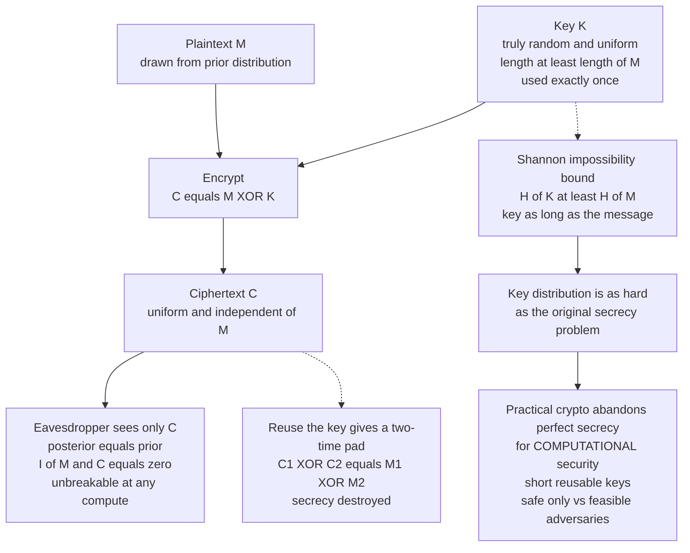

# 🔐 Probability and Information-Theoretic Security

> [!abstract] TL;DR
> **Information-theoretic (perfect) security** is Shannon's rigorous notion of secrecy that holds against an adversary with *unlimited* time and computation, because the ciphertext contains *no information* about the plaintext at all. The **one-time pad** — XOR the message with a truly random key of equal length, used once — is the canonical scheme that achieves it. Shannon also proved its price: perfect secrecy *requires* a key at least as long as the message (H of K ≥ H of M), which is why practical cryptography abandons perfect secrecy for **computational** security with short reusable keys. The recurring lesson — **never reuse a one-time key** — echoes through every stream cipher and nonce in applied crypto.

---

## Intuition

**Analogy:** Imagine a coded message so perfectly scrambled that seeing the ciphertext tells an eavesdropper *literally nothing*. Every possible plaintext of that length remains exactly as likely *after* they intercept the message as it was *before*. There is no puzzle to solve, no pattern to exploit, no "guess and check" that could ever narrow things down — even a galaxy of supercomputers running until the heat death of the universe would be no better off than a coin-flipper. That is **perfect secrecy**, and Shannon proved the **one-time pad** achieves it — at the steep price of needing a truly random key *as long as the message*.

This is fundamentally different from everyday cryptography. AES and RSA are not perfectly secret; they merely *bet on hardness* — they are secure only because nobody knows a fast enough algorithm *yet*. The one-time pad needs no such bet: there is simply **nothing to compute**, because the ciphertext holds no information about the plaintext to begin with. Crypto is inherently probabilistic — the key is a random variable, and "security" is a statement about probability distributions.

---

## How It Works

### Core Mechanics

**1. Crypto is probabilistic.** The raw material of secrecy is *randomness*. A key is a random variable K drawn from some distribution; a message is a random variable M with a prior p(m) reflecting what the adversary already believes (e.g., "attack" is more likely than "aardvark"). Security is defined through these distributions and an adversary's **advantage** — how much better than blind guessing they can do after seeing the ciphertext. Perfect secrecy is the limiting case where that advantage is exactly **zero**.

**2. Perfect secrecy (Shannon, 1949).** A cipher has perfect secrecy if the ciphertext reveals nothing about the plaintext — the a-posteriori probability of a message given the ciphertext equals its a-priori probability:

$$\Pr[M = m \mid C = c] = \Pr[M = m] \quad\text{for all } m, c$$

Equivalently, ciphertext and plaintext are **statistically independent**, which in information-theoretic terms means their mutual information is zero: I(M; C) = 0. Seeing C leaves the adversary's beliefs about M *exactly where they started*. This is the strongest possible secrecy — unbreakable even with infinite time and computation.

**3. The one-time pad (OTP / Vernam cipher).** Encrypt bit-by-bit by XOR-ing the message with a key of equal length:

$$C = M \oplus K, \qquad M = C \oplus K$$

The key K must be (1) **truly random and uniform**, (2) **at least as long as M**, and (3) **used exactly once**. Because K is uniform and independent of M, the ciphertext C is uniform and independent of M — so I(M; C) = 0. Given *any* ciphertext, *every* plaintext of that length is equally consistent (there is exactly one key mapping each candidate plaintext to that ciphertext), so no information leaks. Vernam patented it in 1919; Shannon proved it perfectly secret in 1949.

**4. Shannon's theorem — the impossibility limit.** Perfect secrecy is not free. Shannon proved that *any* perfectly secret cipher must have a key whose entropy is at least the message entropy:

$$H(K) \ge H(M)$$

Intuitively, to make the ciphertext independent of every possible message, the key must be able to map any plaintext to any ciphertext with equal probability — which needs at least as much randomness as the messages carry. This is why the OTP is **impractical**: you must securely pre-share as many secret key bits as you will ever send, so the **key-distribution problem is as hard as the original secrecy problem**. That single fact is *why* practical cryptography abandons perfect secrecy for **computational security** — short reusable keys, secure only against *feasible* adversaries.

**5. The information-theoretic vs computational gap.** Information-theoretic (unconditional) security — the OTP, secret sharing, one-time MACs, quantum key distribution — holds against infinite compute and requires no assumptions. Computational security — essentially *everything* else (AES, RSA, elliptic curves) — is conditional on unproven hardness assumptions and a bounded adversary. Most real crypto lives on the computational side; only a handful of settings can actually achieve the unconditional gold standard.

### Flow: Perfect Secrecy and Why We Settle for Less



---

## Key Concepts

### Secondary (intuitive)
- **Perfect secrecy** = the scrambled message could equally be *any* message, so an eavesdropper learns nothing — no computer, however fast, can help.
- The **one-time pad** achieves this by XOR-ing a fresh random key as long as the message; its catch is you need as much secret key as you have secret message.
- **"One-time" means one time** — reuse the pad on a second message and secrecy collapses.
- **Entropy** measures uncertainty; a strong key/password is one with a lot of it (a truly random 128-bit key has 128 bits of entropy).

### Undergraduate (formal)
- **Shannon secrecy:** perfect secrecy ⟺ Pr[M=m | C=c] = Pr[M=m] ⟺ I(M; C) = 0 (plaintext and ciphertext are independent).
- **Key-length bound:** perfect secrecy requires H(K) ≥ H(M); the OTP meets it with equality and, when the key is uniform of message length, is essentially the *unique* perfectly secret cipher.
- **Advantage:** an adversary's edge over guessing; perfect secrecy means advantage 0 for *any* adversary, computational security means negligible advantage for *feasible* adversaries.
- **Min-entropy** H∞(X) = −log₂ maxₓ p(x) is the right measure for *worst-case guessing* — it captures the probability the single most likely guess is right, which is what a key/password must resist.
- **Computational vs unconditional:** AES/RSA rely on hardness assumptions and a bounded adversary; the OTP relies on *no* assumptions and beats even a quantum or infinite adversary.

### Graduate (advanced)
- **Uniqueness / structure:** with |K| = |M| = |C| and every message possible, perfect secrecy forces K to be uniform and encryption to be a bijection for each key — Shannon's theorem pins down the OTP.
- **Key reuse as a rank/statistics attack:** C₁ ⊕ C₂ = M₁ ⊕ M₂ removes the key entirely; recovery exploits the *low entropy of natural-language plaintext* (crib-dragging, letter-frequency, drag-and-guess) — the leak is unconditional, no key-search needed.
- **Other unconditional constructions:** Shamir **secret sharing** (a t-of-n threshold scheme where fewer than t shares reveal *zero* information), **one-time MACs** via Carter–Wegman universal hashing (perfect one-time authentication, the core of Poly1305/GHASH), and **quantum key distribution** (security from the no-cloning theorem and measurement disturbance rather than computation).
- **Stream ciphers as "computational OTPs":** a stream cipher replaces the truly random pad with a pseudorandom keystream G(k, nonce); it inherits the OTP's XOR structure *and* its fatal weakness — nonce/keystream reuse re-creates the two-time pad (WEP, MS-PPTP, reused AES-CTR/GCM nonces).
- **Entropy budgeting:** a 128-bit key delivers 128 bits of secrecy *only if* it is truly uniform; entropy sourced from a weak PRNG or low-entropy seed silently collapses perfect (or claimed computational) security.

---

## Python Demo

```python
# Perfect secrecy of the ONE-TIME PAD and the catastrophe of KEY REUSE.
# Cryptography uses only the standard library (secrets = CSPRNG); matplotlib
# is used purely to visualize. No numpy required.
import secrets
import math
from collections import Counter
import matplotlib.pyplot as plt


# ---------- helpers ----------
def xor_bytes(a, b):
    """Byte-wise XOR of two equal-length byte strings."""
    return bytes(x ^ y for x, y in zip(a, b))


def otp_encrypt(msg, key):
    """One-time pad: ciphertext = message XOR key (key length >= message)."""
    return xor_bytes(msg, key)


def entropy_per_byte(data):
    """Empirical Shannon entropy (bits per byte) of a byte string."""
    n = len(data)
    counts = Counter(data)
    return -sum((c / n) * math.log2(c / n) for c in counts.values())


# ================================================================
# PART A - PERFECT SECRECY: ciphertext is UNIFORM and INDEPENDENT of plaintext.
#   For a FIXED plaintext, drawing a fresh uniform key each time makes the
#   ciphertext uniform over all 256 byte values. Two DIFFERENT plaintexts give
#   the SAME ciphertext distribution -> the ciphertext leaks nothing about M.
# ================================================================
TRIALS = 200_000
plaintext_A = b"A"          # 0x41
plaintext_B = b"z"          # 0x7a  (a very different plaintext)

hist_A, hist_B = Counter(), Counter()
for _ in range(TRIALS):
    hist_A[otp_encrypt(plaintext_A, secrets.token_bytes(1))[0]] += 1
    hist_B[otp_encrypt(plaintext_B, secrets.token_bytes(1))[0]] += 1

xs = list(range(256))
uniform = 1 / 256
freqA = [hist_A.get(b, 0) / TRIALS for b in xs]
freqB = [hist_B.get(b, 0) / TRIALS for b in xs]
print("PART A - perfect secrecy")
print(f"  max deviation from uniform (plaintext A): {max(abs(f-uniform) for f in freqA):.5f}")
print(f"  distributions for A and B match: max|freqA-freqB| = "
      f"{max(abs(a-b) for a, b in zip(freqA, freqB)):.5f}")

# ================================================================
# PART B - THE TWO-TIME PAD: reuse one key on two messages and it leaks m1 XOR m2.
# ================================================================
m1 = b"MEET AT THE OLD MILL AT DAWN, COME ALONE AND UNARMED."
m2 = b"THE PACKAGE IS HIDDEN UNDER THE THIRD FLOOR BOARDING."
assert len(m1) == len(m2)

key = secrets.token_bytes(len(m1))    # ONE key ...
c1 = otp_encrypt(m1, key)
c2 = otp_encrypt(m2, key)             # ... reused on a SECOND message (fatal)

leak = xor_bytes(c1, c2)              # the key cancels out entirely
print("\nPART B - two-time pad")
print(f"  c1 XOR c2 == m1 XOR m2 ? {leak == xor_bytes(m1, m2)}  (key has cancelled)")

# Known-plaintext recovery: learn/guess m1 and m2 falls out with no key search.
recovered_m2 = xor_bytes(leak, m1)
print(f"  recovered m2 correct: {recovered_m2 == m2}")
print(f"  recovered m2: {recovered_m2.decode()}")

# Crib-dragging: slide a guessed word ('crib') across the leak. When it aligns
# with real text in ONE message, the XOR reveals readable text from the OTHER.
crib = b" THE "
def all_letters_or_space(bs):
    return all(x == 32 or 65 <= x <= 90 or 97 <= x <= 122 for x in bs)
print("  crib-dragging with crib", crib, "-> readable fragments from the other message:")
for off in range(len(leak) - len(crib) + 1):
    guess = xor_bytes(leak[off:off + len(crib)], crib)
    if all_letters_or_space(guess) and guess != crib:
        print(f"    offset {off:2d}: {guess.decode()!r}")

# ================================================================
# PART C - ENTROPY: the key must carry as much randomness as the message.
# ================================================================
long_key = secrets.token_bytes(4000)                         # uniform random
english = (b"the quick brown fox jumps over the lazy dog. " * 90)[:4000]
Hk, Hm = entropy_per_byte(long_key), entropy_per_byte(english)
print("\nPART C - entropy per byte (max is 8.0)")
print(f"  random key   : {Hk:.3f} bits/byte")
print(f"  english text : {Hm:.3f} bits/byte")

# ----- visualize -----
fig, ax = plt.subplots(2, 2, figsize=(14, 9))

ax[0, 0].bar(xs, freqA, width=1.0, alpha=0.6, label="ciphertext | plaintext 'A'")
ax[0, 0].bar(xs, freqB, width=1.0, alpha=0.6, label="ciphertext | plaintext 'z'")
ax[0, 0].axhline(uniform, color="red", ls="--", label="uniform 1/256")
ax[0, 0].set_title("Perfect secrecy: ciphertext uniform & independent of plaintext")
ax[0, 0].set_xlabel("ciphertext byte value"); ax[0, 0].set_ylabel("probability")
ax[0, 0].legend()

ax[0, 1].bar(["random key", "english text"], [Hk, Hm], color=["seagreen", "indianred"])
ax[0, 1].axhline(8.0, color="gray", ls="--", label="max 8 bits/byte")
ax[0, 1].set_title("Entropy per byte: key must match the message's randomness")
ax[0, 1].set_ylabel("bits per byte"); ax[0, 1].set_ylim(0, 8.5); ax[0, 1].legend()

n = len(m1)
ax[1, 0].plot(range(n), list(xor_bytes(m1, m2)), lw=3, alpha=0.5, label="m1 XOR m2 (secret)")
ax[1, 0].plot(range(n), list(leak), lw=1.2, color="black", label="c1 XOR c2 (public)")
ax[1, 0].set_title("Two-time pad leak: c1 XOR c2 == m1 XOR m2 (key cancels)")
ax[1, 0].set_xlabel("byte position"); ax[1, 0].set_ylabel("XOR value"); ax[1, 0].legend()

ax[1, 1].plot(range(n), list(m2), "o", ms=5, alpha=0.6, label="true m2")
ax[1, 1].plot(range(n), list(recovered_m2), "x", ms=6, label="recovered m2 = leak XOR m1")
ax[1, 1].set_title("Known-plaintext recovery: full m2 recovered, no key search")
ax[1, 1].set_xlabel("byte position"); ax[1, 1].set_ylabel("byte value"); ax[1, 1].legend()

plt.tight_layout()
plt.show()

# Takeaways:
#  * PART A -> a fresh uniform key makes every ciphertext equally likely and the
#    same for any plaintext: I(M;C)=0, perfect secrecy, unbreakable at any compute.
#  * PART B -> reusing the key removes it (c1^c2 = m1^m2); low-entropy plaintext
#    is then recoverable by crib-dragging or known-plaintext XOR. "One-time" is literal.
#  * PART C -> a uniform key sits at 8 bits/byte while english is far lower; the key
#    must supply at least H(M) bits of entropy for the guarantee to hold.
```

Running it prints `c1 XOR c2 == m1 XOR m2 ? True`, recovers the full second message with **no key search**, surfaces readable crib-drag fragments (e.g. the `KAGE` of "PACKAGE" leaks out where the other message contains " THE "), and plots (1) two identical uniform ciphertext distributions, (2) the key's 8 bits/byte versus english text's far lower entropy, (3) the leak line `c1 ⊕ c2` sitting exactly on `m1 ⊕ m2`, and (4) perfect recovery of `m2`.

---

## Real-World Applications

- **The one-time pad in practice:** the Moscow–Washington "hotline" and Cold-War diplomatic/espionage traffic (numbers stations, spy pads) used physically distributed pads for provably unbreakable messaging where the stakes justified the crushing key-distribution burden.
- **VENONA (the key-reuse cautionary tale):** during WWII the Soviets, under pressure, *reused* one-time pad pages. US Army/NSA cryptanalysts exploited exactly the C₁ ⊕ C₂ = M₁ ⊕ M₂ leak over years of painstaking crib-dragging to read thousands of messages — the definitive proof that "one-time" is literal.
- **Stream-cipher reuse disasters:** WEP's short IVs caused keystream reuse and broke Wi-Fi privacy; MS-PPTP reused RC4 keystream across directions; reusing an AES-GCM nonce leaks the XOR of plaintexts *and* the authentication key. All are the two-time pad wearing a modern costume.
- **Shamir secret sharing:** a t-of-n scheme where any t shares reconstruct the secret and any t−1 shares reveal *information-theoretically nothing* — used in HSM key custody, cryptocurrency cold-storage backups, and threshold signing.
- **One-time MACs / Carter–Wegman:** universal-hashing MACs give perfect one-time authentication and underpin the ubiquitous Poly1305 (in ChaCha20-Poly1305) and GHASH (in AES-GCM).
- **Quantum key distribution (BB84):** achieves information-theoretic key agreement from physics — the no-cloning theorem makes eavesdropping detectable — deployed in banking/government fiber links and satellite experiments.
- **Password and key strength auditing:** entropy and min-entropy estimates quantify guessing resistance, driving password policies (NIST) and key-size decisions.

---

## Common Pitfalls

- **Reusing a one-time key ("two-time pad")** — encrypting two messages under the same pad gives C₁ ⊕ C₂ = M₁ ⊕ M₂, leaking the XOR of the plaintexts; natural-language redundancy then makes both recoverable by crib-dragging. This is the single most common OTP/stream-cipher failure (VENONA, WEP, nonce reuse).
- **A "random" key that isn't random** — the OTP's guarantee is only as strong as the key's entropy. A pad from a weak PRNG (or a low-entropy seed) carries far less than H(M) bits of true randomness, silently collapsing perfect secrecy into ordinary, breakable security. Use a CSPRNG.
- **Confusing computational and information-theoretic security** — AES-256 is *not* perfectly secret; it is merely infeasible to break *today*. Only unconditional schemes (OTP, secret sharing, QKD) survive unlimited compute and future quantum attacks.
- **Thinking a short key can be perfectly secret** — Shannon's H(K) ≥ H(M) forbids it. Any scheme claiming "unbreakable" security with a key shorter than the message is either not perfectly secret or is lying.
- **Ignoring the key-distribution problem** — you can't get the OTP's magic for free: securely delivering a message-length key is exactly as hard as securely delivering the message. Perfect secrecy relocates the problem, it doesn't dissolve it.
- **Treating a stream cipher like a true OTP** — stream ciphers are only *computationally* secure and are catastrophically sensitive to nonce/keystream reuse. The OTP's reuse lesson is *more* dangerous here because reuse is easy to trigger by accident.

---

## Related Concepts

- [[Entropy_and_Information_Content]] — Shannon entropy is the yardstick for the H(K) ≥ H(M) bound and for measuring key/password strength (min-entropy).
- [[Joint_Conditional_Entropy_and_Mutual_Information]] — perfect secrecy is precisely I(M; C) = 0; any information leak is I(secret; observable) > 0.
- [[Information_Theoretic_Security_and_Privacy]] — the parent Information Theory note that develops perfect secrecy, the wiretap channel, and differential privacy in depth.
- [[Symmetric_Encryption]] — the modern *computational* counterpart to the OTP; secure by hardness assumptions and a bounded adversary, and the home of practical stream/block ciphers.
- [[Asymmetric_Cryptography_and_PKI]] — public-key security rests on factoring/discrete-log hardness, the antithesis of the OTP's assumption-free guarantee.
- [[Hash_Functions_and_MACs]] — one-time MACs (Carter–Wegman universal hashing) are an information-theoretic authentication analogue of the OTP.
- [[Post_Quantum_Cryptography]] — motivated by quantum attacks on computational schemes; unconditional secrecy is inherently quantum-safe, sharpening the contrast.
- [[Quantum_Key_Distribution_and_BB84]] — achieves information-theoretic key agreement from physics rather than computational hardness.

*(Sibling Cryptography notes still to be written — `Cryptography_Overview`, `Computational_Hardness_Assumptions`, `Stream_Ciphers_and_PRGs`, `Random_Number_Generation`, `Commitment_Schemes_and_Secret_Sharing`, `Password_Hashing_and_KDFs` — will link here once they exist.)*

---

## Review Questions

1. **Secondary (conceptual):** In one or two sentences, explain why an eavesdropper who intercepts a one-time-pad ciphertext learns *nothing* about the message, even with unlimited computing power — and why this is different from the "security" of AES.
2. **Undergraduate (scenario):** A developer wants "unbreakable" encryption, so they generate a 256-bit key with `random.seed(42)` and XOR it, repeated, over a 1 MB file. Identify *two* separate reasons this is not perfectly secret (hint: one is about key length / Shannon's bound, one is about the quality of the randomness), and state what would actually be required for perfect secrecy.
3. **Graduate (trade-off):** Contrast the one-time pad and AES-256 along three axes — *adversary assumptions*, *key management*, and *failure modes*. Given the OTP is provably unbreakable, explain *why* essentially all real systems choose the computationally-secure option instead, and name two settings where information-theoretic security is nonetheless the right (or only) choice.

---

## Sources

- [Shannon, "Communication Theory of Secrecy Systems," Bell System Technical Journal (1949)](https://ieeexplore.ieee.org/document/6769090)
- [Katz & Lindell, "Introduction to Modern Cryptography" — Chapter 2, Perfect Secrecy](https://www.cs.umd.edu/~jkatz/imc.html)
- [Vernam, "Cipher Printing Telegraph Systems," Transactions of the AIEE (1926)](https://ieeexplore.ieee.org/document/5061224)
- [NSA / National Cryptologic Museum, "The VENONA Story"](https://www.nsa.gov/portals/75/documents/about/cryptologic-heritage/historical-figures-publications/publications/coldwar/venona_story.pdf)
- [Boneh & Shoup, "A Graduate Course in Applied Cryptography" — Section 2, The One-Time Pad and Perfect Secrecy](https://toc.cryptobook.us/)

---

#cryptography #information-theoretic-security #one-time-pad #perfect-secrecy #shannon
