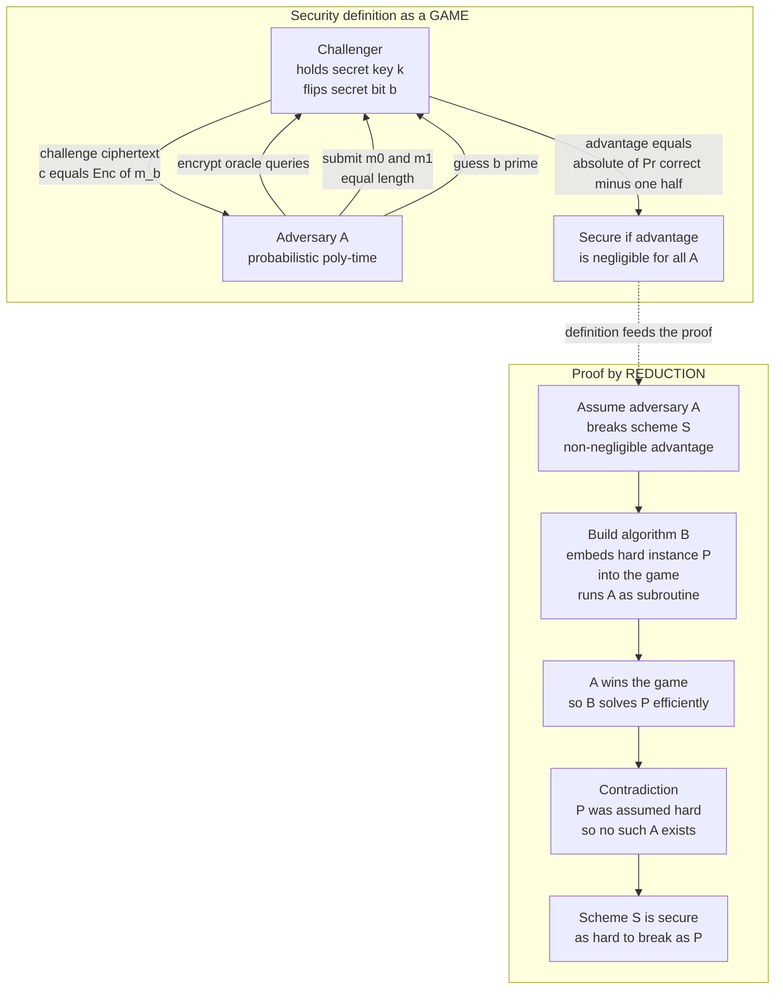
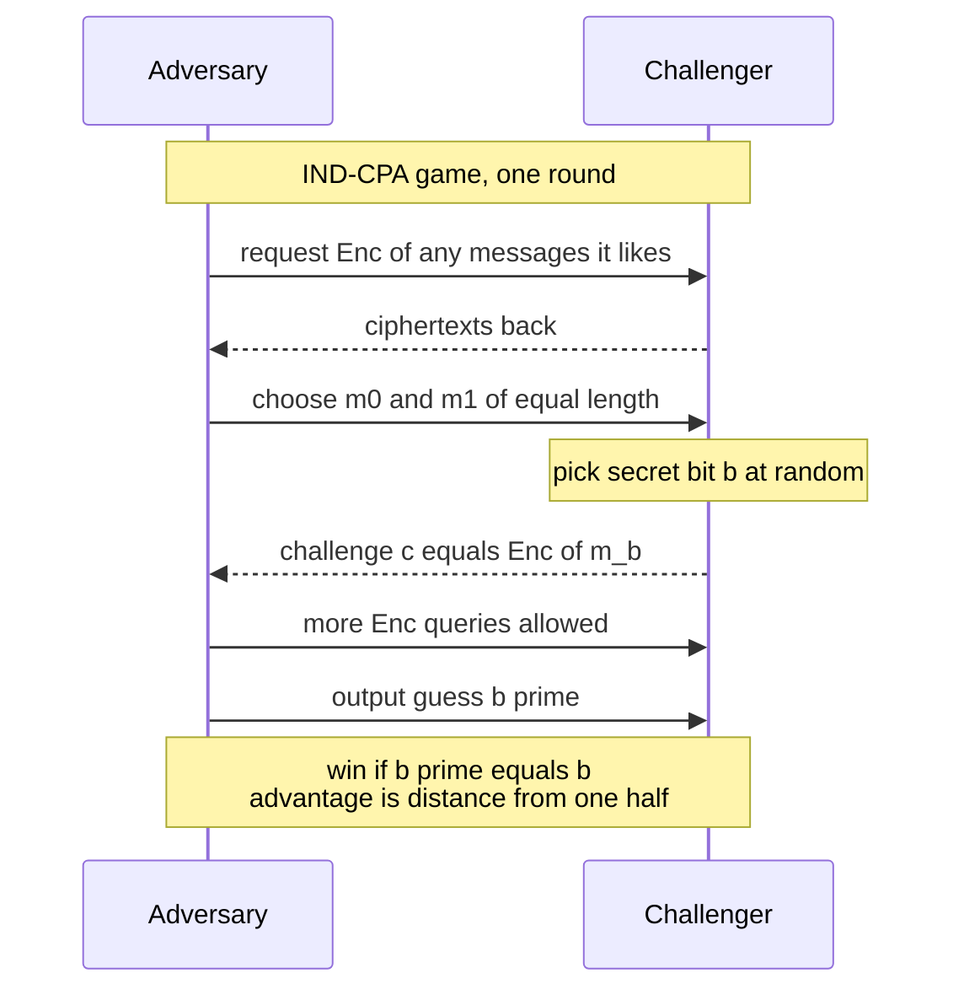

# 🔐 Provable Security and Reductions

> [!abstract] TL;DR
> **Provable security** is the paradigm that turned cryptography from an *art* into a *science*. Instead of "this cipher looks scrambled enough," modern cryptography rests on **three pillars**: a **precise definition** of what "secure" means (usually a *game* between a **challenger** and an **adversary**), a **hardness assumption** (some problem like factoring is infeasible), and a **proof by reduction** showing "*if* anyone could break this scheme, *then* they could solve the hard problem." The definitions you will meet everywhere are **IND-CPA** and **IND-CCA** for encryption (an adversary cannot tell which of two chosen messages was encrypted — this forces **randomized** encryption) and **EUF-CMA** for signatures (an adversary cannot forge a signature on a new message). A **reduction** is the same tool as an NP-completeness proof, aimed at security: assume a breaker exists, build an efficient solver for a hard problem, reach a contradiction. The catch: assumptions are **unproven**, models can be **wrong**, and a proof of the *algorithm* says nothing about a *leaky implementation* — "provably secure" is not "unbreakable."

---

## Intuition

**Analogy — how do you *prove* a lock is secure?** You cannot test a lock against *every possible burglar* — there are infinitely many, and tomorrow's burglar is cleverer than today's. So a locksmith's demo of "watch, I couldn't pick it" proves almost nothing. Cryptographers escape this trap with a beautiful sleight of hand. They do not try to show *no one* can pick the lock. Instead they prove a **conditional**: "**IF** anyone could pick this lock, **THEN** that same person could also solve a famous math puzzle that the world's best minds have failed to crack for fifty years." Now the burden shifts. As long as that puzzle stays hard, the lock stays secure — and if someone *does* pick the lock, they have accidentally become world-famous for solving the puzzle. This is **security by reduction**: you *tie* your scheme's safety to a well-studied hard problem, so breaking one means breaking the other.

Two things had to be nailed down to make this rigorous. First, **what does "break" even mean?** "Secure" is meaningless until you say *exactly* what the attacker is allowed to do and what counts as winning. Cryptographers answer this with a **game**: a referee (the challenger) and an attacker (the adversary) play by fixed rules, and the scheme is secure if no efficient attacker wins by more than a hair over blind guessing. Second, **what is the hard problem?** That is the *assumption* — factoring, discrete log, or a lattice problem. Precise definition, explicit assumption, reduction proof: these three pillars are the entire scaffolding of modern cryptography, and once you can read them, every serious cryptographic claim becomes legible.

---

## How It Works

### From art to science: the three pillars

Before roughly 1980, cryptography was a cycle of **design, break, redesign**: someone proposed a cipher that "looked" secure, someone else found a clever attack, repeat. There was no way to say what a scheme *guaranteed*. The revolution — driven by **Goldwasser, Micali, Rivest, Blum, Yao** and others — replaced intuition with a rigorous method built on three pillars:

1. **Definitions.** State *precisely* what security means: the adversary's **powers** (what oracles and queries it gets), its **goal** (what counts as a win), and the **success measure** (advantage over guessing). Without a definition, "secure" is a mood, not a claim.
2. **Assumptions.** Identify a **hard computational problem** — factoring large integers, computing discrete logarithms, or solving Learning With Errors — and *assume* no efficient algorithm solves it. These are **unproven** but heavily studied (see the sibling note *Computational Hardness Assumptions*).
3. **Proofs by reduction.** Prove a theorem of the form: "**if** the assumption holds, **then** the scheme meets the definition." The proof is a **reduction** — a construction that converts any successful attacker into an efficient solver for the hard problem.

The slogan: turn *"this seems secure"* into *"this is provably as hard to break as factoring."*

### Security definitions as games

A security definition is a **game** between two parties:

- The **challenger** sets up the scheme, holds the secret key, and answers the adversary's queries by the rules.
- The **adversary** `A` is any **efficient** algorithm — formally **probabilistic polynomial-time** — that interacts with the challenger and tries to win.

The scheme is **secure** if for *every* efficient `A`, its **advantage** — how much better than blind guessing it does — is **negligible**. You must specify the game *exactly*: change the adversary's powers and you get a different, stronger or weaker, definition.

### The encryption security ladder: IND-CPA and IND-CCA

**IND-CPA** — *indistinguishability under chosen-plaintext attack* — is the workhorse definition. The game:

1. Challenger generates a key `k`.
2. Adversary may **encrypt any messages it likes** (the "chosen-plaintext" power — modeled as an encryption oracle).
3. Adversary submits **two equal-length messages** `m0, m1`.
4. Challenger flips a secret bit `b`, returns the **challenge ciphertext** `c = Enc(k, m_b)`.
5. Adversary keeps querying, then outputs a guess `b'`.
6. Adversary **wins** if `b' = b`. Its **advantage** is `|Pr[b' = b] - 1/2|`.

IND-CPA formalizes **semantic security**: the ciphertext leaks *nothing efficiently computable* about the plaintext. A crucial consequence: **encryption must be randomized**. A **deterministic** cipher always maps a given message to the same ciphertext, so the adversary encrypts `m0` and `m1` itself, compares against the challenge, and wins with advantage `1/2`. This is exactly why ECB mode is broken and why real modes inject an IV or nonce (see the sibling note *Modes of Operation*).

**IND-CCA** — *chosen-ciphertext attack* — hands the adversary an even sharper knife: a **decryption oracle**. It may ask the challenger to decrypt ciphertexts of its choosing (anything except the challenge ciphertext itself). **IND-CCA2** (adaptive, where decryption queries continue *after* seeing the challenge) is the **gold standard** for real protocols, because real attackers *do* get to submit ciphertexts and observe reactions — padding-oracle and Bleichenbacher attacks are exactly CCA attacks in the wild. The ladder climbs by **giving the adversary more power**: IND-CPA `<` IND-CCA1 `<` IND-CCA2.

### Signature security: EUF-CMA

For signatures the standard is **EUF-CMA** — *existential unforgeability under chosen-message attack*. The adversary gets a **signing oracle** and may request signatures on **any messages it chooses**; it wins if it outputs a **valid signature on a message it never asked about** ("existential" = *some* new message, not a specific one). A scheme that is EUF-CMA-secure guarantees: even after watching you sign a million chosen documents, an attacker cannot forge your signature on document one-million-and-one.

### The reduction argument — the heart of a proof

To prove *"scheme `S` is secure IF problem `P` is hard,"* you argue by **contradiction via reduction**:

1. **Assume** an efficient adversary `A` breaks `S` with non-negligible advantage.
2. **Construct** an algorithm `B` (the *reduction*) that takes an instance of the hard problem `P` as input, **runs `A` as a subroutine** — simulating the security game for `A`, embedding the `P`-instance into the challenge — and uses `A`'s successful attack to **solve `P` efficiently**.
3. **Contradiction.** Because `P` is assumed hard, no such efficient `B` can exist. Therefore no such `A` exists, so `S` is secure.

The one-line form: **"break `S` implies solve `P`."** This is *precisely* the reduction technique of NP-completeness (see [[NP_Completeness_and_the_Cook_Levin_Theorem]] and [[Reductions_and_NP_Complete_Problems]]), redirected from *classifying problems* to *transferring hardness into security*. A subtlety: reductions have **tightness**. A **tight** reduction loses little — breaking `S` is *almost exactly* as hard as `P`. A **loose** reduction loses a large factor, so to keep the same real-world security you must inflate key sizes to compensate.

### Negligible, efficient, and the security parameter

Provable security is **asymptotic**, phrased in a **security parameter** `n` (think key length). Two definitions carry all the weight:

- **Efficient** = **probabilistic polynomial-time (PPT)** in `n`.
- **Negligible** = shrinks faster than *any* inverse polynomial: for every polynomial `p`, the quantity is eventually smaller than `1/p(n)`. A function like `2^{-n}` is negligible; `1/n^100` is not.

Security means: *every* PPT adversary has *negligible* advantage. Practitioners also care about **concrete (bit) security** — not just "negligible eventually" but "an attacker needs about `2^128` operations for *this* key size." Asymptotic proofs justify the design; concrete analysis picks the parameters.

### The Random Oracle Model

Some efficient, widely deployed schemes resist proofs in the plain "standard model." The **Random Oracle Model (ROM)** is an *idealization*: model a hash function as a **truly random function** that everyone queries as a black box. Under this fiction, elegant proofs exist for **RSA-OAEP** encryption, **RSA-PSS** signatures, and the **Fiat-Shamir** transform (turning interactive proofs into signatures, see [[Interactive_Proofs_and_Zero_Knowledge]]). The controversy: **ROM is not sound in general.** Canetti, Goldreich, and Halevi (2004) exhibited schemes **provably secure in the ROM but insecure with *every* real hash function**. So a ROM proof is strong heuristic evidence, not a standard-model guarantee — a known gap you must be honest about.

### Flow / Architecture





---

## Key Concepts

### Secondary (plain-language)
- **Provable security:** you do not just *hope* a code is safe — you *prove* that cracking it is as hard as some famous unsolved puzzle.
- **The game idea:** security is a contest with clear rules between a referee and an attacker; the code is safe if no attacker can beat coin-flipping.
- **Randomness matters:** encrypting the same message twice must give *different* results, or an eavesdropper can spot repeats.
- **Not a magic shield:** a proof covers the *math*, not a buggy or leaky *implementation*.

### Undergraduate (CS background)
- **IND-CPA game:** adversary submits `m0, m1`; challenger returns `Enc(m_b)`; security means advantage `|Pr[b'=b] - 1/2|` is negligible. Forces **randomized/probabilistic encryption**.
- **IND-CCA / IND-CCA2:** add a **decryption oracle**; CCA2 (adaptive) is the real-world standard, defeating padding-oracle style attacks.
- **EUF-CMA:** signatures secure against forgery even given a chosen-message **signing oracle**.
- **Reduction:** transform an attacker into a solver for a hard problem; the same **many-one reduction** idea as NP-completeness, aimed at security.
- **Negligible vs non-negligible; PPT:** the asymptotic vocabulary that makes "efficient attacker" and "tiny advantage" precise.

### Graduate (research-level)
- **Concrete vs asymptotic security; tightness:** a reduction with tightness loss `L` means "break `S` in time `t`" yields "solve `P` in time `~t`" only up to factor `L`; loose reductions demand bigger parameters.
- **Game-hopping / sequence-of-games proofs (Shoup, Bellare-Rogaway):** structure a proof as a chain of games with bounded statistical or computational distance between neighbors.
- **Simulation-based vs game-based definitions:** indistinguishability (IND) vs semantic security equivalence; real-vs-ideal simulation used in MPC and UC frameworks.
- **Random Oracle Model and its limits:** ROM proofs (OAEP, PSS, Fiat-Shamir) versus the **Canetti-Goldreich-Halevi** uninstantiability separation; standard-model constructions as the goal.
- **Worst-case vs average-case hardness:** cryptography needs average-case hard, key-distribution hardness — not mere NP-completeness (see [[Complexity_Cryptography_and_Average_Case_Hardness]]).

---

## Python Demo

This demo makes **semantic security** concrete by *playing the IND-CPA game* thousands of times against two ciphers. The adversary submits `m0` (two identical blocks) and `m1` (two different blocks). A **deterministic** cipher leaks the pattern — the adversary wins nearly always, advantage `~1/2`. A **randomized** cipher (fresh nonce per encryption) hides it — the adversary is stuck near coin-flipping, advantage `~0`. Pure stdlib plus matplotlib.

```python
# IND-CPA security game: deterministic (ECB-like) vs randomized (CTR-like) encryption.
# Shows WHY deterministic encryption fails semantic security and randomized encryption passes.
import hmac, hashlib, secrets
import matplotlib.pyplot as plt

BLOCK = 16  # bytes per block

def prf(key: bytes, data: bytes) -> bytes:
    # A pseudorandom function built from HMAC-SHA256, truncated to one block.
    return hmac.new(key, data, hashlib.sha256).digest()[:BLOCK]

# --- Scheme 1: DETERMINISTIC block cipher (ECB-style): same block -> same ciphertext ---
def enc_deterministic(key: bytes, msg: bytes) -> bytes:
    out = b""
    for off in range(0, len(msg), BLOCK):
        out += prf(key, msg[off:off + BLOCK])   # no randomness at all
    return out

# --- Scheme 2: RANDOMIZED stream cipher (CTR-style): fresh nonce each call ---
def enc_randomized(key: bytes, msg: bytes) -> bytes:
    nonce = secrets.token_bytes(BLOCK)          # fresh randomness every encryption
    out = nonce
    for i, off in enumerate(range(0, len(msg), BLOCK)):
        block = msg[off:off + BLOCK]
        keystream = prf(key, nonce + i.to_bytes(4, "big"))
        out += bytes(a ^ b for a, b in zip(block, keystream))
    return out

# --- The adversary's strategy ---
def adversary_messages():
    m0 = b"A" * BLOCK + b"A" * BLOCK   # two IDENTICAL plaintext blocks
    m1 = b"A" * BLOCK + b"B" * BLOCK   # two DIFFERENT plaintext blocks
    return m0, m1

def adversary_guess(ciphertext: bytes, has_nonce: bool) -> int:
    body = ciphertext[BLOCK:] if has_nonce else ciphertext   # strip nonce prefix
    blk0, blk1 = body[0:BLOCK], body[BLOCK:2 * BLOCK]
    # If the two ciphertext blocks match, plaintext blocks matched -> guess m0 (b=0).
    return 0 if blk0 == blk1 else 1

# --- Play the IND-CPA game many times, record correctness per trial ---
def play_game(enc, has_nonce, trials=3000):
    key = secrets.token_bytes(32)
    correct = []
    for _ in range(trials):
        m0, m1 = adversary_messages()
        b = secrets.randbelow(2)                 # challenger's secret bit
        c = enc(key, m0 if b == 0 else m1)       # encrypt the chosen message
        b_guess = adversary_guess(c, has_nonce)
        correct.append(1 if b_guess == b else 0)
    return correct

def cumulative_rate(correct):
    running, total = [], 0
    for i, x in enumerate(correct, start=1):
        total += x
        running.append(total / i)
    return running

det = play_game(enc_deterministic, has_nonce=False)
rnd = play_game(enc_randomized,   has_nonce=True)

det_rate = sum(det) / len(det)
rnd_rate = sum(rnd) / len(rnd)
det_adv = abs(det_rate - 0.5)
rnd_adv = abs(rnd_rate - 0.5)

print(f"Deterministic (ECB-like): win rate = {det_rate:.3f}, advantage = {det_adv:.3f}")
print(f"Randomized   (CTR-like): win rate = {rnd_rate:.3f}, advantage = {rnd_adv:.3f}")

# --- Visualize: convergence of win rate, and the advantage gap ---
fig, (ax1, ax2) = plt.subplots(1, 2, figsize=(12, 4.5))

ax1.plot(cumulative_rate(det), label="Deterministic (ECB-like)", color="crimson")
ax1.plot(cumulative_rate(rnd), label="Randomized (CTR-like)", color="seagreen")
ax1.axhline(0.5, ls="--", color="gray", label="Blind guessing (0.5)")
ax1.set_xlabel("Number of IND-CPA game rounds")
ax1.set_ylabel("Adversary win rate")
ax1.set_title("Adversary win rate converges")
ax1.set_ylim(0.4, 1.05)
ax1.legend()

ax2.bar(["Deterministic", "Randomized"], [det_adv, rnd_adv],
        color=["crimson", "seagreen"])
ax2.axhline(0.0, color="gray", lw=0.8)
ax2.set_ylabel("Adversary advantage  = |win rate - 0.5|")
ax2.set_title("Advantage: broken vs secure")
for i, v in enumerate([det_adv, rnd_adv]):
    ax2.text(i, v + 0.01, f"{v:.3f}", ha="center")

plt.tight_layout()
plt.savefig("ind_cpa_game.png", dpi=110)
print("Saved plot to ind_cpa_game.png")
```

**Expected output (numbers vary slightly by run):**

```
Deterministic (ECB-like): win rate = 1.000, advantage = 0.500
Randomized   (CTR-like): win rate = 0.502, advantage = 0.002
Saved plot to ind_cpa_game.png
```

The deterministic cipher hands the adversary advantage `1/2` — the maximum, a total break. The randomized cipher pins the advantage near `0`: exactly what "IND-CPA secure" *means*. Same adversary, same messages; the only difference is a **fresh nonce**.

---

## Real-World Applications

- **AES-GCM and modern TLS 1.3 ciphersuites.** GCM is an authenticated mode designed and analyzed to reach **IND-CCA2** style security (via IND-CPA encryption plus a MAC); the randomized nonce is *why* it beats ECB. Every HTTPS session leans on these definitions.
- **RSA-OAEP and RSA-PSS.** Raw "textbook RSA" is deterministic and trivially breaks IND-CPA. **OAEP** padding (Bellare-Rogaway) adds randomness and comes with an **IND-CCA2 proof in the Random Oracle Model**; **PSS** does the same for signatures reaching **EUF-CMA**. This is the direct reason these paddings exist (see [[Asymmetric_Cryptography_and_PKI]]).
- **Digital signatures in code-signing, TLS certificates, and blockchains.** ECDSA and Ed25519 are used precisely because they target **EUF-CMA** — an attacker who sees many signatures still cannot forge a new one.
- **Post-quantum standards (ML-KEM / Kyber, ML-DSA / Dilithium).** NIST selected schemes accompanied by **reduction proofs** to lattice problems such as Module-LWE, with explicit **IND-CCA2 / EUF-CMA** claims and tightness analysis (see [[Post_Quantum_Cryptography]]).
- **"Don't roll your own crypto."** The practical payoff: vetted primitives ship with a *definition met* and an *assumption named*. Knowing a library is "IND-CCA2 under LWE" tells you exactly what it promises — and what it does not.

---

## Common Pitfalls

- **Deterministic encryption.** Reusing a cipher with no IV/nonce (ECB, or naive RSA) instantly fails IND-CPA — identical plaintexts produce identical ciphertexts, leaking structure. The demo above is this pitfall in miniature.
- **Assuming "provably secure" means "unbreakable."** A proof is only as good as its **assumption** (which is unproven), its **model** (ROM may not reflect real hashes), and its **scope** (it covers the *algorithm*, not the *code*).
- **Ignoring side channels and misuse.** A reduction says nothing about **timing, power, or cache leaks**, nor about nonce reuse or bad randomness. Provably secure algorithms are routinely broken via leaky implementations (see the sibling notes *Side Channel Attacks* and *Cryptographic Failures and Misuse*).
- **Confusing worst-case and average-case hardness.** NP-completeness is a **worst-case** guarantee; a random key is an **average-case** instance. Basing a cipher on NP-completeness alone can leave typical keys easy (see [[Complexity_Cryptography_and_Average_Case_Hardness]]).
- **Trusting loose reductions at face value.** A reduction with a large tightness loss can be *technically valid* yet demand much larger keys for real security; ignoring the loss means over-claiming the concrete security level.
- **Proving the wrong definition.** IND-CPA is not enough where the attacker can submit ciphertexts — you need **IND-CCA2**. Matching the definition to the *threat model* is the whole game.

---

## Related Concepts

- [[NP_Completeness_and_the_Cook_Levin_Theorem]] — the reduction technique of security proofs is the very same many-one reduction that classifies NP-complete problems, repurposed to transfer *hardness* into *security*.
- [[Reductions_and_NP_Complete_Problems]] — the general machinery of "solve `B`, and you solve `A`"; cryptographic reductions run it as "break the scheme, and you solve the hard problem."
- [[Complexity_Cryptography_and_Average_Case_Hardness]] — explains *why* cryptography needs average-case hardness and one-way functions, not just the worst-case NP-completeness that reductions usually target.
- [[Interactive_Proofs_and_Zero_Knowledge]] — the Fiat-Shamir transform (proved in the Random Oracle Model) turns interactive proofs into signatures; ZK proofs are themselves defined by simulation-based security games.
- [[Symmetric_Encryption]] — IND-CPA and IND-CCA are the definitions symmetric ciphers and their modes are engineered to satisfy; the randomized-encryption requirement is why IVs and nonces exist.
- [[Asymmetric_Cryptography_and_PKI]] — RSA-OAEP and RSA-PSS are the canonical schemes with reduction proofs (in the ROM) reaching IND-CCA2 and EUF-CMA.
- [[Hash_Functions_and_MACs]] — the Random Oracle Model idealizes exactly these hash functions to enable proofs; MACs and authenticated encryption push IND-CPA up to IND-CCA.
- [[Post_Quantum_Cryptography]] — modern lattice schemes ship with explicit reductions to LWE and stated IND-CCA2 / EUF-CMA guarantees, tightness included.

> Sibling notes in this new **Cryptography** vault referenced above in prose — *Cryptography Overview*, *Computational Hardness Assumptions*, *Symmetric Encryption Fundamentals*, *Modes of Operation*, *Digital Signatures*, *Zero Knowledge Proofs*, *Side Channel Attacks*, and *Cryptographic Failures and Misuse* — do not exist yet and should be wikilinked once created.

---

## Review Questions

**Tier 1 — conceptual (explain to a peer):**
1. Why can't you establish a cipher's security by "trying lots of attacks and failing to break it"? What does the reduction approach do instead?
2. In the IND-CPA game, what exactly does the adversary submit, what does the challenger return, and how is *advantage* defined?
3. Why must IND-CPA-secure encryption be *randomized*? Sketch how an adversary beats any deterministic cipher.

**Tier 2 — applied / scenario:**
4. You are handed a library documented as "IND-CPA secure under the DDH assumption in the standard model." A colleague plans to use it in a protocol where the attacker can submit ciphertexts and observe accept/reject responses. Is IND-CPA sufficient here? What definition do you actually need, and why?
5. A signature scheme is proven EUF-CMA-secure. An intern argues "so it's impossible for anyone to ever produce a valid signature they shouldn't." Identify at least three real-world ways the system could still be broken despite this proof.

**Tier 3 — trade-off / research:**
6. Compare a **tight** and a **loose** reduction to the *same* hard problem. If two schemes both reduce to factoring but with tightness losses `2^0` and `2^40`, how does that affect the key sizes you deploy, and what does "provably secure" really guarantee about concrete security in each case?
7. Bellare-Rogaway proved OAEP secure in the Random Oracle Model, yet Canetti-Goldreich-Halevi showed ROM proofs can be uninstantiable. How much confidence should a ROM proof give you, and how would you argue for or against deploying a scheme that has *only* a ROM proof?

---

## Sources

- Goldwasser, S. and Micali, S. "Probabilistic Encryption." *Journal of Computer and System Sciences*, 1984. [Link](https://doi.org/10.1016/0022-0000(84)90070-9)
- Goldwasser, S., Micali, S., and Rivest, R. "A Digital Signature Scheme Secure Against Adaptive Chosen-Message Attacks." *SIAM Journal on Computing*, 1988. [Link](https://doi.org/10.1137/0217017)
- Katz, J. and Lindell, Y. *Introduction to Modern Cryptography* (3rd ed.), CRC Press, 2020 — the standard reference on security definitions, games, and reductions. [Link](https://www.cs.umd.edu/~jkatz/imc.html)
- Bellare, M. and Rogaway, P. "Random Oracles are Practical: A Paradigm for Designing Efficient Protocols." *ACM CCS*, 1993. [Link](https://web.cs.ucdavis.edu/~rogaway/papers/ro.pdf)
- Canetti, R., Goldreich, O., and Halevi, S. "The Random Oracle Methodology, Revisited." *Journal of the ACM*, 2004. [Link](https://doi.org/10.1145/1008731.1008734)
- Shoup, V. "Sequences of Games: A Tool for Taming Complexity in Security Proofs." IACR ePrint 2004/332. [Link](https://eprint.iacr.org/2004/332)

---

#cryptography #provable-security #reductions #ind-cpa #security-definitions
