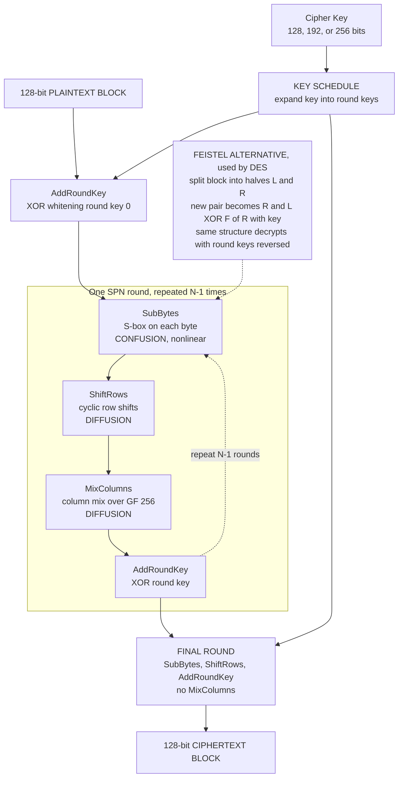

# 🔒 Block Ciphers and AES

> [!abstract] TL;DR
> A **block cipher** is a keyed, invertible permutation on fixed-size $n$-bit blocks: for each key $K$, $\text{Enc}_K$ is a bijection on $\{0,1\}^n$ (so $\text{Dec}_K$ exists), and a *good* one is a **pseudorandom permutation** — indistinguishable from a random permutation to anyone without the key. Two design paradigms dominate: the **Substitution-Permutation Network (SPN)** used by **AES** (S-box **confusion** + linear-layer **diffusion**, iterated for rounds) and the **Feistel network** used by **DES** (split-and-XOR, elegant because the *same* structure encrypts and decrypts by reversing the round keys). **AES** — 128-bit blocks, 128/192/256-bit keys, 10/12/14 rounds of SubBytes → ShiftRows → MixColumns → AddRoundKey over the field $\mathrm{GF}(2^8)$ — has survived 20+ years of cryptanalysis with no practical break and secures most of the world's encrypted data. A raw block cipher encrypts only *one* block deterministically; real messages need a **mode of operation** and **authentication**.

---

## Intuition

**Analogy:** A block cipher is a giant, key-controlled **scrambling machine**. Feed in a fixed chunk of data (one 128-bit block) plus a secret key, and the machine runs the bits through many rounds of *substitution* (swap each byte for another via a lookup table) and *mixing* (stir the bytes together so each one influences all the others), turning the input into apparent gibberish. Turn the crank the other way — with the same key — and every step reverses exactly, giving your data back. AES is the industrial-strength version of this machine: it scrambles 128-bit blocks so thoroughly that, without the key, the output is statistically indistinguishable from pure random noise.

Two ideas make the noise real. First **confusion**: make the relationship between key, plaintext, and ciphertext so tangled that no simple equation connects them — that is the job of the nonlinear **S-box**. Second **diffusion**: spread the influence of every input bit across the *entire* block within a round or two, so flipping one plaintext bit flips roughly *half* the ciphertext bits (the **avalanche effect**) — that is the job of the linear ShiftRows/MixColumns layers. Iterate confusion and diffusion enough times and the machine's output looks like a fresh random permutation of its input.

---

## How It Works

### A block cipher is a family of permutations

Formally, a block cipher is a function $E : \{0,1\}^\kappa \times \{0,1\}^n \to \{0,1\}^n$ where $\kappa$ is the key length and $n$ the block size. Fixing the key gives $E_K(\cdot) = E(K, \cdot)$, and the defining requirement is that **$E_K$ is a bijection (permutation) of the $2^n$ possible blocks** — otherwise decryption would be ambiguous. So each key selects one permutation out of the $2^n!$ permutations of $n$-bit strings; the key is an index into an astronomically large catalogue of shuffles.

The security goal is stated as a **pseudorandom permutation (PRP)**: no efficient adversary, given oracle access to either $E_K$ (for a secret random $K$) or a truly random permutation $\pi$, can tell which one it is talking to with meaningful advantage. This is the *ideal abstraction* cryptographers reduce to — once you believe AES behaves like a PRP, you can build and *prove secure* the modes and MACs on top of it. This provable-security framing (reductions to the PRP assumption) is the theoretical backbone; the sibling note *Provable_Security_and_Reductions* will develop it.

### Confusion and diffusion — Shannon's two levers

Claude Shannon (1949) named the two properties every strong cipher must supply, and they map cleanly onto the two layers of a modern round:

- **Confusion** makes the ciphertext's dependence on the *key* as complex and nonlinear as possible, defeating attacks that try to solve linear equations. It is delivered by **S-boxes** — small nonlinear substitution tables engineered to resist **linear** and **differential cryptanalysis**.
- **Diffusion** dissipates the statistical structure of the *plaintext* across the whole ciphertext, so patterns and redundancy vanish. It is delivered by **linear mixing** layers (bit permutations, matrix multiplies over a finite field) that spread one changed bit across the entire block in one or two rounds.

Neither alone is enough: pure substitution leaves block-level structure; pure permutation is linear and trivially invertible by an attacker. Iterating *both* for many rounds is what buys the security margin.

### The two design paradigms — SPN and Feistel

**Substitution-Permutation Network (SPN), used by AES.** Each round applies, in order, a **key-mixing** step, a **substitution** layer (parallel S-boxes → confusion), and a **linear permutation / mixing** layer (→ diffusion). Every operation must be invertible so the whole cipher inverts. AES is the archetype.

**Feistel network, used by DES.** Split the block into left and right halves $(L, R)$. Each round computes $(L, R) \leftarrow (R,\; L \oplus F(R, K_i))$ — run a **round function** $F$ on one half, XOR the result into the other, then swap. Its elegance is twofold: (1) **encryption and decryption use the identical circuit** — you decrypt simply by feeding the round keys in reverse order; and (2) the round function $F$ **need not be invertible** (the XOR-and-swap structure guarantees reversibility regardless of $F$), which frees the designer to make $F$ as nonlinear and messy as they like.

### AES (Rijndael) in detail

AES operates on a 128-bit block arranged as a $4\times4$ matrix of bytes (the **state**), column by column. Key sizes 128/192/256 bits give **10/12/14 rounds**. Each full round is four transformations:

1. **SubBytes** — the nonlinear S-box, applied to every byte. Each byte is replaced by its **multiplicative inverse in $\mathrm{GF}(2^8)$** (with $0 \mapsto 0$) followed by a fixed **affine transform** over $\mathrm{GF}(2)$. This is the *confusion* step; the inverse-in-a-finite-field construction gives excellent resistance to differential/linear attacks. The finite-field arithmetic lives in [[Fields_and_Field_Extensions]].
2. **ShiftRows** — cyclically left-rotate row $r$ by $r$ bytes ($0,1,2,3$). A cheap byte permutation that spreads bytes across columns (*diffusion*).
3. **MixColumns** — treat each column as a degree-3 polynomial over $\mathrm{GF}(2^8)$ and multiply by a fixed **MDS matrix** (entries $\{01,02,03\}$). Every output byte of a column depends on all four input bytes (*diffusion*). Skipped in the final round.
4. **AddRoundKey** — XOR the 128-bit **round key** into the state. The only step that mixes in secret material.

A **key schedule** expands the cipher key into $\text{Nr}+1$ round keys using RotWord, SubWord (the same S-box), and round constants (Rcon). The design is deliberately *simple and fast*, which is why CPUs ship dedicated **AES-NI** instructions that encrypt a block in a handful of cycles.

Together ShiftRows + MixColumns give **full diffusion in two rounds**: after two rounds every ciphertext byte depends on every plaintext byte. Ten rounds leaves a large security margin.



### DES, 3DES, and the AES competition

The **Data Encryption Standard (DES, 1977)** was a 16-round Feistel cipher with a **56-bit key** and 64-bit blocks. Its downfall was key length, not structure: 56 bits is only $2^{56}$ keys, brute-forced by the EFF's **Deep Crack** machine in 1998 in about two days. **Triple-DES (3DES)** — encrypt-decrypt-encrypt with two or three DES keys — stretched the effective key length to buy another two decades, but it is slow (three DES passes), has a 64-bit block (vulnerable to birthday-bound attacks like *Sweet32*), and is now **deprecated**. NIST replaced DES through an **open, transparent competition** (1997–2000): 15 public submissions, years of worldwide cryptanalysis, and the selection of Belgian cipher **Rijndael** as AES in 2001. That open process — the same one that later chose SHA-3 and the post-quantum standards — is itself a model of trustworthy standardization, contrasting sharply with DES's secret NSA-influenced S-box design.

---

## Key Concepts

### Secondary (explain to anyone)
- **Block cipher** = a machine that scrambles a fixed chunk of data with a key, reversibly. Same key un-scrambles it.
- **Block vs stream:** a block cipher works on fixed chunks (AES: 16 bytes at a time); a stream cipher produces a keystream you XOR byte-by-byte.
- **Avalanche effect:** change one input bit and about half the output bits flip — the sign that the scrambling is thorough.
- **AES is everywhere:** it protects HTTPS, your disk, your Wi-Fi, and your VPN. It is the single most-used cipher on Earth.

### Undergraduate (needs some CS background)
- **Permutation / bijection:** $\text{Enc}_K$ must be one-to-one on $\{0,1\}^n$ so decryption is unambiguous; the key selects one shuffle from $2^n!$.
- **Confusion vs diffusion:** S-boxes provide nonlinearity (confusion); linear ShiftRows/MixColumns spread influence (diffusion). Shannon, 1949.
- **SPN vs Feistel:** SPN needs every layer invertible (AES); Feistel gets reversibility for free and reuses the same circuit for decryption with reversed round keys (DES). Feistel's $F$ need not be invertible.
- **AES round:** SubBytes → ShiftRows → MixColumns → AddRoundKey, for 10/12/14 rounds; the last round drops MixColumns.
- **Key schedule:** expands one key into all round keys; a weak schedule enables related-key attacks.
- **A block cipher is not an encryption scheme:** by itself it encrypts one block deterministically. You need a **mode of operation** (CBC, CTR, GCM) for real messages and a **MAC/AEAD** for integrity.

### Graduate (system-level / research)
- **PRP / SPRP security:** a secure block cipher is a **pseudorandom permutation**; if the adversary also gets a decryption oracle, a **strong PRP (SPRP)**. Modes' security proofs reduce to these assumptions.
- **The $\mathrm{GF}(2^8)$ S-box:** $x \mapsto x^{-1}$ in $\mathbb{F}_{256} = \mathbb{F}_2[x]/(x^8+x^4+x^3+x+1)$ has optimal differential uniformity (max differential probability $4/256$) and high nonlinearity; the affine post-map removes fixed points and algebraic simplicity. See [[Galois_Theory]] and [[Fields_and_Field_Extensions]].
- **MixColumns is an MDS transform:** its $4\times4$ matrix over $\mathrm{GF}(2^8)$ is Maximum-Distance-Separable, giving a branch number of 5 — the same coding-theory optimality that underlies Reed-Solomon codes ([[Linear_Block_Codes_and_Reed_Solomon]]). This is what forces full diffusion in two rounds.
- **Linear and differential cryptanalysis:** the two workhorse attacks; round count is chosen to make the best linear/differential trail's probability negligible, giving the *security margin*.
- **Best known AES attacks:** biclique cryptanalysis lowers AES-128's effort to about $2^{126}$ — a factor-of-4 improvement over the $2^{128}$ brute force, i.e. **no practical break**. Related-key attacks exist on the AES-192/256 *key schedule* but do not threaten single-key security.
- **Post-quantum margin:** Grover's algorithm gives a quadratic speedup, halving effective key length ($2^{128} \to 2^{64}$ for AES-128 search), so **AES-256** is recommended where long-term quantum resistance matters. See [[Post_Quantum_Cryptography]].

---

## Python Demo

```python
"""
Block ciphers from scratch: the AES round operations over GF(2^8), the S-box,
the avalanche effect, and a tiny Feistel network for DES intuition.

*** EDUCATIONAL ONLY -- do NOT use this for real cryptography. ***
Real code must use a vetted library (e.g. `cryptography`, OpenSSL) with a
proper mode of operation and authentication.

Pure standard library + matplotlib (numpy optional). Run: python aes_demo.py
"""
import matplotlib.pyplot as plt

# ---------------------------------------------------------------------------
# 1. GF(2^8) ARITHMETIC  (the field F_2[x] / (x^8 + x^4 + x^3 + x + 1), poly 0x11B)
# ---------------------------------------------------------------------------
def xtime(a):
    """Multiply a byte by 2 in GF(2^8): shift left, reduce by 0x1B if it overflows."""
    a <<= 1
    if a & 0x100:
        a ^= 0x11B
    return a & 0xFF

def gf_mul(a, b):
    """Multiply two bytes in GF(2^8) via shift-and-add (Russian-peasant style)."""
    p = 0
    for _ in range(8):
        if b & 1:
            p ^= a
        b >>= 1
        a = xtime(a)
    return p

def gf_inv(a):
    """Multiplicative inverse in GF(2^8): a^-1 = a^254, since the group has order 255."""
    if a == 0:
        return 0
    result = 1
    for _ in range(254):
        result = gf_mul(result, a)
    return result

# ---------------------------------------------------------------------------
# 2. THE AES S-BOX  =  affine( multiplicative inverse )   -> CONFUSION
# ---------------------------------------------------------------------------
def rotl8(x, s):
    return ((x << s) | (x >> (8 - s))) & 0xFF

def affine(b):
    # AES affine map over GF(2): b XOR (b<<<1) XOR (b<<<2) XOR (b<<<3) XOR (b<<<4) XOR 0x63
    return b ^ rotl8(b, 1) ^ rotl8(b, 2) ^ rotl8(b, 3) ^ rotl8(b, 4) ^ 0x63

SBOX = [affine(gf_inv(a)) for a in range(256)]

# sanity-check against the published AES S-box: S(0x00)=0x63, S(0x01)=0x7c, S(0x53)=0xed
assert SBOX[0x00] == 0x63 and SBOX[0x01] == 0x7C and SBOX[0x53] == 0xED
print("S-box built from GF(2^8) inverse + affine map; matches the AES standard.")

# ---------------------------------------------------------------------------
# 3. AES-128 STATE AND ROUND OPERATIONS  (state is a 4x4 byte matrix, column-major)
# ---------------------------------------------------------------------------
def bytes_to_state(block):        # 16 bytes -> state[row][col]
    return [[block[c * 4 + r] for c in range(4)] for r in range(4)]

def state_to_bytes(state):        # state -> 16 bytes
    return bytes(state[r][c] for c in range(4) for r in range(4))

def sub_bytes(state):                                   # CONFUSION
    for r in range(4):
        for c in range(4):
            state[r][c] = SBOX[state[r][c]]

def shift_rows(state):                                  # DIFFUSION
    for r in range(4):
        state[r] = state[r][r:] + state[r][:r]

def mix_columns(state):                                 # DIFFUSION (GF(2^8) matrix mult)
    for c in range(4):
        s0, s1, s2, s3 = (state[r][c] for r in range(4))
        state[0][c] = gf_mul(2, s0) ^ gf_mul(3, s1) ^ s2 ^ s3
        state[1][c] = s0 ^ gf_mul(2, s1) ^ gf_mul(3, s2) ^ s3
        state[2][c] = s0 ^ s1 ^ gf_mul(2, s2) ^ gf_mul(3, s3)
        state[3][c] = gf_mul(3, s0) ^ s1 ^ s2 ^ gf_mul(2, s3)

def add_round_key(state, rk):                           # XOR in the round key
    for r in range(4):
        for c in range(4):
            state[r][c] ^= rk[c * 4 + r]

# ---------------------------------------------------------------------------
# 4. AES-128 KEY SCHEDULE  -> eleven 16-byte round keys
# ---------------------------------------------------------------------------
def key_expansion(key16):
    w = [list(key16[4 * i:4 * i + 4]) for i in range(4)]
    rcon = 1
    for i in range(4, 44):
        t = list(w[i - 1])
        if i % 4 == 0:
            t = t[1:] + t[:1]                 # RotWord
            t = [SBOX[b] for b in t]          # SubWord
            t[0] ^= rcon                      # Rcon
            rcon = xtime(rcon)
        w.append([w[i - 4][j] ^ t[j] for j in range(4)])
    # pack the 44 words into 11 column-major 16-byte round keys
    return [bytes(w[4 * rnd + c][r] for c in range(4) for r in range(4)) for rnd in range(11)]

def aes128_trace(block16, round_keys):
    """Full AES-128 encryption; returns the 16-byte state after EACH round (for avalanche)."""
    state = bytes_to_state(block16)
    add_round_key(state, round_keys[0])
    trace = [state_to_bytes(state)]           # after initial whitening
    for rnd in range(1, 10):
        sub_bytes(state); shift_rows(state); mix_columns(state); add_round_key(state, round_keys[rnd])
        trace.append(state_to_bytes(state))
    sub_bytes(state); shift_rows(state); add_round_key(state, round_keys[10])   # final round, no MixColumns
    trace.append(state_to_bytes(state))
    return trace

# --- validate against the official FIPS-197 test vector ---------------------
KEY = bytes.fromhex("000102030405060708090a0b0c0d0e0f")
PT  = bytes.fromhex("00112233445566778899aabbccddeeff")
RK  = key_expansion(KEY)
CT  = aes128_trace(PT, RK)[-1]
assert CT == bytes.fromhex("69c4e0d86a7b0430d8cdb78070b4c55a")
print("Full AES-128 encryption matches the FIPS-197 test vector:", CT.hex())

# ---------------------------------------------------------------------------
# 5. THE AVALANCHE EFFECT: flip ONE bit -> ~half the output bits flip
# ---------------------------------------------------------------------------
def hamming(a, b):
    return sum(bin(x ^ y).count("1") for x, y in zip(a, b))

def flip_bit(data, bit):
    d = bytearray(data)
    d[bit // 8] ^= 1 << (bit % 8)
    return bytes(d)

# (a) flip one PLAINTEXT bit, watch the difference grow across rounds
trace_ref = aes128_trace(PT, RK)
trace_pt  = aes128_trace(flip_bit(PT, 0), RK)          # one plaintext bit changed
pt_diff   = [hamming(a, b) for a, b in zip(trace_ref, trace_pt)]

# (b) flip one KEY bit, re-expand, encrypt the SAME plaintext
RK2       = key_expansion(flip_bit(KEY, 0))
trace_key = aes128_trace(PT, RK2)
key_diff  = [hamming(a, b) for a, b in zip(trace_ref, trace_key)]

print(f"\nAvalanche (128-bit block, 64 = half):")
print(f"  1-bit plaintext change -> bits differing per round: {pt_diff}")
print(f"  1-bit key change       -> bits differing per round: {key_diff}")
print("  Both saturate near 64 within ~2 rounds: full diffusion.")

# ---------------------------------------------------------------------------
# 6. A TINY FEISTEL NETWORK (DES intuition): SAME code decrypts with reversed keys
# ---------------------------------------------------------------------------
def xor(a, b):
    return bytes(x ^ y for x, y in zip(a, b))

def F(half, subkey):
    """Round function on a 4-byte half. NEED NOT be invertible -- Feistel handles that."""
    x = xor(half, subkey)
    x = bytes(SBOX[b] for b in x)             # nonlinearity via the S-box
    return x[1:] + x[:1]                       # a byte rotation for spreading

def feistel(block8, subkeys):
    """Encrypt OR decrypt an 8-byte block. Decrypt = call again with subkeys reversed."""
    L, R = block8[:4], block8[4:]
    for k in subkeys:
        L, R = R, xor(L, F(R, k))
    return R + L                               # final swap makes the same code invert

SUBKEYS = [b"K1__", b"K2__", b"K3__", b"K4__"]
plain8  = b"CRYPTO!!"
cipher8 = feistel(plain8, SUBKEYS)
back8   = feistel(cipher8, list(reversed(SUBKEYS)))     # identical function, reversed keys
assert back8 == plain8
print(f"\nFeistel: encrypt {plain8!r} -> {cipher8.hex()} -> decrypt {back8!r}")
print("Same circuit decrypts by reversing round keys; F itself is not invertible.")

# ---------------------------------------------------------------------------
# 7. VISUALIZE: avalanche across rounds + the S-box's nonlinearity
# ---------------------------------------------------------------------------
fig, ax = plt.subplots(1, 3, figsize=(17, 5))

rounds = list(range(len(pt_diff)))
ax[0].plot(rounds, pt_diff, "o-", color="#2563eb", label="1-bit plaintext flip")
ax[0].plot(rounds, key_diff, "s-", color="#16a34a", label="1-bit key flip")
ax[0].axhline(64, color="red", ls="--", label="half of 128 bits")
ax[0].set_title("AES avalanche effect\none flipped bit spreads to ~half the block")
ax[0].set_xlabel("round (0 = after initial AddRoundKey)")
ax[0].set_ylabel("ciphertext bits differing from reference")
ax[0].set_ylim(0, 128); ax[0].legend(); ax[0].grid(alpha=0.3)

# S-box as a 16x16 heatmap: a strong cipher's substitution looks structureless
grid = [SBOX[16 * r:16 * r + 16] for r in range(16)]
im = ax[1].imshow(grid, cmap="viridis")
ax[1].set_title("AES S-box as a 16x16 table\nno visible pattern = strong confusion")
ax[1].set_xlabel("low nibble of input"); ax[1].set_ylabel("high nibble of input")
fig.colorbar(im, ax=ax[1], fraction=0.046, label="S-box output byte")

# Nonlinearity: y = S(x) scatters unpredictably, unlike a linear/affine map
xs = list(range(256))
ax[2].plot(xs, SBOX, ".", color="#9b59b6", markersize=4, label="AES S-box  S(x)")
ax[2].plot(xs, [(3 * x + 5) & 0xFF for x in xs], "-", color="#e67e22",
           alpha=0.7, label="a LINEAR map (breakable)")
ax[2].set_title("S(x) has no linear structure\nthat is what resists linear cryptanalysis")
ax[2].set_xlabel("input byte x"); ax[2].set_ylabel("output byte")
ax[2].legend(); ax[2].grid(alpha=0.3)

plt.tight_layout()
plt.savefig("block_ciphers_aes.png", dpi=120)
print("\nSaved plot to block_ciphers_aes.png")
```

Running it builds the S-box from $\mathrm{GF}(2^8)$ arithmetic (matching the published table), verifies the full AES-128 encryption against the FIPS-197 test vector, prints the per-round avalanche counts (a single flipped plaintext *or* key bit drives roughly half of the 128 output bits to flip within about two rounds), and shows the tiny Feistel network encrypting and then decrypting with the *same* function called on reversed keys. The plot renders (left) the avalanche curves saturating near 64, (center) the S-box as a structureless heatmap, and (right) $S(x)$ scattering against a breakable linear map.

---

## Real-World Applications

> **Example — AES-GCM securing TLS 1.3 / HTTPS.** When your browser shows a padlock, the bulk of the page is almost certainly encrypted with **AES-256-GCM** (or ChaCha20-Poly1305 on devices without AES-NI). GCM is a *mode* that turns the AES block cipher into an **AEAD** scheme: it runs AES in counter (CTR) mode to encrypt the stream and computes a GHASH-based authentication tag for integrity, so a tampered packet is rejected. The AES core here is exactly the SPN described above, executed by the CPU's hardware **AES-NI** instructions at gigabytes per second. See [[TLS_Protocol_Deep_Dive]].

- **Full-disk encryption:** BitLocker (Windows), FileVault (macOS), and LUKS/dm-crypt (Linux) encrypt disk sectors with AES, typically in **XTS** mode designed for random-access storage.
- **Wi-Fi (WPA2/WPA3):** the CCMP cipher suite is **AES-CCM** — AES in CTR mode for confidentiality plus CBC-MAC for integrity.
- **VPNs and secure tunnels:** IPsec and WireGuard-style tunnels use AES-GCM (or ChaCha20-Poly1305) for the encrypted transport.
- **Databases, backups, and cloud storage:** at-rest encryption in AWS KMS, Google Cloud, PostgreSQL/MySQL TDE, and password managers is overwhelmingly AES.
- **Hardware and IoT:** AES-NI on x86/ARM and dedicated crypto accelerators make AES the default even on constrained devices; it is the single most-deployed cipher on Earth.

---

## Common Pitfalls

- **Using a raw block cipher as an "encryption scheme."** AES alone encrypts one 16-byte block deterministically. Encrypting a long message block-by-block with the same key is **ECB mode**, which leaks structure (identical plaintext blocks → identical ciphertext blocks — the infamous "ECB penguin"). Always use a proper mode (CTR, CBC, GCM); the sibling *Modes_of_Operation* note covers this.
- **Encrypting without authenticating.** Confidentiality is not integrity. Unauthenticated ciphertext is *malleable* and exposed to padding-oracle and bit-flipping attacks. Use **AEAD** (AES-GCM) or encrypt-then-MAC; see *Message_Authentication_Codes* / [[Hash_Functions_and_MACs]].
- **Nonce / IV reuse.** Reusing a nonce in CTR or GCM is catastrophic — it reveals the XOR of plaintexts and, in GCM, can leak the authentication key. Nonces must be unique per key.
- **Still using DES or 3DES.** Single DES (56-bit key) is brute-forceable; 3DES is slow and its 64-bit block is vulnerable to birthday-bound (Sweet32) attacks. Migrate to AES.
- **Rolling your own S-box or reducing rounds.** The AES S-box and 10/12/14-round counts are the product of intense public cryptanalysis. A hand-tuned or round-reduced variant almost always weakens confusion/diffusion and opens differential/linear attacks.
- **Ignoring side channels.** Naive table-lookup AES leaks key bits through **cache-timing** attacks; software must use constant-time or bit-sliced implementations, or hardware AES-NI. The *Side_Channel_Attacks* sibling note will treat this.
- **Assuming AES-128 is "quantum-proof."** Grover's search halves the effective key length; where multi-decade quantum resistance is required, prefer **AES-256**. See [[Post_Quantum_Cryptography]].

---

## Related Concepts

- [[Symmetric_Encryption]] — the applied companion: how AES modes, AEAD, and key management appear in real systems and libraries.
- [[Cryptography_Overview]] — the vault entry point framing symmetric vs public-key crypto and the security-goals AES delivers confidentiality for.
- [[Fields_and_Field_Extensions]] — the finite field $\mathrm{GF}(2^8)$ where SubBytes (inverse) and MixColumns (matrix multiply) live.
- [[Galois_Theory]] — the algebra of finite fields underlying the S-box's optimal differential/nonlinearity properties.
- [[Groups_and_Subgroups]] — the multiplicative group $\mathbb{F}_{256}^{*}$ (order 255) that makes $a^{-1} = a^{254}$ work.
- [[Linear_Block_Codes_and_Reed_Solomon]] — MixColumns is an MDS transform, the same coding-theory optimality behind Reed-Solomon; a direct block-cipher/coding bridge.
- [[Error_Correcting_Codes_Fundamentals]] — finite-field linear algebra and branch-number/distance ideas shared with the AES diffusion layer.
- [[Information_Theoretic_Security_and_Privacy]] — Shannon's confusion/diffusion and perfect-secrecy bounds that AES approximates computationally rather than unconditionally.
- [[Entropy_and_Information_Content]] — quantifies key entropy and why key length (128 vs 256 bits) sets brute-force resistance.
- [[Hash_Functions_and_MACs]] — the integrity primitive a block cipher needs alongside it; also how block ciphers build MACs (CBC-MAC, CMAC) and hashes.
- [[TLS_Protocol_Deep_Dive]] — the flagship protocol where AES-GCM does the bulk encryption.
- [[Post_Quantum_Cryptography]] — Grover's quadratic speedup and the AES-256 margin for the quantum era.
- [[Asymmetric_Cryptography_and_PKI]] — the public-key half that bootstraps the symmetric AES key in every hybrid scheme.

Sibling notes planned for this Cryptography vault (referenced above in prose until they exist): *Symmetric_Encryption_Fundamentals*, *Groups_Rings_Fields_for_Cryptography*, *Modes_of_Operation*, *Message_Authentication_Codes*, *Stream_Ciphers_and_PRGs*, *Cryptanalysis_Fundamentals*, *Side_Channel_Attacks*, and *Provable_Security_and_Reductions*.

---

## Review Questions

1. **Conceptual.** Explain why every layer of AES (SubBytes, ShiftRows, MixColumns, AddRoundKey) must be *invertible*, yet the round function $F$ in a Feistel cipher like DES need not be. What structural property of the Feistel construction buys reversibility "for free," and why does that also let you decrypt with the *same* circuit?
2. **Scenario.** You must encrypt a 1 GB backup file. You have a correct AES-128 block-cipher implementation. Explain precisely why calling it directly on each 16-byte block (ECB) is insecure, name a mode that fixes it, and state what *additional* mechanism you still need so that an attacker cannot silently tamper with the ciphertext.
3. **Trade-off.** Compare the confusion (S-box) and diffusion (ShiftRows/MixColumns) layers in terms of what attack each defends against and what "full diffusion in two rounds" means. Then argue: given that the best known attack on AES-128 is only marginally better than the $2^{128}$ brute force, when would you nonetheless deploy AES-256, and what does Grover's algorithm have to do with that choice?

---

## Sources

- [NIST FIPS 197 — Advanced Encryption Standard (AES) specification](https://nvlpubs.nist.gov/nistpubs/FIPS/NIST.FIPS.197-upd1.pdf)
- [Daemen & Rijmen, *The Design of Rijndael* (2nd ed., 2020)](https://link.springer.com/book/10.1007/978-3-662-60769-5)
- [Katz & Lindell, *Introduction to Modern Cryptography* (3rd ed.), block ciphers / PRPs](https://www.cs.umd.edu/~jkatz/imc.html)
- [Boneh & Shoup, *A Graduate Course in Applied Cryptography*, Ch. 4 (block ciphers)](https://toc.cryptobook.us/)
- [NIST FIPS 46-3 — Data Encryption Standard (DES), withdrawn](https://csrc.nist.gov/pubs/fips/46-3/final)

---

#cryptography #block-cipher #aes #feistel #spn
