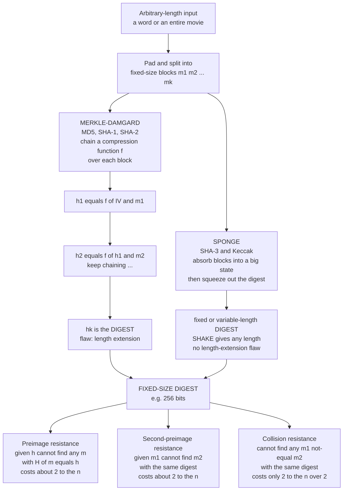

# 🔗 Cryptographic Hash Functions

> [!abstract] TL;DR
> A **cryptographic hash function** `H` maps arbitrary-length input to a **fixed-length digest** (SHA-256 emits 256 bits) — a **deterministic, one-way "fingerprint" of data**. It must satisfy **three security properties**: **preimage resistance** (given a digest you cannot find *any* input that produced it), **second-preimage resistance** (given one input you cannot find a *different* input with the same digest), and **collision resistance** (you cannot find *any two* distinct inputs colliding at all). A one-bit change flips roughly half the output bits — the **avalanche** effect. Because of the **birthday paradox**, collision resistance is capped at *half* the digest length: an `n`-bit hash yields only `2^(n/2)` collision security, which is exactly why SHA-256 gives "128-bit" collision resistance and digests are sized at *double* the target strength. Two dominant constructions exist — **Merkle-Damgard** (MD5, SHA-1, SHA-2; simple but suffers **length-extension**) and the **sponge** (SHA-3/Keccak; length-extension-immune, variable output via SHAKE). MD5 and SHA-1 are **broken**; SHA-2 and SHA-3 are the safe defaults. Hashes are the crypto Swiss-army knife: they power **digital signatures, HMAC, password storage, Merkle trees and blockchains, commitments, content-addressing (Git, IPFS), and integrity checks** everywhere.

---

## Intuition

**Analogy — a digital fingerprint.** Feed *anything* into a cryptographic hash — a single word, a legal contract, or an entire two-hour movie file — and it hands back a short, fixed-size string, say 64 hex characters. That string is a **fingerprint** of the data: it identifies the input as reliably as a fingerprint identifies a person, and it is always the *same* size no matter whether the input was one byte or one terabyte.

Three things make this fingerprint *cryptographic* rather than ordinary. First, **change a single bit of the input and the fingerprint changes completely and unpredictably** — not one character shifts, but roughly half of them scramble, with no visible relationship to the edit. Second, **you cannot run it backward**: given a fingerprint, there is no feasible way to reconstruct the data that made it, any more than you can rebuild a person from their fingerprint. Third, **you cannot forge a clash**: you cannot find two different documents that happen to share the same fingerprint. That combination — a compact, deterministic, one-way, clash-proof fingerprint of arbitrary data — is why the same primitive shows up in signatures, passwords, blockchains, and integrity checks alike. It is the closest thing cryptography has to a universal tool.

This is *not* the same as a hash-table hash or a CRC checksum. Those also map data to a short value, but they are built for **speed and even spreading**, not adversarial safety — you can trivially engineer collisions in them, and they leak structure. A cryptographic hash is engineered so that a determined attacker with enormous compute *still* cannot invert it or force a collision. (See [[Hash_Table_Fundamentals]] and [[String_Hashing]] for the non-adversarial cousins.)

---

## How It Works

### What a hash *is*, precisely

A cryptographic hash function is a map `H : {0,1}* -> {0,1}^n` from **arbitrary-length** bit strings to a **fixed** `n`-bit digest (n = 256 for SHA-256, 512 for SHA-512). It is:

- **Deterministic** — the same input always yields the same digest, on any machine, forever. This is what lets two parties independently verify they hold identical data.
- **Fast to compute** — hashing gigabytes is cheap (unlike password KDFs, which are *deliberately* slow; see below).
- **Compressing** — it crushes any input, however large, down to `n` bits. By pigeonhole, infinitely many inputs share each digest, so collisions *exist* mathematically. The security claim is only that they are **infeasible to find**.

### The three security properties

These are the *defining* requirements. A function is only a *cryptographic* hash if it plausibly meets all three:

1. **Preimage resistance (one-way).** Given a digest `h`, it is infeasible to find *any* message `m` with `H(m) = h`. You cannot invert the fingerprint. Best generic attack: brute-force guessing, about `2^n` work.
2. **Second-preimage resistance (weak collision resistance).** Given a *specific* message `m1`, it is infeasible to find a *different* `m2 != m1` with `H(m2) = H(m1)`. Best generic attack: about `2^n` work.
3. **Collision resistance (strong collision resistance).** It is infeasible to find *any* two distinct messages `m1 != m2` with `H(m1) = H(m2)` — the attacker gets to choose *both*. This is the **strongest and hardest** property, and the birthday bound (below) caps it at only `2^(n/2)` work.

Collision resistance implies second-preimage resistance, which (for most constructions) relates to preimage resistance — but they are distinct, and collision resistance is what breaks first when a hash is attacked.

### The avalanche effect

A well-designed hash exhibits **avalanche**: flipping a *single input bit* flips, on average, *half* the output bits, with no correlation an attacker can exploit. This is what makes the fingerprint look random and unforgeable — it destroys any structural relationship between similar inputs and their digests. The [Python demo](#python-demo) measures this directly and finds the difference clusters tightly around 50 percent.

### The birthday bound — why digests are double-sized

Naively you might expect finding a collision to cost `2^n` guesses. It does not. By the **birthday paradox** — the same reason only 23 people suffice for a better-than-even chance two share a birthday — collecting about `sqrt(2^n) = 2^(n/2)` random digests makes a collision *likely*. So:

> An `n`-bit hash offers only **`n/2` bits of collision resistance.**

SHA-256 therefore gives **128-bit** collision security, not 256-bit. This is precisely why **digest sizes are chosen at double the desired security level**: to resist a `2^128` collision search you must publish a 256-bit hash. Preimage and second-preimage attacks still cost the full `2^n`, so the *weakest* link for a broad hash is always collisions. (See [[Information_Theoretic_Security_and_Privacy]] for the probability foundations, and the demo, which empirically recovers the `2^(n/2)` scaling.)

### Two constructions: Merkle-Damgard vs sponge

A hash must digest inputs of *any* length, so it iterates a fixed-size primitive over blocks:

- **Merkle-Damgard** (MD5, SHA-1, **SHA-2**). Pad the message, split into blocks `m1, m2, ..., mk`, and chain a **compression function** `f`: start from a fixed IV, compute `h1 = f(IV, m1)`, then `h2 = f(h1, m2)`, and so on; the final chaining value is the digest. Simple, well-understood, and provably collision-resistant *if* `f` is. Its notorious flaw is the **length-extension attack**: because the digest *is* the full internal state, an attacker who knows `H(m)` can compute `H(m ‖ pad ‖ x)` for chosen `x` **without knowing `m`**. This is exactly why the naive MAC `H(key ‖ message)` is **broken** — and why **HMAC** (a nested construction) exists.
- **Sponge** (SHA-3 / **Keccak**). Maintain a large internal **state**; **absorb** the message by XOR-ing blocks into part of the state and permuting, then **squeeze** out digest bits. Because only *part* of the state is ever exposed, the sponge is **immune to length extension** and supports **arbitrary-length output** (the SHAKE extendable-output functions). SHA-3 emerged from an *open NIST competition* as a structurally different backup to SHA-2, so a break of one construction does not doom both.

### Flow / Architecture



---

## Key Concepts

### Secondary (intuitive, no CS background needed)

- **A digital fingerprint.** Any data in, a fixed short string out; identical data always fingerprints the same, different data almost never collides.
- **One bit flips everything.** Edit a single character and the fingerprint scrambles completely — that is the *avalanche* effect, and it is how tampering is detected.
- **No going backward.** From a fingerprint you cannot rebuild the data. That one-way property is why passwords and downloads can be verified without exposing the secret.
- **The MD5/SHA-1 lesson.** Old fingerprints (MD5, SHA-1) can now be *forged* — two different files made to share one fingerprint — so modern systems use SHA-2 or SHA-3.

### Undergraduate (a first security or theory course)

- **Formal signature.** `H : {0,1}* -> {0,1}^n`, deterministic, efficiently computable, compressing.
- **The three properties, ranked.** Collision resistance implies second-preimage resistance; preimage resistance is separate. Collision resistance is strongest and falls first.
- **Birthday bound.** Collisions cost `~2^(n/2)`, not `2^n` — so a 256-bit hash gives 128-bit collision security and digests are sized at double the target strength.
- **Length extension.** Merkle-Damgard leaks enough in its output to extend a hash of an unknown message; this breaks `H(key ‖ msg)` as a MAC. Fix with **HMAC** or use SHA-3.
- **Not a hash-table hash.** CRC and hash-table functions optimize speed and distribution, not adversarial resistance — never use them for security. See [[Hash_Table_Fundamentals]].
- **Salting for passwords.** Never store a bare hash of a password; salt it and use a *slow* KDF (bcrypt, scrypt, Argon2) so brute force is expensive.

### Graduate (advanced / applied cryptography)

- **Random oracle model.** Many proofs (RSA-OAEP, RSA-PSS, Fiat-Shamir transforms) model `H` as a **random oracle** — an idealized function returning uniform random outputs on each new query. It is a powerful heuristic with known *uninstantiability* results (schemes secure in the ROM with no secure concrete hash), so it is useful but debated. See [[Computational_Hardness_Assumptions]] and the forthcoming `Provable_Security_and_Reductions`.
- **Merkle-Damgard strengthening & MD-multicollisions.** Length-padding (MD strengthening) is required for the collision-resistance reduction; Joux's multicollision attack shows MD hashes admit `2^k` collisions for barely more than the cost of one, weakening cascaded constructions.
- **Indifferentiability.** The sponge is provably *indifferentiable* from a random oracle up to its capacity, a stronger structural guarantee than Merkle-Damgard offers — part of why Keccak won the SHA-3 competition.
- **Provable-security caveat.** Collision resistance cannot be met by a *single fixed* function in the asymptotic sense (an adversary can hardcode a colliding pair), so theory uses **keyed hash families**; deployed hashes are unkeyed and rely on the concrete-security "we could not find it" argument, like the underlying hardness assumptions.
- **Quantum impact.** Grover gives a quadratic speedup on preimage search (`2^n -> 2^(n/2)`) and the BHT algorithm attacks collisions at `2^(n/3)`; SHA-256 remains comfortable, and doubling output (SHA-512) restores margins — far less catastrophic than Shor's break of public-key assumptions.

---

## Python Demo

```python
# CRYPTOGRAPHIC HASH FUNCTIONS -- three properties, measured not asserted.
#
#   (a) AVALANCHE     : flip ONE input bit -> ~50% of the 256 output bits flip.
#   (b) BIRTHDAY BOUND: truncate SHA-256 to n bits, hash random inputs until a
#                       COLLISION appears; it shows up after ~2^(n/2) tries, NOT
#                       2^n -- the reason a 256-bit hash gives 128-bit collision
#                       resistance. We recover the sqrt(2^n) scaling empirically.
#   (c) PREIMAGE      : inverting (find ANY m with truncated-hash = target) costs
#                       the FULL ~2^n -- for the same n, hugely more than (b).
#
# Pure standard library + hashlib for all crypto; matplotlib only to draw it.

import hashlib
import os
import math
import matplotlib.pyplot as plt

# ---------------------------------------------------------------------------
# (a) AVALANCHE EFFECT
# ---------------------------------------------------------------------------
def sha256_bits(data: bytes) -> str:
    """Return the 256-bit SHA-256 digest as a string of '0'/'1'."""
    return bin(int.from_bytes(hashlib.sha256(data).digest(), "big"))[2:].zfill(256)

def flip_one_bit(data: bytes, bit_index: int) -> bytes:
    b = bytearray(data)
    b[bit_index // 8] ^= (1 << (bit_index % 8))
    return bytes(b)

TRIALS = 4000
avalanche_pct = []
for _ in range(TRIALS):
    msg = os.urandom(32)
    twin = flip_one_bit(msg, int.from_bytes(os.urandom(1), "big") % 256)
    h1, h2 = sha256_bits(msg), sha256_bits(twin)
    diff = sum(c1 != c2 for c1, c2 in zip(h1, h2))   # Hamming distance in bits
    avalanche_pct.append(100.0 * diff / 256)

mean_av = sum(avalanche_pct) / len(avalanche_pct)
print(f"(a) AVALANCHE: one flipped input bit changes {mean_av:.2f}% of output bits "
      f"(ideal 50%) over {TRIALS} trials.")

# ---------------------------------------------------------------------------
# (b) BIRTHDAY BOUND -- collisions appear after ~2^(n/2) tries
# ---------------------------------------------------------------------------
def trunc_hash(data: bytes, nbits: int) -> int:
    """Top nbits of SHA-256 as an integer -- an n-bit hash."""
    return int.from_bytes(hashlib.sha256(data).digest(), "big") >> (256 - nbits)

def trials_to_collision(nbits: int) -> int:
    """Hash fresh random inputs until two share the same n-bit digest."""
    seen = set()
    count = 0
    while True:
        count += 1
        h = trunc_hash(os.urandom(16), nbits)
        if h in seen:
            return count
        seen.add(h)

bit_lengths = [8, 12, 16, 20, 24, 28]
REPEATS = 12
measured = []
for n in bit_lengths:
    runs = [trials_to_collision(n) for _ in range(REPEATS)]
    avg = sum(runs) / len(runs)
    measured.append(avg)
    print(f"(b) n={n:>2} bits: first collision after ~{avg:>10.0f} tries "
          f"| sqrt(2^n)=2^(n/2)={2**(n/2):>10.0f} | full 2^n={2**n:>12}")

# theoretical curves: expected first-collision count ~ sqrt(pi/2) * 2^(n/2)
birthday_curve = [math.sqrt(math.pi / 2) * 2 ** (n / 2) for n in bit_lengths]
bruteforce_curve = [2 ** n for n in bit_lengths]

# ---------------------------------------------------------------------------
# (c) PREIMAGE RESISTANCE -- inverting costs the FULL ~2^n
# ---------------------------------------------------------------------------
def trials_to_preimage(nbits: int) -> int:
    """Pick a random target n-bit digest, brute-force ANY input mapping to it."""
    target = trunc_hash(os.urandom(16), nbits)
    count = 0
    while True:
        count += 1
        if trunc_hash(os.urandom(16), nbits) == target:
            return count

for n in [8, 12, 16, 20]:
    pre = sum(trials_to_preimage(n) for _ in range(6)) / 6
    col = sum(trials_to_collision(n) for _ in range(6)) / 6
    print(f"(c) n={n:>2} bits: PREIMAGE ~{pre:>9.0f} tries (approx 2^n={2**n}) "
          f"vs COLLISION ~{col:>7.0f} tries (approx 2^(n/2)={int(2**(n/2))}) "
          f"| ratio {pre/col:>6.1f}x harder to invert")

# ---------------------------------------------------------------------------
# VISUALIZE
# ---------------------------------------------------------------------------
fig, ax = plt.subplots(1, 2, figsize=(15, 5.6))

ax[0].hist(avalanche_pct, bins=40, color="steelblue", edgecolor="white")
ax[0].axvline(50, color="crimson", lw=2, ls="--", label="ideal 50%")
ax[0].axvline(mean_av, color="black", lw=2, label=f"measured {mean_av:.1f}%")
ax[0].set_xlabel("percent of the 256 output bits that flipped")
ax[0].set_ylabel("count")
ax[0].set_title("(a) Avalanche: one input-bit flip\nscrambles about half the digest")
ax[0].legend()

ax[1].semilogy(bit_lengths, bruteforce_curve, "^--", color="crimson", lw=2,
               label="naive guess: 2^n")
ax[1].semilogy(bit_lengths, birthday_curve, "-", color="darkorange", lw=2,
               label="birthday bound: ~2^(n/2)")
ax[1].semilogy(bit_lengths, measured, "o", color="seagreen", ms=9,
               label="measured collisions")
ax[1].set_xlabel("hash truncation length n (bits)")
ax[1].set_ylabel("tries to first collision (log scale)")
ax[1].set_title("(b) Collisions track 2^(n/2), not 2^n\n"
                "so a 256-bit hash gives only 128-bit collision resistance")
ax[1].legend(loc="upper left")
ax[1].grid(True, which="both", alpha=0.3)

plt.tight_layout()
plt.show()

print("\nTakeaway: measured green dots hug the ORANGE 2^(n/2) line, far below the")
print("red 2^n line. Collision search is square-root cheap -- which is exactly why")
print("digest sizes are DOUBLE the target security level (SHA-256 -> 128-bit).")
```

**What the demo shows.** Part (a): the avalanche histogram is a tight bell centered on 50 percent — one flipped input bit reliably scrambles about half of SHA-256's 256 output bits, exactly the unpredictability a fingerprint needs. Part (b): the measured collision counts (green dots) sit right on the **orange `2^(n/2)` birthday curve** and *far below* the red `2^n` line — empirical proof that collision search is square-root cheap, so a 256-bit digest buys only 128 bits of collision resistance. Part (c): for the *same* `n`, brute-forcing a **preimage** costs on the order of `2^n` tries while a **collision** costs only `2^(n/2)`, a gap that widens rapidly with `n` — quantifying why inverting a hash is far harder than merely colliding it, and why collisions are always the first thing to break.

---

## Real-World Applications

> **Example — every Git commit is content-addressed by a hash.** Git names every blob, tree, and commit by the hash of its contents (historically SHA-1, migrating to SHA-256). Two files with identical content get the same object ID automatically (free deduplication), a commit's ID cryptographically commits to its entire history (change any ancestor and every descendant ID changes — a hash chain), and `git fsck` detects any silent corruption because the stored content must re-hash to its name. This is a **content-addressed store** built entirely on collision resistance and the avalanche effect — the same idea underlies **IPFS** and **Docker image digests**.

- **Digital signatures ("hash-and-sign").** You sign the *hash* of a message, not the message itself — signatures operate on fixed-size inputs and you want to sign gigabyte documents. Collision resistance is essential: if an attacker finds two documents with the same hash, one signature validates both. See the forthcoming `Digital_Signatures`.
- **MACs / HMAC.** Message integrity and authenticity in TLS, JWT, and API signing use **HMAC**, a hash nested to sidestep length extension. See [[Hash_Functions_and_MACs]] and the forthcoming `Message_Authentication_Codes`.
- **Password storage.** *Never* store a raw hash. Salt each password and run a deliberately **slow** KDF (bcrypt, scrypt, **Argon2**) so offline brute force is expensive. See the forthcoming `Password_Hashing_and_KDFs`.
- **Merkle trees & blockchains.** Bitcoin block IDs, proof-of-work, and Merkle proofs for light-client verification are all hash chains; tamper with any transaction and every downstream hash changes. See [[Hash_Functions_and_Merkle_Trees]] and the forthcoming `Blockchain_Cryptography`.
- **Commitment schemes.** Publish `H(value ‖ nonce)` to *commit* to a value without revealing it, then open it later — binding comes from collision resistance, hiding from preimage resistance. See the forthcoming `Commitment_Schemes_and_Secret_Sharing`.
- **Integrity & content-addressing.** Download checksums, deduplication, Git/IPFS/Docker digests, and file-integrity monitoring all rely on the fingerprint being infeasible to forge.

---

## Common Pitfalls

- **Using MD5 or SHA-1 for security.** Both are **broken** for collision resistance — MD5 practically since 2004 (exploited to forge a CA certificate in the **Flame** malware) and SHA-1 since the 2017 **SHAttered** attack produced two colliding PDFs. Use SHA-256, SHA-512, or SHA-3. See the forthcoming `Cryptographic_Failures_and_Misuse`.
- **`H(key ‖ message)` as a MAC.** The **length-extension** property of Merkle-Damgard hashes (MD5, SHA-1, SHA-2) lets an attacker forge `H(key ‖ msg ‖ pad ‖ extra)` without the key. Use **HMAC**, or a length-extension-immune hash (SHA-3, BLAKE3).
- **Storing bare `SHA256(password)`.** A fast unsalted hash is trivially cracked with rainbow tables and GPUs. Password hashing requires a **salt** plus a **slow, memory-hard KDF** (Argon2/bcrypt/scrypt). Fast is a *feature* for integrity and a *bug* for passwords.
- **Assuming `n`-bit hash = `n`-bit collision security.** The **birthday bound** halves it: SHA-256 gives 128-bit collision resistance. Sizing a digest at only the target security level leaves collisions exposed.
- **Confusing a cryptographic hash with a checksum.** CRC32 and hash-table hashes have *zero* adversarial resistance — collisions are engineerable by design. They protect against *accidental* corruption, never against an *attacker*.
- **Trusting the random-oracle model blindly.** Proofs in the ROM (OAEP, PSS, Fiat-Shamir) are heuristic; there exist schemes secure with an idealized oracle yet insecure under *every* concrete hash. Treat it as strong evidence, not a guarantee. See [[Computational_Hardness_Assumptions]].

---

## Related Concepts

- [[Hash_Functions_and_MACs]] — the Cybersecurity companion: HMAC construction, length-extension attacks in depth, and the SHA-2 vs SHA-3 vs BLAKE3 engineering trade-offs.
- [[Hash_Functions_and_Merkle_Trees]] — how these fingerprints chain into Merkle trees for blockchain block IDs, proof-of-work, and O(log n) inclusion proofs.
- [[Computational_Hardness_Assumptions]] — one-way functions are the theoretical parent of a hash's preimage resistance; also the home of the random-oracle idealization used in hash-based proofs.
- [[Information_Theoretic_Security_and_Privacy]] — the probability and entropy foundations behind the birthday paradox and why collision search is square-root cheap.
- [[Hash_Table_Fundamentals]] — the *non*-cryptographic cousin: same "map data to a short value" idea, optimized for speed and distribution with no adversarial guarantees.
- [[String_Hashing]] — polynomial rolling hashes for algorithms (Rabin-Karp); fast and collision-prone, the opposite design point from a cryptographic hash.
- [[Groups_Rings_Fields_for_Cryptography]] — the algebraic structures underpinning the public-key schemes that hashes are combined with in hash-and-sign.
- [[Modular_Arithmetic_and_Number_Theory]] — the arithmetic layer beneath the signature and MAC schemes that consume hash outputs.

*(Forthcoming siblings in this Cryptography vault — `Cryptography_Overview`, `Message_Authentication_Codes`, `Digital_Signatures`, `Password_Hashing_and_KDFs`, `Blockchain_Cryptography`, `Commitment_Schemes_and_Secret_Sharing`, `Provable_Security_and_Reductions`, and `Cryptographic_Failures_and_Misuse` — will deepen each application and are referenced in prose above until they exist.)*

---

## Review Questions

1. **(Conceptual)** State the three security properties of a cryptographic hash and give a concrete attack scenario that each one prevents. Then explain why *collision resistance* implies *second-preimage resistance* but not vice versa, and why collision resistance is the property that "breaks first" in practice.
2. **(Scenario)** A colleague builds a message-authentication scheme by publishing `tag = SHA256(secret_key ‖ message)`. Explain the exact attack that defeats this, name the hash-construction property that enables it, and give two different fixes — one that keeps SHA-256 and one that changes the hash family. Why does SHA-3 not need the first fix?
3. **(Trade-off / quantitative)** You are designing a system that must resist collision attacks at the 128-bit security level for the next 20 years, including against a future quantum adversary. Using the birthday bound *and* the quantum collision/preimage speedups, justify a concrete digest size and hash choice, and explain why you would *not* simply pick the fastest available hash (e.g. a raw hash for password storage).

---

## Sources

- Katz, J., & Lindell, Y. (2020). *Introduction to Modern Cryptography* (3rd ed.). CRC Press. — Definitions of the three properties, Merkle-Damgard, and the birthday bound.
- NIST (2015). *FIPS 202: SHA-3 Standard — Permutation-Based Hash and Extendable-Output Functions.* https://csrc.nist.gov/pubs/fips/202/final — The sponge construction and SHAKE.
- NIST (2015). *FIPS 180-4: Secure Hash Standard (SHS).* https://csrc.nist.gov/pubs/fips/180-4/final — Specification of the SHA-1 and SHA-2 families.
- Stevens, M., Bursztein, E., Karpman, P., Albertini, A., & Markov, Y. (2017). "The First Collision for Full SHA-1" (SHAttered). *CRYPTO 2017.* https://shattered.io/ — The practical SHA-1 collision.
- Bertoni, G., Daemen, J., Peeters, M., & Van Assche, G. (2011). "Cryptographic Sponge Functions." https://keccak.team/files/CSF-0.1.pdf — The sponge/Keccak design and its indifferentiability from a random oracle.

---

#cryptography #hash-functions #sha #collision-resistance #merkle-damgard
