# 🔏 Message Authentication Codes

> [!abstract] TL;DR
> Encryption hides a message but does **nothing** to stop an active attacker from *tampering* with it in transit — flipping bits, truncating, or replaying ciphertext, all undetectably. A **Message Authentication Code (MAC)** is the missing half of secure communication: a keyed *tamper-evident seal*. The sender computes a short **tag** from the message **and** a shared secret key; the receiver recomputes it and rejects any message whose tag does not match. Without the key you cannot forge a valid tag, so any alteration is caught — the formal guarantee is **existential unforgeability under chosen-message attack (EUF-CMA)**. The correct constructions are **HMAC** (nested hashing, which specifically defeats length-extension attacks that break the naive `H(key ‖ message)`), **CBC-MAC/CMAC**, and polynomial MACs like **GMAC** and **Poly1305**. Modern practice bundles confidentiality and integrity into one **authenticated-encryption (AEAD)** primitive — AES-GCM, ChaCha20-Poly1305 — and when composing separately the only provably-safe order is **encrypt-then-MAC**. Two subtle-but-lethal details complete the picture: getting the composition order wrong causes **padding-oracle** breaks (Lucky13, POODLE), and comparing tags with a naive early-exit loop leaks a **timing side channel** — you must use **constant-time comparison**.

---

## Intuition

**Analogy:** Imagine mailing a signed contract inside a locked box. The lock (encryption) keeps a nosy courier from *reading* the pages — but it does nothing to stop a clever courier from *swapping* a page, tearing off the last paragraph, or resending yesterday's box as if it were today's. Locking a message hides it; it does not prove it arrived *unchanged* or that *you* were the one who sent it. What you actually want is a **wax seal stamped with a signet only you and the recipient possess**: a short imprint pressed from the *contents* of the letter plus a shared secret die. The recipient re-presses the seal from the letter they received; if the two imprints match, the letter is exactly what you wrote and truly came from a holder of the die. Alter a single word and the reseal no longer matches. Crucially, an attacker who never held the die cannot forge a matching seal for a message you never wrote.

That wax seal is a **MAC**. The "die" is a shared secret **key**; the "imprint" is a fixed-length **tag** computed from `(key, message)`. Encryption gives *confidentiality* (they can't read it); the MAC gives *integrity* (they can't change it undetected) and *authenticity* (proof it came from someone with the key). You almost always need both — and the modern lesson, learned through a graveyard of real breaks, is: **encryption without authentication is insecure.**

---

## How It Works

### The problem MACs solve

A symmetric cipher (see the planned sibling `Symmetric_Encryption_Fundamentals`, and the applied [[Symmetric_Encryption]]) delivers **confidentiality only**. Many modes are *malleable*: with a stream cipher or CTR-mode ciphertext `c = m ⊕ keystream`, flipping bit `i` of `c` flips exactly bit `i` of the recovered plaintext — an attacker can change `amount=100` to `amount=900` without ever decrypting anything. Ciphers also permit **truncation** (drop the tail) and **replay** (resend a valid old message). None of this is caught by decryption: the box still "opens," it just contains a forgery. A MAC closes this gap by proving two things at once — **integrity** (the bytes were not altered) and **data-origin authenticity** (they came from a party holding the shared key).

### What a MAC actually is

A MAC is a keyed function `MAC : Key × Message → Tag` producing a short, fixed-length **tag** (typically 128–256 bits). Protocol:

1. **Sender** computes `t = MAC_K(m)` and transmits `(m, t)`.
2. **Receiver** recomputes `t* = MAC_K(m')` on the message `m'` it received and **accepts iff `t* == t'`** (using a constant-time compare, see below).

The security definition is **EUF-CMA — existential unforgeability under chosen-message attack**: even an adversary who can obtain valid tags on *any messages of its choosing* still cannot produce a valid tag on a **new** message it never queried, except with negligible probability. Note the key symmetry with signatures: a MAC uses a **shared secret** and is verified only by parties who hold that secret, whereas a digital signature is verified with a **public** key by anyone (see [[Asymmetric_Cryptography_and_PKI]] and [[ECDSA_and_Digital_Signatures]], and the planned sibling `Digital_Signatures`). A consequence: MACs give integrity + authenticity but **not non-repudiation** — either party could have produced the tag, so a MAC can't prove *which* one did to a third party.

### HMAC — the standard hash-based MAC

The obvious idea — hash the key and message together as `H(K ‖ m)` — is **broken** (next subsection). The correct construction is **HMAC**:

$$\text{HMAC}(K, m) = H\big((K \oplus \text{opad}) \,\|\, H((K \oplus \text{ipad}) \,\|\, m)\big)$$

where `ipad = 0x36` repeated and `opad = 0x5c` repeated to the hash's block size. The **nested** (inner-then-outer) hashing is not decoration: it is exactly what neutralizes length-extension. HMAC is **provably secure if the compression function behaves as a PRF** (Bellare's proof), and it is everywhere — TLS record integrity and key derivation, JWT `HS256` token signing (see [[JWT_and_OAuth]]), IPsec, AWS SigV4 and other API request signing, and signed cookies.

### Why naive `H(key ‖ msg)` is broken: the length-extension attack

Merkle–Damgård hashes (MD5, SHA-1, SHA-2) process a message block-by-block and **the final digest IS the internal state** after the last block. That means anyone who knows `H(K ‖ m)` and the *length* of `K` can resume the hash from that state and keep going — computing `H(K ‖ m ‖ pad ‖ extra)` for attacker-chosen `extra`, **without ever knowing `K`**. The result is a *valid tag for an extended message*. This is not theoretical: the **Flickr API signature scheme** used `MD5(secret ‖ params)` and was forged exactly this way in 2009. Defenses: use **HMAC** (the outer hash hides the inner state), or a hash immune by design — **SHA-3 (Keccak sponge)** and **BLAKE2/BLAKE3** are not length-extendable, and **SHA-512/256** truncates away the extendable state. The Python demo below performs this forgery end-to-end.

### Other MAC families

- **CBC-MAC** — encrypt the message in CBC mode and keep the last block as the tag. Secure only for **fixed-length** messages; naive variable-length use is forgeable. **CMAC/OMAC** fixes this with key derivation and is the standardized block-cipher MAC.
- **GMAC** — the authentication half of **AES-GCM**: a polynomial (universal) hash `GHASH` evaluated over the field `GF(2^128)` (see [[Groups_Rings_Fields_for_Cryptography]]), then encrypted. Extremely fast with hardware `PCLMULQDQ`, but **catastrophically nonce-sensitive** — repeat a GCM nonce and you leak the authentication key.
- **Poly1305** — Bernstein's fast **one-time** MAC evaluated modulo the prime `2^130 − 5`, paired with the **ChaCha20** stream cipher (see the planned sibling `Stream_Ciphers_and_PRGs`). A fresh per-message key is derived so each Poly1305 instance authenticates once.
- **Carter–Wegman / universal-hashing MACs** — the theory underneath GMAC and Poly1305: a one-time MAC built from a universal hash family is **information-theoretically secure** for a single message (see [[Probability_and_Information_Theoretic_Security]]).

### Authenticated encryption (AEAD) and the encrypt-then-MAC principle

Composing a cipher and a MAC by hand is error-prone, so modern crypto bundles both into a single **AEAD** primitive — **AES-GCM**, **ChaCha20-Poly1305**, **AES-CCM** — which also authenticates optional **associated data** (unencrypted headers such as packet numbers or content types) that must be bound to the ciphertext but not hidden. The standing recommendation is blunt: **all encryption should be authenticated encryption.** When you *must* combine primitives yourself, the order is not a matter of taste:

- **Encrypt-then-MAC (EtM)** — encrypt, then MAC the *ciphertext*: `c = Enc(m); t = MAC(c)`. Verify `t` **before** decrypting. This is provably **IND-CCA** secure and lets you reject forgeries without touching the decryptor.
- **MAC-then-Encrypt (MtE)** — TLS's old CBC construction — and **Encrypt-and-MAC** have both led to **padding-oracle attacks** (**Lucky13**, **POODLE**) because the receiver decrypts *first* and leaks whether the padding was valid.

The ordering is critical (see the planned sibling `Cryptographic_Failures_and_Misuse`), which is exactly why AEAD — which gets it right by construction — is the modern default in **TLS 1.3**.

### Constant-time comparison

One more subtlety sinks otherwise-correct code. Comparing the received tag to the recomputed tag with a normal `==` (or a byte-by-byte loop that **returns early on the first mismatch**) leaks, through its **running time**, *how many leading bytes matched*. An attacker who can measure this feeds guesses byte-by-byte, keeping whichever guess ran slightly longer, and reconstructs a valid tag one byte at a time — turning an exponential forgery into a linear one. The fix is a **constant-time compare** that always examines every byte (`hmac.compare_digest`, `crypto/subtle.ConstantTimeCompare`). This is a real, exploited side-channel class (see the planned sibling `Side_Channel_Attacks`), and the demo visualizes the leak directly.

```mermaid
graph TD
    subgraph "MAC over a public channel"
      M["Message m"] --> TAG["tag t equals MAC of K and m"]
      K["Shared secret key K"] --> TAG
      TAG --> WIRE["Send m and t"]
      WIRE -->|"active attacker may flip bits<br/>truncate or replay"| RX["Receiver gets m-prime and t-prime"]
      K --> VER["Recompute t-star equals MAC of K and m-prime"]
      RX --> VER
      VER --> CMP{"constant-time compare<br/>t-star equals t-prime"}
      CMP -->|"match"| ACC["Accept: integrity plus authenticity"]
      CMP -->|"mismatch"| REJ["Reject: tampered or forged"]
    end

    subgraph "HMAC construction defeats length extension"
      HK["Key K"] --> IP["K xor ipad"]
      HK --> OP["K xor opad"]
      MM["Message m"] --> INNER["inner equals Hash of K-xor-ipad concat m"]
      IP --> INNER
      INNER --> OUTER["tag equals Hash of K-xor-opad concat inner"]
      OP --> OUTER
    end

    subgraph "Encrypt-then-MAC and AEAD"
      PT["Plaintext"] --> ENC["Encrypt with key Ke"]
      ENC --> CT["Ciphertext c"]
      HDR["Associated data header"] --> MC["tag equals MAC of Km over header and c"]
      CT --> MC
      MC --> OUT["Send header, c, tag<br/>verify tag BEFORE decrypting"]
    end
```



---

## Key Concepts

### Secondary (intuitive)
- A **MAC** is a keyed tamper-evident seal: a short **tag** computed from the message plus a shared secret key. Recompute it on arrival; if it matches, nothing was changed and it came from someone with the key.
- **Encryption ≠ authentication.** Hiding a message does not stop someone from silently *altering* it. You almost always need both.
- Without the key you **cannot forge** a valid tag, so any tampering — a flipped bit, a chopped tail, a replayed message — is detected.
- Use **HMAC** (not `H(key ‖ msg)`), prefer **authenticated encryption (AES-GCM / ChaCha20-Poly1305)**, and always compare tags with a **constant-time** function.

### Undergraduate (formal)
- **Security definition — EUF-CMA:** given oracle access to `MAC_K(·)` on chosen messages, no efficient adversary can output a valid `(m*, t*)` for a *fresh* `m*` with non-negligible probability. Strong-unforgeability additionally forbids new tags on already-queried messages.
- **MAC vs signature:** MAC = symmetric, shared key, verifier must hold the secret, no non-repudiation; signature = asymmetric, public verification, gives non-repudiation.
- **HMAC:** `H((K⊕opad) ‖ H((K⊕ipad) ‖ m))`; the nested design defeats length extension and is a PRF/MAC assuming the compression function is a PRF.
- **Length-extension attack:** for Merkle–Damgård `H`, knowing `H(K‖m)` and `|K|` lets you compute `H(K‖m‖glue‖extra)` with no key — breaking the secret-prefix MAC `H(K‖m)`.
- **Composition order:** encrypt-then-MAC is IND-CCA secure; MAC-then-encrypt and encrypt-and-MAC enable padding oracles (Lucky13, POODLE). Prefer **AEAD**.
- **Constant-time compare:** tag verification must not branch on tag contents; early-exit `==` leaks a byte-oriented timing oracle.

### Graduate (advanced)
- **PRF ⇒ MAC:** any secure pseudorandom function is a secure fixed-length MAC (`MAC_K(m) = F_K(m)`); the reduction turns a forger into a PRF distinguisher — the reduction machinery of the planned sibling `Provable_Security_and_Reductions` and [[Computational_Hardness_Assumptions]].
- **Universal hashing / Carter–Wegman:** `t = h(m) ⊕ F_K(nonce)` with an ε-almost-universal `h` yields a one-time-secure MAC with *information-theoretic* forgery bound ε per query — the design of **GMAC** (`GHASH` over `GF(2^128)`) and **Poly1305** (arithmetic mod `2^130 − 5`). Security collapses instantly on **nonce reuse**, which reveals the hash key.
- **AEAD notions:** IND-CPA + INT-CTXT ⇒ IND-CCA; formalized as the AEAD interface `Enc(K, N, A, M) → C` binding a nonce `N` and associated data `A`. Nonce-misuse-resistant modes (**AES-GCM-SIV**) degrade gracefully to leaking only equality of repeated `(N, M)` rather than the auth key.
- **CBC-MAC subtleties:** secure as a fixed-length PRF; variable-length messages need **ECBC/CMAC** (encrypt-last-block or subkey construction) to prevent length-splicing forgeries. Never reuse the block-cipher key for both CBC-MAC and CBC encryption.
- **Beyond-birthday and truncation:** 128-bit polynomial MACs face a birthday bound near `2^64` authenticated blocks per key; tag truncation trades bandwidth for forgery probability `2^(-t)`.
- **Timing side channel as a reduction:** a non-constant-time verifier is a *forgery oracle* — Bleichenbacher-style byte-at-a-time recovery reduces `2^128` guessing to `~16 × 256` measurements. Constant-time comparison is a correctness requirement, not an optimization.

---

## Python Demo

```python
# Message Authentication Codes: four lessons in one runnable script.
#   (A) the NAIVE MAC  H(key || message)  is FORGEABLE via a length-extension
#       attack -- we implement SHA-256 from scratch, resume it from a published
#       digest, and forge a valid tag for an extended message WITHOUT the key.
#   (B) HMAC (nested ipad/opad hashing) RESISTS the same attack.
#   (C) a naive early-exit tag compare leaks a TIMING side channel; the
#       constant-time compare does not.
#   (D) ENCRYPT-then-MAC rejects tampered ciphertext BEFORE decrypting.
# Pure standard library (hashlib/hmac/os/time) + matplotlib. No numpy required.
import os, hmac, hashlib, time
import matplotlib.pyplot as plt

# ============================================================
# A minimal, standard SHA-256 that we can RESUME from a given state.
# (Real code uses hashlib; we need the guts to demonstrate length extension.)
# ============================================================
_K = [
    0x428a2f98,0x71374491,0xb5c0fbcf,0xe9b5dba5,0x3956c25b,0x59f111f1,0x923f82a4,0xab1c5ed5,
    0xd807aa98,0x12835b01,0x243185be,0x550c7dc3,0x72be5d74,0x80deb1fe,0x9bdc06a7,0xc19bf174,
    0xe49b69c1,0xefbe4786,0x0fc19dc6,0x240ca1cc,0x2de92c6f,0x4a7484aa,0x5cb0a9dc,0x76f988da,
    0x983e5152,0xa831c66d,0xb00327c8,0xbf597fc7,0xc6e00bf3,0xd5a79147,0x06ca6351,0x14292967,
    0x27b70a85,0x2e1b2138,0x4d2c6dfc,0x53380d13,0x650a7354,0x766a0abb,0x81c2c92e,0x92722c85,
    0xa2bfe8a1,0xa81a664b,0xc24b8b70,0xc76c51a3,0xd192e819,0xd6990624,0xf40e3585,0x106aa070,
    0x19a4c116,0x1e376c08,0x2748774c,0x34b0bcb5,0x391c0cb3,0x4ed8aa4a,0x5b9cca4f,0x682e6ff3,
    0x748f82ee,0x78a5636f,0x84c87814,0x8cc70208,0x90befffa,0xa4506ceb,0xbef9a3f7,0xc67178f2]
_H0 = [0x6a09e667,0xbb67ae85,0x3c6ef372,0xa54ff53a,0x510e527f,0x9b05688c,0x1f83d9ab,0x5be0cd19]

def _rotr(x, n): return ((x >> n) | (x << (32 - n))) & 0xffffffff

def _compress(state, block):
    w = [int.from_bytes(block[i:i+4], "big") for i in range(0, 64, 4)]
    for i in range(16, 64):
        s0 = _rotr(w[i-15], 7) ^ _rotr(w[i-15], 18) ^ (w[i-15] >> 3)
        s1 = _rotr(w[i-2], 17) ^ _rotr(w[i-2], 19) ^ (w[i-2] >> 10)
        w.append((w[i-16] + s0 + w[i-7] + s1) & 0xffffffff)
    a, b, c, d, e, f, g, h = state
    for i in range(64):
        S1 = _rotr(e, 6) ^ _rotr(e, 11) ^ _rotr(e, 25)
        ch = (e & f) ^ (~e & g)
        t1 = (h + S1 + ch + _K[i] + w[i]) & 0xffffffff
        S0 = _rotr(a, 2) ^ _rotr(a, 13) ^ _rotr(a, 22)
        maj = (a & b) ^ (a & c) ^ (b & c)
        t2 = (S0 + maj) & 0xffffffff
        h, g, f, e = g, f, e, (d + t1) & 0xffffffff
        d, c, b, a = c, b, a, (t1 + t2) & 0xffffffff
    return [(x + y) & 0xffffffff for x, y in zip(state, [a, b, c, d, e, f, g, h])]

def _md_pad(msg_len):
    """The Merkle-Damgard padding SHA-256 appends to a message of msg_len bytes."""
    pad = b"\x80"
    while (msg_len + len(pad)) % 64 != 56:
        pad += b"\x00"
    return pad + (msg_len * 8).to_bytes(8, "big")

def sha256(msg):
    data = msg + _md_pad(len(msg))
    state = list(_H0)
    for i in range(0, len(data), 64):
        state = _compress(state, data[i:i+64])
    return b"".join(x.to_bytes(4, "big") for x in state)

assert sha256(b"abc").hex() == hashlib.sha256(b"abc").hexdigest()   # sanity check

# ============================================================
# PART A -- LENGTH-EXTENSION forgery of the naive MAC  H(key || message)
# ============================================================
def length_extend(orig_digest, orig_msg_len, extra):
    """Given tag = SHA256(prefix) with len(prefix)=orig_msg_len, forge the tag for
    prefix || glue || extra, resuming from the digest -- NO knowledge of prefix."""
    glue = _md_pad(orig_msg_len)
    state = [int.from_bytes(orig_digest[i:i+4], "big") for i in range(0, 32, 4)]
    already = orig_msg_len + len(glue)                       # multiple of 64
    data = extra + b"\x80"
    while len(data) % 64 != 56:
        data += b"\x00"
    data += ((already + len(extra)) * 8).to_bytes(8, "big")
    for i in range(0, len(data), 64):
        state = _compress(state, data[i:i+64])
    forged = b"".join(x.to_bytes(4, "big") for x in state)
    return forged, glue + extra                             # (forged_tag, suffix)

secret  = os.urandom(16)                                    # server key; attacker CANNOT see it
message = b"user=guest&role=viewer"
naive_tag = sha256(secret + message)                        # naive MAC = H(key || message)

# Attacker knows only: message, naive_tag, and the key LENGTH (16). No key!
key_len = 16
extra   = b"&role=admin"
forged_tag, suffix = length_extend(naive_tag, key_len + len(message), extra)
forged_message = message + suffix

server_recompute = sha256(secret + forged_message)          # server checks with its real key
naive_forged_ok  = (server_recompute == forged_tag)
print("PART A  naive H(key||msg)")
print("  forged message :", forged_message)
print("  forgery accepted by server WITHOUT the key:", naive_forged_ok)   # -> True (broken!)

# ============================================================
# PART B -- HMAC resists the same trick
# ============================================================
def my_hmac(key, msg):
    if len(key) > 64:
        key = sha256(key)
    key = key.ljust(64, b"\x00")
    ipad = bytes(k ^ 0x36 for k in key)
    opad = bytes(k ^ 0x5c for k in key)
    return sha256(opad + sha256(ipad + msg))

assert my_hmac(secret, message) == hmac.new(secret, message, hashlib.sha256).digest()

hmac_tag = my_hmac(secret, message)
# Attacker tries the identical extension attack against the HMAC tag:
fake_tag, suffix2 = length_extend(hmac_tag, 64 + len(message), extra)   # bogus assumption
hmac_forged_ok = (my_hmac(secret, message + suffix2) == fake_tag)
print("PART B  HMAC-SHA256")
print("  same length-extension forgery accepted:", hmac_forged_ok)      # -> False (safe)

# ============================================================
# PART C -- CONSTANT-TIME vs early-exit tag comparison (timing side channel)
# ============================================================
TAG_LEN = 16
real_tag = os.urandom(TAG_LEN)

def insecure_equal(a, b):
    """Early-exit compare: bails on the FIRST mismatch -> leaks match length."""
    if len(a) != len(b):
        return False, 0
    for i, (x, y) in enumerate(zip(a, b)):
        if x != y:
            return False, i + 1          # bytes examined = position of first mismatch
    return True, len(a)

# For each matching-prefix length p, craft a guess whose first mismatch is at p.
prefixes = list(range(TAG_LEN + 1))
def guess_with_prefix(p):
    if p == TAG_LEN:
        return bytes(real_tag)                                   # full match
    return real_tag[:p] + bytes([real_tag[p] ^ 0xFF]) + os.urandom(TAG_LEN - p - 1)

# (C1) deterministic root cause: bytes examined before early exit.
bytes_examined = [insecure_equal(real_tag, guess_with_prefix(p))[1] for p in prefixes]
ct_examined    = [TAG_LEN for _ in prefixes]                     # compare_digest reads all bytes

# (C2) real wall-clock timing (min-of-batches to suppress OS noise).
def time_compare(fn, guess, reps=40000, batches=7):
    best = float("inf")
    for _ in range(batches):
        t0 = time.perf_counter()
        for _ in range(reps):
            fn(real_tag, guess)
        best = min(best, (time.perf_counter() - t0) / reps)
    return best * 1e9                                            # nanoseconds per call

insecure_ns = [time_compare(lambda a, b: insecure_equal(a, b), guess_with_prefix(p))
               for p in prefixes]
const_ns    = [time_compare(hmac.compare_digest, guess_with_prefix(p)) for p in prefixes]
print("PART C  timing")
print(f"  insecure compare: mismatch-early {insecure_ns[0]:.0f} ns  vs  "
      f"full-match {insecure_ns[-1]:.0f} ns  (rises with match length)")
print(f"  constant-time   : {min(const_ns):.0f}..{max(const_ns):.0f} ns  (flat)")

# ============================================================
# PART D -- ENCRYPT-then-MAC rejects tampering BEFORE decrypting
# ============================================================
def keystream(key, nonce, n):                                   # SHA-256 in counter mode (a toy PRG)
    out, ctr = b"", 0
    while len(out) < n:
        out += sha256(key + nonce + ctr.to_bytes(8, "big")); ctr += 1
    return out[:n]

def xor(a, b): return bytes(x ^ y for x, y in zip(a, b))

enc_key, mac_key, nonce = os.urandom(16), os.urandom(16), os.urandom(12)
plaintext = b"transfer 100 USD to bob"
ct  = xor(plaintext, keystream(enc_key, nonce, len(plaintext)))
tag = my_hmac(mac_key, nonce + ct)                              # MAC the CIPHERTEXT (encrypt-then-MAC)

def etm_open(nonce, ct, tag):
    if not hmac.compare_digest(tag, my_hmac(mac_key, nonce + ct)):
        raise ValueError("MAC check FAILED -- reject before decrypting (no oracle exposed)")
    return xor(ct, keystream(enc_key, nonce, len(ct)))

tampered = bytearray(ct); tampered[0] ^= 0x08                   # attacker flips a ciphertext bit
print("PART D  encrypt-then-MAC")
print("  honest open :", etm_open(nonce, ct, tag))
try:
    etm_open(nonce, bytes(tampered), tag)
except ValueError as e:
    print("  tampered    :", e)

# ============================================================
# VISUALIZE
# ============================================================
fig, ax = plt.subplots(2, 2, figsize=(14, 9))

# A: naive MAC forged tag == server's recomputed tag (they coincide -> broken)
ax[0, 0].plot(range(32), list(server_recompute), lw=3, alpha=0.5, label="server recompute")
ax[0, 0].plot(range(32), list(forged_tag), "x", ms=6, label="attacker forged tag")
ax[0, 0].set_title("A: naive H(key||msg) FORGED by length extension (tags coincide)")
ax[0, 0].set_xlabel("tag byte index"); ax[0, 0].set_ylabel("byte value"); ax[0, 0].legend()

# B: HMAC extension attempt diverges from the true HMAC -> forgery fails
true_hmac_ext = my_hmac(secret, message + suffix2)
ax[0, 1].plot(range(32), list(true_hmac_ext), lw=3, alpha=0.5, label="true HMAC of forged msg")
ax[0, 1].plot(range(32), list(fake_tag), "x", ms=6, label="attacker extension attempt")
ax[0, 1].set_title("B: HMAC RESISTS length extension (tags differ)")
ax[0, 1].set_xlabel("tag byte index"); ax[0, 1].set_ylabel("byte value"); ax[0, 1].legend()

# C1: bytes examined before early exit -- the deterministic leak
ax[1, 0].plot(prefixes, bytes_examined, "-o", label="insecure early-exit compare")
ax[1, 0].plot(prefixes, ct_examined, "--s", label="constant-time (reads all bytes)")
ax[1, 0].set_title("C: WHY it leaks -- work scales with matching prefix")
ax[1, 0].set_xlabel("number of matching leading bytes")
ax[1, 0].set_ylabel("tag bytes examined"); ax[1, 0].legend()

# C2: measured time rises for the insecure compare, flat for constant-time
ax[1, 1].plot(prefixes, insecure_ns, "-o", label="insecure early-exit compare")
ax[1, 1].plot(prefixes, const_ns, "--s", label="hmac.compare_digest (constant-time)")
ax[1, 1].set_title("C: measured timing side channel")
ax[1, 1].set_xlabel("number of matching leading bytes")
ax[1, 1].set_ylabel("nanoseconds per compare"); ax[1, 1].legend()

plt.tight_layout(); plt.show()

# Takeaways:
#   A -> naive H(key||msg) is broken: a valid tag for message||glue||extra is forged
#        from the published tag and the key LENGTH alone. Never build a MAC this way.
#   B -> HMAC's outer hash hides the internal state, so the same trick fails.
#   C -> early-exit compare's runtime rises with the matching-prefix length, a
#        byte-at-a-time forgery oracle; hmac.compare_digest stays flat.
#   D -> encrypt-then-MAC verifies the tag before decryption, so a flipped bit is
#        rejected without ever running the decryptor (no padding oracle).
```

Running it prints `forgery accepted by server WITHOUT the key: True` for the naive MAC and `False` for HMAC, shows the insecure compare's per-call time climbing from tens of nanoseconds (early mismatch) toward the full-match cost while `hmac.compare_digest` stays flat, and rejects the tampered ciphertext at the MAC stage. The four panels visualize the length-extension forgery (attacker tag lands exactly on the server's recomputed tag), HMAC's resistance (tags diverge), and both the *root cause* (bytes examined) and the *observable effect* (measured time) of the timing side channel.

---

## Real-World Applications

> **Example — TLS.** The protocol is a museum of this note. **TLS 1.2** used HMAC for record integrity, but its **MAC-then-encrypt** CBC construction leaked padding validity through timing — the **Lucky13** attack — and SSLv3's variant fell to **POODLE**. The response was decisive: **TLS 1.3 dropped MAC-then-encrypt entirely and mandates AEAD** — AES-GCM (GMAC over `GF(2^128)`) or ChaCha20-Poly1305 — so confidentiality and integrity arrive as one primitive with associated data binding the record header. See [[TLS_Protocol_Deep_Dive]].

- **JWT / token signing:** the `HS256` algorithm is literally **HMAC-SHA256** over the token's header and payload; a valid signature proves the token was minted by a holder of the secret and not tampered with (see [[JWT_and_OAuth]]). The infamous `alg: none` and RS256-to-HS256 confusion bugs are failures to authenticate *which* verification path is used.
- **API request signing:** **AWS Signature Version 4**, Stripe webhooks, and countless partner APIs sign each request with HMAC over the method, path, headers, and body so a proxy cannot alter or replay it.
- **IPsec / ESP and SSH:** per-packet HMAC (or AEAD) provides integrity and anti-replay for VPN and remote-shell traffic.
- **Signed cookies and sessions:** frameworks (Rails, Django, Flask) HMAC session cookies so the client cannot forge `admin=true`.
- **Secure messaging:** the Signal/Double-Ratchet protocol authenticates every message with a MAC derived from the ratchet, giving per-message integrity on top of forward-secret encryption.
- **Disk and cloud storage:** authenticated-encryption modes protect data at rest so a storage-layer attacker cannot silently flip ciphertext blocks.

---

## Common Pitfalls

- **Encrypting without authenticating** — unauthenticated ciphertext is malleable; a stream/CTR bit-flip is an undetected plaintext edit. Rule of thumb: **all encryption should be authenticated encryption (AEAD)**.
- **Rolling a MAC as `H(key ‖ message)`** — the secret-prefix MAC is broken by **length extension** on any Merkle–Damgård hash (SHA-1/SHA-2), as the demo forges live. Use **HMAC**, or a length-extension-immune hash (SHA-3, BLAKE2/3, SHA-512/256).
- **Non-constant-time tag comparison** — a naive `==` or early-exit loop leaks a **timing oracle** that enables byte-at-a-time forgery. Always use `hmac.compare_digest` / `crypto/subtle`.
- **Wrong composition order** — MAC-then-encrypt and encrypt-and-MAC caused Lucky13 and POODLE. Use **encrypt-then-MAC** (verify tag *before* decrypting) or, better, a vetted AEAD.
- **Nonce reuse in GCM/Poly1305** — repeating a nonce under the same key **leaks the authentication key**, allowing universal forgery (and, in GCM, plaintext XOR). Use a counter or a misuse-resistant mode (AES-GCM-SIV).
- **No replay or context binding** — a valid `(message, tag)` can be *replayed*; a MAC proves integrity, not freshness. Bind sequence numbers, timestamps, or session context (as associated data) and reject duplicates.
- **Truncating tags too aggressively** — a `t`-bit tag admits forgery with probability `2^(-t)`; don't shave tags below the security you need.
- **Reusing one key for encryption and MAC** — derive **independent** keys (e.g., via HKDF); sharing a key across primitives voids the security proofs.
- **Treating a MAC like a signature** — a MAC gives no **non-repudiation**; either holder of the shared key could have produced it, so it can't prove authorship to a third party.

---

## Related Concepts

- [[Hash_Functions_and_MACs]] — the applied companion covering hash security properties and the HMAC/length-extension story in an engineering context.
- [[Symmetric_Encryption]] — block/stream ciphers and AEAD modes (AES-GCM, ChaCha20-Poly1305) that MACs pair with; the confidentiality half of secure channels.
- [[TLS_Protocol_Deep_Dive]] — where HMAC, AEAD, encrypt-then-MAC, Lucky13/POODLE, and the TLS 1.3 AEAD-only mandate all play out in production.
- [[JWT_and_OAuth]] — `HS256` tokens are HMAC-SHA256 in the wild; a concrete integrity/authenticity application (and its `alg` pitfalls).
- [[Asymmetric_Cryptography_and_PKI]] — digital signatures are the public-verification counterpart of MACs, adding non-repudiation that shared-key MACs cannot.
- [[ECDSA_and_Digital_Signatures]] — the asymmetric authentication primitive to contrast against symmetric MACs.
- [[Computational_Hardness_Assumptions]] — HMAC's security reduces to the compression function being a PRF; the reduction-style guarantees behind "provably secure" MACs.
- [[Probability_and_Information_Theoretic_Security]] — Carter–Wegman one-time MACs (the theory beneath GMAC/Poly1305) are information-theoretically secure for a single message.
- [[Groups_Rings_Fields_for_Cryptography]] — GMAC's `GHASH` and Poly1305 are polynomial evaluations over finite fields; the algebra that makes universal-hash MACs fast.
- [[Cryptography_Overview]] — the parent map placing MACs as the integrity + authentication primitive among the four security goals.

*(Planned Cryptography siblings referenced in prose until they exist: `Symmetric_Encryption_Fundamentals`, `Hash_Functions`, `Modes_of_Operation`, `Digital_Signatures`, `Provable_Security_and_Reductions`, `Side_Channel_Attacks`, `Cryptographic_Failures_and_Misuse`, `Stream_Ciphers_and_PRGs`, `TLS_and_Secure_Channels`.)*

---

## Review Questions

1. **Secondary (conceptual):** Encryption already scrambles a message so an eavesdropper can't read it. Explain, using the wax-seal analogy, *why that isn't enough* and what extra guarantee a MAC adds. Give one concrete example of damage an attacker can do to encrypted-but-unauthenticated data.
2. **Undergraduate (scenario):** A developer builds an API token as `tag = SHA256(secret_key ‖ token_data)` and ships it. Describe precisely how an attacker who knows a valid `(token_data, tag)` pair and the length of `secret_key` can forge a valid tag for `token_data ‖ …extra…` **without** the key. What single change (naming a specific construction) fixes it, and *why* does that construction defeat the attack?
3. **Graduate (trade-off):** You must protect a message with both confidentiality and integrity and can either (a) hand-compose a cipher with HMAC or (b) use an AEAD such as AES-GCM. Compare them on composition-order correctness, nonce sensitivity, associated-data support, and failure modes (padding oracles vs nonce-reuse key leakage). Then justify why "encrypt-then-MAC" is the only safe manual order and why TLS 1.3 abandoned manual composition altogether.

---

## Sources

- [Bellare, Canetti, Krawczyk, "Keying Hash Functions for Message Authentication" (HMAC), CRYPTO 1996](https://cseweb.ucsd.edu/~mihir/papers/kmd5.pdf)
- [Krawczyk, "The Order of Encryption and Authentication for Protecting Communications" (encrypt-then-MAC), CRYPTO 2001](https://www.iacr.org/archive/crypto2001/21390309.pdf)
- [Katz & Lindell, *Introduction to Modern Cryptography* (3rd ed., 2020) — Chapter 4, Message Authentication Codes](https://www.cs.umd.edu/~jkatz/imc.html)
- [Boneh & Shoup, *A Graduate Course in Applied Cryptography* — Chapters 6–9 (MACs, AEAD)](https://toc.cryptobook.us/)
- [NIST SP 800-38D, "Recommendation for GCM and GMAC"](https://csrc.nist.gov/pubs/sp/800/38/d/final)
- [AlFardan & Paterson, "Lucky Thirteen: Breaking the TLS and DTLS Record Protocols" (2013)](https://www.ieee-security.org/TC/SP2013/papers/4977a526.pdf)

---

#cryptography #mac #hmac #authenticated-encryption #integrity
