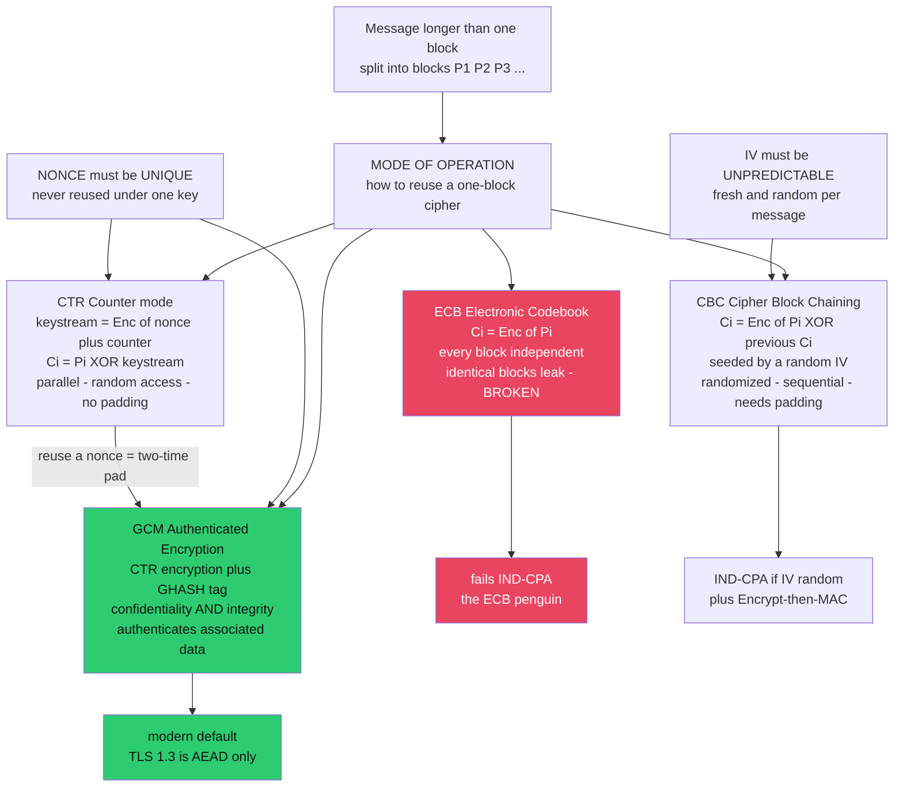

# 🔗 Modes of Operation

> [!abstract] TL;DR
> A **block cipher** (like AES) encrypts exactly **one fixed-size block** — 16 bytes — deterministically. Real messages are arbitrary length, so a **mode of operation** specifies how to invoke the block cipher repeatedly to encrypt a whole message *securely*. **The mode choice is as important as the cipher.** **ECB** encrypts each block independently, so identical plaintext blocks become identical ciphertext blocks — it leaks structure (the infamous **ECB penguin**) and fails IND-CPA; **never use it**. **CBC** XORs each block with the previous ciphertext block, seeded by a random **IV**, achieving IND-CPA — but it is sequential, needs padding (padding-oracle risk), and the IV must be *unpredictable*. **CTR** encrypts a **nonce plus counter** to make a keystream and XORs it with the plaintext — parallel, random-access, no padding — but a repeated nonce is a **two-time-pad disaster**. Modern practice is **AEAD** (**AES-GCM**, **ChaCha20-Poly1305**): CTR-style encryption *plus* an authentication tag, giving confidentiality **and** integrity in one primitive. "Encryption without authentication is a bug." Almost every real-world symmetric-crypto break lives in the mode and the **nonce/IV discipline**, not the cipher.

---

## Intuition

**Analogy.** A block cipher is a single industrial stamping press that can lock exactly **one shoebox** at a time, and it always stamps the *same* box the *same* way. Now you need to ship a whole warehouse of boxes. The **mode of operation** is your rulebook for running that one press across thousands of boxes.

The naive rule — *stamp every box independently with the same setting* — is **ECB (Electronic Codebook)**. It seems fine until you notice the fatal flaw: **two boxes with identical contents get identical stamps.** An observer who cannot open any box can still see *which boxes match*, and from that alone reconstruct the shape of your shipment. That is exactly the **ECB penguin**: encrypt a picture of a penguin with AES-ECB and the penguin's outline is *still perfectly visible* in the ciphertext, because every uniform patch of colour is a repeated plaintext block that maps to the same repeated ciphertext block. The cipher is strong; the *mode* threw away all its strength.

The fix in every good mode is the same idea: inject **freshness** so that identical inputs stop producing identical outputs. CBC chains each box to the last one starting from a random seed (the **IV**); CTR mixes in an ever-increasing counter; GCM does that *and* welds on a tamper-evident seal. Get the freshness discipline wrong — reuse a seed, repeat a counter — and the whole thing collapses back to the penguin, or worse.

---

## How It Works

### The problem a mode solves

A block cipher is a keyed **pseudorandom permutation (PRP)**: for a fixed key `k`, `E_k` is a fixed, *deterministic* bijection on the block space (128-bit blocks for AES). Two properties follow that a mode must work around:

1. **Fixed width.** It maps 16 bytes to 16 bytes. It cannot, by itself, encrypt 17 bytes or 17 megabytes.
2. **Deterministic.** The same block under the same key always yields the same output. Determinism is *poison* for confidentiality over multi-block data, because equality of plaintext blocks leaks through as equality of ciphertext blocks.

A **mode of operation** turns the one-block PRP into a scheme for arbitrary-length messages while *hiding* that determinism — usually by mixing in a per-message **IV** or per-message **nonce** so the encryption becomes **randomized** (or at least **stateful and unique**). The gold-standard target is **IND-CPA**: ciphertexts are indistinguishable even to an adversary who can choose plaintexts to encrypt (see [[Cryptography_Overview]] for the definition; the reduction to the PRP's security belongs in the vault's planned `Provable_Security_and_Reductions` note).

### The four canonical modes

- **ECB — Electronic Codebook (BROKEN).** `C_i = E_k(P_i)`. Each block encrypted independently, no IV. Deterministic, so identical blocks leak; fails IND-CPA. Its only legitimate use is encrypting a *single* random block (for example, wrapping one key), where there is no structure to leak.
- **CBC — Cipher Block Chaining.** `C_0 = IV`; `C_i = E_k(P_i ⊕ C_{i-1})`. The XOR with the previous ciphertext makes each block depend on all prior blocks; a random, **unpredictable** IV randomizes the first. Achieves IND-CPA. Downsides: **encryption is sequential** (cannot parallelize; decryption can), it needs **padding** to a block boundary (opening the door to **padding-oracle** attacks if integrity is not checked), and a **predictable IV** enables chosen-plaintext attacks such as **BEAST**.
- **CTR — Counter mode.** `C_i = P_i ⊕ E_k(nonce ‖ i)`. The cipher never touches the plaintext; it encrypts a **counter block** built from a per-message **nonce** and the block index to produce a **keystream**, which is XORed with the data. This turns a block cipher into a **stream cipher** (see the planned `Stream_Ciphers_and_PRGs` note): **fully parallelizable**, **random-access** (decrypt block 900 without the first 899), and **no padding**. The catch is absolute: **the nonce must never repeat under a given key**, because a repeated `nonce ‖ i` regenerates the *same keystream*, and reused keystream is a **two-time pad** — `C ⊕ C' = P ⊕ P'` leaks the XOR of the plaintexts.
- **GCM — Galois/Counter Mode (AEAD).** CTR-mode encryption **plus** a **GHASH** authentication tag computed in the Galois field `GF(2^128)` (see [[Groups_Rings_Fields_for_Cryptography]]). It provides **Authenticated Encryption with Associated Data**: the tag protects both the ciphertext *and* unencrypted **associated data** (headers, sequence numbers, addresses). One key, one primitive, both confidentiality and integrity. **ChaCha20-Poly1305** is the software-friendly AEAD alternative (no AES-NI hardware needed, constant-time by construction).

### IV vs nonce — the two freshness contracts

These are the single most error-prone part of applied symmetric crypto, and their *requirements differ*:

- A **CBC IV** must be **random and unpredictable** per message. Reusing or predicting it leaks information about the plaintext.
- A **CTR/GCM nonce** ("number used once") must be **unique** per key — it may be a simple counter and need not be secret, but it must **never repeat**. **GCM nonce reuse is catastrophic**: it not only leaks `P ⊕ P'` but exposes the GHASH authentication subkey `H = E_k(0^128)`, letting an attacker **forge** tags for arbitrary messages (the "**forbidden attack**"). **Misuse-resistant** modes — **SIV** and **AES-GCM-SIV** — derive a synthetic IV from the message itself, so a repeated nonce only leaks message *equality* rather than everything.

### Authenticate, and in the right order

Confidentiality is not enough — unauthenticated ciphertext is **malleable** and attackers exploit that (padding oracles, bit-flipping). If you are not using an AEAD, the only sound generic composition is **Encrypt-then-MAC**: encrypt, then MAC the *ciphertext*, and verify the MAC *before* decrypting (see [[Hash_Functions_and_MACs]]). **MAC-then-Encrypt** and **Encrypt-and-MAC** invite padding-oracle attacks because the attacker's ciphertext is processed before authentication. AEAD modes bundle this composition correctly so you cannot get the order wrong — which is precisely why they are the default.



---

## Key Concepts

### Secondary (intuitive)
- A **block cipher** locks one fixed-size box; a **mode** is the rulebook for locking a whole warehouse of boxes with that one press.
- **ECB** stamps every box the same way, so identical boxes look identical — that is the **penguin**. Never use it for real data.
- **CBC** and **CTR** mix in freshness (a random **IV** or a unique **nonce**) so identical data looks different every time, like uniform noise.
- **GCM / AEAD** also welds on a **tamper-evident seal (tag)**, so you *notice* if anyone edits the ciphertext.
- Two golden rules: **never reuse a nonce**, and **always authenticate**.

### Undergraduate (formal)
- **ECB:** `C_i = E_k(P_i)` — deterministic, so it fails **IND-CPA**; equal plaintext blocks reveal themselves as equal ciphertext blocks.
- **CBC:** `C_0 = IV`, `C_i = E_k(P_i ⊕ C_{i-1})` — IND-CPA if the IV is random and unpredictable; sequential encryption; requires block **padding** (PKCS#7), which enables **padding-oracle** attacks when unauthenticated.
- **CTR:** `C_i = P_i ⊕ E_k(nonce ‖ i)` — a keystream generator; parallel, random-access, no padding; **security dies if a nonce repeats under a key** (keystream reuse).
- **AEAD (GCM):** CTR encryption plus a **GHASH** tag over `GF(2^128)`; the tag authenticates ciphertext **and** associated data; **ChaCha20-Poly1305** is the constant-time, hardware-free alternative.
- **Composition:** **Encrypt-then-MAC** is the sound order; **MAC-then-Encrypt** and **Encrypt-and-MAC** are fragile — AEAD removes the choice.

### Graduate (advanced)
- **IND-CPA reductions:** a mode is a secure encryption scheme if the underlying `E_k` is a secure **PRP/PRF** and the IV/nonce contract holds. CTR's security follows from the PRF switching lemma; both CTR and CBC carry a **birthday bound** — security degrades after roughly `2^{n/2}` blocks per key (for AES, `n = 128`, so ~`2^{64}` blocks), which is why keys are rotated.
- **The forbidden attack (GCM nonce reuse):** two messages under the same nonce expose `H = E_k(0^128)`; treating GHASH as a polynomial over `GF(2^128)`, the attacker solves for `H` and obtains **universal forgery** — formalized by Joux. This is *worse* than a two-time pad because it breaks **integrity**, not just confidentiality.
- **Misuse-resistant AE (MRAE):** **SIV** and **AES-GCM-SIV** derive a synthetic IV as a MAC of `(nonce, AAD, plaintext)`, so nonce reuse degrades gracefully to leaking only plaintext *equality*. Related frontiers: **key commitment** (a ciphertext should decrypt under only one key) and **release-of-unverified-plaintext** robustness.
- **Tweakable modes:** **XTS** (a tweakable block cipher keyed by sector index) is the standard for **disk encryption** — it is deterministic *per sector* with no cross-sector diffusion, an acceptable trade because a disk has no room for per-sector IVs, but it means XTS leaks equal sectors and is not an AEAD.
- **Why the field moved to AEAD-only:** **Vaudenay** padding oracles, **Lucky13** timing side-channels, and **POODLE** exploited CBC-with-MAC-then-Encrypt in TLS; **TLS 1.3** responded by removing CBC entirely and permitting only AEAD.

---

## Python Demo

```python
# Modes of operation from scratch, and WHY ECB is broken.
#   We build a real, invertible toy block cipher (a SHA-256-based Feistel network,
#   a genuine keyed pseudorandom permutation) so nothing depends on external crypto
#   libraries -- pure stdlib + matplotlib.
#
#   (a) ECB: encrypt a highly patterned image. Identical plaintext blocks map to
#       identical ciphertext blocks, so the SHAPE SURVIVES -> the "ECB penguin".
#   (b) CBC (random IV) and CTR (random nonce): the SAME image becomes uniform
#       random-looking noise -> IND-CPA in action.
#   (c) CTR NONCE REUSE is catastrophic: encrypting two images under the same
#       nonce+key gives C1 XOR C2 == P1 XOR P2 -> a two-time pad, structure leaks.
#   (d) CBC with a REUSED/PREDICTABLE IV leaks equality of message prefixes.
import os, struct, hashlib, math
import matplotlib.pyplot as plt

BLOCK = 16      # 128-bit block, like AES
HALF  = 8
ROUNDS = 6

def _xor(a, b):
    return bytes(x ^ y for x, y in zip(a, b))

def _F(half, key, rnd):
    """Feistel round function: a PRF built from SHA-256, output HALF bytes."""
    return hashlib.sha256(key + bytes([rnd]) + half).digest()[:HALF]

def block_encrypt(block, key):
    """Deterministic 16-byte -> 16-byte permutation (a toy PRP)."""
    L, R = block[:HALF], block[HALF:]
    for rnd in range(ROUNDS):
        L, R = R, _xor(L, _F(R, key, rnd))
    return L + R

def block_decrypt(block, key):
    L, R = block[:HALF], block[HALF:]
    for rnd in reversed(range(ROUNDS)):
        L, R = _xor(R, _F(L, key, rnd)), L
    return L + R

# ---- modes of operation (data assumed block-aligned for clarity) -------------
def ecb_encrypt(data, key):
    return b"".join(block_encrypt(data[i:i+BLOCK], key)
                    for i in range(0, len(data), BLOCK))

def cbc_encrypt(data, key, iv):
    out, prev = bytearray(), iv
    for i in range(0, len(data), BLOCK):
        prev = block_encrypt(_xor(data[i:i+BLOCK], prev), key)
        out += prev
    return bytes(out)

def cbc_decrypt(data, key, iv):
    out, prev = bytearray(), iv
    for i in range(0, len(data), BLOCK):
        c = data[i:i+BLOCK]
        out += _xor(block_decrypt(c, key), prev)
        prev = c
    return bytes(out)

def ctr_encrypt(data, key, nonce):
    """nonce is 8 bytes; counter block = nonce || 8-byte big-endian index."""
    out = bytearray()
    for idx, i in enumerate(range(0, len(data), BLOCK)):
        ks = block_encrypt(nonce + struct.pack(">Q", idx), key)
        out += _xor(data[i:i+BLOCK], ks)
    return bytes(out)                       # CTR is its own inverse

# ---- build two highly patterned "images" (large uniform regions) -------------
H = W = 128                                 # W is a multiple of BLOCK -> blocks align to rows

def blank(v):
    return [[v] * W for _ in range(H)]

def disc(img, cx, cy, r, val):
    for y in range(H):
        for x in range(W):
            if (x - cx) ** 2 + (y - cy) ** 2 <= r * r:
                img[y][x] = val

def smiley():
    img = blank(40)                                     # dark background
    disc(img, W/2, H/2, W*0.40, 220)                    # bright face
    disc(img, W/2 - W*0.15, H/2 - H*0.12, W*0.05, 40)   # left eye
    disc(img, W/2 + W*0.15, H/2 - H*0.12, W*0.05, 40)   # right eye
    for t in range(20, 161):                            # smile arc (lower half)
        ang = math.radians(t)
        mx = int(W/2 + W*0.22*math.cos(ang))
        my = int(H/2 + H*0.20*math.sin(ang))
        for oy in range(-2, 3):
            for ox in range(-2, 3):
                if 0 <= my+oy < H and 0 <= mx+ox < W:
                    img[my+oy][mx+ox] = 40
    return img

def diamond():
    img = blank(40)
    cx, cy, r = W/2, H/2, W*0.42
    for y in range(H):
        for x in range(W):
            if abs(x - cx) + abs(y - cy) <= r:
                img[y][x] = 200
    return img

def flatten(img):  return bytes(v for row in img for v in row)
def reshape(data): return [[data[y*W + x] for x in range(W)] for y in range(H)]

img1, img2 = smiley(), diamond()
flat1, flat2 = flatten(img1), flatten(img2)

key   = os.urandom(16)
iv    = os.urandom(BLOCK)     # random, unpredictable  -> correct for CBC
nonce = os.urandom(HALF)      # unique per key         -> correct for CTR

ecb1 = ecb_encrypt(flat1, key)
cbc1 = cbc_encrypt(flat1, key, iv)
ctr1 = ctr_encrypt(flat1, key, nonce)

# correctness: CBC/CTR round-trip back to the original plaintext
assert cbc_decrypt(cbc1, key, iv)        == flat1
assert ctr_encrypt(ctr1, key, nonce)     == flat1

# (a) ECB leaks: thousands of ciphertext blocks, only a handful DISTINCT
n_blocks = len(ecb1) // BLOCK
ecb_distinct = len({ecb1[i:i+BLOCK] for i in range(0, len(ecb1), BLOCK)})
cbc_distinct = len({cbc1[i:i+BLOCK] for i in range(0, len(cbc1), BLOCK)})
print(f"ECB: {n_blocks} ciphertext blocks but only {ecb_distinct} DISTINCT -> structure leaks")
print(f"CBC: {n_blocks} ciphertext blocks, {cbc_distinct} distinct       -> looks random")

# (c) CTR NONCE REUSE = two-time pad: C1 XOR C2 == P1 XOR P2
bad_nonce = os.urandom(HALF)
c1 = ctr_encrypt(flat1, key, bad_nonce)
c2 = ctr_encrypt(flat2, key, bad_nonce)          # SAME nonce, SAME key -- FORBIDDEN
leak = _xor(c1, c2)
print("CTR nonce reuse: C1 XOR C2 == P1 XOR P2 ?", leak == _xor(flat1, flat2), "(keystream cancels)")

# (d) CBC with a REUSED/PREDICTABLE IV leaks equality of message prefixes
shared = b"ACCOUNT:12345678"                     # identical 16-byte first block
m_a = shared + b"balance=0000100!"
m_b = shared + b"balance=9999999!"
fixed_iv = b"\x00" * BLOCK
ca, cb = cbc_encrypt(m_a, key, fixed_iv), cbc_encrypt(m_b, key, fixed_iv)
ra = cbc_encrypt(m_a, key, os.urandom(BLOCK))
rb = cbc_encrypt(m_b, key, os.urandom(BLOCK))
print("CBC fixed IV   : first cipher block equal ?", ca[:BLOCK] == cb[:BLOCK], "-> leaks shared prefix")
print("CBC random IV  : first cipher block equal ?", ra[:BLOCK] == rb[:BLOCK], "-> no leak")

# ---- visualize: the penguin vs the noise ------------------------------------
fig, ax = plt.subplots(2, 3, figsize=(13, 9))
show = dict(cmap="gray", vmin=0, vmax=255)

ax[0,0].imshow(reshape(flat1), **show); ax[0,0].set_title("Plaintext image (patterned)")
ax[0,1].imshow(reshape(ecb1),  **show); ax[0,1].set_title("ECB -- pattern SURVIVES (the penguin)")
ax[0,2].imshow(reshape(cbc1),  **show); ax[0,2].set_title("CBC (random IV) -- noise")
ax[1,0].imshow(reshape(ctr1),  **show); ax[1,0].set_title("CTR (fresh nonce) -- noise")
ax[1,1].imshow(reshape(leak),  **show); ax[1,1].set_title("CTR NONCE REUSE: C1 XOR C2 = P1 XOR P2")
ax[1,2].imshow(reshape(flat2), **show); ax[1,2].set_title("Second plaintext (for reference)")
for row in ax:
    for a in row:
        a.axis("off")
plt.tight_layout()
plt.show()

# Takeaways:
#  * ECB's ciphertext is not noise -- identical plaintext blocks collapse to a few
#    distinct ciphertext blocks, so the shape is plainly visible: fails IND-CPA.
#  * CBC (random IV) and CTR (fresh nonce) turn the SAME image into uniform noise.
#  * Reuse a CTR nonce and the keystream cancels: C1 XOR C2 reveals P1 XOR P2, and
#    both shapes reappear -- a two-time pad. In GCM this ALSO forges the auth tag.
#  * Reuse/predict a CBC IV and equal message prefixes leak as equal cipher blocks.
```

Running it prints that the ECB ciphertext of a 16384-byte image has thousands of blocks but only a handful of *distinct* values (background and face collapse to fixed ciphertext blocks), while CBC/CTR are almost all distinct; it confirms the nonce-reuse XOR identity and the CBC fixed-IV prefix leak; and it plots the six-panel figure where the ECB panel still shows the smiley (the penguin effect), the CBC/CTR panels are uniform noise, and the nonce-reuse panel resurrects both shapes superimposed.

---

## Real-World Applications

> **Example — TLS 1.3.** The protocol behind every HTTPS padlock uses **AEAD only**: **AES-128-GCM**, **AES-256-GCM**, or **ChaCha20-Poly1305**. CBC cipher suites were *removed entirely* because a decade of padding-oracle and timing attacks — **BEAST**, **Lucky13**, **POODLE** — exploited CBC's padding and MAC-then-Encrypt composition. GCM's tag authenticates the record header (associated data) as well as the payload, and each record gets a unique nonce derived from a per-connection sequence number. See [[TLS_Protocol_Deep_Dive]] and [[Symmetric_Encryption]].

- **Disk / full-volume encryption** (BitLocker, LUKS/dm-crypt, FileVault, iOS Data Protection) uses **XTS-AES** — a tweakable, sector-indexed mode chosen because a disk sector has no room for a per-write random IV; the trade-off is that XTS leaks equal sectors and provides no integrity.
- **VPNs and secure tunnels** (WireGuard, IPsec, SSH): WireGuard is ChaCha20-Poly1305 only; IPsec/ESP and SSH offer AES-GCM and ChaCha20-Poly1305 AEAD suites.
- **Secure messaging** (Signal, WhatsApp, iMessage): the Double Ratchet encrypts each message with an AEAD (AES-GCM or ChaCha20-Poly1305) under a freshly ratcheted key, so nonce uniqueness is guaranteed by key rotation.
- **Cloud storage and databases at rest** (AWS KMS/S3, Google Cloud, envelope encryption): bulk data under AES-GCM data keys, with the data key itself wrapped by a key-encryption key using a key-wrap mode.
- **The cautionary tales** — the reused-nonce class recurs constantly: the WEP Wi-Fi collapse (RC4 IV reuse), the PlayStation 3 ECDSA nonce reuse, and multiple **AES-GCM** nonce-reuse findings in TLS implementations that motivated **AES-GCM-SIV** (RFC 8452).

---

## Common Pitfalls

- **Using ECB for anything structured** — images, protocol buffers, JSON, database columns all leak patterns. ECB is only ever safe for a single random block (key wrapping). The penguin is the canonical "do not do this."
- **Reusing a CTR/GCM nonce under one key** — the single most dangerous mistake. It reduces CTR to a two-time pad and, in GCM, *also* leaks the authentication subkey `H`, enabling forgery. Use a random 96-bit nonce, a strictly increasing counter you never reset, or a nonce-misuse-resistant mode (AES-GCM-SIV).
- **A predictable or reused CBC IV** — CBC needs a *random, unpredictable* IV per message. A fixed IV leaks equal prefixes (as the demo shows); a predictable one enables chosen-plaintext attacks (BEAST). Do not use a counter or timestamp as a CBC IV.
- **Encrypting without authenticating** — unauthenticated CBC/CTR ciphertext is malleable; attackers flip bits or run padding oracles. Always use an AEAD, or Encrypt-then-MAC if you truly cannot.
- **Getting the composition order wrong** — MAC-then-Encrypt and Encrypt-and-MAC are the historical source of padding-oracle disasters. Encrypt-then-MAC (verify tag *before* decrypting) is the only sound generic order. Prefer AEAD so the order is not yours to get wrong.
- **Ignoring the block/message budget** — CBC and CTR carry a birthday bound (~`2^{n/2}` blocks per key). For 128-bit blocks that is huge but not infinite; long-lived keys over massive data need rotation.
- **Weak randomness for keys/IVs/nonces** — a predictable PRNG silently destroys every mode. Always source from a CSPRNG (`os.urandom`, `secrets`), never `random`.

---

## Related Concepts

- [[Symmetric_Encryption]] — the applied Cybersecurity companion: AES internals, GCM vs ChaCha20-Poly1305, the nonce-reuse "forbidden attack," and KDFs.
- [[Cryptography_Overview]] — defines **IND-CPA**, threat models, and why "encryption without a threat model" is meaningless; the vault entry point.
- [[Hash_Functions_and_MACs]] — MACs, HMAC, GHASH/Poly1305, and the Encrypt-then-MAC composition that AEAD bundles correctly.
- [[TLS_Protocol_Deep_Dive]] — the flagship protocol that went AEAD-only in TLS 1.3 after CBC padding-oracle attacks (POODLE, Lucky13).
- [[Asymmetric_Cryptography_and_PKI]] — the hybrid picture: public-key exchange establishes the symmetric key that a mode then uses for bulk data.
- [[Groups_Rings_Fields_for_Cryptography]] — GHASH lives in the Galois field `GF(2^128)` and AES's MixColumns in `GF(2^8)`; the algebra behind authentication tags.
- [[Modular_Arithmetic_and_Number_Theory]] — the finite-field and modular arithmetic groundwork underpinning the field operations these modes rely on.

*Planned Cryptography-vault siblings referenced above in prose — `Block_Ciphers_and_AES`, `Symmetric_Encryption_Fundamentals`, `Stream_Ciphers_and_PRGs`, `Message_Authentication_Codes`, `Provable_Security_and_Reductions`, `Cryptographic_Failures_and_Misuse`, and `TLS_and_Secure_Channels` — will be linked once those notes exist.*

---

## Review Questions

1. **Conceptual (Secondary/Undergraduate).** Explain, using the ECB penguin, *why* encrypting each block independently with a strong cipher like AES is still insecure. What single property of a good mode fixes this, and how do CBC and CTR each provide it?
2. **Scenario (Undergraduate/Graduate).** You must encrypt many independent 4 KB records that are frequently read at random offsets, and you also need to detect any tampering. Would you choose CBC, CTR, or AES-GCM? Justify your answer in terms of parallelism, random access, padding, and integrity — and state exactly how you would manage the nonce to avoid reuse.
3. **Trade-off (Graduate).** GCM and CTR both build a keystream from a nonce, yet a repeated nonce is *worse* in GCM than in raw CTR. Explain precisely what a nonce collision leaks in each case, why GCM additionally enables tag *forgery* (the forbidden attack), and how AES-GCM-SIV changes the failure mode.

---

## Sources

- [NIST SP 800-38A — Recommendation for Block Cipher Modes of Operation: ECB, CBC, CFB, OFB, CTR](https://csrc.nist.gov/publications/detail/sp/800-38a/final)
- [NIST SP 800-38D — Galois/Counter Mode (GCM) and GMAC](https://csrc.nist.gov/publications/detail/sp/800-38d/final)
- [Rogaway, "Evaluation of Some Blockcipher Modes of Operation" (2011)](https://web.cs.ucdavis.edu/~rogaway/papers/modes.pdf)
- [Böck, Zauner, Devlin, Somorovsky, Jovanovic, "Nonce-Disrespecting Adversaries: Practical Forgery Attacks on GCM in TLS" (2016)](https://eprint.iacr.org/2016/475.pdf)
- [RFC 8452 — AES-GCM-SIV: Nonce Misuse-Resistant Authenticated Encryption](https://www.rfc-editor.org/rfc/rfc8452)
- [Wikipedia — Block cipher mode of operation (the ECB penguin)](https://en.wikipedia.org/wiki/Block_cipher_mode_of_operation)

---

#cryptography #modes-of-operation #ecb-cbc-ctr #gcm-aead #nonce-iv
