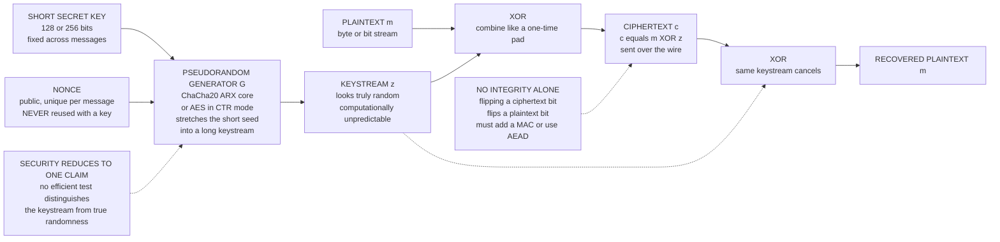

# 🔑 Stream Ciphers and Pseudorandom Generators (PRGs)

> [!abstract] TL;DR
> A **stream cipher** makes the unbreakable-but-impractical **one-time pad** usable: instead of a truly random key as long as the message, it starts from a **short key** (plus a **nonce**) and **stretches** it into a long, random-*looking* **keystream** using a **pseudorandom generator (PRG)**, then XORs that keystream with the plaintext byte-by-byte. You trade the pad's *perfect* secrecy for **computational** secrecy — but gain a fast, short-keyed, reusable-per-nonce cipher. The whole security rests on the PRG being **computationally unpredictable**: no efficient test can tell its output from true randomness. The modern standard is **ChaCha20** (usually as **ChaCha20-Poly1305** AEAD); the cautionary history is **RC4** and bare **LFSRs**, both broken. The one unforgivable sin is **keystream/nonce reuse**, which collapses the cipher to a **two-time pad** and leaks `m1 XOR m2`.

---

## Intuition

**Analogy:** Imagine you and a friend each own an *identical, unbreakable* magic dice-shaker. The [[Information_Theoretic_Security_and_Privacy|one-time pad]] is the honest version: before you ever talk, you both agree on a book of *truly random* dice rolls — one roll per letter you will ever send. It is provably unbreakable, but the "key" is as long as everything you'll ever say, and you must share it in advance through a secure channel. Utterly impractical.

The stream cipher is the clever cheat. Instead of sharing a giant book of random rolls, you share one *tiny* secret seed. You both feed that seed into an *identical deterministic machine* — a **pseudorandom generator** — that spins out an endless stream of rolls that *look* random to anyone who doesn't know the seed. You then XOR your message with this stream exactly like a one-time pad. The catch: the stream is not truly random, it is *pseudo*random — so a god-like adversary with unlimited compute could in principle unwind the machine. But no *feasible* adversary can, and that is enough. You traded perfect secrecy for **computational security**, and in exchange got a short key, unlimited length, and blistering speed.

Everything that follows — why RC4 died, why ChaCha20 won, why nonce reuse is catastrophic — is a consequence of that one trade: the security of the whole cipher is *exactly* the security of the little machine that fakes randomness.

---

## How It Works

### Core mechanics

A stream cipher has three moving parts and one rule.

1. **The seed = key + nonce.** The sender and receiver share a short secret **key** (typically 128 or 256 bits). For each message they also pick a **nonce** ("number used once") — a public, non-secret, *unique* value. The pair `(key, nonce)` seeds the generator. The key stays fixed across many messages; the *nonce* is what makes each message's keystream different. This is what lets a *short* key encrypt *many* messages safely.

2. **The PRG stretches the seed into a keystream.** A **pseudorandom generator** is a deterministic function `G` that maps the short seed to an arbitrarily long output `G(seed) = z_0, z_1, z_2, ...`. The defining property is **computational indistinguishability**: no efficient algorithm, given the output, can tell it apart from a truly random string of the same length with any meaningful advantage. Equivalently (Yao's theorem), the output is **next-bit unpredictable** — given any prefix `z_0 ... z_{i-1}`, no efficient algorithm predicts `z_i` better than a coin flip. These two definitions are the same thing, and a PRG that satisfies them is *exactly* what makes a stream cipher secure.

3. **XOR, like a one-time pad.** Encryption is `c_i = m_i XOR z_i`; decryption is `m_i = c_i XOR z_i`. The receiver regenerates the identical keystream from the same `(key, nonce)` and XORs it back out. XOR is its own inverse, so the same code encrypts and decrypts. This is byte-for-byte the one-time pad construction — the *only* difference is that the pad `z` is pseudorandom rather than truly random.

**The rule:** never reuse a `(key, nonce)` pair. Reuse produces the *same* keystream twice, and `c1 XOR c2 = m1 XOR m2` — the keystream cancels and the plaintexts leak (see Common Pitfalls).

### Why the PRG is the whole game

A stream cipher inherits **all** of its security from its PRG. If the generator is indistinguishable from random, the cipher is IND-CPA secure — you have essentially "computationalized" the one-time pad's perfect secrecy. If the generator has *any* structure an attacker can exploit — bias, short period, linearity — the cipher is broken. This is why the theory matters: a secure PRG provably exists **if and only if one-way functions exist**, tying stream ciphers to the deepest assumptions of the field (planned sibling notes on *Computational Hardness Assumptions* and *Provable Security and Reductions* cover this reduction).

### The historical failure modes

- **LFSRs (Linear Feedback Shift Registers)** generate very long, statistically balanced sequences with almost no hardware cost — which is why they powered Cold-War-era ciphers. But their output is a **linear** recurrence over GF(2), and the **Berlekamp–Massey algorithm** recovers the *entire* generator (its length and feedback taps) from a short segment of output, then predicts every future bit. A bare LFSR passes basic frequency tests yet is *cryptographically dead*. Secure designs must add **nonlinear** combining.
- **RC4**, once ubiquitous (WEP, early TLS, WPA-TKIP), was tiny and fast but riddled with **statistical biases** — its early keystream bytes are non-uniform. The **FMS attack** exploited RC4's key schedule to break **WEP** outright; later single-byte and multi-byte biases broke **RC4 in TLS**. RC4 is now **banned** (RFC 7465).

### The modern winner: ChaCha20

**ChaCha20** (Bernstein, 2008), the hardened successor to **Salsa20**, is the current default. It is an **ARX** design — built only from **A**dd, **R**otate, and **X**OR of 32-bit words — which is fast and constant-time in pure software, with no lookup tables (so no cache-timing side channels). It runs as a **counter-mode PRF**: it takes `(key, nonce, block_counter)` and emits a 512-bit keystream block per counter value. Paired with the **Poly1305** MAC it forms the AEAD cipher **ChaCha20-Poly1305**, standardized in TLS 1.3 and used by **WireGuard**, **OpenSSH**, and most **mobile** traffic — it beats AES on hardware that lacks AES-NI acceleration.

### The blurry line: CTR-mode block ciphers are stream ciphers

There is no hard boundary between "stream cipher" and "block cipher in counter mode." **AES-CTR** runs a block cipher on an incrementing counter to *produce a keystream*, then XORs it with plaintext — the identical construction. ChaCha20 *is* a counter-mode keystream generator. The same nonce discipline and the same lack-of-integrity caveat apply to both.

### Flow / architecture



---

## Key Concepts

### Secondary (intuitive)
- A **stream cipher** turns a **short key** into a **long random-looking keystream** and **XORs** it with your message — like a one-time pad you can actually afford.
- The **PRG** is the machine that stretches the key. If it makes truly random-looking output, the cipher is safe; if its output has any pattern, the cipher is broken.
- The **nonce** is a public "message number" that makes every message's keystream different so a short key can be reused safely across messages.
- **Golden rule:** never encrypt two messages with the same key *and* the same nonce.
- **ChaCha20** is the good modern one; **RC4** is the famous broken one.

### Undergraduate (formal)
- **One-time pad vs stream cipher:** the OTP needs a truly random key with `H(K) >= H(M)` and gives *perfect* (information-theoretic) secrecy; a stream cipher replaces the random key with a *pseudorandom* keystream and gives *computational* (IND-CPA) secrecy with a short, per-nonce-reusable key.
- **PRG definition:** `G : {0,1}^s -> {0,1}^n` with `n > s` whose output is **computationally indistinguishable** from uniform. By **Yao's theorem** this is equivalent to **next-bit unpredictability**.
- **LFSR weakness:** an LFSR of length `L` is a linear recurrence over GF(2); **Berlekamp–Massey** reconstructs it from any `2L` consecutive output bits, so its **linear complexity** (not its period) is the real security measure — and it is only `L`.
- **RC4 / WEP:** RC4's biased key schedule enabled the **FMS attack**; WEP compounded it with 24-bit IVs that *repeated*, guaranteeing keystream reuse.
- **Malleability:** XOR stream ciphers provide **no integrity** — flipping ciphertext bit `i` flips plaintext bit `i` undetectably. A **MAC** (or AEAD) is mandatory.

### Graduate (advanced)
- **PRGs exist iff one-way functions exist** (Håstad–Impagliazzo–Levin–Luby): the existence of secure stream ciphers is equivalent to the existence of OWFs — the minimal assumption of symmetric cryptography.
- **Security reduction:** a stream cipher's IND-CPA advantage is bounded by the PRG's distinguishing advantage plus a birthday-bound term in the number of blocks; the proof is a hybrid argument swapping the keystream for true randomness.
- **Nonce-based security:** ChaCha20 and CTR are **nonce-based** schemes; their security is conditioned on nonce *uniqueness*, not secrecy. This motivates **nonce-misuse-resistant** AEAD (e.g., AES-GCM-SIV) that degrades gracefully under reuse.
- **Linear vs nonlinear complexity:** cryptographic sequence design measures **linear complexity**, its stability under bit changes, and correlation immunity of the combining function; maximal-period LFSRs (m-sequences) have ideal *statistical* distribution yet minimal *linear complexity* — the canonical "passes statistics, fails cryptanalysis" trap.
- **ARX cryptanalysis:** ChaCha's security is analyzed via differential/rotational cryptanalysis of its quarter-round; the best attacks reach only a handful of its 20 rounds, leaving a large security margin.
- **Distinguishers as breaks:** in the indistinguishability paradigm, *any* efficient distinguisher — even one that never recovers a plaintext — counts as a break; RC4 was retired on the strength of distinguishers alone.

---

## Python Demo

```python
# Stream ciphers from PRGs, in two acts:
#  (a) TEST KEYSTREAM RANDOMNESS. Build a weak LFSR PRG and a strong SHA256-CTR
#      PRG. Both PASS naive frequency/runs tests -- but Berlekamp-Massey exposes
#      the LFSR's tiny LINEAR COMPLEXITY and predicts its every future bit, while
#      the strong PRG stays unpredictable (~chance). Statistics are NECESSARY,
#      not SUFFICIENT.
#  (b) NONCE-REUSE CATASTROPHE. Encrypt two messages under the SAME key+nonce.
#      Then c1 XOR c2 == m1 XOR m2 (the keystream cancels) -> a TWO-TIME PAD.
#      Recover plaintext by crib-dragging -- exactly the WEP / RC4 / MS-PPTP break.
# Pure standard library + matplotlib (no numpy required).
import hashlib
from collections import Counter
import matplotlib.pyplot as plt

# ----------------------------------------------------------------------
# PRG 1 (WEAK): a 16-bit maximal-length Galois LFSR. Cheap in hardware,
# statistically balanced -- but LINEAR, hence fully recoverable from output.
# ----------------------------------------------------------------------
def lfsr_bits(seed, n, poly=0xB400, width=16):
    state = seed & ((1 << width) - 1)
    if state == 0:
        state = 1
    out = []
    for _ in range(n):
        bit = state & 1
        out.append(bit)
        state >>= 1
        if bit:
            state ^= poly          # feedback -> maximal period 2^16 - 1
    return out

# ----------------------------------------------------------------------
# PRG 2 (STRONG): SHA-256 in counter mode -- a stand-in CSPRNG / stream cipher.
# keystream = SHA256(key || nonce || counter) blocks. This is the ChaCha20 / CTR
# pattern: a keyed function run as a counter-mode keystream generator.
# ----------------------------------------------------------------------
def hash_keystream(key, nonce, nbytes):
    out = bytearray()
    counter = 0
    while len(out) < nbytes:
        out += hashlib.sha256(key + nonce + counter.to_bytes(8, "big")).digest()
        counter += 1
    return bytes(out[:nbytes])

def bytes_to_bits(data):
    return [(byte >> i) & 1 for byte in data for i in range(8)]

# ----------------------------------------------------------------------
# Basic statistical randomness tests (necessary, NOT sufficient).
# ----------------------------------------------------------------------
def monobit_ratio(bits):
    return sum(bits) / len(bits)

def runs_count(bits):
    return 1 + sum(1 for i in range(1, len(bits)) if bits[i] != bits[i - 1])

def chi2_bytes(data):
    counts = Counter(data)
    exp = len(data) / 256.0
    return sum((counts.get(v, 0) - exp) ** 2 / exp for v in range(256))

# ----------------------------------------------------------------------
# Berlekamp-Massey over GF(2): returns linear complexity L and connection
# polynomial c. Small L => the sequence is an LFSR and every future bit is
# predictable => the generator is cryptographically dead.
# ----------------------------------------------------------------------
def berlekamp_massey(bits):
    n = len(bits)
    b = [1] + [0] * n
    c = [1] + [0] * n
    L, m = 0, -1
    for i in range(n):
        d = bits[i]
        for j in range(1, L + 1):
            d ^= c[j] & bits[i - j]
        if d:
            t = c[:]
            shift = i - m
            for j in range(0, n + 1 - shift):
                c[j + shift] ^= b[j]
            if 2 * L <= i:
                L = i + 1 - L
                m = i
                b = t
    return L, c[:L + 1]

def predict_next(observed, L, c, future):
    seq = observed[:]
    for i in range(len(observed), len(observed) + future):
        bit = 0
        for j in range(1, L + 1):
            bit ^= c[j] & seq[i - j]
        seq.append(bit)
    return seq[len(observed):]

# ======================= (a) randomness / predictability =======================
KEY, NONCE = b"an-example-256-bit-secret-key!!!", b"nonce-01"
N_BITS = 4096

lfsr = lfsr_bits(0xACE1, N_BITS)
strong = bytes_to_bits(hash_keystream(KEY, NONCE, N_BITS // 8))

print("=== basic randomness tests (both LOOK random) ===")
for name, bits in [("weak LFSR", lfsr), ("SHA256-CTR", strong)]:
    print(f"{name:11s} ones={monobit_ratio(bits):.3f} "
          f"runs={runs_count(bits)} (ideal ~{len(bits)//2})")

# linear-complexity profile: the test that EXPOSES the LFSR
lengths = list(range(16, 513, 16))
lc_lfsr   = [berlekamp_massey(lfsr[:L])[0]   for L in lengths]
lc_strong = [berlekamp_massey(strong[:L])[0] for L in lengths]

# predict FUTURE bits from an OBSERVED prefix
OBS, FUT = 128, 128
L1, cp1 = berlekamp_massey(lfsr[:OBS])
pred1 = predict_next(lfsr[:OBS], L1, cp1, FUT)
acc_lfsr = sum(p == a for p, a in zip(pred1, lfsr[OBS:OBS + FUT])) / FUT

L2, cp2 = berlekamp_massey(strong[:OBS])
pred2 = predict_next(strong[:OBS], L2, cp2, FUT)
acc_strong = sum(p == a for p, a in zip(pred2, strong[OBS:OBS + FUT])) / FUT

print("\n=== Berlekamp-Massey on first 128 keystream bits ===")
print(f"weak LFSR  : linear complexity L={L1:3d} -> next-bit accuracy {acc_lfsr:.0%}")
print(f"SHA256-CTR : linear complexity L={L2:3d} -> next-bit accuracy {acc_strong:.0%}")

# ======================= (b) nonce / keystream reuse =======================
m1 = b"ATTACK the north gate at dawn; the reserves wait by the river."
m2 = b"DEFEND the south wall at dusk; the cavalry holds the high road."
size = max(len(m1), len(m2))
m1, m2 = m1.ljust(size), m2.ljust(size)

ks = hash_keystream(KEY, NONCE, size)        # SAME key+nonce twice -- FATAL
def xor(a, b): return bytes(x ^ y for x, y in zip(a, b))
ct1, ct2 = xor(m1, ks), xor(m2, ks)

leak = xor(ct1, ct2)                          # == m1 XOR m2 ; keystream cancels
print("\n=== nonce reuse: c1 XOR c2 == m1 XOR m2 (keystream cancels) ===")
print("recovered from ciphertext ONLY, no key:", leak == xor(m1, m2))

def crib_drag(x, crib):
    hits = []
    for pos in range(len(x) - len(crib) + 1):
        seg = xor(x[pos:pos + len(crib)], crib)
        if all(32 <= ch < 127 for ch in seg):
            hits.append((pos, seg.decode()))
    return hits

crib = b" the "
print(f"\ncrib-dragging {crib!r} through c1 XOR c2 reveals the OTHER message:")
for pos, frag in crib_drag(leak, crib):
    print(f"  pos {pos:2d}: ...{frag}...")

ks_recovered = xor(ct1, m1)                   # any known/guessed m1 ...
m2_recovered = xor(ct2, ks_recovered)         # ... totally recovers m2
print("\nknown-plaintext -> full recovery of m2:")
print("  ", m2_recovered.decode())

# ============================= visualize =============================
fig, ax = plt.subplots(2, 2, figsize=(14, 9))

# 1. linear-complexity profile -- the smoking gun
ax[0, 0].plot(lengths, lc_lfsr, "o-", color="#e74c3c", label="weak LFSR")
ax[0, 0].plot(lengths, lc_strong, "s-", color="#2ecc71", label="SHA256-CTR")
ax[0, 0].plot(lengths, [L / 2 for L in lengths], "k--", alpha=.5, label="ideal  n/2")
ax[0, 0].axhline(16, color="#e74c3c", ls=":", alpha=.7)
ax[0, 0].set_title("Berlekamp-Massey linear complexity\nLFSR saturates at 16 -> broken")
ax[0, 0].set_xlabel("keystream bits observed")
ax[0, 0].set_ylabel("linear complexity L")
ax[0, 0].legend()

# 2. frequency test -- both pass (necessary, not sufficient)
names = ["weak\nLFSR", "SHA256\nCTR"]
ax[0, 1].bar(names, [monobit_ratio(lfsr), monobit_ratio(strong)],
             color=["#e74c3c", "#2ecc71"])
ax[0, 1].axhline(0.5, color="k", ls="--", label="ideal 0.5")
ax[0, 1].set_ylim(0.45, 0.55)
ax[0, 1].set_title("Monobit frequency: BOTH look random\n(a weak PRG can still pass)")
ax[0, 1].set_ylabel("fraction of 1 bits")
ax[0, 1].legend()

# 3. next-bit predictability
ax[1, 0].bar(names, [acc_lfsr, acc_strong], color=["#e74c3c", "#2ecc71"])
ax[1, 0].axhline(0.5, color="k", ls="--", label="chance 0.5")
ax[1, 0].set_ylim(0, 1.05)
ax[1, 0].set_title("Next-bit prediction after Berlekamp-Massey\nLFSR ~100%, strong PRG ~chance")
ax[1, 0].set_ylabel("prediction accuracy")
ax[1, 0].legend()

# 4. nonce-reuse leak: XOR of plaintexts exposed; crib-drag hits marked
ax[1, 1].plot(range(len(leak)), list(leak), color="#7f8c8d",
              label="c1 XOR c2  ==  m1 XOR m2")
for pos, _ in crib_drag(leak, crib):
    ax[1, 1].axvspan(pos, pos + len(crib), color="#f1c40f", alpha=.4)
ax[1, 1].set_title("Nonce reuse = two-time pad\nyellow = crib-drag recovers plaintext")
ax[1, 1].set_xlabel("byte position")
ax[1, 1].set_ylabel("XOR byte value")
ax[1, 1].legend()

plt.tight_layout()
plt.show()
```

**What you see when it runs.** Both generators pass the monobit and runs tests (a maximal-length LFSR is *statistically* balanced), so naive randomness testing gives them both a clean bill of health. Then Berlekamp–Massey tells the truth: the LFSR's **linear complexity saturates at 16** no matter how much output you feed it, and from 128 observed bits the recovered recurrence predicts **100%** of its future bits — the cipher is transparent. The SHA256-CTR keystream's linear complexity climbs along the ideal `n/2` line and its next-bit prediction sits at **~50%** (chance). Act two prints `m1 XOR m2` recovered from ciphertext *alone*, crib-drags `" the "` to peel readable fragments out of the leak, and then fully reconstructs `m2` given any guessed `m1` — the exact anatomy of the WEP and RC4-in-TLS breaks.

---

## Real-World Applications

> **Example — ChaCha20-Poly1305 in TLS 1.3 and WireGuard.** When your phone opens an HTTPS connection on a CPU without AES-NI, TLS 1.3 negotiates the **ChaCha20-Poly1305** AEAD cipher suite. ChaCha20 is the *stream cipher* half: it seeds its ARX core with the session key, a per-record nonce, and a block counter, emits a keystream, and XORs it with the record. **Poly1305** is the MAC that supplies the integrity ChaCha20 alone cannot — turning a malleable keystream cipher into authenticated encryption. **WireGuard** uses the same construction as its *only* data cipher, and OpenSSH offers `chacha20-poly1305@openssh.com`. See [[TLS_Protocol_Deep_Dive]].

- **AES-CTR / AES-GCM everywhere else.** Most TLS traffic on server hardware uses AES in **counter mode** — a block cipher *run as a stream cipher* — wrapped in GCM for integrity. Disk and database encryption lean on CTR/XTS variants of the same keystream idea. The planned *Block Ciphers and AES* sibling note covers this in depth; see also [[Symmetric_Encryption]].
- **CSPRNGs are PRGs.** `/dev/urandom`, Linux's ChaCha-based RNG, and NIST **CTR_DRBG** (AES-CTR) are literally pseudorandom generators — the same primitive, used to produce keys, nonces, and tokens rather than a keystream. See the planned *Random Number Generation* sibling note.
- **Mobile and low-power devices.** Salsa20/ChaCha's table-free software speed makes it the default for Android app traffic, IoT links, and anywhere constant-time software without hardware crypto is required.
- **The cautionary layer.** **WEP** (RC4 + repeating 24-bit IVs) and **WPA-TKIP** are the textbook stream-cipher disasters; every wireless-security curriculum teaches them as *how not to use a keystream*.

---

## Common Pitfalls

- **Keystream / nonce reuse (the catastrophic one).** Encrypting two messages with the same `(key, nonce)` yields the same keystream, so `c1 XOR c2 = m1 XOR m2` and the keystream vanishes — a **two-time pad**. Crib-dragging or any known-plaintext then peels both messages apart, as the demo shows. This is precisely how **WEP** (IVs cycled and repeated), **MS-PPTP**, and countless custom systems fell. Use a counter or a large random nonce and *never* let a pair repeat under one key; if you cannot guarantee uniqueness, use a **nonce-misuse-resistant** AEAD.
- **No integrity — malleability.** XOR stream ciphers are **malleable**: flip ciphertext bit `i` and you flip plaintext bit `i`, undetectably and predictably. Encryption is *not* authentication. Always pair the keystream with a **MAC** or use an **AEAD** construction like ChaCha20-Poly1305. See [[Hash_Functions_and_MACs]].
- **Trusting statistical tests.** Passing monobit, runs, or even the full Dieharder/NIST STS battery does **not** make a generator cryptographically secure — a maximal-length LFSR passes them and is still trivially broken by Berlekamp–Massey. Cryptographic strength is about *unpredictability to an adversary*, not surface statistics.
- **Rolling your own PRG (LFSRs, `rand()`, Mersenne Twister).** Linear or non-cryptographic generators are predictable from a short output prefix. Never build a keystream from `random`/`rand()`; use a vetted CSPRNG or a standard stream cipher.
- **Using RC4 because it is "fast and simple."** RC4 is deprecated and banned (RFC 7465) due to keystream biases and the FMS/WEP break. Reach for ChaCha20 or AES-CTR/GCM instead.
- **Truncated or predictable nonces.** WEP's 24-bit IV space guaranteed reuse within hours on a busy network. Nonces must be large enough (96+ bits) or strictly counter-managed so that reuse under a fixed key is impossible.

---

## Related Concepts

- [[Information_Theoretic_Security_and_Privacy]] — the one-time pad, perfect secrecy, and Shannon's `H(K) >= H(M)` bound; the *unconditional* ideal that stream ciphers approximate *computationally*.
- [[Symmetric_Encryption]] — the applied companion covering AES, modes, and AEAD; stream ciphers and CTR mode are its keystream branch.
- [[Hash_Functions_and_MACs]] — the integrity primitive a stream cipher *lacks*; a MAC (or AEAD) is mandatory to stop bit-flipping/malleability attacks.
- [[TLS_Protocol_Deep_Dive]] — where ChaCha20-Poly1305 and AES-GCM keystreams actually secure the internet.
- [[Cryptography_Overview]] — the vault entry point defining computational vs information-theoretic security and IND-CPA, the framing this note sits inside.
- [[Entropy_and_Information_Content]] — measures the uncertainty a PRG *seed* must carry; low seed entropy silently defeats any keystream.
- [[Modular_Arithmetic_and_Number_Theory]] — LFSR sequences are recurrences over GF(2); the polynomial/finite-field view explains their period and linear structure.
- [[Groups_Rings_Fields_for_Cryptography]] — the finite-field algebra (GF(2)) underlying LFSR feedback polynomials and the Berlekamp–Massey recovery.
- [[Post_Quantum_Cryptography]] — symmetric stream ciphers survive quantum attacks by doubling the key length (Grover only halves the search exponent), unlike public-key schemes.
- [[TLS_and_SSL]] — the network-security view of why RC4 was removed from TLS and replaced by ChaCha20/AES-GCM.

*(Planned Cryptography siblings referenced in prose above — `Symmetric_Encryption_Fundamentals`, `Random_Number_Generation`, `Modes_of_Operation`, `Block_Ciphers_and_AES`, `Message_Authentication_Codes`, `Computational_Hardness_Assumptions`, `Provable_Security_and_Reductions`, and `Cryptographic_Failures_and_Misuse` — will be wired in when created.)*

---

## Review Questions

1. **Conceptual.** A stream cipher and a one-time pad both compute `c = m XOR (keystream)`. Explain precisely what the stream cipher gives up and what it gains, and identify the single property of the PRG on which the *entire* security of the stream cipher rests. Why does "next-bit unpredictable" turn out to be the same requirement as "indistinguishable from random"?
2. **Scenario.** You are handed a keystream generator that passes the full NIST statistical test suite — perfect frequency, runs, and spectral results. Your teammate concludes it is safe to ship as a stream cipher. Design a single experiment (name the algorithm) that could still prove it broken, and explain why a maximal-length LFSR is the textbook example of "passes statistics, fails cryptanalysis."
3. **Trade-off / debugging.** An engineer uses AES-CTR with a 64-bit random nonce drawn per message, encrypting billions of messages under one key, and adds no MAC "because AES is secure." Identify the *two* independent failures here (one about nonces, one about integrity), describe the concrete attack each enables, and state the minimal fix for each.

---

## Sources

- [Bernstein, "ChaCha, a variant of Salsa20" (2008)](https://cr.yp.to/chacha/chacha-20080128.pdf)
- [Nir & Langley, RFC 8439 — ChaCha20 and Poly1305 for IETF Protocols (2018)](https://www.rfc-editor.org/rfc/rfc8439)
- [Katz & Lindell, *Introduction to Modern Cryptography* (3rd ed., 2020) — Ch. 3 (PRGs, stream ciphers)](https://www.cs.umd.edu/~jkatz/imc.html)
- [Fluhrer, Mantin & Shamir, "Weaknesses in the Key Scheduling Algorithm of RC4" (2001) — the FMS/WEP attack](https://www.cs.cornell.edu/people/egs/615/rc4_ksaproc.pdf)
- [Popov, RFC 7465 — Prohibiting RC4 Cipher Suites (2015)](https://www.rfc-editor.org/rfc/rfc7465)
- [Boneh & Shoup, *A Graduate Course in Applied Cryptography* — Ch. 3 (stream ciphers, PRGs)](https://toc.cryptobook.us/)

---

#cryptography #stream-cipher #prg #chacha20 #keystream
